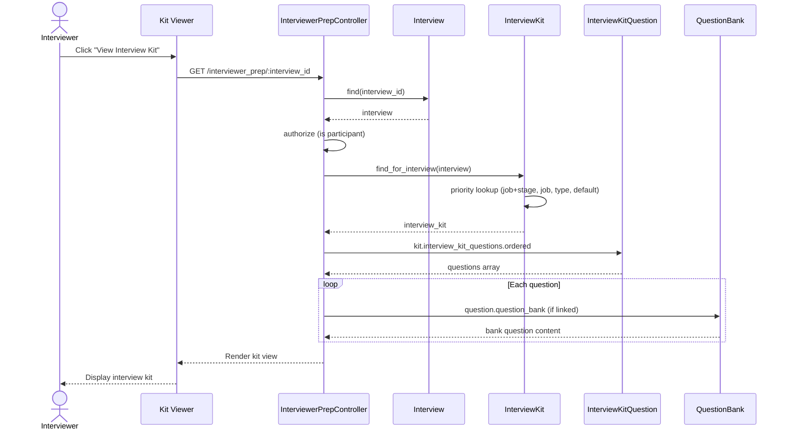

# UC-159: View Interview Kit

## Metadata

| Attribute | Value |
|-----------|-------|
| **ID** | UC-159 |
| **Name** | View Interview Kit |
| **Functional Area** | Interview Management |
| **Primary Actor** | Interviewer (ACT-04) |
| **Priority** | P2 |
| **Complexity** | Low |
| **Status** | Draft |

## Description

An interviewer accesses the interview kit before or during an interview to view structured questions, evaluation criteria, time allocations, and guidance for conducting the interview. The kit helps ensure consistent, fair, and thorough candidate evaluation across all interviews for a role.

## Actors

| Actor | Role in Use Case |
|-------|------------------|
| Interviewer (ACT-04) | Views the interview kit for preparation |
| Hiring Manager (ACT-03) | Views kit to understand evaluation criteria |
| Recruiter (ACT-02) | May view to verify kit is appropriate |

## Preconditions

- [ ] User is authenticated and has access to the interview
- [ ] Interview exists (any active status)
- [ ] Interview kit is assigned to the interview or job/stage
- [ ] User is a participant or has recruiter/admin access

## Postconditions

### Success
- [ ] Interview kit content displayed to user
- [ ] Questions and guidance visible
- [ ] Evaluation criteria and scorecard preview shown
- [ ] Access logged for audit (optional)

### Failure
- [ ] Error message if no kit assigned
- [ ] Fallback to general questions if specific kit unavailable

## Triggers

- Interviewer clicks "View Interview Kit" before interview
- Interviewer opens kit during interview from dashboard
- System prompts kit review in interview reminder email
- Interviewer accesses kit from scorecard submission page

## Basic Flow



| Step | Actor | Action | System Response |
|------|-------|--------|-----------------|
| 1 | Interviewer | Clicks "View Interview Kit" | Kit viewer requested |
| 2 | System | Validates user has access | Authorization checked |
| 3 | System | Loads interview record | Interview details retrieved |
| 4 | System | Finds appropriate kit | Priority-based kit lookup |
| 5 | System | Loads kit questions | Ordered questions retrieved |
| 6 | System | Expands question bank references | Full question content loaded |
| 7 | System | Loads evaluation criteria | Scorecard preview built |
| 8 | System | Renders kit viewer | Full kit displayed |

## Alternative Flows

### AF-1: No Kit Assigned - Show Default

**Trigger:** No specific kit found for interview

| Step | Actor | Action | System Response |
|------|-------|--------|-----------------|
| 4a | System | No job/stage specific kit found | Falls back to default |
| 4b | System | Loads organization default kit | Default kit retrieved |
| 4c | System | Displays with "Default Kit" label | Kit shown with indicator |

**Resumption:** Continues at step 5 of basic flow

### AF-2: View Kit from Scorecard Page

**Trigger:** Interviewer opens kit while filling scorecard

| Step | Actor | Action | System Response |
|------|-------|--------|-----------------|
| 1a | Interviewer | Clicks "Reference Kit" on scorecard | Kit overlay opens |
| 8a | System | Displays kit in modal/sidebar | Kit alongside scorecard |
| 8b | Interviewer | Reviews question guidance | Can reference while scoring |

**Resumption:** Interviewer continues scorecard submission

### AF-3: View Candidate Context

**Trigger:** Interviewer wants to see candidate info with kit

| Step | Actor | Action | System Response |
|------|-------|--------|-----------------|
| 8a | Interviewer | Clicks "View Candidate Profile" | Candidate tab opens |
| 8b | System | Shows resume and application | Candidate info displayed |
| 8c | Interviewer | Reviews alongside questions | Split view available |

**Resumption:** Interviewer continues preparation

### AF-4: Print Interview Kit

**Trigger:** Interviewer wants paper copy for in-person interview

| Step | Actor | Action | System Response |
|------|-------|--------|-----------------|
| 8a | Interviewer | Clicks "Print Kit" | Print dialog opens |
| 8b | System | Generates print-friendly version | PDF or print view |
| 8c | Interviewer | Prints document | Physical copy ready |

**Resumption:** Use case ends

## Exception Flows

### EF-1: No Kit Available

**Trigger:** No kit found and no default exists

| Step | Actor | Action | System Response |
|------|-------|--------|-----------------|
| 4.1 | System | No kit found at any level | No kit message |
| 4.2 | System | Shows basic guidance | Generic interview tips |
| 4.3 | System | Prompts recruiter to create | Alert sent (optional) |

**Resolution:** Interview proceeds without structured kit

### EF-2: Kit Questions Empty

**Trigger:** Kit exists but has no questions

| Step | Actor | Action | System Response |
|------|-------|--------|-----------------|
| 5.1 | System | Kit has zero questions | Empty kit warning |
| 5.2 | System | Shows scorecard criteria only | Evaluation criteria displayed |
| 5.3 | System | Suggests contacting recruiter | Contact info shown |

**Resolution:** Interviewer uses criteria without questions

### EF-3: Access Denied

**Trigger:** User not authorized to view interview

| Step | Actor | Action | System Response |
|------|-------|--------|-----------------|
| 2.1 | System | User not a participant | Access denied error |
| 2.2 | System | Suggests requesting access | Request link shown |

**Resolution:** User must be added as participant

## Business Rules

| ID | Rule | Description |
|----|------|-------------|
| BR-159.1 | Access Control | Only interview participants, recruiters, and admins can view kit |
| BR-159.2 | Kit Priority | Job+Stage > Job > Interview Type > Default |
| BR-159.3 | Question Ordering | Questions displayed in defined position order |
| BR-159.4 | Time Allocations | Total time shown and per-question allocations visible |
| BR-159.5 | Candidate Privacy | Sensitive candidate info only shown to appropriate roles |
| BR-159.6 | Read-Only | Interviewers cannot modify kit content |

## Data Requirements

### Input Data

| Field | Type | Required | Validation |
|-------|------|----------|------------|
| interview_id | integer | Yes | Must exist |
| user_id | integer | Yes | From session |

### Output Data

| Field | Type | Description |
|-------|------|-------------|
| kit_name | string | Interview kit name |
| kit_description | text | Kit overview and purpose |
| questions | array | Ordered list of questions |
| questions[].question | text | Question text |
| questions[].guidance | text | Interviewer guidance |
| questions[].time_allocation | integer | Minutes for question |
| questions[].source | string | "Custom" or QuestionBank name |
| total_time | integer | Sum of time allocations |
| scorecard_preview | object | Linked scorecard structure |

## Interview Kit Structure

```
+---------------------------------------------------------------+
| Interview Kit: Technical Interview                              |
| Software Engineer - Senior Level                                |
+-----------------------------------------------------------------+
|                                                                 |
| Overview                                                        |
| This interview focuses on coding skills, system design, and     |
| technical problem-solving. Allow candidate to think aloud and   |
| provide hints if they get stuck.                                |
|                                                                 |
| Total Time: 60 minutes                                          |
|                                                                 |
+-----------------------------------------------------------------+
| Questions                                                       |
+-----------------------------------------------------------------+
|                                                                 |
| 1. Background & Experience (10 min)                             |
| ----------------------------------------------------------------|
| Q: Walk me through your most challenging technical project      |
|    from the last year. What was your role and contribution?     |
|                                                                 |
| Guidance: Listen for ownership, technical depth, and            |
| collaboration. Follow up on architecture decisions.             |
|                                                                 |
| Look for: Problem-solving approach, technical leadership,       |
| ability to explain complex concepts                             |
|                                                                 |
+-----------------------------------------------------------------+
| 2. Coding Exercise (25 min)                                     |
| ----------------------------------------------------------------|
| Q: [Share coding problem from question bank]                    |
|    Implement a function that...                                 |
|                                                                 |
| Guidance: Let candidate choose their preferred language.        |
| Observe their problem-solving process, not just final answer.   |
| Offer hints after 5 minutes if stuck.                           |
|                                                                 |
| Look for: Code quality, optimization thinking, testing          |
| considerations, communication during problem-solving            |
|                                                                 |
+-----------------------------------------------------------------+
| 3. System Design (20 min)                                       |
| ----------------------------------------------------------------|
| Q: Design a URL shortening service like bit.ly. Start with      |
|    high-level architecture and we'll dive deeper.               |
|                                                                 |
| Guidance: Start simple, then add complexity (scale, caching,    |
| database choices). Assess trade-off discussions.                |
|                                                                 |
| Look for: System thinking, scalability awareness,               |
| practical engineering judgment                                  |
|                                                                 |
+-----------------------------------------------------------------+
| 4. Candidate Questions (5 min)                                  |
| ----------------------------------------------------------------|
| Q: What questions do you have about the role or team?           |
|                                                                 |
| Guidance: Note the quality and depth of their questions.        |
| This reveals their research and genuine interest.               |
|                                                                 |
+-----------------------------------------------------------------+
|                                                                 |
| Evaluation Criteria                                             |
| - Technical Skills (1-5)                                        |
| - Problem Solving (1-5)                                         |
| - Communication (1-5)                                           |
| - Culture Fit (1-5)                                             |
|                                                                 |
| [View Full Scorecard]                                           |
|                                                                 |
+-----------------------------------------------------------------+
```

## UI/UX Requirements

### Screen/Component

- **Location:** /interviewer_prep/:interview_id
- **Entry Point:**
  - "View Kit" button on interview dashboard
  - Link in interview reminder email
  - Reference button on scorecard form
- **Key Elements:**
  - Kit overview and time breakdown
  - Collapsible question sections
  - Guidance and look-for indicators
  - Candidate context sidebar (optional)
  - Print-friendly view

### Navigation

```
+---------------------------------------------------------------+
| < Back to My Interviews                                         |
+-----------------------------------------------------------------+
| Interview Kit | Candidate Profile | Scorecard                   |
| ============================================================= |
|                                                                 |
| Technical Interview                                             |
| John Smith - Software Engineer                                  |
| Monday, January 27, 2026 at 10:00 AM EST                        |
|                                                                 |
+-----------------------------------------------------------------+
|                      [Kit Content]                              |
|                                                                 |
+-----------------------------------------------------------------+
|                                                                 |
| [Print Kit]  [Open in New Tab]  [Start Scorecard]              |
|                                                                 |
+-----------------------------------------------------------------+
```

## Non-Functional Requirements

| Requirement | Target |
|-------------|--------|
| Page Load Time | < 1 second |
| Offline Support | Cache kit for offline access (optional) |
| Print Quality | Clean A4/Letter print layout |
| Mobile Support | Responsive design for tablet use |

## Security Considerations

- [x] Authentication required
- [x] Authorization: Must be participant or recruiter/admin
- [x] Read-only access for interviewers
- [x] Candidate sensitive data appropriately restricted

## Related Use Cases

| Use Case | Relationship |
|----------|--------------|
| UC-150 Schedule Interview | Creates interview that kit is linked to |
| UC-160 Manage Interview Templates | Creates/edits interview kits |
| UC-200 Submit Scorecard | Uses kit criteria for evaluation |
| UC-158 Complete Interview | May reference kit during session |

---

## Data Model References

> Cross-references to [DATA_MODEL.md](../DATA_MODEL.md) and [CRUD_MATRIX.md](../CRUD_MATRIX.md)

### Subject Areas

| Subject Area | ID | Relationship |
|--------------|-----|--------------|
| Interview | SA-06 | Primary |
| Evaluation | SA-07 | Secondary |

### Entities CRUD

| Entity | C | R | U | D | Notes |
|--------|---|---|---|---|-------|
| Interview | | X | | | Read for context |
| InterviewKit | | X | | | Read kit definition |
| InterviewKitQuestion | | X | | | Read ordered questions |
| QuestionBank | | X | | | Read linked questions |
| ScorecardTemplate | | X | | | Read for criteria preview |

**Legend:** C = Create, R = Read, U = Update, D = Delete

---

## Process Model References

> Cross-references to [PROCESS_MODEL.md](../PROCESS_MODEL.md) and [PROCESS_CRUD_MATRIX.md](../PROCESS_CRUD_MATRIX.md)

| Attribute | Value | Link |
|-----------|-------|------|
| **Elementary Business Process** | EP-0510: View Interview Kit | [PROCESS_MODEL.md#ep-0510](../PROCESS_MODEL.md#elementary-business-processes-4) |
| **Business Process** | BP-201: Interview Coordination | [PROCESS_MODEL.md#bp-201](../PROCESS_MODEL.md#bp-201-interview-coordination) |
| **Business Function** | BF-02: Candidate Evaluation | [PROCESS_MODEL.md#bf-02](../PROCESS_MODEL.md#bf-02-candidate-evaluation) |

### EBP Details

| Attribute | Value |
|-----------|-------|
| **Trigger** | Interviewer prepares for or conducts interview |
| **Input** | Interview ID |
| **Output** | Displayed interview kit with questions and criteria |
| **Business Rules** | BR-159.1 through BR-159.6 |

---

## Traceability Matrix

> Complete artifact mapping for requirements traceability

| Artifact Type | ID | Name | Link |
|---------------|-----|------|------|
| **Use Case** | UC-159 | View Interview Kit | *(this document)* |
| **Elementary Process** | EP-0510 | View Interview Kit | [PROCESS_MODEL.md](../PROCESS_MODEL.md#elementary-business-processes-4) |
| **Business Process** | BP-201 | Interview Coordination | [PROCESS_MODEL.md](../PROCESS_MODEL.md#bp-201-interview-coordination) |
| **Business Function** | BF-02 | Candidate Evaluation | [PROCESS_MODEL.md](../PROCESS_MODEL.md#bf-02-candidate-evaluation) |
| **Primary Actor** | ACT-04 | Interviewer | [ACTORS.md](../ACTORS.md#act-04-interviewer) |
| **Subject Area (Primary)** | SA-06 | Interview | [DATA_MODEL.md](../DATA_MODEL.md#sa-06-interview) |

### Implementation Artifacts

| Artifact Type | Path/Reference | Status |
|---------------|----------------|--------|
| Controller | `app/controllers/interviewer_prep_controller.rb` | Implemented |
| Model | `app/models/interview_kit.rb` | Implemented |
| Model | `app/models/interview_kit_question.rb` | Implemented |
| View | `app/views/interviewer_prep/show.html.erb` | Implemented |
| Test | `test/controllers/interviewer_prep_controller_test.rb` | Implemented |

---

## Open Questions

1. Should we track which interviewers viewed the kit?
2. Should kit viewing be mandatory before submitting feedback?
3. How should we handle kit updates after interview is scheduled?

## Change History

| Version | Date | Author | Changes |
|---------|------|--------|---------|
| 0.1 | 2026-01-25 | System | Initial draft |
