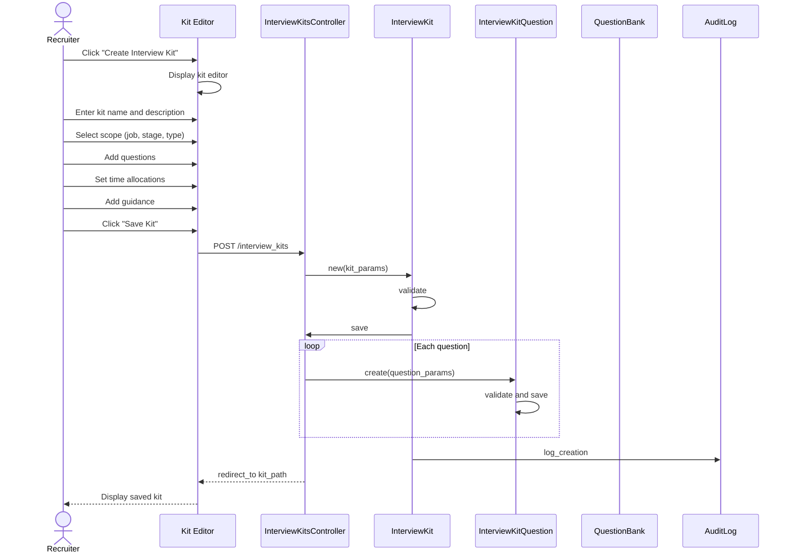

# UC-160: Manage Interview Templates

## Metadata

| Attribute | Value |
|-----------|-------|
| **ID** | UC-160 |
| **Name** | Manage Interview Templates |
| **Functional Area** | Interview Management |
| **Primary Actor** | Recruiter (ACT-02) |
| **Priority** | P2 |
| **Complexity** | Medium |
| **Status** | Draft |

## Description

A recruiter creates, edits, duplicates, or deactivates interview kit templates that define the structure, questions, and evaluation criteria for different interview types. Templates can be scoped to specific jobs, pipeline stages, or interview types, ensuring consistent evaluation across all interviews.

## Actors

| Actor | Role in Use Case |
|-------|------------------|
| Recruiter (ACT-02) | Creates and manages interview templates |
| System Administrator (ACT-01) | May manage organization-wide templates |
| Hiring Manager (ACT-03) | May request specific templates for their roles |

## Preconditions

- [ ] User is authenticated with Recruiter or Admin role
- [ ] User has access to the organization's interview configuration
- [ ] For job-specific kits, user has access to the job

## Postconditions

### Success
- [ ] Interview kit created/updated/duplicated/deactivated
- [ ] Questions and guidance saved
- [ ] Template available for selection when scheduling interviews
- [ ] Audit log entry created

### Failure
- [ ] No changes saved
- [ ] User shown validation errors

## Triggers

- Recruiter clicks "Create Interview Kit" from settings
- Recruiter clicks "Edit" on existing kit
- Recruiter clicks "Duplicate" to create copy
- Admin configures organization default templates

## Basic Flow



| Step | Actor | Action | System Response |
|------|-------|--------|-----------------|
| 1 | Recruiter | Clicks "Create Interview Kit" | Kit editor displayed |
| 2 | Recruiter | Enters kit name | Name captured |
| 3 | Recruiter | Enters description | Description captured |
| 4 | Recruiter | Selects interview type (optional) | Type associated |
| 5 | Recruiter | Selects job (optional) | Job scope set |
| 6 | Recruiter | Selects stage (optional) | Stage scope set |
| 7 | Recruiter | Adds first question | Question form displayed |
| 8 | Recruiter | Enters question text | Question captured |
| 9 | Recruiter | Adds interviewer guidance | Guidance captured |
| 10 | Recruiter | Sets time allocation | Time captured |
| 11 | Recruiter | Adds additional questions | More questions added |
| 12 | Recruiter | Reorders questions (drag-drop) | Order updated |
| 13 | Recruiter | Clicks "Save Kit" | System validates |
| 14 | System | Validates required fields | Validation passes |
| 15 | System | Saves interview kit | Kit record created |
| 16 | System | Saves questions | Questions created in order |
| 17 | System | Creates audit log | Action logged |
| 18 | System | Displays saved kit | Success message shown |

## Alternative Flows

### AF-1: Edit Existing Template

**Trigger:** Recruiter clicks "Edit" on an existing kit

| Step | Actor | Action | System Response |
|------|-------|--------|-----------------|
| 1a | Recruiter | Clicks "Edit" on kit | Edit form loaded |
| 1b | System | Loads existing kit data | Form pre-populated |
| 7a | Recruiter | Modifies questions | Changes tracked |
| 18a | System | Updates existing record | Kit updated |

**Resumption:** Use case ends with updated kit

### AF-2: Duplicate Template

**Trigger:** Recruiter clicks "Duplicate" to create copy

| Step | Actor | Action | System Response |
|------|-------|--------|-----------------|
| 1a | Recruiter | Clicks "Duplicate" | Duplicate action triggered |
| 1b | System | Creates copy with "(Copy)" suffix | New kit created |
| 1c | System | Opens edit form for copy | Edit form displayed |
| 1d | Recruiter | Modifies as needed | Changes made |

**Resumption:** Continues at step 13 of basic flow

### AF-3: Add Questions from Question Bank

**Trigger:** Recruiter wants to use pre-defined questions

| Step | Actor | Action | System Response |
|------|-------|--------|-----------------|
| 7a | Recruiter | Clicks "Add from Question Bank" | Question bank browser opens |
| 7b | Recruiter | Browses/searches questions | Questions displayed |
| 7c | Recruiter | Selects questions to add | Questions added to kit |
| 7d | System | Links questions to kit | References created |

**Resumption:** Continues at step 10 of basic flow

### AF-4: Set as Organization Default

**Trigger:** Admin wants to set kit as default

| Step | Actor | Action | System Response |
|------|-------|--------|-----------------|
| 13a | Admin | Clicks "Set as Default" | Default confirmation shown |
| 13b | System | Removes default from other kits | Previous default cleared |
| 13c | System | Sets this kit as default | is_default = true |

**Resumption:** Continues at step 14 of basic flow

### AF-5: Deactivate Template

**Trigger:** Recruiter wants to retire a template

| Step | Actor | Action | System Response |
|------|-------|--------|-----------------|
| 1a | Recruiter | Clicks "Deactivate" on kit | Confirmation dialog shown |
| 1b | Recruiter | Confirms deactivation | Deactivation processed |
| 1c | System | Sets active = false | Kit hidden from selection |
| 1d | System | Logs deactivation | Audit entry created |

**Resumption:** Use case ends

## Exception Flows

### EF-1: Validation Failure

**Trigger:** Required fields missing at step 14

| Step | Actor | Action | System Response |
|------|-------|--------|-----------------|
| 14.1 | System | Detects validation errors | Errors highlighted |
| 14.2 | System | Shows error messages | Specific errors listed |
| 14.3 | Recruiter | Corrects errors | Fields updated |
| 14.4 | Recruiter | Resubmits | System re-validates |

**Resolution:** Returns to step 13

### EF-2: Question Bank Item Not Found

**Trigger:** Referenced question bank item was deleted

| Step | Actor | Action | System Response |
|------|-------|--------|-----------------|
| 7c.1 | System | Question bank reference invalid | Warning displayed |
| 7c.2 | System | Shows orphaned question | Suggests replacement |
| 7c.3 | Recruiter | Selects replacement or removes | Reference fixed |

**Resolution:** Kit saved without orphaned references

### EF-3: Kit In Use Warning

**Trigger:** Editing kit that's used by scheduled interviews

| Step | Actor | Action | System Response |
|------|-------|--------|-----------------|
| 13.1 | System | Detects active usage | Warning displayed |
| 13.2 | System | Shows count of active interviews | "Used by 5 scheduled interviews" |
| 13.3 | Recruiter | Confirms or cancels | Decision made |

**Resolution:** Changes apply to future interviews only

## Business Rules

| ID | Rule | Description |
|----|------|-------------|
| BR-160.1 | Name Required | Kit must have a unique name within organization |
| BR-160.2 | Scope Hierarchy | Kit with job+stage scope takes priority over job-only or type-only |
| BR-160.3 | One Default | Only one kit can be marked as organization default |
| BR-160.4 | Soft Delete | Deactivated kits are hidden, not deleted (preserve history) |
| BR-160.5 | Question Order | Questions maintain explicit position order |
| BR-160.6 | Time Allocation | Total time allocation is sum of question times |

## Data Requirements

### Input Data

| Field | Type | Required | Validation |
|-------|------|----------|------------|
| name | string | Yes | Max 255 chars, unique in org |
| description | text | No | Max 5000 chars |
| interview_type | enum | No | Valid interview type |
| job_id | integer | No | Valid job in org |
| stage_id | integer | No | Valid stage in org |
| is_default | boolean | No | Default false |
| active | boolean | No | Default true |
| questions | array | No | Array of question objects |
| questions[].question | text | Yes | Question text |
| questions[].guidance | text | No | Interviewer guidance |
| questions[].time_allocation | integer | No | Minutes (default 10) |
| questions[].question_bank_id | integer | No | Reference to question bank |
| questions[].position | integer | Yes | Display order |

### Output Data

| Field | Type | Description |
|-------|------|-------------|
| id | integer | Kit identifier |
| total_questions | integer | Count of questions |
| total_time_allocation | integer | Sum of time in minutes |
| scope_label | string | Human-readable scope description |

## Database Transactions

### Tables Affected

| Table | Operation | Conditions |
|-------|-----------|------------|
| interview_kits | CREATE/UPDATE | Kit definition |
| interview_kit_questions | CREATE/UPDATE/DELETE | Kit questions |
| audit_logs | CREATE | Log changes |

### Transaction Detail

```sql
-- Create Interview Kit Transaction
BEGIN TRANSACTION;

-- Step 1: If setting as default, clear existing defaults
UPDATE interview_kits
SET is_default = FALSE,
    updated_at = NOW()
WHERE organization_id = @organization_id
  AND is_default = TRUE;

-- Step 2: Insert interview kit
INSERT INTO interview_kits (
    organization_id,
    name,
    description,
    interview_type,
    job_id,
    stage_id,
    is_default,
    active,
    created_at,
    updated_at
) VALUES (
    @organization_id,
    @name,
    @description,
    @interview_type,
    @job_id,
    @stage_id,
    @is_default,
    TRUE,
    NOW(),
    NOW()
);

SET @kit_id = LAST_INSERT_ID();

-- Step 3: Insert questions
INSERT INTO interview_kit_questions (
    interview_kit_id,
    question_bank_id,
    question,
    guidance,
    time_allocation,
    position,
    created_at,
    updated_at
) VALUES
    (@kit_id, @question_bank_1, @question_1, @guidance_1, @time_1, 0, NOW(), NOW()),
    (@kit_id, NULL, @question_2, @guidance_2, @time_2, 1, NOW(), NOW()),
    (@kit_id, @question_bank_3, @question_3, @guidance_3, @time_3, 2, NOW(), NOW());

-- Step 4: Create audit log
INSERT INTO audit_logs (
    organization_id,
    user_id,
    action,
    auditable_type,
    auditable_id,
    metadata,
    created_at
) VALUES (
    @organization_id,
    @current_user_id,
    'interview_kit.created',
    'InterviewKit',
    @kit_id,
    JSON_OBJECT(
        'name', @name,
        'interview_type', @interview_type,
        'job_id', @job_id,
        'stage_id', @stage_id,
        'question_count', @question_count,
        'is_default', @is_default
    ),
    NOW()
);

COMMIT;
```

### Rollback Scenarios

| Scenario | Rollback Action |
|----------|-----------------|
| Validation failure | No transaction started |
| Question save failure | Full rollback |
| Duplicate name | Rollback, return error |

## UI/UX Requirements

### Screen/Component

- **Location:** /admin/interview_kits or /interview_kits
- **Entry Point:**
  - Settings > Interview Kits
  - Job configuration > Interview Kits
- **Key Elements:**
  - Kit list with filters
  - Kit editor with question builder
  - Drag-and-drop reordering
  - Question bank browser
  - Preview mode

### Kit Editor Layout

```
+---------------------------------------------------------------+
| Create Interview Kit                              [Save] [X]    |
+-----------------------------------------------------------------+
|                                                                 |
| Kit Name *                                                      |
| +-------------------------------------------------------+      |
| | Technical Interview Kit                               |      |
| +-------------------------------------------------------+      |
|                                                                 |
| Description                                                     |
| +-------------------------------------------------------+      |
| | Comprehensive technical evaluation for engineering    |      |
| | positions...                                          |      |
| +-------------------------------------------------------+      |
|                                                                 |
| Scope (optional - leave blank for general use)                  |
| Interview Type: [Technical     v]                               |
| Job:            [Any job       v]                               |
| Stage:          [Any stage     v]                               |
|                                                                 |
| [ ] Set as organization default                                 |
|                                                                 |
+-----------------------------------------------------------------+
| Questions                                   Total Time: 60 min  |
+-----------------------------------------------------------------+
|                                                                 |
| +-----------------------------------------------------------+  |
| | [::] 1. Background & Experience                 [10 min]  |  |
| |     Q: Walk me through your most challenging project...    |  |
| |     Guidance: Listen for ownership and technical depth...  |  |
| |     [Edit] [Remove]                                        |  |
| +-----------------------------------------------------------+  |
|                                                                 |
| +-----------------------------------------------------------+  |
| | [::] 2. Coding Exercise                         [25 min]  |  |
| |     Q: Implement a function that... (from Question Bank)   |  |
| |     Guidance: Let candidate choose language...             |  |
| |     [Edit] [Remove]                                        |  |
| +-----------------------------------------------------------+  |
|                                                                 |
| +-----------------------------------------------------------+  |
| | [::] 3. System Design                           [20 min]  |  |
| |     Q: Design a URL shortening service...                  |  |
| |     Guidance: Start simple, add complexity...              |  |
| |     [Edit] [Remove]                                        |  |
| +-----------------------------------------------------------+  |
|                                                                 |
| +-----------------------------------------------------------+  |
| | [::] 4. Candidate Questions                     [5 min]   |  |
| |     Q: What questions do you have about the role?          |  |
| |     [Edit] [Remove]                                        |  |
| +-----------------------------------------------------------+  |
|                                                                 |
| [+ Add Question]  [+ Add from Question Bank]                   |
|                                                                 |
+-----------------------------------------------------------------+
|                                                                 |
| [Cancel]                    [Preview]           [Save Kit]      |
|                                                                 |
+-----------------------------------------------------------------+
```

### Kit List View

```
+---------------------------------------------------------------+
| Interview Kits                              [+ Create New Kit]  |
+-----------------------------------------------------------------+
| Filter: [All Types v] [All Jobs v] [Active Only v]   [Search]  |
+-----------------------------------------------------------------+
|                                                                 |
| Name                    | Type        | Scope      | Questions |
|------------------------------------------------------------|---|
| Technical Interview     | Technical   | Any        | 4         |
| [star] Default                                                  |
|------------------------------------------------------------|---|
| Phone Screen           | Phone Screen| Any         | 3         |
|------------------------------------------------------------|---|
| Engineering Panel      | Panel       | Engineering | 6         |
|                                    | Job              |         |
|------------------------------------------------------------|---|
| Product Manager Screen | Video       | PM Job     | 5         |
|                                                                 |
+-----------------------------------------------------------------+
```

## Non-Functional Requirements

| Requirement | Target |
|-------------|--------|
| Response Time | < 2 seconds |
| Max Questions | 50 per kit |
| Autosave | Save draft every 30 seconds |

## Security Considerations

- [x] Authentication required
- [x] Authorization: Recruiter or Admin role
- [x] Organization scoping: Kits isolated by organization
- [x] Audit logging: All changes tracked

## Related Use Cases

| Use Case | Relationship |
|----------|--------------|
| UC-150 Schedule Interview | Uses kits when scheduling |
| UC-159 View Interview Kit | Displays kits to interviewers |
| UC-208 Create Scorecard Template | May be linked to kits |

---

## Data Model References

> Cross-references to [DATA_MODEL.md](../DATA_MODEL.md) and [CRUD_MATRIX.md](../CRUD_MATRIX.md)

### Subject Areas

| Subject Area | ID | Relationship |
|--------------|-----|--------------|
| Interview | SA-06 | Primary |
| Evaluation | SA-07 | Secondary |

### Entities CRUD

| Entity | C | R | U | D | Notes |
|--------|---|---|---|---|-------|
| InterviewKit | X | X | X | | Full CRUD (soft delete) |
| InterviewKitQuestion | X | X | X | X | Full CRUD |
| QuestionBank | | X | | | Read for question selection |
| Job | | X | | | Read for scope selection |
| Stage | | X | | | Read for scope selection |
| AuditLog | X | | | | Log all changes |

**Legend:** C = Create, R = Read, U = Update, D = Delete

---

## Process Model References

> Cross-references to [PROCESS_MODEL.md](../PROCESS_MODEL.md) and [PROCESS_CRUD_MATRIX.md](../PROCESS_CRUD_MATRIX.md)

| Attribute | Value | Link |
|-----------|-------|------|
| **Elementary Business Process** | EP-0511: Manage Interview Templates | [PROCESS_MODEL.md#ep-0511](../PROCESS_MODEL.md#elementary-business-processes-4) |
| **Business Process** | BP-201: Interview Coordination | [PROCESS_MODEL.md#bp-201](../PROCESS_MODEL.md#bp-201-interview-coordination) |
| **Business Function** | BF-02: Candidate Evaluation | [PROCESS_MODEL.md#bf-02](../PROCESS_MODEL.md#bf-02-candidate-evaluation) |

### EBP Details

| Attribute | Value |
|-----------|-------|
| **Trigger** | Recruiter creates or modifies interview kit |
| **Input** | Kit name, description, scope, questions |
| **Output** | Saved interview kit available for use |
| **Business Rules** | BR-160.1 through BR-160.6 |

---

## Traceability Matrix

> Complete artifact mapping for requirements traceability

| Artifact Type | ID | Name | Link |
|---------------|-----|------|------|
| **Use Case** | UC-160 | Manage Interview Templates | *(this document)* |
| **Elementary Process** | EP-0511 | Manage Interview Templates | [PROCESS_MODEL.md](../PROCESS_MODEL.md#elementary-business-processes-4) |
| **Business Process** | BP-201 | Interview Coordination | [PROCESS_MODEL.md](../PROCESS_MODEL.md#bp-201-interview-coordination) |
| **Business Function** | BF-02 | Candidate Evaluation | [PROCESS_MODEL.md](../PROCESS_MODEL.md#bf-02-candidate-evaluation) |
| **Primary Actor** | ACT-02 | Recruiter | [ACTORS.md](../ACTORS.md#act-02-recruiter) |
| **Subject Area (Primary)** | SA-06 | Interview | [DATA_MODEL.md](../DATA_MODEL.md#sa-06-interview) |

### Implementation Artifacts

| Artifact Type | Path/Reference | Status |
|---------------|----------------|--------|
| Controller | `app/controllers/interview_kits_controller.rb` | Implemented |
| Model | `app/models/interview_kit.rb` | Implemented |
| Model | `app/models/interview_kit_question.rb` | Implemented |
| Policy | `app/policies/interview_kit_policy.rb` | Implemented |
| View | `app/views/interview_kits/*.html.erb` | Implemented |
| Test | `test/models/interview_kit_test.rb` | Implemented |

---

## Open Questions

1. Should we support versioning of interview kits?
2. How should we handle kit changes for in-progress hiring?
3. Should we allow sharing kits across organizations?

## Change History

| Version | Date | Author | Changes |
|---------|------|--------|---------|
| 0.1 | 2026-01-25 | System | Initial draft |
