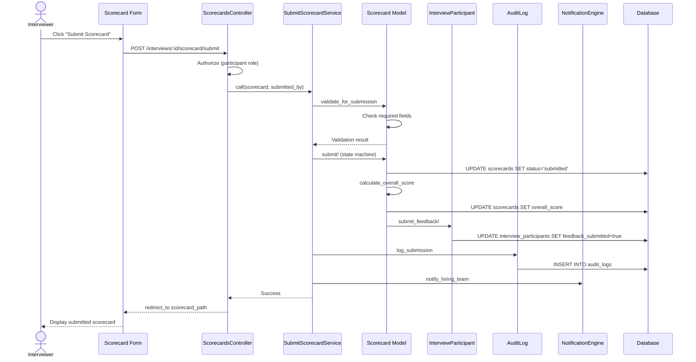

# UC-200: Submit Scorecard

## Metadata

| Attribute | Value |
|-----------|-------|
| **ID** | UC-200 |
| **Name** | Submit Scorecard |
| **Functional Area** | Evaluation & Feedback |
| **Primary Actor** | Interviewer (ACT-04) |
| **Priority** | P1 |
| **Complexity** | Medium |
| **Status** | Draft |

## Description

An interviewer submits a completed scorecard after conducting an interview. The scorecard captures structured feedback including an overall recommendation, competency ratings, and written comments. Once submitted, the scorecard becomes visible to the hiring team and cannot be edited without unlocking.

## Actors

| Actor | Role in Use Case |
|-------|------------------|
| Interviewer (ACT-04) | Completes and submits the scorecard evaluation |
| Hiring Manager (ACT-03) | Receives notification of submitted feedback |
| Recruiter (ACT-02) | Receives notification of submitted feedback |

## Preconditions

- [ ] User is authenticated and is an interview participant
- [ ] Interview status is "completed"
- [ ] Scorecard exists for this participant (created automatically when accessing)
- [ ] Scorecard status is "draft" (not already submitted)

## Postconditions

### Success
- [ ] Scorecard status updated to "submitted"
- [ ] Scorecard submitted_at timestamp recorded
- [ ] Scorecard visible_to_team flag set to true
- [ ] Interview participant feedback_submitted flag set to true
- [ ] Overall score calculated from competency ratings
- [ ] Audit log entry created
- [ ] Hiring team notified of new feedback

### Failure
- [ ] Scorecard remains in draft status
- [ ] Validation errors displayed to user
- [ ] No notifications sent

## Triggers

- Interviewer clicks "Submit Scorecard" button on scorecard form
- Interviewer completes scorecard and clicks "Save and Submit"

## Basic Flow



| Step | Actor | Action | System Response |
|------|-------|--------|-----------------|
| 1 | Interviewer | Opens scorecard for completed interview | System displays scorecard form with template sections |
| 2 | Interviewer | Reviews all required fields are complete | Form shows completion percentage |
| 3 | Interviewer | Enters overall recommendation | Recommendation saved |
| 4 | Interviewer | Enters summary of interview | Summary captured |
| 5 | Interviewer | Clicks "Submit Scorecard" | System validates required fields |
| 6 | System | Validates overall_recommendation is present | Validation passes |
| 7 | System | Validates summary is present | Validation passes |
| 8 | System | Validates all required competencies rated | Validation passes |
| 9 | System | Calculates overall_score from ratings | Score computed |
| 10 | System | Transitions scorecard status to "submitted" | Status updated |
| 11 | System | Sets submitted_at timestamp | Timestamp recorded |
| 12 | System | Sets visible_to_team to true | Visibility enabled |
| 13 | System | Updates participant feedback_submitted flag | Flag set to true |
| 14 | System | Creates audit log entry | Audit recorded |
| 15 | System | Notifies hiring manager and recruiter | Notifications sent |
| 16 | System | Redirects to scorecard view | Submitted scorecard displayed |

## Alternative Flows

### AF-1: Save Draft Before Submitting

**Trigger:** Interviewer wants to save progress before final submission

| Step | Actor | Action | System Response |
|------|-------|--------|-----------------|
| 5a | Interviewer | Clicks "Save Draft" | System saves scorecard |
| 6a | System | Updates scorecard with current values | Data persisted |
| 7a | System | Displays success message | "Scorecard saved" shown |
| 8a | Interviewer | Continues editing or leaves | Draft preserved |

**Resumption:** User can return later to continue from step 2

### AF-2: Interviewer is Lead Interviewer

**Trigger:** Participant has role "lead" instead of "interviewer"

| Step | Actor | Action | System Response |
|------|-------|--------|-----------------|
| 15a | System | Sends priority notification | Higher priority alert |
| 16a | System | Updates interview summary | Lead feedback highlighted |

**Resumption:** Returns to step 16 of basic flow

## Exception Flows

### EF-1: Required Fields Missing

**Trigger:** Required competency ratings or overall recommendation missing at step 6-8

| Step | Actor | Action | System Response |
|------|-------|--------|-----------------|
| E.1 | System | Detects missing required fields | Highlights incomplete sections |
| E.2 | System | Displays validation errors | "Please complete all required fields" |
| E.3 | Interviewer | Completes missing fields | Fields populated |
| E.4 | Interviewer | Resubmits scorecard | System re-validates |

**Resolution:** Returns to step 6, continues if valid

### EF-2: Scorecard Already Submitted

**Trigger:** Scorecard status is not "draft" at step 5

| Step | Actor | Action | System Response |
|------|-------|--------|-----------------|
| E.1 | System | Detects non-draft status | Blocks submission |
| E.2 | System | Displays error message | "Scorecard has already been submitted" |
| E.3 | System | Redirects to view mode | Read-only scorecard displayed |

**Resolution:** Use case ends; user views submitted scorecard

### EF-3: Interview Not Completed

**Trigger:** Interview status is not "completed" at step 1

| Step | Actor | Action | System Response |
|------|-------|--------|-----------------|
| E.1 | System | Detects interview not completed | Blocks scorecard access |
| E.2 | System | Displays error message | "Interview must be completed before submitting feedback" |
| E.3 | System | Redirects to interview details | Interview shown |

**Resolution:** User must complete interview first (UC-158)

## Business Rules

| ID | Rule | Description |
|----|------|-------------|
| BR-200.1 | Interview Completion Required | Scorecards can only be submitted for completed interviews |
| BR-200.2 | One Scorecard Per Participant | Each interview participant can only have one scorecard per interview |
| BR-200.3 | Required Fields | Overall recommendation and summary are always required for submission |
| BR-200.4 | Required Competencies | All competencies marked as required in the template must be rated |
| BR-200.5 | Score Calculation | Overall score is weighted average of section weights and item ratings |
| BR-200.6 | Immutable After Submit | Submitted scorecards cannot be edited without explicit unlock by authorized user |

## Data Requirements

### Input Data

| Field | Type | Required | Validation |
|-------|------|----------|------------|
| overall_recommendation | enum | Yes | strong_hire, hire, no_decision, no_hire, strong_no_hire |
| summary | text | Yes | Max 10,000 chars, not blank |
| strengths | text | No | Max 5,000 chars |
| concerns | text | No | Max 5,000 chars |
| scorecard_responses | array | Conditional | Required items must have values |

### Output Data

| Field | Type | Description |
|-------|------|-------------|
| status | enum | Updated to "submitted" |
| submitted_at | datetime | Timestamp of submission |
| visible_to_team | boolean | Set to true |
| overall_score | decimal | Calculated weighted score (0-100) |

## Database Transactions

### Tables Affected

| Table | Operation | Conditions |
|-------|-----------|------------|
| scorecards | UPDATE | Status, timestamps, score |
| scorecard_responses | UPDATE | Any final response changes |
| interview_participants | UPDATE | feedback_submitted flag |
| audit_logs | CREATE | Submission event |

### Transaction Detail

```sql
-- Submit Scorecard Transaction
BEGIN TRANSACTION;

-- Step 1: Update scorecard status and calculate score
UPDATE scorecards
SET status = 'submitted',
    submitted_at = NOW(),
    visible_to_team = true,
    overall_score = @calculated_score,
    updated_at = NOW()
WHERE id = @scorecard_id
  AND status = 'draft';

-- Step 2: Update interview participant
UPDATE interview_participants
SET feedback_submitted = true,
    updated_at = NOW()
WHERE id = @participant_id;

-- Step 3: Create audit log entry
INSERT INTO audit_logs (
    organization_id,
    user_id,
    action,
    auditable_type,
    auditable_id,
    metadata,
    ip_address,
    user_agent,
    created_at
) VALUES (
    @organization_id,
    @current_user_id,
    'scorecard.submitted',
    'Scorecard',
    @scorecard_id,
    JSON_OBJECT(
        'interview_id', @interview_id,
        'overall_recommendation', @recommendation,
        'overall_score', @calculated_score,
        'candidate_name', @candidate_name,
        'job_title', @job_title
    ),
    @ip_address,
    @user_agent,
    NOW()
);

COMMIT;
```

### Rollback Scenarios

| Scenario | Rollback Action |
|----------|-----------------|
| Validation failure | No transaction started, return errors |
| State transition failure | Full rollback, scorecard remains draft |
| Audit log failure | Log error but commit scorecard (non-critical) |

## UI/UX Requirements

### Screen/Component

- **Location:** /interviews/:interview_id/scorecard
- **Entry Point:**
  - "Submit Feedback" button from interview detail
  - "Complete Scorecard" link from email notification
  - "Pending Feedback" list in interviewer dashboard
- **Key Elements:**
  - Template sections displayed in order by position
  - Rating scale selector for competency items
  - Yes/No toggle for boolean items
  - Text areas for notes and open-ended items
  - Overall recommendation radio buttons
  - Summary text area (required)
  - Strengths/Concerns text areas (optional)
  - Completion percentage indicator
  - "Save Draft" and "Submit Scorecard" buttons

### Form Layout

```
+-------------------------------------------------------------+
| Submit Feedback for: [Candidate Name]                        |
| Interview: [Phone Screen] - [Date]                          |
+-------------------------------------------------------------+
| Progress: [==========------] 65% Complete                    |
+-------------------------------------------------------------+
| [Section 1: Technical Skills]                    Weight: 40% |
| +-----------------------------------------------------------+
| | Problem Solving *                                          |
| | [1] [2] [3] [4] [5]                                       |
| | Notes: [________________________]                          |
| +-----------------------------------------------------------+
| | Coding Ability *                                           |
| | [1] [2] [3] [4] [5]                                       |
| | Notes: [________________________]                          |
| +-----------------------------------------------------------+
|                                                              |
| [Section 2: Communication]                       Weight: 30% |
| +-----------------------------------------------------------+
| | Clarity of Expression                                      |
| | [1] [2] [3] [4] [5]                                       |
| +-----------------------------------------------------------+
|                                                              |
| [Overall Assessment]                                         |
| +-----------------------------------------------------------+
| | Overall Recommendation *                                   |
| | ( ) Strong Hire  ( ) Hire  ( ) No Decision                |
| | ( ) No Hire  ( ) Strong No Hire                           |
| +-----------------------------------------------------------+
| | Summary *                                                  |
| | [                                                    ]     |
| | [                                                    ]     |
| +-----------------------------------------------------------+
| | Strengths                                                  |
| | [                                                    ]     |
| +-----------------------------------------------------------+
| | Concerns                                                   |
| | [                                                    ]     |
| +-----------------------------------------------------------+
|                                                              |
| [Cancel]                    [Save Draft]  [Submit Scorecard] |
+-------------------------------------------------------------+
```

## Non-Functional Requirements

| Requirement | Target |
|-------------|--------|
| Response Time | Form load < 2s, submit < 3s |
| Availability | 99.9% |
| Autosave | Every 30 seconds while editing |
| Concurrent Users | 50 per interview |

## Security Considerations

- [x] Authentication required
- [x] Authorization check: User must be interview participant
- [x] Organization scoping: Scorecard belongs to user's organization
- [x] Data isolation: Cannot view other participants' draft scorecards
- [x] Audit logging: Submission logged with user, timestamp, IP

## Related Use Cases

| Use Case | Relationship |
|----------|--------------|
| UC-158 Complete Interview | Must precede this use case |
| UC-159 View Interview Kit | Often precedes (for preparation) |
| UC-201 Rate Competencies | Embedded within this use case |
| UC-202 Add Interview Notes | Embedded within this use case |
| UC-203 View Team Feedback | Follows (hiring manager reviews) |
| UC-205 Make Hiring Decision | Uses scorecard data |

---

## Data Model References

> Cross-references to [DATA_MODEL.md](../DATA_MODEL.md) and [CRUD_MATRIX.md](../CRUD_MATRIX.md)

### Subject Areas

| Subject Area | ID | Relationship |
|--------------|-----|--------------|
| Evaluation | SA-07 | Primary |
| Interview | SA-06 | Secondary |
| Compliance & Audit | SA-09 | Reference |

### Entities CRUD

| Entity | C | R | U | D | Notes |
|--------|---|---|---|---|-------|
| Scorecard | | ✓ | ✓ | | Updated with submission status |
| ScorecardResponse | | ✓ | ✓ | | Responses saved during editing |
| ScorecardTemplate | | ✓ | | | Read to get template structure |
| ScorecardTemplateSection | | ✓ | | | Read for section layout |
| ScorecardTemplateItem | | ✓ | | | Read for item configuration |
| Interview | | ✓ | | | Read to verify completion |
| InterviewParticipant | | ✓ | ✓ | | Updated with feedback_submitted |
| AuditLog | ✓ | | | | Created in step 14 |

**Legend:** C = Create, R = Read, U = Update, D = Delete

---

## Process Model References

> Cross-references to [PROCESS_MODEL.md](../PROCESS_MODEL.md) and [PROCESS_CRUD_MATRIX.md](../PROCESS_CRUD_MATRIX.md)

| Attribute | Value | Link |
|-----------|-------|------|
| **Elementary Business Process** | EP-0601: Submit Scorecard | [PROCESS_MODEL.md#ep-0601](../PROCESS_MODEL.md#ep-0601-submit-scorecard) |
| **Business Process** | BP-202: Feedback Collection | [PROCESS_MODEL.md#bp-202](../PROCESS_MODEL.md#bp-202-feedback-collection) |
| **Business Function** | BF-02: Candidate Evaluation | [PROCESS_MODEL.md#bf-02](../PROCESS_MODEL.md#bf-02-candidate-evaluation) |

### EBP Details

| Attribute | Value |
|-----------|-------|
| **Trigger** | Interviewer completes evaluation after interview |
| **Input** | Competency ratings, recommendation, summary, notes |
| **Output** | Submitted scorecard visible to hiring team |
| **Business Rules** | BR-200.1 through BR-200.6 (see Business Rules section) |

---

## Traceability Matrix

> Complete artifact mapping for requirements traceability

| Artifact Type | ID | Name | Link |
|---------------|-----|------|------|
| **Use Case** | UC-200 | Submit Scorecard | *(this document)* |
| **Elementary Process** | EP-0601 | Submit Scorecard | [PROCESS_MODEL.md](../PROCESS_MODEL.md#ep-0601-submit-scorecard) |
| **Business Process** | BP-202 | Feedback Collection | [PROCESS_MODEL.md](../PROCESS_MODEL.md#bp-202-feedback-collection) |
| **Business Function** | BF-02 | Candidate Evaluation | [PROCESS_MODEL.md](../PROCESS_MODEL.md#bf-02-candidate-evaluation) |
| **Primary Actor** | ACT-04 | Interviewer | [ACTORS.md](../ACTORS.md#act-04-interviewer) |
| **Subject Area (Primary)** | SA-07 | Evaluation | [DATA_MODEL.md](../DATA_MODEL.md#sa-07-evaluation) |
| **Subject Area (Secondary)** | SA-06 | Interview | [DATA_MODEL.md](../DATA_MODEL.md#sa-06-interview) |
| **CRUD Matrix Row** | UC-200 | - | [CRUD_MATRIX.md](../CRUD_MATRIX.md#uc-200) |
| **Process CRUD Row** | EP-0601 | - | [PROCESS_CRUD_MATRIX.md](../PROCESS_CRUD_MATRIX.md#ep-0601) |

### Implementation Artifacts

| Artifact Type | Path/Reference | Status |
|---------------|----------------|--------|
| Controller | `app/controllers/scorecards_controller.rb` | Implemented |
| Model | `app/models/scorecard.rb` | Implemented |
| Service | `app/services/submit_scorecard_service.rb` | Implemented |
| Policy | `app/policies/scorecard_policy.rb` | Implemented |
| View | `app/views/scorecards/edit.html.erb` | Implemented |
| Test | `test/models/scorecard_test.rb` | Implemented |

---

## Open Questions

1. Should interviewers be able to view their own submitted scorecards immediately or only after all feedback is collected?
2. What is the grace period for editing a submitted scorecard before it becomes locked?
3. Should the system auto-submit scorecards that are left as drafts after a configurable time period?

## Change History

| Version | Date | Author | Changes |
|---------|------|--------|---------|
| 0.1 | 2026-01-25 | System | Initial draft |
