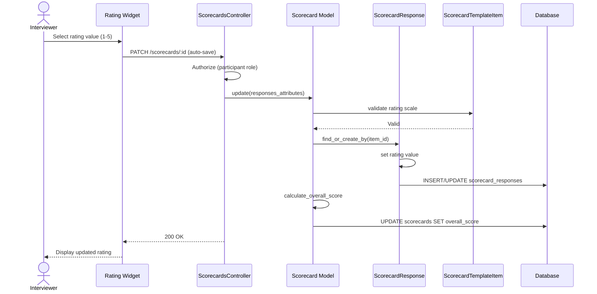

# UC-201: Rate Competencies

## Metadata

| Attribute | Value |
|-----------|-------|
| **ID** | UC-201 |
| **Name** | Rate Competencies |
| **Functional Area** | Evaluation & Feedback |
| **Primary Actor** | Interviewer (ACT-04) |
| **Priority** | P1 |
| **Complexity** | Low |
| **Status** | Draft |

## Description

An interviewer rates a candidate on specific competencies defined in the scorecard template. Each competency is scored on a configurable scale (typically 1-5) with optional notes. Ratings are saved as scorecard responses and contribute to the overall score calculation.

## Actors

| Actor | Role in Use Case |
|-------|------------------|
| Interviewer (ACT-04) | Provides ratings for competencies |
| Recruiter (ACT-02) | Configures competencies in templates |

## Preconditions

- [ ] User is authenticated and is an interview participant
- [ ] Interview status is "completed"
- [ ] Scorecard exists for this participant
- [ ] Scorecard status is "draft" (editable)
- [ ] Scorecard template contains competency items

## Postconditions

### Success
- [ ] ScorecardResponse records created/updated for rated items
- [ ] Overall score recalculated based on new ratings
- [ ] Scorecard updated_at timestamp refreshed
- [ ] Rating persisted to database

### Failure
- [ ] Invalid rating value rejected
- [ ] Validation error displayed
- [ ] Previous rating preserved

## Triggers

- Interviewer selects a rating value on the scorecard form
- Interviewer updates an existing rating
- Form auto-saves after rating selection

## Basic Flow



| Step | Actor | Action | System Response |
|------|-------|--------|-----------------|
| 1 | Interviewer | Views competency item in scorecard | Rating scale displayed |
| 2 | Interviewer | Clicks on rating value (e.g., 4 of 5) | Rating selected visually |
| 3 | System | Validates rating is within scale range | Validation passes |
| 4 | System | Creates/updates ScorecardResponse | Response saved |
| 5 | System | Recalculates overall score | Score updated |
| 6 | System | Updates scorecard timestamp | Updated_at refreshed |
| 7 | System | Confirms save (via UI indicator) | "Saved" indicator shown |

## Alternative Flows

### AF-1: Add Notes to Rating

**Trigger:** Interviewer wants to add context to the rating

| Step | Actor | Action | System Response |
|------|-------|--------|-----------------|
| 7a | Interviewer | Expands notes field | Text area shown |
| 8a | Interviewer | Enters rating notes | Notes captured |
| 9a | System | Saves notes with rating | Response updated |

**Resumption:** Use case ends

### AF-2: Change Existing Rating

**Trigger:** Interviewer wants to modify a previously saved rating

| Step | Actor | Action | System Response |
|------|-------|--------|-----------------|
| 2a | Interviewer | Clicks different rating value | New selection highlighted |
| 3a | System | Updates existing ScorecardResponse | Response overwritten |

**Resumption:** Continues at step 5 of basic flow

### AF-3: Clear Rating

**Trigger:** Interviewer wants to remove a rating (for optional competencies)

| Step | Actor | Action | System Response |
|------|-------|--------|-----------------|
| 2b | Interviewer | Clicks selected rating again (toggle off) | Rating cleared |
| 3b | System | Sets rating to null | Response updated |
| 4b | System | Validates not required item | Validation passes |

**Resumption:** Continues at step 5 of basic flow

## Exception Flows

### EF-1: Invalid Rating Value

**Trigger:** Rating value outside configured scale at step 3

| Step | Actor | Action | System Response |
|------|-------|--------|-----------------|
| E.1 | System | Detects invalid rating | Rejects value |
| E.2 | System | Displays validation error | "Rating must be between 1 and 5" |
| E.3 | Interviewer | Selects valid rating | Value accepted |

**Resolution:** Returns to step 4, continues if valid

### EF-2: Scorecard Already Submitted

**Trigger:** Scorecard status is not "draft" at step 1

| Step | Actor | Action | System Response |
|------|-------|--------|-----------------|
| E.1 | System | Detects non-draft status | Read-only mode enabled |
| E.2 | System | Disables rating controls | Ratings not clickable |
| E.3 | System | Displays notice | "Scorecard has been submitted" |

**Resolution:** Use case ends; ratings cannot be modified

### EF-3: Required Competency Not Rated

**Trigger:** Required competency has no rating when scorecard is being submitted

| Step | Actor | Action | System Response |
|------|-------|--------|-----------------|
| E.1 | System | Detects missing required rating | Highlights item |
| E.2 | System | Blocks scorecard submission | Error message shown |
| E.3 | Interviewer | Provides rating | Validation passes |

**Resolution:** Scorecard submission continues (UC-200)

## Business Rules

| ID | Rule | Description |
|----|------|-------------|
| BR-201.1 | Rating Scale | Rating must be between 1 and the item's rating_scale (typically 5) |
| BR-201.2 | Required Items | Competencies marked as required must be rated before submission |
| BR-201.3 | One Response Per Item | Each competency can only have one rating per scorecard |
| BR-201.4 | Draft Only | Ratings can only be modified when scorecard is in draft status |
| BR-201.5 | Weight Calculation | Ratings contribute to overall score based on section weights |
| BR-201.6 | Scale Labels | Rating displays use labels from RATING_SCALES (e.g., "Strong No" to "Strong Yes") |

## Data Requirements

### Input Data

| Field | Type | Required | Validation |
|-------|------|----------|------------|
| scorecard_template_item_id | integer | Yes | Must exist in template |
| rating | integer | Conditional | 1 to rating_scale (default 5) |
| notes | text | No | Max 2,000 chars |

### Output Data

| Field | Type | Description |
|-------|------|-------------|
| id | integer | ScorecardResponse ID |
| rating | integer | Selected rating value |
| notes | text | Optional notes |
| scorecard.overall_score | decimal | Recalculated score |

## Database Transactions

### Tables Affected

| Table | Operation | Conditions |
|-------|-----------|------------|
| scorecard_responses | CREATE/UPDATE | Rating for competency item |
| scorecards | UPDATE | Recalculated overall_score |

### Transaction Detail

```sql
-- Rate Competency Transaction
BEGIN TRANSACTION;

-- Step 1: Upsert scorecard response
INSERT INTO scorecard_responses (
    scorecard_id,
    scorecard_template_item_id,
    rating,
    notes,
    created_at,
    updated_at
) VALUES (
    @scorecard_id,
    @item_id,
    @rating_value,
    @notes,
    NOW(),
    NOW()
)
ON CONFLICT (scorecard_id, scorecard_template_item_id) DO UPDATE SET
    rating = @rating_value,
    notes = COALESCE(@notes, scorecard_responses.notes),
    updated_at = NOW();

-- Step 2: Recalculate and update overall score
UPDATE scorecards
SET overall_score = (
    SELECT ROUND(
        SUM(
            (sr.rating::float / sti.rating_scale) * 100 * COALESCE(sts.weight, 100)
        ) / SUM(COALESCE(sts.weight, 100)),
        2
    )
    FROM scorecard_responses sr
    JOIN scorecard_template_items sti ON sr.scorecard_template_item_id = sti.id
    JOIN scorecard_template_sections sts ON sti.scorecard_template_section_id = sts.id
    WHERE sr.scorecard_id = @scorecard_id
      AND sti.item_type = 'rating'
      AND sr.rating IS NOT NULL
),
    updated_at = NOW()
WHERE id = @scorecard_id;

COMMIT;
```

### Rollback Scenarios

| Scenario | Rollback Action |
|----------|-----------------|
| Invalid rating value | No transaction, return validation error |
| Database constraint violation | Full rollback, return error |

## UI/UX Requirements

### Screen/Component

- **Location:** Embedded within /interviews/:id/scorecard/edit
- **Entry Point:** Part of scorecard form
- **Key Elements:**
  - Rating scale selector (1-5 stars or numbered buttons)
  - Rating labels from template (e.g., "Strong No" to "Strong Yes")
  - Optional notes expandable section
  - Required indicator (*) for required items
  - Guidance text from template
  - Visual feedback on selection

### Rating Widget

```
+-------------------------------------------------------+
| Technical Problem Solving *                            |
| [Guidance: Evaluate ability to break down problems...] |
+-------------------------------------------------------+
|                                                        |
|   [1]      [2]      [3]      [4]      [5]             |
| Strong    No     Neutral   Yes    Strong              |
|   No                               Yes                 |
|                         [X]                            |
|                                                        |
+-------------------------------------------------------+
| + Add notes                                            |
+-------------------------------------------------------+
```

### Rating Scale Display

```
5-Point Scale:
+---+---+---+---+---+
| 1 | 2 | 3 | 4 | 5 |
+---+---+---+---+---+
  |   |   |   |   |
  v   v   v   v   v
Strong No Neutral Yes Strong
  No              Yes

4-Point Scale:
+---+---+---+---+
| 1 | 2 | 3 | 4 |
+---+---+---+---+
  |   |   |   |
  v   v   v   v
 No Maybe Maybe Yes
    No   Yes

3-Point Scale:
+---+---+---+
| 1 | 2 | 3 |
+---+---+---+
  |   |   |
  v   v   v
Below Meets Exceeds
```

## Non-Functional Requirements

| Requirement | Target |
|-------------|--------|
| Response Time | Rating save < 500ms |
| Availability | 99.9% |
| Autosave | Within 2 seconds of selection |
| Offline Support | Queue changes for sync |

## Security Considerations

- [x] Authentication required
- [x] Authorization check: User must own the scorecard
- [x] Draft status verified before write
- [x] Input validation on rating range

## Related Use Cases

| Use Case | Relationship |
|----------|--------------|
| UC-200 Submit Scorecard | Parent use case |
| UC-202 Add Interview Notes | Related (notes on ratings) |
| UC-207 Manage Competencies | Defines competencies being rated |
| UC-208 Create Scorecard Template | Configures rating scales |

---

## Data Model References

> Cross-references to [DATA_MODEL.md](../DATA_MODEL.md) and [CRUD_MATRIX.md](../CRUD_MATRIX.md)

### Subject Areas

| Subject Area | ID | Relationship |
|--------------|-----|--------------|
| Evaluation | SA-07 | Primary |
| Interview | SA-06 | Secondary |

### Entities CRUD

| Entity | C | R | U | D | Notes |
|--------|---|---|---|---|-------|
| ScorecardResponse | ✓ | ✓ | ✓ | | Created/updated with rating |
| Scorecard | | ✓ | ✓ | | Overall score recalculated |
| ScorecardTemplateItem | | ✓ | | | Read for validation rules |

**Legend:** C = Create, R = Read, U = Update, D = Delete

---

## Process Model References

> Cross-references to [PROCESS_MODEL.md](../PROCESS_MODEL.md) and [PROCESS_CRUD_MATRIX.md](../PROCESS_CRUD_MATRIX.md)

| Attribute | Value | Link |
|-----------|-------|------|
| **Elementary Business Process** | EP-0602: Rate Competencies | [PROCESS_MODEL.md#ep-0602](../PROCESS_MODEL.md#ep-0602-rate-competencies) |
| **Business Process** | BP-202: Feedback Collection | [PROCESS_MODEL.md#bp-202](../PROCESS_MODEL.md#bp-202-feedback-collection) |
| **Business Function** | BF-02: Candidate Evaluation | [PROCESS_MODEL.md#bf-02](../PROCESS_MODEL.md#bf-02-candidate-evaluation) |

### EBP Details

| Attribute | Value |
|-----------|-------|
| **Trigger** | Interviewer evaluates candidate on competency |
| **Input** | Rating value (1-5), optional notes |
| **Output** | Saved rating contributing to overall score |
| **Business Rules** | BR-201.1 through BR-201.6 (see Business Rules section) |

---

## Traceability Matrix

> Complete artifact mapping for requirements traceability

| Artifact Type | ID | Name | Link |
|---------------|-----|------|------|
| **Use Case** | UC-201 | Rate Competencies | *(this document)* |
| **Elementary Process** | EP-0602 | Rate Competencies | [PROCESS_MODEL.md](../PROCESS_MODEL.md#ep-0602-rate-competencies) |
| **Business Process** | BP-202 | Feedback Collection | [PROCESS_MODEL.md](../PROCESS_MODEL.md#bp-202-feedback-collection) |
| **Business Function** | BF-02 | Candidate Evaluation | [PROCESS_MODEL.md](../PROCESS_MODEL.md#bf-02-candidate-evaluation) |
| **Primary Actor** | ACT-04 | Interviewer | [ACTORS.md](../ACTORS.md#act-04-interviewer) |
| **Subject Area (Primary)** | SA-07 | Evaluation | [DATA_MODEL.md](../DATA_MODEL.md#sa-07-evaluation) |
| **CRUD Matrix Row** | UC-201 | - | [CRUD_MATRIX.md](../CRUD_MATRIX.md#uc-201) |
| **Process CRUD Row** | EP-0602 | - | [PROCESS_CRUD_MATRIX.md](../PROCESS_CRUD_MATRIX.md#ep-0602) |

### Implementation Artifacts

| Artifact Type | Path/Reference | Status |
|---------------|----------------|--------|
| Controller | `app/controllers/scorecards_controller.rb` | Implemented |
| Model | `app/models/scorecard_response.rb` | Implemented |
| Model | `app/models/scorecard_template_item.rb` | Implemented |
| View | `app/views/scorecards/_rating_widget.html.erb` | Implemented |
| Test | `test/models/scorecard_response_test.rb` | Implemented |

---

## Open Questions

1. Should we support custom rating scales beyond 3, 4, and 5 point?
2. Should ratings be hidden from other interviewers until all feedback is submitted?
3. Should there be a "N/A" option for competencies that cannot be evaluated?

## Change History

| Version | Date | Author | Changes |
|---------|------|--------|---------|
| 0.1 | 2026-01-25 | System | Initial draft |
