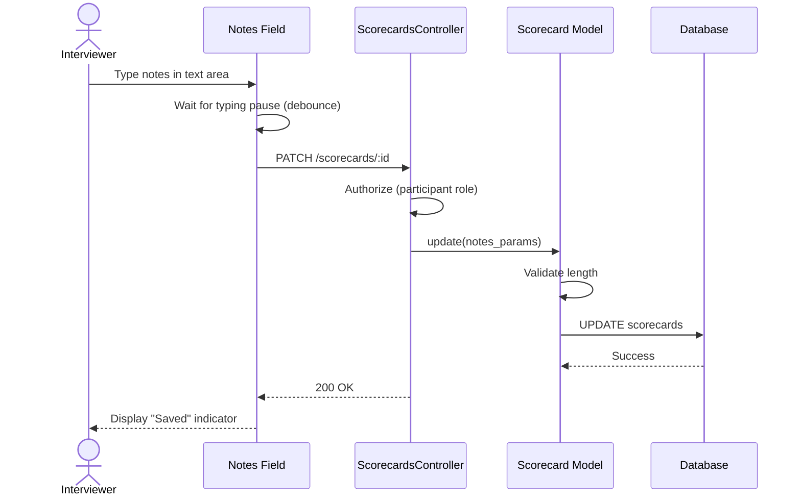

# UC-202: Add Interview Notes

## Metadata

| Attribute | Value |
|-----------|-------|
| **ID** | UC-202 |
| **Name** | Add Interview Notes |
| **Functional Area** | Evaluation & Feedback |
| **Primary Actor** | Interviewer (ACT-04) |
| **Priority** | P2 |
| **Complexity** | Low |
| **Status** | Draft |

## Description

An interviewer adds free-form notes to their scorecard during or after an interview. Notes can be added as general feedback (summary, strengths, concerns) or attached to specific competency ratings. These notes provide qualitative context to supplement quantitative ratings and are visible to the hiring team after scorecard submission.

## Actors

| Actor | Role in Use Case |
|-------|------------------|
| Interviewer (ACT-04) | Writes interview observations and notes |
| Hiring Manager (ACT-03) | Reviews notes as part of feedback (after submission) |
| Recruiter (ACT-02) | Reviews notes as part of candidate evaluation |

## Preconditions

- [ ] User is authenticated and is an interview participant
- [ ] Scorecard exists for this participant
- [ ] Scorecard status is "draft" (editable)

## Postconditions

### Success
- [ ] Notes saved to appropriate scorecard fields or response records
- [ ] Scorecard updated_at timestamp refreshed
- [ ] Notes ready for visibility upon submission

### Failure
- [ ] Validation error displayed (e.g., character limit exceeded)
- [ ] User prompted to correct issue

## Triggers

- Interviewer types in a notes text field on the scorecard form
- Form auto-saves after typing pause
- Interviewer clicks "Save Draft"

## Basic Flow



| Step | Actor | Action | System Response |
|------|-------|--------|-----------------|
| 1 | Interviewer | Clicks on notes text field | Text area becomes active |
| 2 | Interviewer | Types interview observations | Characters captured |
| 3 | System | Detects typing pause (500ms) | Initiates auto-save |
| 4 | System | Validates notes length | Validation passes |
| 5 | System | Saves notes to scorecard | Data persisted |
| 6 | System | Updates scorecard timestamp | Updated_at refreshed |
| 7 | System | Shows save indicator | "Saved" text appears |

## Alternative Flows

### AF-1: Add Notes to Specific Competency

**Trigger:** Interviewer expands notes section on a rating item

| Step | Actor | Action | System Response |
|------|-------|--------|-----------------|
| 1a | Interviewer | Clicks "Add notes" on rating item | Notes field expands |
| 2a | Interviewer | Types competency-specific notes | Notes captured |
| 3a | System | Saves to ScorecardResponse.notes | Response updated |

**Resumption:** Continues at step 3 of basic flow

### AF-2: Add Strengths/Concerns

**Trigger:** Interviewer enters content in strengths or concerns fields

| Step | Actor | Action | System Response |
|------|-------|--------|-----------------|
| 1b | Interviewer | Clicks Strengths text area | Field becomes active |
| 2b | Interviewer | Types candidate strengths | Content captured |
| 3b | System | Saves to scorecard.strengths | Field updated |
| 4b | Interviewer | Clicks Concerns text area | Field becomes active |
| 5b | Interviewer | Types candidate concerns | Content captured |
| 6b | System | Saves to scorecard.concerns | Field updated |

**Resumption:** Use case ends

### AF-3: Format Notes with Markdown

**Trigger:** Interviewer uses markdown formatting

| Step | Actor | Action | System Response |
|------|-------|--------|-----------------|
| 2c | Interviewer | Uses markdown syntax (bullets, bold) | Formatting preserved |
| 5c | System | Stores raw markdown | Text saved |
| 7c | System | Renders formatted preview | Formatted view shown |

**Resumption:** Use case ends

## Exception Flows

### EF-1: Notes Exceed Character Limit

**Trigger:** Notes exceed maximum allowed length at step 4

| Step | Actor | Action | System Response |
|------|-------|--------|-----------------|
| E.1 | System | Detects length violation | Highlights field |
| E.2 | System | Displays character count | "5,100 / 5,000 characters" |
| E.3 | Interviewer | Reduces notes length | Characters removed |
| E.4 | System | Re-validates | Validation passes |

**Resolution:** Returns to step 5, continues if valid

### EF-2: Scorecard Already Submitted

**Trigger:** Scorecard status is not "draft"

| Step | Actor | Action | System Response |
|------|-------|--------|-----------------|
| E.1 | System | Detects non-draft status | Read-only mode |
| E.2 | System | Disables text areas | Fields not editable |
| E.3 | System | Displays submitted notes | View-only display |

**Resolution:** Use case ends; notes cannot be modified

### EF-3: Auto-Save Fails

**Trigger:** Network error during save at step 5

| Step | Actor | Action | System Response |
|------|-------|--------|-----------------|
| E.1 | System | Detects save failure | Error indicator shown |
| E.2 | System | Displays retry message | "Save failed. Retrying..." |
| E.3 | System | Queues for retry | Auto-retry in 5 seconds |
| E.4 | System | Retries save | Success or show error |

**Resolution:** Returns to step 5 on success, displays error if persistent failure

## Business Rules

| ID | Rule | Description |
|----|------|-------------|
| BR-202.1 | Character Limits | Summary: 10,000 chars; Strengths/Concerns: 5,000 chars each; Item notes: 2,000 chars |
| BR-202.2 | Draft Only | Notes can only be modified when scorecard is in draft status |
| BR-202.3 | Auto-Save | Notes auto-save after 500ms typing pause |
| BR-202.4 | Required Summary | Summary field is required for scorecard submission |
| BR-202.5 | Visibility | Notes become visible to hiring team only after scorecard submission |
| BR-202.6 | No PII | Notes should not contain sensitive candidate information (phone, email) |

## Data Requirements

### Input Data

| Field | Type | Required | Validation |
|-------|------|----------|------------|
| summary | text | Yes (for submit) | Max 10,000 chars |
| strengths | text | No | Max 5,000 chars |
| concerns | text | No | Max 5,000 chars |
| scorecard_response.notes | text | No | Max 2,000 chars |

### Output Data

| Field | Type | Description |
|-------|------|-------------|
| summary | text | Saved interview summary |
| strengths | text | Saved strengths |
| concerns | text | Saved concerns |
| updated_at | datetime | Last modification time |

## Database Transactions

### Tables Affected

| Table | Operation | Conditions |
|-------|-----------|------------|
| scorecards | UPDATE | Summary, strengths, concerns fields |
| scorecard_responses | UPDATE | Item-specific notes |

### Transaction Detail

```sql
-- Add Interview Notes Transaction
BEGIN TRANSACTION;

-- Update general notes
UPDATE scorecards
SET summary = @summary,
    strengths = @strengths,
    concerns = @concerns,
    updated_at = NOW()
WHERE id = @scorecard_id
  AND status = 'draft';

-- Update item-specific notes (if applicable)
UPDATE scorecard_responses
SET notes = @item_notes,
    updated_at = NOW()
WHERE scorecard_id = @scorecard_id
  AND scorecard_template_item_id = @item_id;

COMMIT;
```

### Rollback Scenarios

| Scenario | Rollback Action |
|----------|-----------------|
| Validation failure | No transaction, return error |
| Character limit exceeded | Reject update, prompt user |

## UI/UX Requirements

### Screen/Component

- **Location:** Embedded within /interviews/:id/scorecard/edit
- **Entry Point:** Part of scorecard form
- **Key Elements:**
  - Summary text area (large, prominent)
  - Strengths text area
  - Concerns text area
  - Expandable notes on each rating item
  - Character counter
  - Auto-save indicator
  - Markdown preview toggle

### Notes Layout

```
+-------------------------------------------------------+
| Summary * (Required for submission)                    |
+-------------------------------------------------------+
| [                                                     ] |
| [  Provide an overall summary of the interview and   ] |
| [  your recommendation for this candidate...         ] |
| [                                                     ] |
+-------------------------------------------------------+
| 1,250 / 10,000 characters          [Saved]            |
+-------------------------------------------------------+

+-------------------------------------------------------+
| Strengths                                              |
+-------------------------------------------------------+
| [                                                     ] |
| [  Key strengths demonstrated by the candidate...    ] |
| [                                                     ] |
+-------------------------------------------------------+
| 450 / 5,000 characters                                |
+-------------------------------------------------------+

+-------------------------------------------------------+
| Concerns                                               |
+-------------------------------------------------------+
| [                                                     ] |
| [  Areas of concern or improvement opportunities...  ] |
| [                                                     ] |
+-------------------------------------------------------+
| 320 / 5,000 characters                                |
+-------------------------------------------------------+
```

### Item Notes Expansion

```
+-------------------------------------------------------+
| Technical Problem Solving                       [4/5] |
+-------------------------------------------------------+
| + Add notes                                            |
+-------------------------------------------------------+

[After clicking "Add notes":]

+-------------------------------------------------------+
| Technical Problem Solving                       [4/5] |
+-------------------------------------------------------+
| Notes:                                                 |
| [  Demonstrated solid approach to breaking down      ] |
| [  the problem. Could have been more thorough...     ] |
+-------------------------------------------------------+
| 125 / 2,000 characters                                |
+-------------------------------------------------------+
```

## Non-Functional Requirements

| Requirement | Target |
|-------------|--------|
| Response Time | Auto-save < 500ms |
| Availability | 99.9% |
| Autosave Debounce | 500ms after last keystroke |
| Offline Support | Local storage backup |

## Security Considerations

- [x] Authentication required
- [x] Authorization check: User must own the scorecard
- [x] Draft status verified before write
- [x] XSS prevention on notes display
- [x] No PII storage guidance

## Related Use Cases

| Use Case | Relationship |
|----------|--------------|
| UC-200 Submit Scorecard | Parent use case |
| UC-201 Rate Competencies | Related (notes on ratings) |
| UC-203 View Team Feedback | Consumes notes |
| UC-159 View Interview Kit | May provide note prompts |

---

## Data Model References

> Cross-references to [DATA_MODEL.md](../DATA_MODEL.md) and [CRUD_MATRIX.md](../CRUD_MATRIX.md)

### Subject Areas

| Subject Area | ID | Relationship |
|--------------|-----|--------------|
| Evaluation | SA-07 | Primary |
| Interview | SA-06 | Secondary |

### Entities CRUD

| Entity | C | R | U | D | Notes |
|--------|---|---|---|---|-------|
| Scorecard | | ✓ | ✓ | | Summary, strengths, concerns updated |
| ScorecardResponse | | ✓ | ✓ | | Item notes updated |

**Legend:** C = Create, R = Read, U = Update, D = Delete

---

## Process Model References

> Cross-references to [PROCESS_MODEL.md](../PROCESS_MODEL.md) and [PROCESS_CRUD_MATRIX.md](../PROCESS_CRUD_MATRIX.md)

| Attribute | Value | Link |
|-----------|-------|------|
| **Elementary Business Process** | EP-0603: Add Interview Notes | [PROCESS_MODEL.md#ep-0603](../PROCESS_MODEL.md#ep-0603-add-interview-notes) |
| **Business Process** | BP-202: Feedback Collection | [PROCESS_MODEL.md#bp-202](../PROCESS_MODEL.md#bp-202-feedback-collection) |
| **Business Function** | BF-02: Candidate Evaluation | [PROCESS_MODEL.md#bf-02](../PROCESS_MODEL.md#bf-02-candidate-evaluation) |

### EBP Details

| Attribute | Value |
|-----------|-------|
| **Trigger** | Interviewer documents observations during/after interview |
| **Input** | Free-form text notes |
| **Output** | Saved notes associated with scorecard |
| **Business Rules** | BR-202.1 through BR-202.6 (see Business Rules section) |

---

## Traceability Matrix

> Complete artifact mapping for requirements traceability

| Artifact Type | ID | Name | Link |
|---------------|-----|------|------|
| **Use Case** | UC-202 | Add Interview Notes | *(this document)* |
| **Elementary Process** | EP-0603 | Add Interview Notes | [PROCESS_MODEL.md](../PROCESS_MODEL.md#ep-0603-add-interview-notes) |
| **Business Process** | BP-202 | Feedback Collection | [PROCESS_MODEL.md](../PROCESS_MODEL.md#bp-202-feedback-collection) |
| **Business Function** | BF-02 | Candidate Evaluation | [PROCESS_MODEL.md](../PROCESS_MODEL.md#bf-02-candidate-evaluation) |
| **Primary Actor** | ACT-04 | Interviewer | [ACTORS.md](../ACTORS.md#act-04-interviewer) |
| **Subject Area (Primary)** | SA-07 | Evaluation | [DATA_MODEL.md](../DATA_MODEL.md#sa-07-evaluation) |
| **CRUD Matrix Row** | UC-202 | - | [CRUD_MATRIX.md](../CRUD_MATRIX.md#uc-202) |
| **Process CRUD Row** | EP-0603 | - | [PROCESS_CRUD_MATRIX.md](../PROCESS_CRUD_MATRIX.md#ep-0603) |

### Implementation Artifacts

| Artifact Type | Path/Reference | Status |
|---------------|----------------|--------|
| Controller | `app/controllers/scorecards_controller.rb` | Implemented |
| Model | `app/models/scorecard.rb` | Implemented |
| Model | `app/models/scorecard_response.rb` | Implemented |
| View | `app/views/scorecards/edit.html.erb` | Implemented |
| Stimulus | `app/javascript/controllers/autosave_controller.js` | Implemented |

---

## Open Questions

1. Should notes support rich text formatting beyond markdown?
2. Should we implement a voice-to-text option for mobile interviews?
3. Should notes be encrypted at rest for additional privacy protection?

## Change History

| Version | Date | Author | Changes |
|---------|------|--------|---------|
| 0.1 | 2026-01-25 | System | Initial draft |
