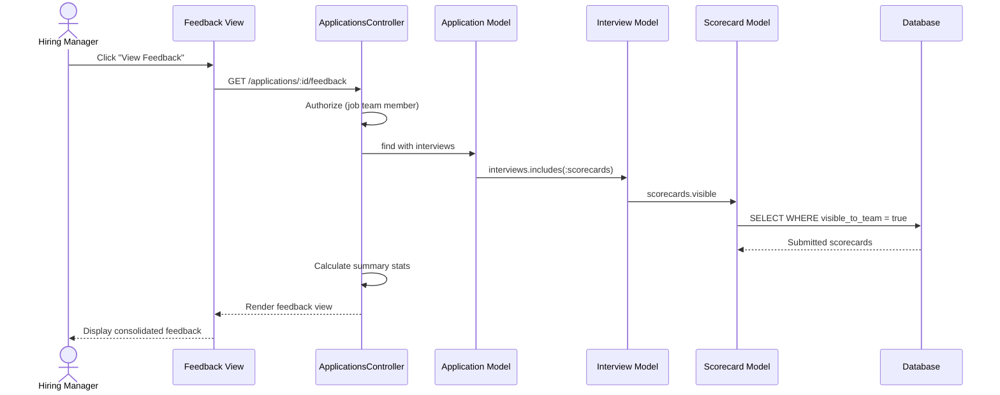

# UC-203: View Team Feedback

## Metadata

| Attribute | Value |
|-----------|-------|
| **ID** | UC-203 |
| **Name** | View Team Feedback |
| **Functional Area** | Evaluation & Feedback |
| **Primary Actor** | Hiring Manager (ACT-03) |
| **Priority** | P1 |
| **Complexity** | Medium |
| **Status** | Draft |

## Description

A hiring manager or recruiter views all submitted scorecards and feedback for a candidate across one or more interviews. This consolidated view enables informed hiring decisions by presenting ratings, recommendations, and notes from all interviewers in one place.

## Actors

| Actor | Role in Use Case |
|-------|------------------|
| Hiring Manager (ACT-03) | Reviews team feedback to make hiring decisions |
| Recruiter (ACT-02) | Reviews feedback to coordinate with hiring manager |
| Interviewer (ACT-04) | May view feedback after submitting their own (configurable) |

## Preconditions

- [ ] User is authenticated
- [ ] User has access to the application (job team member or admin)
- [ ] At least one scorecard has been submitted for the application

## Postconditions

### Success
- [ ] All submitted scorecards displayed
- [ ] Summary statistics calculated and shown
- [ ] Interview timeline visible
- [ ] Recommendation distribution displayed

### Failure
- [ ] Access denied if user lacks permissions
- [ ] "No feedback yet" message if no submitted scorecards

## Triggers

- Hiring manager clicks "View Feedback" on application detail page
- Recruiter navigates to candidate's feedback tab
- User clicks on "Feedback" in application sidebar

## Basic Flow



| Step | Actor | Action | System Response |
|------|-------|--------|-----------------|
| 1 | Hiring Manager | Navigates to application | Application detail shown |
| 2 | Hiring Manager | Clicks "View Feedback" tab | System loads feedback data |
| 3 | System | Authorizes user access | Access granted |
| 4 | System | Fetches all interviews for application | Interviews loaded |
| 5 | System | Fetches visible scorecards for each interview | Scorecards retrieved |
| 6 | System | Calculates summary statistics | Stats computed |
| 7 | System | Renders consolidated feedback view | Feedback displayed |
| 8 | Hiring Manager | Views recommendation distribution | Chart/summary shown |
| 9 | Hiring Manager | Scrolls through individual scorecards | Detailed feedback visible |

## Alternative Flows

### AF-1: Filter by Interview

**Trigger:** User wants to focus on specific interview round

| Step | Actor | Action | System Response |
|------|-------|--------|-----------------|
| 9a | Hiring Manager | Selects interview filter | Filtered scorecards shown |
| 10a | System | Shows only scorecards for selected interview | View updated |

**Resumption:** User can continue reviewing or remove filter

### AF-2: Expand/Collapse Scorecards

**Trigger:** User wants to see detailed vs. summary view

| Step | Actor | Action | System Response |
|------|-------|--------|-----------------|
| 9b | Hiring Manager | Clicks "Expand All" | All scorecards expanded |
| 10b | System | Shows full notes and all ratings | Detailed view |
| 11b | Hiring Manager | Clicks "Collapse All" | Summary view restored |

**Resumption:** Use case ends

### AF-3: View as Recruiter

**Trigger:** Recruiter accesses feedback view

| Step | Actor | Action | System Response |
|------|-------|--------|-----------------|
| 3a | System | Authorizes recruiter access | Full access granted |
| 8a | System | Shows additional recruiter actions | "Request Feedback" button visible |

**Resumption:** Continues with full view

### AF-4: Interviewer Views After Submission

**Trigger:** Interviewer accesses feedback after submitting their own

| Step | Actor | Action | System Response |
|------|-------|--------|-----------------|
| 3b | System | Checks interviewer's scorecard submitted | Submission verified |
| 7b | System | Shows limited view (org policy dependent) | Feedback visible |

**Resumption:** Interviewer views available feedback

## Exception Flows

### EF-1: No Scorecards Submitted

**Trigger:** No interviewers have submitted feedback yet

| Step | Actor | Action | System Response |
|------|-------|--------|-----------------|
| E.1 | System | Detects no submitted scorecards | Empty state shown |
| E.2 | System | Displays "No feedback yet" message | Helpful message |
| E.3 | System | Shows pending feedback list | Interviewers who haven't submitted |
| E.4 | System | Offers "Request Feedback" action | Action button available |

**Resolution:** User can request feedback (UC-204)

### EF-2: User Not Authorized

**Trigger:** User is not part of job team at step 3

| Step | Actor | Action | System Response |
|------|-------|--------|-----------------|
| E.1 | System | Detects insufficient permissions | Access denied |
| E.2 | System | Redirects to application index | Error message shown |
| E.3 | System | Logs access attempt | Audit entry created |

**Resolution:** User cannot view feedback

### EF-3: Partial Feedback

**Trigger:** Some but not all interviewers have submitted

| Step | Actor | Action | System Response |
|------|-------|--------|-----------------|
| 7a | System | Detects incomplete feedback | Warning banner shown |
| 7b | System | Lists pending submissions | Names of non-submitters |
| 7c | System | Shows completion percentage | "3 of 5 scorecards submitted" |

**Resolution:** User can view available feedback and optionally request missing

## Business Rules

| ID | Rule | Description |
|----|------|-------------|
| BR-203.1 | Visibility | Only submitted scorecards (visible_to_team = true) are shown |
| BR-203.2 | Authorization | User must be job team member, admin, or submitted interviewer |
| BR-203.3 | Interviewer Access | Interviewers can only view after submitting (org configurable) |
| BR-203.4 | Statistics | Summary includes average score, recommendation distribution |
| BR-203.5 | Chronological Order | Scorecards sorted by interview date, then submission date |
| BR-203.6 | No Draft Scorecards | Draft scorecards are never visible to team |

## Data Requirements

### Input Data

| Field | Type | Required | Validation |
|-------|------|----------|------------|
| application_id | integer | Yes | Must exist, user must have access |
| interview_filter | integer | No | Must be valid interview for application |
| view_mode | enum | No | "summary" or "detailed" |

### Output Data

| Field | Type | Description |
|-------|------|-------------|
| scorecards | array | Collection of submitted scorecards |
| summary | object | Aggregate statistics |
| recommendation_distribution | object | Count by recommendation type |
| average_score | decimal | Weighted average of all scores |
| pending_feedback | array | Interviewers who haven't submitted |

## Database Transactions

### Tables Affected

| Table | Operation | Conditions |
|-------|-----------|------------|
| applications | READ | Load application context |
| interviews | READ | Get interviews for application |
| scorecards | READ | Get visible scorecards |
| scorecard_responses | READ | Get individual ratings |
| interview_participants | READ | Get pending submitters |
| users | READ | Get interviewer names |

### Query Detail

```sql
-- Fetch team feedback for application
SELECT
    s.*,
    i.title as interview_title,
    i.interview_type,
    i.scheduled_at,
    u.first_name,
    u.last_name,
    ip.role as participant_role
FROM scorecards s
JOIN interviews i ON s.interview_id = i.id
JOIN interview_participants ip ON s.interview_participant_id = ip.id
JOIN users u ON ip.user_id = u.id
WHERE i.application_id = @application_id
  AND s.visible_to_team = true
  AND s.status IN ('submitted', 'locked')
ORDER BY i.scheduled_at ASC, s.submitted_at ASC;

-- Calculate recommendation distribution
SELECT
    overall_recommendation,
    COUNT(*) as count
FROM scorecards s
JOIN interviews i ON s.interview_id = i.id
WHERE i.application_id = @application_id
  AND s.visible_to_team = true
GROUP BY overall_recommendation;

-- Get pending feedback
SELECT
    u.first_name,
    u.last_name,
    u.email,
    i.title as interview_title,
    i.scheduled_at
FROM interview_participants ip
JOIN users u ON ip.user_id = u.id
JOIN interviews i ON ip.interview_id = i.id
WHERE i.application_id = @application_id
  AND ip.feedback_submitted = false
  AND ip.role IN ('lead', 'interviewer')
  AND i.status = 'completed';
```

## UI/UX Requirements

### Screen/Component

- **Location:** /applications/:id/feedback
- **Entry Point:**
  - "Feedback" tab on application detail page
  - "View Feedback" link in application sidebar
  - "Scorecards" section of candidate profile
- **Key Elements:**
  - Summary statistics card
  - Recommendation distribution chart (pie or bar)
  - Interview timeline with scorecard indicators
  - Expandable scorecard cards
  - Pending feedback warnings
  - Filter and sort controls

### Feedback Dashboard Layout

```
+---------------------------------------------------------------+
| Candidate: John Smith                                          |
| Position: Senior Software Engineer                             |
+---------------------------------------------------------------+
| [Overview] [Feedback] [Timeline] [Documents]                   |
+---------------------------------------------------------------+

+---------------+  +----------------------+  +-----------------+
| Team Summary  |  | Recommendation Dist. |  | Completion     |
+---------------+  +----------------------+  +-----------------+
| Avg Score: 78 |  | Strong Hire: 2       |  | 4/5 scorecards |
| Scorecards: 4 |  | Hire: 1              |  | [====-]  80%   |
| Positive: 75% |  | No Decision: 0       |  |                |
|               |  | No Hire: 1           |  | [Request       |
|               |  | Strong No Hire: 0    |  |  Missing]      |
+---------------+  +----------------------+  +-----------------+

+---------------------------------------------------------------+
| Filter: [All Interviews v]  Sort: [By Date v]  [Expand All]   |
+---------------------------------------------------------------+

+---------------------------------------------------------------+
| Phone Screen - Jan 20, 2026                                    |
+---------------------------------------------------------------+
| +-----------------------------------------------------------+ |
| | Jane Recruiter            Strong Hire      Score: 82      | |
| +-----------------------------------------------------------+ |
| | [Summary]                                                  | |
| | Excellent communication skills and strong technical       | |
| | background. Would be a great addition to the team...      | |
| |                                                           | |
| | [Competency Ratings]                                      | |
| | Technical Skills:      [****-] 4/5                        | |
| | Communication:         [*****] 5/5                        | |
| | Problem Solving:       [****-] 4/5                        | |
| |                                                           | |
| | [View Full Scorecard]                                     | |
| +-----------------------------------------------------------+ |
+---------------------------------------------------------------+

+---------------------------------------------------------------+
| Technical Interview - Jan 22, 2026                             |
+---------------------------------------------------------------+
| +-----------------------------------------------------------+ |
| | Bob Engineer              Hire            Score: 75       | |
| +-----------------------------------------------------------+ |
| | [View Full Scorecard]                                     | |
| +-----------------------------------------------------------+ |
| +-----------------------------------------------------------+ |
| | Carol Architect           No Hire         Score: 62       | |
| +-----------------------------------------------------------+ |
| | [View Full Scorecard]                                     | |
| +-----------------------------------------------------------+ |
+---------------------------------------------------------------+

+---------------------------------------------------------------+
| [! Pending Feedback from: Mike Manager (Final Interview)]     |
| [Request Feedback]                                             |
+---------------------------------------------------------------+
```

## Non-Functional Requirements

| Requirement | Target |
|-------------|--------|
| Response Time | Page load < 2s |
| Availability | 99.9% |
| Concurrent Users | 50 per application |
| Data Freshness | Real-time updates via Turbo Streams |

## Security Considerations

- [x] Authentication required
- [x] Authorization check: Job team member or admin
- [x] Draft scorecards never exposed
- [x] Audit logging for access
- [x] EEOC data separated (not shown in feedback)

## Related Use Cases

| Use Case | Relationship |
|----------|--------------|
| UC-200 Submit Scorecard | Provides feedback being viewed |
| UC-204 Request Additional Feedback | Can be triggered from this view |
| UC-205 Make Hiring Decision | Uses this data for decision |
| UC-206 Approve Stage Progression | Uses this data for approval |
| UC-159 View Interview Kit | Context for scorecard items |

---

## Data Model References

> Cross-references to [DATA_MODEL.md](../DATA_MODEL.md) and [CRUD_MATRIX.md](../CRUD_MATRIX.md)

### Subject Areas

| Subject Area | ID | Relationship |
|--------------|-----|--------------|
| Evaluation | SA-07 | Primary |
| Interview | SA-06 | Secondary |
| Application Pipeline | SA-05 | Reference |

### Entities CRUD

| Entity | C | R | U | D | Notes |
|--------|---|---|---|---|-------|
| Application | | ✓ | | | Context for feedback |
| Interview | | ✓ | | | Interview details |
| Scorecard | | ✓ | | | Visible scorecards only |
| ScorecardResponse | | ✓ | | | Individual ratings |
| InterviewParticipant | | ✓ | | | Pending feedback |
| User | | ✓ | | | Interviewer names |

**Legend:** C = Create, R = Read, U = Update, D = Delete

---

## Process Model References

> Cross-references to [PROCESS_MODEL.md](../PROCESS_MODEL.md) and [PROCESS_CRUD_MATRIX.md](../PROCESS_CRUD_MATRIX.md)

| Attribute | Value | Link |
|-----------|-------|------|
| **Elementary Business Process** | EP-0604: View Team Feedback | [PROCESS_MODEL.md#ep-0604](../PROCESS_MODEL.md#ep-0604-view-team-feedback) |
| **Business Process** | BP-202: Feedback Collection | [PROCESS_MODEL.md#bp-202](../PROCESS_MODEL.md#bp-202-feedback-collection) |
| **Business Function** | BF-02: Candidate Evaluation | [PROCESS_MODEL.md#bf-02](../PROCESS_MODEL.md#bf-02-candidate-evaluation) |

### EBP Details

| Attribute | Value |
|-----------|-------|
| **Trigger** | Hiring manager or recruiter wants to review all feedback |
| **Input** | Application ID |
| **Output** | Consolidated view of all submitted scorecards |
| **Business Rules** | BR-203.1 through BR-203.6 (see Business Rules section) |

---

## Traceability Matrix

> Complete artifact mapping for requirements traceability

| Artifact Type | ID | Name | Link |
|---------------|-----|------|------|
| **Use Case** | UC-203 | View Team Feedback | *(this document)* |
| **Elementary Process** | EP-0604 | View Team Feedback | [PROCESS_MODEL.md](../PROCESS_MODEL.md#ep-0604-view-team-feedback) |
| **Business Process** | BP-202 | Feedback Collection | [PROCESS_MODEL.md](../PROCESS_MODEL.md#bp-202-feedback-collection) |
| **Business Function** | BF-02 | Candidate Evaluation | [PROCESS_MODEL.md](../PROCESS_MODEL.md#bf-02-candidate-evaluation) |
| **Primary Actor** | ACT-03 | Hiring Manager | [ACTORS.md](../ACTORS.md#act-03-hiring-manager) |
| **Subject Area (Primary)** | SA-07 | Evaluation | [DATA_MODEL.md](../DATA_MODEL.md#sa-07-evaluation) |
| **CRUD Matrix Row** | UC-203 | - | [CRUD_MATRIX.md](../CRUD_MATRIX.md#uc-203) |
| **Process CRUD Row** | EP-0604 | - | [PROCESS_CRUD_MATRIX.md](../PROCESS_CRUD_MATRIX.md#ep-0604) |

### Implementation Artifacts

| Artifact Type | Path/Reference | Status |
|---------------|----------------|--------|
| Controller | `app/controllers/applications_controller.rb` | Implemented |
| View | `app/views/applications/_feedback.html.erb` | Implemented |
| Query | `app/queries/team_feedback_query.rb` | Planned |
| Test | `test/controllers/applications_controller_test.rb` | Implemented |

---

## Open Questions

1. Should we show a comparison matrix across interviewers for the same competencies?
2. Should sentiment analysis be applied to free-form notes?
3. What level of anonymization should be applied for blind hiring processes?

## Change History

| Version | Date | Author | Changes |
|---------|------|--------|---------|
| 0.1 | 2026-01-25 | System | Initial draft |
