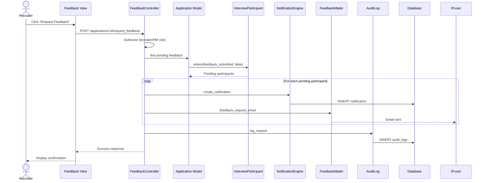

# UC-204: Request Additional Feedback

## Metadata

| Attribute | Value |
|-----------|-------|
| **ID** | UC-204 |
| **Name** | Request Additional Feedback |
| **Functional Area** | Evaluation & Feedback |
| **Primary Actor** | Recruiter (ACT-02) |
| **Priority** | P2 |
| **Complexity** | Low |
| **Status** | Draft |

## Description

A recruiter or hiring manager requests missing interview feedback from interviewers who have not yet submitted their scorecards. The system sends reminder notifications via email and in-app alerts to prompt timely feedback completion.

## Actors

| Actor | Role in Use Case |
|-------|------------------|
| Recruiter (ACT-02) | Requests missing feedback from interviewers |
| Hiring Manager (ACT-03) | May request feedback for their candidates |
| Interviewer (ACT-04) | Receives feedback request notification |
| Notification Engine (ACT-13) | Sends reminder notifications |

## Preconditions

- [ ] User is authenticated and has recruiter or hiring manager role
- [ ] Application has completed interviews with pending feedback
- [ ] At least one interviewer has not submitted their scorecard

## Postconditions

### Success
- [ ] Email notification sent to each pending interviewer
- [ ] In-app notification created for each pending interviewer
- [ ] Request logged in activity feed
- [ ] Audit entry created

### Failure
- [ ] No pending interviewers to notify
- [ ] User lacks permission to request feedback

## Triggers

- Recruiter clicks "Request Feedback" button on feedback view
- Hiring manager clicks reminder icon next to pending interviewer
- System auto-triggers after configurable delay (optional)

## Basic Flow



| Step | Actor | Action | System Response |
|------|-------|--------|-----------------|
| 1 | Recruiter | Views feedback page with pending interviewers | Pending list displayed |
| 2 | Recruiter | Clicks "Request Feedback" button | Confirmation modal shown |
| 3 | Recruiter | Confirms request | System initiates notifications |
| 4 | System | Identifies all pending interviewers | List compiled |
| 5 | System | Creates in-app notification for each | Notifications created |
| 6 | System | Sends email reminder to each | Emails queued |
| 7 | System | Logs request in activity feed | Activity recorded |
| 8 | System | Creates audit log entry | Audit saved |
| 9 | System | Shows confirmation message | "Reminder sent to X interviewer(s)" |

## Alternative Flows

### AF-1: Request from Specific Interviewer

**Trigger:** Recruiter wants to remind only one interviewer

| Step | Actor | Action | System Response |
|------|-------|--------|-----------------|
| 2a | Recruiter | Clicks reminder icon next to specific name | Single request initiated |
| 4a | System | Identifies selected interviewer only | One person notified |
| 5a | System | Sends notification to that person | Single notification sent |

**Resumption:** Continues at step 7 of basic flow

### AF-2: Customize Reminder Message

**Trigger:** Recruiter wants to add personal message

| Step | Actor | Action | System Response |
|------|-------|--------|-----------------|
| 3a | Recruiter | Clicks "Add Message" option | Message field shown |
| 3b | Recruiter | Types custom message | Message captured |
| 6a | System | Includes custom message in email | Personalized email sent |

**Resumption:** Continues at step 7 of basic flow

### AF-3: Automated Reminder

**Trigger:** System detects feedback overdue based on org settings

| Step | Actor | Action | System Response |
|------|-------|--------|-----------------|
| 0a | Scheduler | Runs daily reminder job | Job executes |
| 1a | System | Identifies overdue feedback | List compiled |
| 2a | System | Checks last reminder timestamp | Prevents duplicate |
| 3a | System | Sends auto-reminder if eligible | Notification sent |

**Resumption:** Use case ends (no user interaction)

## Exception Flows

### EF-1: No Pending Feedback

**Trigger:** All interviewers have submitted feedback

| Step | Actor | Action | System Response |
|------|-------|--------|-----------------|
| E.1 | System | Detects no pending feedback | Button disabled/hidden |
| E.2 | System | Shows "All feedback received" | Success message |

**Resolution:** Use case ends; no action needed

### EF-2: User Not Authorized

**Trigger:** User lacks permission at step 3

| Step | Actor | Action | System Response |
|------|-------|--------|-----------------|
| E.1 | System | Detects insufficient permissions | Error returned |
| E.2 | System | Displays access denied message | Error shown |

**Resolution:** Use case ends; user cannot request feedback

### EF-3: Email Delivery Failure

**Trigger:** Email service unavailable at step 6

| Step | Actor | Action | System Response |
|------|-------|--------|-----------------|
| E.1 | System | Detects email failure | Logs error |
| E.2 | System | Queues for retry | Job scheduled |
| E.3 | System | In-app notification still delivered | Partial success |
| E.4 | System | Shows warning | "Reminder created; email pending" |

**Resolution:** Email retried via background job

## Business Rules

| ID | Rule | Description |
|----|------|-------------|
| BR-204.1 | Completed Interviews | Only request feedback for completed interviews |
| BR-204.2 | Pending Only | Only notify interviewers who haven't submitted |
| BR-204.3 | Rate Limiting | Maximum one reminder per interviewer per 24 hours |
| BR-204.4 | Authorization | Only job team members can request feedback |
| BR-204.5 | Notification Channels | Both email and in-app notifications sent |
| BR-204.6 | Custom Message | Custom messages limited to 500 characters |

## Data Requirements

### Input Data

| Field | Type | Required | Validation |
|-------|------|----------|------------|
| application_id | integer | Yes | Must exist, user must have access |
| interviewer_ids | array | No | If provided, only these are notified |
| custom_message | text | No | Max 500 chars |

### Output Data

| Field | Type | Description |
|-------|------|-------------|
| notified_count | integer | Number of interviewers notified |
| interviewer_names | array | Names of notified interviewers |

## Database Transactions

### Tables Affected

| Table | Operation | Conditions |
|-------|-----------|------------|
| notifications | CREATE | In-app notification for each |
| audit_logs | CREATE | Request logged |
| feedback_requests | CREATE | Track request timestamp (optional) |

### Transaction Detail

```sql
-- Request Additional Feedback Transaction
BEGIN TRANSACTION;

-- Step 1: Create in-app notifications
INSERT INTO notifications (
    user_id,
    notification_type,
    title,
    body,
    action_url,
    created_at
)
SELECT
    ip.user_id,
    'feedback_request',
    'Feedback Requested',
    CONCAT('Please submit your feedback for ', c.first_name, ' ', c.last_name),
    CONCAT('/interviews/', i.id, '/scorecard'),
    NOW()
FROM interview_participants ip
JOIN interviews i ON ip.interview_id = i.id
JOIN applications a ON i.application_id = a.id
JOIN candidates c ON a.candidate_id = c.id
WHERE a.id = @application_id
  AND ip.feedback_submitted = false
  AND ip.role IN ('lead', 'interviewer')
  AND i.status = 'completed';

-- Step 2: Create audit log
INSERT INTO audit_logs (
    organization_id,
    user_id,
    action,
    auditable_type,
    auditable_id,
    metadata,
    created_at
) VALUES (
    @organization_id,
    @current_user_id,
    'feedback.requested',
    'Application',
    @application_id,
    JSON_OBJECT(
        'notified_interviewers', @interviewer_ids,
        'custom_message', @custom_message
    ),
    NOW()
);

COMMIT;
```

### Email Template

```
Subject: Feedback Requested: [Candidate Name] - [Job Title]

Hi [Interviewer Name],

[Requester Name] has requested your interview feedback for [Candidate Name]
applying for [Job Title].

Your interview on [Interview Date] is awaiting your scorecard submission.

[Custom Message if provided]

Please submit your feedback at your earliest convenience:
[Link to Scorecard]

Thank you for helping us make a great hiring decision!

- The [Organization Name] Recruiting Team
```

## UI/UX Requirements

### Screen/Component

- **Location:** Embedded in /applications/:id/feedback
- **Entry Point:** "Request Feedback" button in pending section
- **Key Elements:**
  - "Request Feedback" primary button
  - Individual reminder icons per interviewer
  - Confirmation modal
  - Optional custom message field
  - Success/error toast notifications

### Request Modal

```
+---------------------------------------------------------------+
| Request Interview Feedback                                     |
+---------------------------------------------------------------+
|                                                                |
| Send a reminder to interviewers who haven't submitted          |
| their feedback yet:                                            |
|                                                                |
| [X] Jane Smith - Phone Screen                                  |
| [X] Bob Johnson - Technical Interview                          |
| [ ] Carol Williams - Technical Interview (reminded 2h ago)     |
|                                                                |
+---------------------------------------------------------------+
| Add a personal message (optional)                              |
| +-----------------------------------------------------------+ |
| | Hi team, please submit your feedback by EOD so we can     | |
| | discuss the candidate in tomorrow's debrief.              | |
| +-----------------------------------------------------------+ |
| 125 / 500 characters                                          |
+---------------------------------------------------------------+
|                            [Cancel]  [Send Reminder]           |
+---------------------------------------------------------------+
```

### Pending Feedback Section

```
+---------------------------------------------------------------+
| Pending Feedback (2)                               [Request All]|
+---------------------------------------------------------------+
| [!] Jane Smith - Phone Screen (3 days overdue)     [Remind]    |
| [!] Bob Johnson - Technical Interview (1 day)      [Remind]    |
+---------------------------------------------------------------+
```

## Non-Functional Requirements

| Requirement | Target |
|-------------|--------|
| Response Time | < 2s for request action |
| Email Delivery | Within 5 minutes |
| In-app Notification | Immediate |
| Rate Limiting | 1 reminder per 24 hours per person |

## Security Considerations

- [x] Authentication required
- [x] Authorization check: Job team member or admin
- [x] Rate limiting to prevent spam
- [x] Audit logging for accountability
- [x] No sensitive data in email body

## Related Use Cases

| Use Case | Relationship |
|----------|--------------|
| UC-203 View Team Feedback | Entry point for this use case |
| UC-200 Submit Scorecard | Action requested from interviewer |
| UC-555 In-App Notification | Creates notification |
| UC-550 Send Email to Candidate | Similar email delivery mechanism |

---

## Data Model References

> Cross-references to [DATA_MODEL.md](../DATA_MODEL.md) and [CRUD_MATRIX.md](../CRUD_MATRIX.md)

### Subject Areas

| Subject Area | ID | Relationship |
|--------------|-----|--------------|
| Evaluation | SA-07 | Primary |
| Communication | SA-10 | Secondary |
| Compliance & Audit | SA-09 | Reference |

### Entities CRUD

| Entity | C | R | U | D | Notes |
|--------|---|---|---|---|-------|
| InterviewParticipant | | ✓ | | | Read pending status |
| Notification | ✓ | | | | Create in-app notifications |
| AuditLog | ✓ | | | | Log request |
| EmailLog | ✓ | | | | Track sent emails |

**Legend:** C = Create, R = Read, U = Update, D = Delete

---

## Process Model References

> Cross-references to [PROCESS_MODEL.md](../PROCESS_MODEL.md) and [PROCESS_CRUD_MATRIX.md](../PROCESS_CRUD_MATRIX.md)

| Attribute | Value | Link |
|-----------|-------|------|
| **Elementary Business Process** | EP-0605: Request Additional Feedback | [PROCESS_MODEL.md#ep-0605](../PROCESS_MODEL.md#ep-0605-request-additional-feedback) |
| **Business Process** | BP-202: Feedback Collection | [PROCESS_MODEL.md#bp-202](../PROCESS_MODEL.md#bp-202-feedback-collection) |
| **Business Function** | BF-02: Candidate Evaluation | [PROCESS_MODEL.md#bf-02](../PROCESS_MODEL.md#bf-02-candidate-evaluation) |

### EBP Details

| Attribute | Value |
|-----------|-------|
| **Trigger** | Recruiter/HM identifies missing feedback |
| **Input** | Application ID, optional custom message |
| **Output** | Email and in-app notifications to pending interviewers |
| **Business Rules** | BR-204.1 through BR-204.6 (see Business Rules section) |

---

## Traceability Matrix

> Complete artifact mapping for requirements traceability

| Artifact Type | ID | Name | Link |
|---------------|-----|------|------|
| **Use Case** | UC-204 | Request Additional Feedback | *(this document)* |
| **Elementary Process** | EP-0605 | Request Additional Feedback | [PROCESS_MODEL.md](../PROCESS_MODEL.md#ep-0605-request-additional-feedback) |
| **Business Process** | BP-202 | Feedback Collection | [PROCESS_MODEL.md](../PROCESS_MODEL.md#bp-202-feedback-collection) |
| **Business Function** | BF-02 | Candidate Evaluation | [PROCESS_MODEL.md](../PROCESS_MODEL.md#bf-02-candidate-evaluation) |
| **Primary Actor** | ACT-02 | Recruiter | [ACTORS.md](../ACTORS.md#act-02-recruiter) |
| **Subject Area (Primary)** | SA-07 | Evaluation | [DATA_MODEL.md](../DATA_MODEL.md#sa-07-evaluation) |
| **Subject Area (Secondary)** | SA-10 | Communication | [DATA_MODEL.md](../DATA_MODEL.md#sa-10-communication) |
| **CRUD Matrix Row** | UC-204 | - | [CRUD_MATRIX.md](../CRUD_MATRIX.md#uc-204) |
| **Process CRUD Row** | EP-0605 | - | [PROCESS_CRUD_MATRIX.md](../PROCESS_CRUD_MATRIX.md#ep-0605) |

### Implementation Artifacts

| Artifact Type | Path/Reference | Status |
|---------------|----------------|--------|
| Controller | `app/controllers/feedback_requests_controller.rb` | Planned |
| Mailer | `app/mailers/feedback_mailer.rb` | Planned |
| Service | `app/services/request_feedback_service.rb` | Planned |
| Job | `app/jobs/feedback_reminder_job.rb` | Planned |
| View | `app/views/applications/_pending_feedback.html.erb` | Planned |

---

## Open Questions

1. Should there be escalation if feedback is overdue beyond a threshold?
2. Should managers be notified when their direct reports haven't submitted?
3. What should the auto-reminder schedule be (e.g., daily, every 2 days)?

## Change History

| Version | Date | Author | Changes |
|---------|------|--------|---------|
| 0.1 | 2026-01-25 | System | Initial draft |
