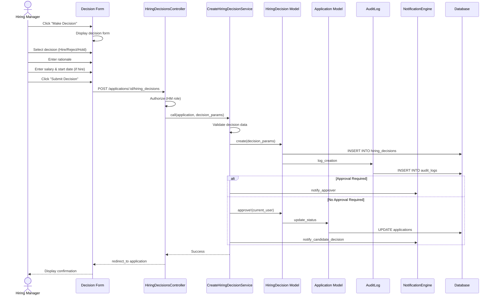

# UC-205: Make Hiring Decision

## Metadata

| Attribute | Value |
|-----------|-------|
| **ID** | UC-205 |
| **Name** | Make Hiring Decision |
| **Functional Area** | Evaluation & Feedback |
| **Primary Actor** | Hiring Manager (ACT-03) |
| **Priority** | P1 |
| **Complexity** | High |
| **Status** | Draft |

## Description

A hiring manager records a formal hiring decision (hire, reject, or hold) for a candidate after reviewing interview feedback. The decision includes a rationale, and for hire decisions, proposed compensation and start date. Decisions may require approval before taking effect. This is an immutable record for compliance and audit purposes.

## Actors

| Actor | Role in Use Case |
|-------|------------------|
| Hiring Manager (ACT-03) | Makes and records the hiring decision |
| Recruiter (ACT-02) | May initiate decision on behalf of HM |
| Executive (ACT-05) | May approve high-level decisions |
| Compliance Officer (ACT-06) | Audits decisions for compliance |

## Preconditions

- [ ] User is authenticated with hiring manager or recruiter role
- [ ] Application is in an active status (not already hired/rejected/withdrawn)
- [ ] Interview feedback has been collected (recommended but not required)
- [ ] No pending hiring decision exists for this application

## Postconditions

### Success
- [ ] HiringDecision record created (immutable)
- [ ] Decision linked to application
- [ ] Rationale documented
- [ ] Proposed salary and start date captured (for hire)
- [ ] Audit log entry created
- [ ] If approved immediately: application status updated
- [ ] If approval required: pending status set, approver notified

### Failure
- [ ] No HiringDecision created
- [ ] Validation errors displayed
- [ ] Application status unchanged

## Triggers

- Hiring manager clicks "Make Decision" on application
- Recruiter initiates decision workflow
- Debrief meeting outcome recorded

## Basic Flow



| Step | Actor | Action | System Response |
|------|-------|--------|-----------------|
| 1 | Hiring Manager | Navigates to application | Application detail shown |
| 2 | Hiring Manager | Clicks "Make Decision" | Decision form displayed |
| 3 | Hiring Manager | Selects decision type (Hire/Reject/Hold) | Type selected |
| 4 | Hiring Manager | Enters rationale for decision | Rationale captured |
| 5 | Hiring Manager | Enters proposed salary (if hire) | Salary captured |
| 6 | Hiring Manager | Enters proposed start date (if hire) | Date captured |
| 7 | Hiring Manager | Clicks "Submit Decision" | System validates input |
| 8 | System | Validates all required fields | Validation passes |
| 9 | System | Creates HiringDecision record | Decision saved |
| 10 | System | Creates audit log entry | Audit recorded |
| 11 | System | Checks if approval required | Approval check |
| 12 | System | If no approval: updates application status | Status changed |
| 13 | System | Sends appropriate notifications | Notifications queued |
| 14 | System | Redirects to application | Success message shown |

## Alternative Flows

### AF-1: Decision Requires Approval

**Trigger:** Organization requires approval for hiring decisions

| Step | Actor | Action | System Response |
|------|-------|--------|-----------------|
| 11a | System | Detects approval required | Sets status to "pending" |
| 12a | System | Identifies approver(s) | Approver determined |
| 13a | System | Notifies approver(s) | Email/notification sent |
| 14a | System | Shows pending status | "Awaiting Approval" displayed |

**Resumption:** Use case ends; triggers UC-206 for approver

### AF-2: Reject Decision

**Trigger:** Decision type is "reject"

| Step | Actor | Action | System Response |
|------|-------|--------|-----------------|
| 5a | System | Hides salary/start date fields | Simplified form |
| 12a | System | Updates application to rejected | Status = "rejected" |
| 13a | System | Triggers rejection workflow | Rejection email prepared |

**Resumption:** Continues at step 14 of basic flow

### AF-3: Hold Decision

**Trigger:** Decision type is "hold"

| Step | Actor | Action | System Response |
|------|-------|--------|-----------------|
| 5b | System | Hides salary/start date fields | Simplified form |
| 12b | System | Application remains active | No status change |
| 13b | System | No external notification | Internal only |

**Resumption:** Continues at step 14 of basic flow

### AF-4: View Feedback Before Decision

**Trigger:** HM wants to review feedback before deciding

| Step | Actor | Action | System Response |
|------|-------|--------|-----------------|
| 2a | Hiring Manager | Clicks "View Feedback" tab | Feedback displayed |
| 2b | Hiring Manager | Reviews all scorecards | Summary statistics shown |
| 2c | Hiring Manager | Clicks "Make Decision" | Decision form shown |

**Resumption:** Continues at step 3 of basic flow

## Exception Flows

### EF-1: Pending Decision Exists

**Trigger:** Application already has a pending hiring decision

| Step | Actor | Action | System Response |
|------|-------|--------|-----------------|
| E.1 | System | Detects existing pending decision | Error returned |
| E.2 | System | Displays error message | "Pending decision exists" |
| E.3 | System | Shows link to existing decision | Navigation provided |

**Resolution:** User must wait for or cancel existing decision

### EF-2: Validation Failure

**Trigger:** Required fields missing at step 8

| Step | Actor | Action | System Response |
|------|-------|--------|-----------------|
| E.1 | System | Detects validation errors | Highlights fields |
| E.2 | System | Displays specific errors | Error messages shown |
| E.3 | Hiring Manager | Corrects errors | Fields updated |
| E.4 | Hiring Manager | Resubmits | System re-validates |

**Resolution:** Returns to step 8, continues if valid

### EF-3: Application Not Active

**Trigger:** Application already in terminal status

| Step | Actor | Action | System Response |
|------|-------|--------|-----------------|
| E.1 | System | Detects inactive application | Error returned |
| E.2 | System | Displays status message | "Application is [status]" |
| E.3 | System | Disables decision form | Read-only view |

**Resolution:** Use case ends; no action possible

### EF-4: Salary Out of Range

**Trigger:** Proposed salary outside job's salary range

| Step | Actor | Action | System Response |
|------|-------|--------|-----------------|
| E.1 | System | Detects salary outside range | Warning shown |
| E.2 | System | Displays range information | "Job range: $X - $Y" |
| E.3 | Hiring Manager | Adjusts salary or proceeds | Decision made |
| E.4 | System | Logs exception if out of range | Audit flag set |

**Resolution:** Continues with warning logged

## Business Rules

| ID | Rule | Description |
|----|------|-------------|
| BR-205.1 | One Pending | Only one pending decision per application at a time |
| BR-205.2 | Rationale Required | All decisions must include a written rationale |
| BR-205.3 | Hire Requirements | Hire decisions require proposed_salary and proposed_start_date when approved |
| BR-205.4 | Immutability | HiringDecision records cannot be updated or deleted after creation |
| BR-205.5 | Approval Workflow | Decision takes effect only after approval (if required) |
| BR-205.6 | Audit Trail | All decisions logged with full context for compliance |
| BR-205.7 | Start Date Future | Proposed start date must be in the future |

## Data Requirements

### Input Data

| Field | Type | Required | Validation |
|-------|------|----------|------------|
| decision | enum | Yes | hire, reject, hold |
| rationale | text | Yes | Min 50 chars, max 5,000 chars |
| proposed_salary | integer | Yes (hire) | Greater than 0 |
| proposed_salary_currency | string | No | ISO 4217, default USD |
| proposed_start_date | date | Yes (hire) | Future date |
| require_approval | boolean | No | Default based on org settings |

### Output Data

| Field | Type | Description |
|-------|------|-------------|
| id | integer | HiringDecision ID |
| status | enum | pending, approved, rejected |
| decided_at | datetime | Decision timestamp |
| decided_by_id | integer | User who made decision |

## Database Transactions

### Tables Affected

| Table | Operation | Conditions |
|-------|-----------|------------|
| hiring_decisions | CREATE | Always |
| applications | UPDATE | If decision approved immediately |
| audit_logs | CREATE | Always |
| notifications | CREATE | For approvers or candidates |

### Transaction Detail

```sql
-- Create Hiring Decision Transaction
BEGIN TRANSACTION;

-- Step 1: Create hiring decision record
INSERT INTO hiring_decisions (
    organization_id,
    application_id,
    decision,
    status,
    rationale,
    proposed_salary,
    proposed_salary_currency,
    proposed_start_date,
    decided_by_id,
    decided_at,
    created_at,
    updated_at
) VALUES (
    @organization_id,
    @application_id,
    @decision,
    @initial_status,
    @rationale,
    @proposed_salary,
    @proposed_salary_currency,
    @proposed_start_date,
    @current_user_id,
    NOW(),
    NOW(),
    NOW()
);

SET @decision_id = LAST_INSERT_ID();

-- Step 2: Create audit log
INSERT INTO audit_logs (
    organization_id,
    user_id,
    action,
    auditable_type,
    auditable_id,
    metadata,
    recorded_changes,
    created_at
) VALUES (
    @organization_id,
    @current_user_id,
    'hiring_decision.created',
    'HiringDecision',
    @decision_id,
    JSON_OBJECT(
        'decision', @decision,
        'application_id', @application_id,
        'candidate_name', @candidate_name,
        'job_title', @job_title,
        'proposed_salary', @proposed_salary
    ),
    JSON_OBJECT('decision', JSON_ARRAY(NULL, @decision)),
    NOW()
);

-- Step 3: If immediate approval (no approval required)
-- Update application status
UPDATE applications
SET status = CASE
    WHEN @decision = 'hire' AND @immediate_approval THEN 'hired'
    WHEN @decision = 'reject' AND @immediate_approval THEN 'rejected'
    ELSE status
END,
    updated_at = NOW()
WHERE id = @application_id;

-- Step 4: Update hiring decision to approved if immediate
UPDATE hiring_decisions
SET status = 'approved',
    approved_by_id = @current_user_id,
    approved_at = NOW()
WHERE id = @decision_id
  AND @immediate_approval = TRUE;

COMMIT;
```

### Rollback Scenarios

| Scenario | Rollback Action |
|----------|-----------------|
| Validation failure | No transaction started, return errors |
| Pending decision exists | Reject with error message |
| Application update failure | Full rollback, return error |

## UI/UX Requirements

### Screen/Component

- **Location:** /applications/:id/hiring_decisions/new
- **Entry Point:**
  - "Make Decision" button on application detail
  - "Decide" action in application actions menu
  - "Record Decision" from debrief notes
- **Key Elements:**
  - Decision type selector (prominent)
  - Rationale text area (required)
  - Salary/start date fields (conditional for hire)
  - Feedback summary panel (reference)
  - Previous decisions history (if any)
  - Approval workflow indicator

### Decision Form Layout

```
+---------------------------------------------------------------+
| Make Hiring Decision                                           |
| Candidate: John Smith | Position: Senior Software Engineer     |
+---------------------------------------------------------------+

+---------------------------------------------------------------+
| Interview Feedback Summary                                     |
+---------------------------------------------------------------+
| Scorecards: 4 submitted                                        |
| Average Score: 78/100                                          |
| Recommendations: 2 Hire, 1 Strong Hire, 1 No Hire             |
| [View Full Feedback]                                           |
+---------------------------------------------------------------+

+---------------------------------------------------------------+
| Decision *                                                     |
+---------------------------------------------------------------+
|  +-------------------+  +-------------------+  +-------------+ |
|  |                   |  |                   |  |             | |
|  |    [checkmark]    |  |       [X]         |  |   [pause]   | |
|  |      HIRE         |  |     REJECT        |  |    HOLD     | |
|  |                   |  |                   |  |             | |
|  +-------------------+  +-------------------+  +-------------+ |
+---------------------------------------------------------------+

+---------------------------------------------------------------+
| Rationale * (Required - minimum 50 characters)                 |
+---------------------------------------------------------------+
| [                                                             ]|
| [  Based on the strong technical interview performance and   ]|
| [  positive team feedback, we recommend extending an offer   ]|
| [  for the Senior Software Engineer position...              ]|
| [                                                             ]|
+---------------------------------------------------------------+
| 245 / 5,000 characters                                        |
+---------------------------------------------------------------+

+---------------------------------------------------------------+
| Offer Details (for Hire decision)                              |
+---------------------------------------------------------------+
| Proposed Salary *      Currency         Start Date *          |
| +------------------+  +----------+     +------------------+   |
| | 125,000          |  | USD    v |     | 2026-03-01       |   |
| +------------------+  +----------+     +------------------+   |
| Job range: $100,000 - $150,000                                |
+---------------------------------------------------------------+

+---------------------------------------------------------------+
| Approval                                                       |
+---------------------------------------------------------------+
| [X] Require approval before finalizing                        |
|     Approver: Jane Executive (VP Engineering)                 |
+---------------------------------------------------------------+

+---------------------------------------------------------------+
|                            [Cancel]  [Submit Decision]         |
+---------------------------------------------------------------+
```

## Non-Functional Requirements

| Requirement | Target |
|-------------|--------|
| Response Time | Form load < 1s, submit < 2s |
| Availability | 99.9% |
| Data Integrity | Immutable records |
| Audit Retention | 7 years minimum |

## Security Considerations

- [x] Authentication required
- [x] Authorization check: Hiring Manager or Recruiter role
- [x] Organization scoping enforced
- [x] Immutable audit trail
- [x] Salary data encrypted at rest
- [x] Access logged for compliance

## Related Use Cases

| Use Case | Relationship |
|----------|--------------|
| UC-203 View Team Feedback | Precedes (review feedback) |
| UC-206 Approve Stage Progression | Similar approval pattern |
| UC-250 Create Offer | Follows for hire decisions |
| UC-105 Reject Candidate | Alternative for rejections |
| UC-311 Document Hiring Decision | Compliance documentation |

---

## Data Model References

> Cross-references to [DATA_MODEL.md](../DATA_MODEL.md) and [CRUD_MATRIX.md](../CRUD_MATRIX.md)

### Subject Areas

| Subject Area | ID | Relationship |
|--------------|-----|--------------|
| Evaluation | SA-07 | Primary |
| Application Pipeline | SA-05 | Secondary |
| Compliance & Audit | SA-09 | Reference |

### Entities CRUD

| Entity | C | R | U | D | Notes |
|--------|---|---|---|---|-------|
| HiringDecision | ✓ | ✓ | | | Created (immutable) |
| Application | | ✓ | ✓ | | Status updated if approved |
| Scorecard | | ✓ | | | Read for feedback summary |
| AuditLog | ✓ | | | | Decision logged |
| User | | ✓ | | | Approver lookup |

**Legend:** C = Create, R = Read, U = Update, D = Delete

---

## Process Model References

> Cross-references to [PROCESS_MODEL.md](../PROCESS_MODEL.md) and [PROCESS_CRUD_MATRIX.md](../PROCESS_CRUD_MATRIX.md)

| Attribute | Value | Link |
|-----------|-------|------|
| **Elementary Business Process** | EP-0701: Make Hiring Decision | [PROCESS_MODEL.md#ep-0701](../PROCESS_MODEL.md#ep-0701-make-hiring-decision) |
| **Business Process** | BP-203: Hiring Decision Making | [PROCESS_MODEL.md#bp-203](../PROCESS_MODEL.md#bp-203-hiring-decision-making) |
| **Business Function** | BF-02: Candidate Evaluation | [PROCESS_MODEL.md#bf-02](../PROCESS_MODEL.md#bf-02-candidate-evaluation) |

### EBP Details

| Attribute | Value |
|-----------|-------|
| **Trigger** | Hiring manager completes candidate evaluation |
| **Input** | Decision type, rationale, salary/start date (for hire) |
| **Output** | Immutable HiringDecision record |
| **Business Rules** | BR-205.1 through BR-205.7 (see Business Rules section) |

---

## Traceability Matrix

> Complete artifact mapping for requirements traceability

| Artifact Type | ID | Name | Link |
|---------------|-----|------|------|
| **Use Case** | UC-205 | Make Hiring Decision | *(this document)* |
| **Elementary Process** | EP-0701 | Make Hiring Decision | [PROCESS_MODEL.md](../PROCESS_MODEL.md#ep-0701-make-hiring-decision) |
| **Business Process** | BP-203 | Hiring Decision Making | [PROCESS_MODEL.md](../PROCESS_MODEL.md#bp-203-hiring-decision-making) |
| **Business Function** | BF-02 | Candidate Evaluation | [PROCESS_MODEL.md](../PROCESS_MODEL.md#bf-02-candidate-evaluation) |
| **Primary Actor** | ACT-03 | Hiring Manager | [ACTORS.md](../ACTORS.md#act-03-hiring-manager) |
| **Subject Area (Primary)** | SA-07 | Evaluation | [DATA_MODEL.md](../DATA_MODEL.md#sa-07-evaluation) |
| **Subject Area (Secondary)** | SA-05 | Application Pipeline | [DATA_MODEL.md](../DATA_MODEL.md#sa-05-application-pipeline) |
| **CRUD Matrix Row** | UC-205 | - | [CRUD_MATRIX.md](../CRUD_MATRIX.md#uc-205) |
| **Process CRUD Row** | EP-0701 | - | [PROCESS_CRUD_MATRIX.md](../PROCESS_CRUD_MATRIX.md#ep-0701) |

### Implementation Artifacts

| Artifact Type | Path/Reference | Status |
|---------------|----------------|--------|
| Controller | `app/controllers/hiring_decisions_controller.rb` | Implemented |
| Model | `app/models/hiring_decision.rb` | Implemented |
| Service | `app/services/create_hiring_decision_service.rb` | Implemented |
| Policy | `app/policies/hiring_decision_policy.rb` | Implemented |
| Mailer | `app/mailers/hiring_decision_mailer.rb` | Implemented |
| View | `app/views/hiring_decisions/new.html.erb` | Implemented |
| Test | `test/models/hiring_decision_test.rb` | Implemented |

---

## Open Questions

1. Should there be a "committee" decision mode for multiple approvers?
2. Should hiring decisions be reversible within a grace period?
3. What additional compliance documentation is required for OFCCP?

## Change History

| Version | Date | Author | Changes |
|---------|------|--------|---------|
| 0.1 | 2026-01-25 | System | Initial draft |
