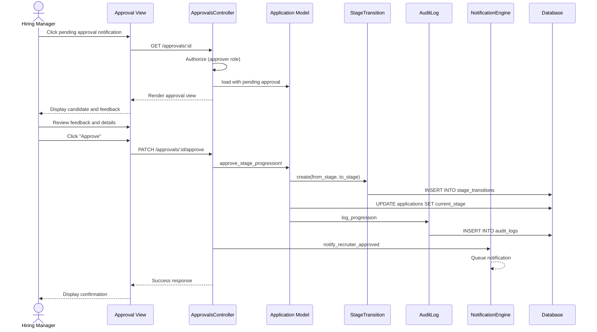

# UC-206: Approve Stage Progression

## Metadata

| Attribute | Value |
|-----------|-------|
| **ID** | UC-206 |
| **Name** | Approve Stage Progression |
| **Functional Area** | Evaluation & Feedback |
| **Primary Actor** | Hiring Manager (ACT-03) |
| **Priority** | P2 |
| **Complexity** | Medium |
| **Status** | Draft |

## Description

A hiring manager or designated approver reviews and approves a candidate's advancement to the next stage in the hiring pipeline. This provides a checkpoint for quality control and ensures hiring managers are engaged in the process before candidates proceed to high-investment stages like onsite interviews or offers.

## Actors

| Actor | Role in Use Case |
|-------|------------------|
| Hiring Manager (ACT-03) | Approves or rejects stage progression |
| Recruiter (ACT-02) | Initiates stage move requiring approval |
| Executive (ACT-05) | May approve for senior-level positions |

## Preconditions

- [ ] User is authenticated and is designated approver for the stage
- [ ] Application has a pending stage progression request
- [ ] Application is in active status
- [ ] Requested target stage requires approval (per job configuration)

## Postconditions

### Success (Approved)
- [ ] Application moved to target stage
- [ ] StageTransition record created
- [ ] Approval status updated
- [ ] Audit log entry created
- [ ] Recruiter notified of approval
- [ ] Next stage activities enabled

### Success (Rejected)
- [ ] Application remains in current stage
- [ ] Rejection reason documented
- [ ] Recruiter notified of rejection
- [ ] Audit log entry created

### Failure
- [ ] System error message displayed
- [ ] Application state unchanged

## Triggers

- Approver receives notification of pending approval
- Approver clicks "Review Pending" in dashboard
- Approver clicks approval request in email

## Basic Flow



| Step | Actor | Action | System Response |
|------|-------|--------|-----------------|
| 1 | Hiring Manager | Receives approval notification | Email/in-app notification |
| 2 | Hiring Manager | Clicks notification to review | Approval view displayed |
| 3 | System | Loads pending approval details | Candidate info, feedback shown |
| 4 | Hiring Manager | Reviews candidate profile | Profile displayed |
| 5 | Hiring Manager | Reviews interview feedback | Scorecards visible |
| 6 | Hiring Manager | Reviews requested stage | Target stage shown |
| 7 | Hiring Manager | Clicks "Approve" | System processes approval |
| 8 | System | Creates stage transition record | Transition logged |
| 9 | System | Updates application current_stage | Stage updated |
| 10 | System | Creates audit log entry | Audit recorded |
| 11 | System | Notifies recruiter | Email sent |
| 12 | System | Displays confirmation | "Progression approved" |

## Alternative Flows

### AF-1: Reject Progression

**Trigger:** Approver decides candidate should not advance

| Step | Actor | Action | System Response |
|------|-------|--------|-----------------|
| 7a | Hiring Manager | Clicks "Reject" | Rejection modal shown |
| 8a | Hiring Manager | Enters rejection reason | Reason captured |
| 9a | Hiring Manager | Confirms rejection | System processes |
| 10a | System | Updates approval to rejected | Status updated |
| 11a | System | Notifies recruiter of rejection | Email sent with reason |
| 12a | System | Displays confirmation | "Progression rejected" |

**Resumption:** Use case ends

### AF-2: Request More Information

**Trigger:** Approver needs additional context before deciding

| Step | Actor | Action | System Response |
|------|-------|--------|-----------------|
| 6a | Hiring Manager | Clicks "Request Info" | Comment field shown |
| 7a | Hiring Manager | Enters question/request | Comment captured |
| 8a | System | Notifies recruiter | Question sent |
| 9a | System | Approval remains pending | Status unchanged |

**Resumption:** Recruiter provides info, approver continues from step 4

### AF-3: Bulk Approve

**Trigger:** Approver has multiple pending approvals

| Step | Actor | Action | System Response |
|------|-------|--------|-----------------|
| 1a | Hiring Manager | Views pending approvals list | List displayed |
| 2a | Hiring Manager | Selects multiple approvals | Checkboxes selected |
| 3a | Hiring Manager | Clicks "Approve Selected" | Confirmation modal |
| 4a | Hiring Manager | Confirms bulk action | System processes all |
| 5a | System | Approves each progression | All transitions created |

**Resumption:** Use case ends

### AF-4: Delegate Approval

**Trigger:** Approver wants someone else to review

| Step | Actor | Action | System Response |
|------|-------|--------|-----------------|
| 3a | Hiring Manager | Clicks "Delegate" | User picker shown |
| 4a | Hiring Manager | Selects delegate | Delegate assigned |
| 5a | System | Reassigns approval | Delegate notified |
| 6a | System | Shows delegation confirmation | Status updated |

**Resumption:** Delegate receives notification and continues from step 1

## Exception Flows

### EF-1: Application No Longer Active

**Trigger:** Application was rejected/withdrawn after approval requested

| Step | Actor | Action | System Response |
|------|-------|--------|-----------------|
| E.1 | System | Detects inactive application | Error returned |
| E.2 | System | Displays status message | "Application is no longer active" |
| E.3 | System | Removes from pending list | Approval closed |

**Resolution:** Use case ends; no action needed

### EF-2: Stage Changed

**Trigger:** Another user already moved the application

| Step | Actor | Action | System Response |
|------|-------|--------|-----------------|
| E.1 | System | Detects stage mismatch | Warning shown |
| E.2 | System | Shows current stage | "Now at [stage]" |
| E.3 | System | Invalidates pending approval | Approval cancelled |

**Resolution:** Use case ends; approval superseded

### EF-3: Approver Not Authorized

**Trigger:** User not the designated approver

| Step | Actor | Action | System Response |
|------|-------|--------|-----------------|
| E.1 | System | Detects authorization failure | Access denied |
| E.2 | System | Displays error message | "Not authorized" |
| E.3 | System | Redirects to dashboard | Dashboard shown |

**Resolution:** Correct approver must act

## Business Rules

| ID | Rule | Description |
|----|------|-------------|
| BR-206.1 | Stage Approval Config | Only stages configured to require approval trigger this workflow |
| BR-206.2 | Designated Approver | Only designated approvers (HM, or configured user) can approve |
| BR-206.3 | Single Approval | One approval per stage transition; no double-approval required |
| BR-206.4 | Rejection Reason | Rejections must include a reason (minimum 20 characters) |
| BR-206.5 | Time Limit | Approvals pending over X days trigger reminder notifications |
| BR-206.6 | Active Application | Only active applications can have stages approved |

## Data Requirements

### Input Data

| Field | Type | Required | Validation |
|-------|------|----------|------------|
| approval_id | integer | Yes | Must be pending approval |
| action | enum | Yes | approve, reject |
| rejection_reason | text | Yes (reject) | Min 20 chars, max 1,000 chars |
| notes | text | No | Max 500 chars |

### Output Data

| Field | Type | Description |
|-------|------|-------------|
| status | enum | approved, rejected |
| approved_at | datetime | Approval timestamp |
| approved_by_id | integer | Approving user |
| new_stage_id | integer | Target stage (if approved) |

## Database Transactions

### Tables Affected

| Table | Operation | Conditions |
|-------|-----------|------------|
| stage_approvals | UPDATE | Status updated |
| applications | UPDATE | current_stage_id (if approved) |
| stage_transitions | CREATE | Record of move (if approved) |
| audit_logs | CREATE | Approval/rejection logged |

### Transaction Detail

```sql
-- Approve Stage Progression Transaction
BEGIN TRANSACTION;

-- Step 1: Update stage approval
UPDATE stage_approvals
SET status = 'approved',
    approved_by_id = @approver_id,
    approved_at = NOW(),
    notes = @notes,
    updated_at = NOW()
WHERE id = @approval_id
  AND status = 'pending';

-- Step 2: Create stage transition (if approved)
INSERT INTO stage_transitions (
    application_id,
    from_stage_id,
    to_stage_id,
    triggered_by_id,
    triggered_by_type,
    created_at
) VALUES (
    @application_id,
    @from_stage_id,
    @to_stage_id,
    @approver_id,
    'approval',
    NOW()
);

-- Step 3: Update application current stage (if approved)
UPDATE applications
SET current_stage_id = @to_stage_id,
    updated_at = NOW()
WHERE id = @application_id;

-- Step 4: Create audit log
INSERT INTO audit_logs (
    organization_id,
    user_id,
    action,
    auditable_type,
    auditable_id,
    metadata,
    recorded_changes,
    created_at
) VALUES (
    @organization_id,
    @approver_id,
    'stage_progression.approved',
    'Application',
    @application_id,
    JSON_OBJECT(
        'from_stage', @from_stage_name,
        'to_stage', @to_stage_name,
        'candidate_name', @candidate_name,
        'job_title', @job_title
    ),
    JSON_OBJECT('current_stage_id', JSON_ARRAY(@from_stage_id, @to_stage_id)),
    NOW()
);

COMMIT;
```

### Rejection Transaction

```sql
-- Reject Stage Progression Transaction
BEGIN TRANSACTION;

-- Step 1: Update stage approval to rejected
UPDATE stage_approvals
SET status = 'rejected',
    rejected_by_id = @approver_id,
    rejected_at = NOW(),
    rejection_reason = @rejection_reason,
    updated_at = NOW()
WHERE id = @approval_id
  AND status = 'pending';

-- Step 2: Create audit log for rejection
INSERT INTO audit_logs (
    organization_id,
    user_id,
    action,
    auditable_type,
    auditable_id,
    metadata,
    created_at
) VALUES (
    @organization_id,
    @approver_id,
    'stage_progression.rejected',
    'Application',
    @application_id,
    JSON_OBJECT(
        'from_stage', @from_stage_name,
        'to_stage', @to_stage_name,
        'rejection_reason', @rejection_reason
    ),
    NOW()
);

COMMIT;
```

## UI/UX Requirements

### Screen/Component

- **Location:** /approvals/:id
- **Entry Point:**
  - Approval notification (email or in-app)
  - "Pending Approvals" widget in dashboard
  - Approval queue in sidebar
- **Key Elements:**
  - Candidate summary card
  - Current and target stage indicator
  - Feedback summary (scorecards)
  - Approve/Reject action buttons
  - Rejection reason modal
  - Notes field

### Approval View Layout

```
+---------------------------------------------------------------+
| Stage Progression Approval                                     |
+---------------------------------------------------------------+
| Requested by: Jane Recruiter | Jan 24, 2026, 2:30 PM          |
+---------------------------------------------------------------+

+---------------------------------------------------------------+
| Candidate: John Smith                                          |
| Position: Senior Software Engineer                             |
+---------------------------------------------------------------+

+---------------------------------------------------------------+
| Stage Progression                                              |
+---------------------------------------------------------------+
|                                                                |
|   [Phone Screen]  ------>  [Technical Interview]              |
|      (current)              (requested)                        |
|                                                                |
+---------------------------------------------------------------+

+---------------------------------------------------------------+
| Interview Feedback Summary                                     |
+---------------------------------------------------------------+
| Phone Screen (completed Jan 22)                                |
| +-----------------------------------------------------------+ |
| | Interviewer: Bob Recruiter                                 | |
| | Recommendation: Strong Hire                                | |
| | Score: 85/100                                              | |
| | Summary: "Excellent candidate with strong technical..."    | |
| | [View Full Scorecard]                                      | |
| +-----------------------------------------------------------+ |
+---------------------------------------------------------------+

+---------------------------------------------------------------+
| Recruiter Notes                                                |
+---------------------------------------------------------------+
| "Ready to proceed to technical round. Candidate has relevant  |
| experience at similar companies. Available for onsite next    |
| week."                                                         |
+---------------------------------------------------------------+

+---------------------------------------------------------------+
| Add Notes (Optional)                                           |
| [                                                             ]|
| [                                                             ]|
+---------------------------------------------------------------+

+---------------------------------------------------------------+
|        [Request More Info]     [Reject]     [Approve]          |
+---------------------------------------------------------------+
```

### Pending Approvals Dashboard Widget

```
+---------------------------------------------------------------+
| Pending Approvals (3)                                   [View All]|
+---------------------------------------------------------------+
| John Smith       Phone Screen -> Technical    2 days ago  [>] |
| Sarah Jones      Technical -> Onsite          1 day ago   [>] |
| Mike Wilson      Onsite -> Offer             5 hours ago [>] |
+---------------------------------------------------------------+
```

## Non-Functional Requirements

| Requirement | Target |
|-------------|--------|
| Response Time | Approval action < 1s |
| Availability | 99.9% |
| Notification Delivery | Within 5 minutes of action |
| Reminder Frequency | Daily for pending > 2 days |

## Security Considerations

- [x] Authentication required
- [x] Authorization check: Designated approver only
- [x] Organization scoping enforced
- [x] Audit logging for compliance
- [x] No side-channel access to approval

## Related Use Cases

| Use Case | Relationship |
|----------|--------------|
| UC-103 Move Stage | Triggers approval requirement |
| UC-203 View Team Feedback | Provides context for decision |
| UC-205 Make Hiring Decision | Similar approval pattern |
| UC-109 View Application History | Shows approval in timeline |

---

## Data Model References

> Cross-references to [DATA_MODEL.md](../DATA_MODEL.md) and [CRUD_MATRIX.md](../CRUD_MATRIX.md)

### Subject Areas

| Subject Area | ID | Relationship |
|--------------|-----|--------------|
| Evaluation | SA-07 | Primary |
| Application Pipeline | SA-05 | Secondary |
| Compliance & Audit | SA-09 | Reference |

### Entities CRUD

| Entity | C | R | U | D | Notes |
|--------|---|---|---|---|-------|
| StageApproval | | ✓ | ✓ | | Status updated |
| Application | | ✓ | ✓ | | Stage updated (if approved) |
| StageTransition | ✓ | | | | Created on approval |
| Scorecard | | ✓ | | | Read for context |
| AuditLog | ✓ | | | | Action logged |

**Legend:** C = Create, R = Read, U = Update, D = Delete

---

## Process Model References

> Cross-references to [PROCESS_MODEL.md](../PROCESS_MODEL.md) and [PROCESS_CRUD_MATRIX.md](../PROCESS_CRUD_MATRIX.md)

| Attribute | Value | Link |
|-----------|-------|------|
| **Elementary Business Process** | EP-0702: Approve Stage Progression | [PROCESS_MODEL.md#ep-0702](../PROCESS_MODEL.md#ep-0702-approve-stage-progression) |
| **Business Process** | BP-203: Hiring Decision Making | [PROCESS_MODEL.md#bp-203](../PROCESS_MODEL.md#bp-203-hiring-decision-making) |
| **Business Function** | BF-02: Candidate Evaluation | [PROCESS_MODEL.md#bf-02](../PROCESS_MODEL.md#bf-02-candidate-evaluation) |

### EBP Details

| Attribute | Value |
|-----------|-------|
| **Trigger** | Recruiter moves candidate to stage requiring approval |
| **Input** | Approval action (approve/reject), optional notes |
| **Output** | Stage transition (if approved), notification to recruiter |
| **Business Rules** | BR-206.1 through BR-206.6 (see Business Rules section) |

---

## Traceability Matrix

> Complete artifact mapping for requirements traceability

| Artifact Type | ID | Name | Link |
|---------------|-----|------|------|
| **Use Case** | UC-206 | Approve Stage Progression | *(this document)* |
| **Elementary Process** | EP-0702 | Approve Stage Progression | [PROCESS_MODEL.md](../PROCESS_MODEL.md#ep-0702-approve-stage-progression) |
| **Business Process** | BP-203 | Hiring Decision Making | [PROCESS_MODEL.md](../PROCESS_MODEL.md#bp-203-hiring-decision-making) |
| **Business Function** | BF-02 | Candidate Evaluation | [PROCESS_MODEL.md](../PROCESS_MODEL.md#bf-02-candidate-evaluation) |
| **Primary Actor** | ACT-03 | Hiring Manager | [ACTORS.md](../ACTORS.md#act-03-hiring-manager) |
| **Subject Area (Primary)** | SA-07 | Evaluation | [DATA_MODEL.md](../DATA_MODEL.md#sa-07-evaluation) |
| **Subject Area (Secondary)** | SA-05 | Application Pipeline | [DATA_MODEL.md](../DATA_MODEL.md#sa-05-application-pipeline) |
| **CRUD Matrix Row** | UC-206 | - | [CRUD_MATRIX.md](../CRUD_MATRIX.md#uc-206) |
| **Process CRUD Row** | EP-0702 | - | [PROCESS_CRUD_MATRIX.md](../PROCESS_CRUD_MATRIX.md#ep-0702) |

### Implementation Artifacts

| Artifact Type | Path/Reference | Status |
|---------------|----------------|--------|
| Controller | `app/controllers/stage_approvals_controller.rb` | Planned |
| Model | `app/models/stage_approval.rb` | Planned |
| Service | `app/services/approve_stage_service.rb` | Planned |
| Policy | `app/policies/stage_approval_policy.rb` | Planned |
| View | `app/views/stage_approvals/show.html.erb` | Planned |
| Test | `test/models/stage_approval_test.rb` | Planned |

---

## Open Questions

1. Should there be an SLA for approval response time?
2. Should auto-escalation occur if approval is not acted on?
3. Can approval be configured per stage or is it per job?

## Change History

| Version | Date | Author | Changes |
|---------|------|--------|---------|
| 0.1 | 2026-01-25 | System | Initial draft |
