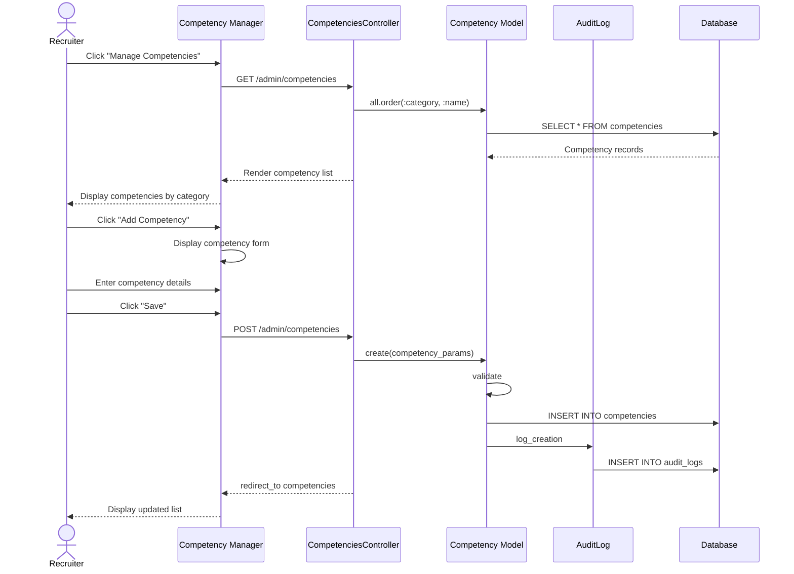

# UC-207: Manage Competencies

## Metadata

| Attribute | Value |
|-----------|-------|
| **ID** | UC-207 |
| **Name** | Manage Competencies |
| **Functional Area** | Evaluation & Feedback |
| **Primary Actor** | Recruiter (ACT-02) |
| **Priority** | P2 |
| **Complexity** | Low |
| **Status** | Draft |

## Description

A recruiter or administrator defines and manages the competencies used for evaluating candidates during interviews. Competencies represent measurable skills, behaviors, or attributes that interviewers rate candidates on. These competencies are then used in scorecard templates to create structured evaluation criteria.

## Actors

| Actor | Role in Use Case |
|-------|------------------|
| Recruiter (ACT-02) | Creates and manages competencies |
| System Administrator (ACT-01) | Has full access to competency management |
| Hiring Manager (ACT-03) | May suggest competencies for their roles |

## Preconditions

- [ ] User is authenticated with recruiter or admin role
- [ ] User belongs to an organization

## Postconditions

### Success (Create)
- [ ] New competency record created
- [ ] Competency available for use in scorecard templates
- [ ] Audit log entry created

### Success (Update)
- [ ] Competency details updated
- [ ] Changes reflected in new scorecards (existing unaffected)
- [ ] Audit log entry created

### Success (Archive)
- [ ] Competency marked as inactive
- [ ] Hidden from new template creation
- [ ] Existing scorecards unaffected

### Failure
- [ ] Validation errors displayed
- [ ] No changes saved

## Triggers

- Recruiter clicks "Manage Competencies" in admin settings
- Recruiter adds competency while creating scorecard template
- Admin configures organization-wide competencies

## Basic Flow



| Step | Actor | Action | System Response |
|------|-------|--------|-----------------|
| 1 | Recruiter | Navigates to Competency Manager | Settings menu shown |
| 2 | Recruiter | Clicks "Manage Competencies" | Competency list displayed |
| 3 | System | Loads all competencies | Grouped by category |
| 4 | Recruiter | Clicks "Add Competency" | New competency form shown |
| 5 | Recruiter | Enters competency name | Name captured |
| 6 | Recruiter | Selects category | Category assigned |
| 7 | Recruiter | Enters description | Description captured |
| 8 | Recruiter | Adds evaluation guidance | Guidance captured |
| 9 | Recruiter | Clicks "Save" | System validates |
| 10 | System | Validates uniqueness of name | Validation passes |
| 11 | System | Creates competency record | Record saved |
| 12 | System | Creates audit log entry | Audit recorded |
| 13 | System | Displays success message | "Competency created" |

## Alternative Flows

### AF-1: Edit Existing Competency

**Trigger:** Recruiter wants to modify competency details

| Step | Actor | Action | System Response |
|------|-------|--------|-----------------|
| 4a | Recruiter | Clicks "Edit" on competency | Edit form shown |
| 5a | Recruiter | Modifies fields | Changes captured |
| 6a | Recruiter | Clicks "Save" | System validates |
| 7a | System | Updates competency | Record updated |

**Resumption:** Continues at step 12 of basic flow

### AF-2: Archive Competency

**Trigger:** Recruiter wants to retire a competency

| Step | Actor | Action | System Response |
|------|-------|--------|-----------------|
| 4b | Recruiter | Clicks "Archive" on competency | Confirmation modal |
| 5b | Recruiter | Confirms archive | System processes |
| 6b | System | Sets active = false | Competency archived |
| 7b | System | Removes from active list | List updated |

**Resumption:** Use case ends

### AF-3: Import Standard Competencies

**Trigger:** New organization wants to seed with common competencies

| Step | Actor | Action | System Response |
|------|-------|--------|-----------------|
| 3a | Recruiter | Clicks "Import Standards" | Category list shown |
| 4a | Recruiter | Selects competency categories | Categories checked |
| 5a | System | Creates competencies from library | Records created |
| 6a | System | Shows import summary | "X competencies imported" |

**Resumption:** Use case ends

### AF-4: Create While Building Template

**Trigger:** Recruiter needs new competency during template creation

| Step | Actor | Action | System Response |
|------|-------|--------|-----------------|
| 0a | Recruiter | Creating scorecard template | Template form shown |
| 1a | Recruiter | Clicks "Add New Competency" | Inline form shown |
| 2a | Recruiter | Enters minimal details | Name, category captured |
| 3a | System | Creates competency | Record saved |
| 4a | System | Auto-adds to template | Competency selected |

**Resumption:** Returns to template creation

## Exception Flows

### EF-1: Duplicate Name

**Trigger:** Competency name already exists at step 10

| Step | Actor | Action | System Response |
|------|-------|--------|-----------------|
| E.1 | System | Detects duplicate name | Validation fails |
| E.2 | System | Displays error | "Competency with this name exists" |
| E.3 | Recruiter | Modifies name | Name updated |
| E.4 | Recruiter | Resubmits | System re-validates |

**Resolution:** Returns to step 10, continues if valid

### EF-2: Competency In Use

**Trigger:** Attempting to delete competency used in templates

| Step | Actor | Action | System Response |
|------|-------|--------|-----------------|
| E.1 | System | Detects competency in use | Block deletion |
| E.2 | System | Shows usage count | "Used in X templates" |
| E.3 | System | Offers archive option | Archive button shown |

**Resolution:** User can archive instead of delete

### EF-3: Required Field Missing

**Trigger:** Name field empty at step 9

| Step | Actor | Action | System Response |
|------|-------|--------|-----------------|
| E.1 | System | Detects missing name | Validation error |
| E.2 | System | Highlights required field | Error message shown |
| E.3 | Recruiter | Enters name | Field populated |

**Resolution:** Returns to step 9, continues if valid

## Business Rules

| ID | Rule | Description |
|----|------|-------------|
| BR-207.1 | Unique Name | Competency names must be unique within organization |
| BR-207.2 | Required Fields | Name is required; description and guidance are optional |
| BR-207.3 | Archive vs Delete | Used competencies can only be archived, not deleted |
| BR-207.4 | Category Organization | Competencies should belong to a category for organization |
| BR-207.5 | Inheritance | Archived competencies remain in existing scorecards |
| BR-207.6 | Standard Library | Organizations can import from standard competency library |

## Data Requirements

### Input Data

| Field | Type | Required | Validation |
|-------|------|----------|------------|
| name | string | Yes | Max 100 chars, unique per org |
| category | string | No | Max 50 chars |
| description | text | No | Max 500 chars |
| guidance | text | No | Max 2,000 chars |
| active | boolean | No | Default true |

### Output Data

| Field | Type | Description |
|-------|------|-------------|
| id | integer | Competency ID |
| name | string | Competency name |
| category | string | Grouping category |
| usage_count | integer | Number of templates using this |

## Database Transactions

### Tables Affected

| Table | Operation | Conditions |
|-------|-----------|------------|
| competencies | CREATE/UPDATE | Adding or modifying |
| audit_logs | CREATE | Log changes |

### Transaction Detail

```sql
-- Create Competency Transaction
BEGIN TRANSACTION;

-- Step 1: Insert competency
INSERT INTO competencies (
    organization_id,
    name,
    category,
    description,
    guidance,
    active,
    created_at,
    updated_at
) VALUES (
    @organization_id,
    @name,
    @category,
    @description,
    @guidance,
    TRUE,
    NOW(),
    NOW()
);

SET @competency_id = LAST_INSERT_ID();

-- Step 2: Create audit log
INSERT INTO audit_logs (
    organization_id,
    user_id,
    action,
    auditable_type,
    auditable_id,
    metadata,
    created_at
) VALUES (
    @organization_id,
    @current_user_id,
    'competency.created',
    'Competency',
    @competency_id,
    JSON_OBJECT(
        'name', @name,
        'category', @category
    ),
    NOW()
);

COMMIT;
```

## UI/UX Requirements

### Screen/Component

- **Location:** /admin/competencies
- **Entry Point:**
  - Admin Settings > Competencies
  - Scorecard Template builder > "Add New Competency"
- **Key Elements:**
  - Category-grouped competency list
  - Search/filter capability
  - Add/Edit/Archive buttons
  - Usage count indicator
  - Import standards button

### Competency Manager Layout

```
+---------------------------------------------------------------+
| Competency Library                                [Import]      |
+---------------------------------------------------------------+
| [Search competencies...]                   [Add Competency]    |
+---------------------------------------------------------------+

+---------------------------------------------------------------+
| Technical Skills (5 competencies)                              |
+---------------------------------------------------------------+
| +-----------------------------------------------------------+ |
| | Problem Solving                                    [3 uses] | |
| | Ability to analyze and solve complex problems              | |
| | [Edit] [Archive]                                           | |
| +-----------------------------------------------------------+ |
| +-----------------------------------------------------------+ |
| | Technical Knowledge                                [5 uses] | |
| | Domain-specific technical expertise                        | |
| | [Edit] [Archive]                                           | |
| +-----------------------------------------------------------+ |
| +-----------------------------------------------------------+ |
| | System Design                                      [2 uses] | |
| | Ability to design scalable systems                         | |
| | [Edit] [Archive]                                           | |
| +-----------------------------------------------------------+ |
+---------------------------------------------------------------+

+---------------------------------------------------------------+
| Communication (3 competencies)                                 |
+---------------------------------------------------------------+
| +-----------------------------------------------------------+ |
| | Verbal Communication                               [4 uses] | |
| | Clarity and effectiveness in spoken communication         | |
| | [Edit] [Archive]                                           | |
| +-----------------------------------------------------------+ |
+---------------------------------------------------------------+

+---------------------------------------------------------------+
| Leadership (2 competencies)                                    |
+---------------------------------------------------------------+
| ...                                                            |
+---------------------------------------------------------------+
```

### Competency Form

```
+---------------------------------------------------------------+
| Add Competency                                                 |
+---------------------------------------------------------------+
|                                                                |
| Name *                                                         |
| +-----------------------------------------------------------+ |
| | Problem Solving                                            | |
| +-----------------------------------------------------------+ |
|                                                                |
| Category                                                       |
| +-----------------------------------------------------------+ |
| | Technical Skills                                   [v]     | |
| +-----------------------------------------------------------+ |
|                                                                |
| Description                                                    |
| +-----------------------------------------------------------+ |
| | Ability to analyze complex problems, identify root        | |
| | causes, and develop effective solutions.                  | |
| +-----------------------------------------------------------+ |
|                                                                |
| Evaluation Guidance (for interviewers)                         |
| +-----------------------------------------------------------+ |
| | Look for: systematic approach, use of frameworks,         | |
| | consideration of edge cases, ability to break down        | |
| | complex problems into manageable parts.                   | |
| |                                                           | |
| | 5 - Exceptional: Demonstrates mastery in problem solving  | |
| | 4 - Strong: Consistently solves complex problems          | |
| | 3 - Adequate: Handles standard problems effectively       | |
| | 2 - Developing: Needs guidance on complex problems        | |
| | 1 - Insufficient: Struggles with basic problems           | |
| +-----------------------------------------------------------+ |
|                                                                |
+---------------------------------------------------------------+
|                              [Cancel]    [Save Competency]     |
+---------------------------------------------------------------+
```

## Non-Functional Requirements

| Requirement | Target |
|-------------|--------|
| Response Time | List load < 1s |
| Availability | 99.9% |
| Standard Library | 50+ pre-defined competencies |
| Categories | 10+ standard categories |

## Security Considerations

- [x] Authentication required
- [x] Authorization check: Recruiter or Admin role
- [x] Organization scoping enforced
- [x] Audit logging for changes
- [x] No cross-org visibility

## Related Use Cases

| Use Case | Relationship |
|----------|--------------|
| UC-208 Create Scorecard Template | Uses competencies |
| UC-201 Rate Competencies | Evaluates candidates on competencies |
| UC-159 View Interview Kit | Displays competency guidance |

---

## Data Model References

> Cross-references to [DATA_MODEL.md](../DATA_MODEL.md) and [CRUD_MATRIX.md](../CRUD_MATRIX.md)

### Subject Areas

| Subject Area | ID | Relationship |
|--------------|-----|--------------|
| Evaluation | SA-07 | Primary |
| Organization | SA-02 | Secondary |

### Entities CRUD

| Entity | C | R | U | D | Notes |
|--------|---|---|---|---|-------|
| Competency | ✓ | ✓ | ✓ | ✓ | Full CRUD (soft delete) |
| ScorecardTemplateItem | | ✓ | | | Reference check |
| AuditLog | ✓ | | | | Log changes |

**Legend:** C = Create, R = Read, U = Update, D = Delete

---

## Process Model References

> Cross-references to [PROCESS_MODEL.md](../PROCESS_MODEL.md) and [PROCESS_CRUD_MATRIX.md](../PROCESS_CRUD_MATRIX.md)

| Attribute | Value | Link |
|-----------|-------|------|
| **Elementary Business Process** | EP-0703: Manage Competencies | [PROCESS_MODEL.md#ep-0703](../PROCESS_MODEL.md#ep-0703-manage-competencies) |
| **Business Process** | BP-203: Hiring Decision Making | [PROCESS_MODEL.md#bp-203](../PROCESS_MODEL.md#bp-203-hiring-decision-making) |
| **Business Function** | BF-02: Candidate Evaluation | [PROCESS_MODEL.md#bf-02](../PROCESS_MODEL.md#bf-02-candidate-evaluation) |

### EBP Details

| Attribute | Value |
|-----------|-------|
| **Trigger** | Recruiter/Admin configures evaluation criteria |
| **Input** | Competency name, category, description, guidance |
| **Output** | Competency record available for templates |
| **Business Rules** | BR-207.1 through BR-207.6 (see Business Rules section) |

---

## Traceability Matrix

> Complete artifact mapping for requirements traceability

| Artifact Type | ID | Name | Link |
|---------------|-----|------|------|
| **Use Case** | UC-207 | Manage Competencies | *(this document)* |
| **Elementary Process** | EP-0703 | Manage Competencies | [PROCESS_MODEL.md](../PROCESS_MODEL.md#ep-0703-manage-competencies) |
| **Business Process** | BP-203 | Hiring Decision Making | [PROCESS_MODEL.md](../PROCESS_MODEL.md#bp-203-hiring-decision-making) |
| **Business Function** | BF-02 | Candidate Evaluation | [PROCESS_MODEL.md](../PROCESS_MODEL.md#bf-02-candidate-evaluation) |
| **Primary Actor** | ACT-02 | Recruiter | [ACTORS.md](../ACTORS.md#act-02-recruiter) |
| **Subject Area (Primary)** | SA-07 | Evaluation | [DATA_MODEL.md](../DATA_MODEL.md#sa-07-evaluation) |
| **CRUD Matrix Row** | UC-207 | - | [CRUD_MATRIX.md](../CRUD_MATRIX.md#uc-207) |
| **Process CRUD Row** | EP-0703 | - | [PROCESS_CRUD_MATRIX.md](../PROCESS_CRUD_MATRIX.md#ep-0703) |

### Implementation Artifacts

| Artifact Type | Path/Reference | Status |
|---------------|----------------|--------|
| Controller | `app/controllers/admin/competencies_controller.rb` | Planned |
| Model | `app/models/competency.rb` | Planned |
| Policy | `app/policies/competency_policy.rb` | Planned |
| View | `app/views/admin/competencies/index.html.erb` | Planned |
| Seed Data | `db/seeds/competencies.rb` | Planned |

---

## Open Questions

1. Should competencies be shareable across organizations (marketplace)?
2. Should we support competency mapping to job families?
3. Should there be competency-specific rating scales?

## Change History

| Version | Date | Author | Changes |
|---------|------|--------|---------|
| 0.1 | 2026-01-25 | System | Initial draft |
