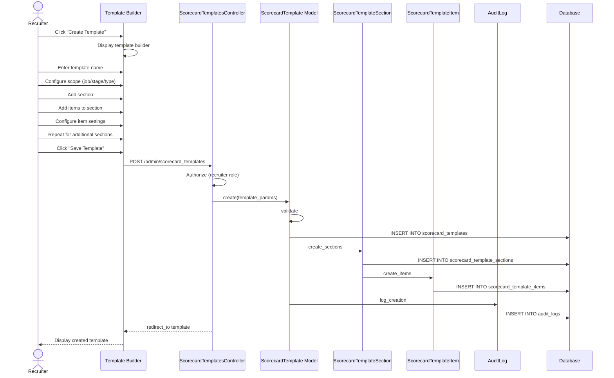

# UC-208: Create Scorecard Template

## Metadata

| Attribute | Value |
|-----------|-------|
| **ID** | UC-208 |
| **Name** | Create Scorecard Template |
| **Functional Area** | Evaluation & Feedback |
| **Primary Actor** | Recruiter (ACT-02) |
| **Priority** | P1 |
| **Complexity** | High |
| **Status** | Draft |

## Description

A recruiter creates a scorecard template that defines the structure and evaluation criteria for interview feedback. Templates contain sections (e.g., Technical Skills, Communication) with individual items (competency ratings, yes/no questions, text fields). Templates can be scoped to specific jobs, stages, or interview types, enabling consistent evaluation across the hiring process.

## Actors

| Actor | Role in Use Case |
|-------|------------------|
| Recruiter (ACT-02) | Creates and configures scorecard templates |
| System Administrator (ACT-01) | Has full access to template management |
| Hiring Manager (ACT-03) | May suggest template content |

## Preconditions

- [ ] User is authenticated with recruiter or admin role
- [ ] User belongs to an organization
- [ ] Competencies exist (optional but recommended)

## Postconditions

### Success
- [ ] ScorecardTemplate record created
- [ ] ScorecardTemplateSections created with positions
- [ ] ScorecardTemplateItems created within sections
- [ ] Template available for interview scorecards
- [ ] Audit log entry created

### Failure
- [ ] Validation errors displayed
- [ ] No template created

## Triggers

- Recruiter clicks "Create Template" from template list
- Recruiter configures evaluation during job setup
- Admin sets up organization default templates

## Basic Flow



| Step | Actor | Action | System Response |
|------|-------|--------|-----------------|
| 1 | Recruiter | Clicks "Create Template" | Template builder displayed |
| 2 | Recruiter | Enters template name | Name captured |
| 3 | Recruiter | Optionally selects scope (job, stage, type) | Scope configured |
| 4 | Recruiter | Clicks "Add Section" | Section form shown |
| 5 | Recruiter | Enters section name and type | Section created |
| 6 | Recruiter | Sets section weight (optional) | Weight assigned |
| 7 | Recruiter | Clicks "Add Item" in section | Item form shown |
| 8 | Recruiter | Selects item type (rating, yes/no, text, select) | Type selected |
| 9 | Recruiter | Enters item name and guidance | Item configured |
| 10 | Recruiter | Sets required flag | Required status set |
| 11 | Recruiter | Repeats steps 7-10 for additional items | Items added |
| 12 | Recruiter | Repeats steps 4-11 for additional sections | Sections added |
| 13 | Recruiter | Clicks "Save Template" | System validates |
| 14 | System | Validates template structure | Validation passes |
| 15 | System | Creates template with sections and items | Records saved |
| 16 | System | Creates audit log entry | Audit recorded |
| 17 | System | Displays success message | "Template created" |

## Alternative Flows

### AF-1: Clone Existing Template

**Trigger:** Recruiter wants to base new template on existing one

| Step | Actor | Action | System Response |
|------|-------|--------|-----------------|
| 1a | Recruiter | Clicks "Clone" on existing template | Clone initiated |
| 2a | System | Creates copy with "(Copy)" suffix | New template created |
| 3a | System | Opens edit mode | Template builder shown |
| 4a | Recruiter | Modifies as needed | Changes captured |

**Resumption:** Continues at step 13 of basic flow

### AF-2: Set as Default

**Trigger:** Recruiter wants template to be organization default

| Step | Actor | Action | System Response |
|------|-------|--------|-----------------|
| 13a | Recruiter | Checks "Set as default" | Default flag enabled |
| 15a | System | Unsets previous default (same scope) | Old default cleared |
| 16a | System | Sets new template as default | Default applied |

**Resumption:** Continues at step 16 of basic flow

### AF-3: Link to Competencies

**Trigger:** Recruiter wants items to reference defined competencies

| Step | Actor | Action | System Response |
|------|-------|--------|-----------------|
| 8a | Recruiter | Selects "From Competency Library" | Competency picker shown |
| 9a | Recruiter | Selects competency | Auto-populates name and guidance |
| 10a | System | Links item to competency | Reference created |

**Resumption:** Continues at step 10 of basic flow

### AF-4: Add Select-Type Item

**Trigger:** Recruiter adds dropdown selection item

| Step | Actor | Action | System Response |
|------|-------|--------|-----------------|
| 8b | Recruiter | Selects "Select" type | Options input shown |
| 9b | Recruiter | Enters option values | Options captured |
| 10b | System | Validates at least one option | Validation passes |

**Resumption:** Continues at step 10 of basic flow

### AF-5: Reorder Sections/Items

**Trigger:** Recruiter wants to change order

| Step | Actor | Action | System Response |
|------|-------|--------|-----------------|
| 12a | Recruiter | Drags section to new position | Position updated |
| 12b | System | Reorders all positions | Positions recalculated |
| 12c | Recruiter | Drags item within section | Item position updated |

**Resumption:** Continues at step 13 of basic flow

## Exception Flows

### EF-1: Empty Template

**Trigger:** Template has no sections at step 14

| Step | Actor | Action | System Response |
|------|-------|--------|-----------------|
| E.1 | System | Detects no sections | Validation error |
| E.2 | System | Displays error | "Add at least one section" |
| E.3 | Recruiter | Adds section | Section created |

**Resolution:** Returns to step 14, continues if valid

### EF-2: Duplicate Template Name

**Trigger:** Name already exists in organization

| Step | Actor | Action | System Response |
|------|-------|--------|-----------------|
| E.1 | System | Detects duplicate name | Validation error |
| E.2 | System | Displays error | "Template name already exists" |
| E.3 | Recruiter | Modifies name | Name updated |

**Resolution:** Returns to step 14, continues if valid

### EF-3: Invalid Rating Scale

**Trigger:** Rating scale outside allowed range

| Step | Actor | Action | System Response |
|------|-------|--------|-----------------|
| E.1 | System | Detects invalid scale | Validation error |
| E.2 | System | Displays error | "Scale must be 3, 4, or 5" |
| E.3 | Recruiter | Selects valid scale | Scale updated |

**Resolution:** Returns to step 14, continues if valid

### EF-4: Missing Select Options

**Trigger:** Select-type item has no options

| Step | Actor | Action | System Response |
|------|-------|--------|-----------------|
| E.1 | System | Detects missing options | Validation error |
| E.2 | System | Highlights item | "Add at least one option" |
| E.3 | Recruiter | Adds options | Options entered |

**Resolution:** Returns to step 14, continues if valid

## Business Rules

| ID | Rule | Description |
|----|------|-------------|
| BR-208.1 | Required Name | Template name is required and unique per organization |
| BR-208.2 | Section Required | Template must have at least one section |
| BR-208.3 | Item Types | Valid item types: rating, yes_no, text, select |
| BR-208.4 | Rating Scales | Allowed scales: 3, 4, or 5 (with predefined labels) |
| BR-208.5 | Select Options | Select-type items must have at least one option |
| BR-208.6 | One Default Per Scope | Only one default template per job/stage/type combination |
| BR-208.7 | Weight Range | Section weights must be 0-100 (or null for equal) |
| BR-208.8 | Position Order | Sections and items ordered by position (0-indexed) |

## Data Requirements

### Input Data

| Field | Type | Required | Validation |
|-------|------|----------|------------|
| name | string | Yes | Max 255 chars, unique per org |
| description | text | No | Max 1,000 chars |
| job_id | integer | No | Must exist if provided |
| stage_id | integer | No | Must exist if provided |
| interview_type | enum | No | Must be valid interview type |
| is_default | boolean | No | Default false |
| active | boolean | No | Default true |

### Section Input Data

| Field | Type | Required | Validation |
|-------|------|----------|------------|
| name | string | Yes | Max 255 chars |
| section_type | enum | Yes | competencies, questions, overall, custom |
| description | text | No | Max 500 chars |
| position | integer | Yes | >= 0 |
| weight | integer | No | 0-100, null for equal |
| required | boolean | No | Default true |

### Item Input Data

| Field | Type | Required | Validation |
|-------|------|----------|------------|
| name | string | Yes | Max 255 chars |
| item_type | enum | Yes | rating, yes_no, text, select |
| guidance | text | No | Max 2,000 chars |
| rating_scale | integer | Conditional | 3, 4, or 5 (for rating type) |
| options | array | Conditional | Required for select type |
| position | integer | Yes | >= 0 |
| required | boolean | No | Default false |

### Output Data

| Field | Type | Description |
|-------|------|-------------|
| id | integer | Template ID |
| section_count | integer | Number of sections |
| item_count | integer | Total items across sections |
| scope_description | string | Human-readable scope |

## Database Transactions

### Tables Affected

| Table | Operation | Conditions |
|-------|-----------|------------|
| scorecard_templates | CREATE | Template record |
| scorecard_template_sections | CREATE | Section records |
| scorecard_template_items | CREATE | Item records |
| audit_logs | CREATE | Log creation |

### Transaction Detail

```sql
-- Create Scorecard Template Transaction
BEGIN TRANSACTION;

-- Step 1: Create template
INSERT INTO scorecard_templates (
    organization_id,
    name,
    description,
    job_id,
    stage_id,
    interview_type,
    is_default,
    active,
    created_at,
    updated_at
) VALUES (
    @organization_id,
    @name,
    @description,
    @job_id,
    @stage_id,
    @interview_type,
    @is_default,
    TRUE,
    NOW(),
    NOW()
);

SET @template_id = LAST_INSERT_ID();

-- Step 2: Create sections
INSERT INTO scorecard_template_sections (
    scorecard_template_id,
    name,
    section_type,
    description,
    position,
    weight,
    required,
    created_at,
    updated_at
) VALUES
    (@template_id, 'Technical Skills', 'competencies', NULL, 0, 40, TRUE, NOW(), NOW()),
    (@template_id, 'Communication', 'competencies', NULL, 1, 30, TRUE, NOW(), NOW()),
    (@template_id, 'Overall Assessment', 'overall', NULL, 2, 30, TRUE, NOW(), NOW());

-- Step 3: Create items (example for first section)
SET @section_id = (SELECT id FROM scorecard_template_sections
                   WHERE scorecard_template_id = @template_id AND position = 0);

INSERT INTO scorecard_template_items (
    scorecard_template_section_id,
    name,
    item_type,
    guidance,
    rating_scale,
    position,
    required,
    created_at,
    updated_at
) VALUES
    (@section_id, 'Problem Solving', 'rating', 'Evaluate ability to...', 5, 0, TRUE, NOW(), NOW()),
    (@section_id, 'Technical Knowledge', 'rating', 'Assess domain expertise...', 5, 1, TRUE, NOW(), NOW());

-- Step 4: Create audit log
INSERT INTO audit_logs (
    organization_id,
    user_id,
    action,
    auditable_type,
    auditable_id,
    metadata,
    created_at
) VALUES (
    @organization_id,
    @current_user_id,
    'scorecard_template.created',
    'ScorecardTemplate',
    @template_id,
    JSON_OBJECT(
        'name', @name,
        'section_count', 3,
        'item_count', 10,
        'scope', @scope_description
    ),
    NOW()
);

-- Step 5: If setting as default, clear other defaults with same scope
UPDATE scorecard_templates
SET is_default = FALSE
WHERE organization_id = @organization_id
  AND id != @template_id
  AND is_default = TRUE
  AND COALESCE(job_id, 0) = COALESCE(@job_id, 0)
  AND COALESCE(stage_id, 0) = COALESCE(@stage_id, 0)
  AND COALESCE(interview_type, '') = COALESCE(@interview_type, '');

COMMIT;
```

## UI/UX Requirements

### Screen/Component

- **Location:** /admin/scorecard_templates/new
- **Entry Point:**
  - "Create Template" button on templates list
  - "Configure Scorecard" during job setup
  - "Clone" action on existing template
- **Key Elements:**
  - Template metadata form
  - Scope selector (job, stage, interview type)
  - Section builder with drag-drop ordering
  - Item builder with type-specific config
  - Live preview panel
  - Save/Cancel buttons

### Template Builder Layout

```
+---------------------------------------------------------------+
| Create Scorecard Template                                      |
+---------------------------------------------------------------+

+------------------------+--------------------------------------+
| Template Settings      | Live Preview                         |
+------------------------+--------------------------------------+
|                        |                                      |
| Name *                 | +----------------------------------+ |
| [Engineering Technical | | Engineering Technical Interview  | |
|  Interview]            | +----------------------------------+ |
|                        | | Section 1: Technical Skills (40%)| |
| Description            | | +------------------------------+ | |
| [For software         ]| | | Problem Solving          [*] | | |
| [engineering technical]| | | [ ] [ ] [ ] [ ] [ ]          | | |
| [interviews...        ]| | |  1   2   3   4   5           | | |
|                        | | +------------------------------+ | |
| Scope (Optional)       | | +------------------------------+ | |
| Job: [Any           v] | | | Technical Knowledge      [*] | | |
| Stage: [Any         v] | | | [ ] [ ] [ ] [ ] [ ]          | | |
| Type: [Technical    v] | | |  1   2   3   4   5           | | |
|                        | | +------------------------------+ | |
| [ ] Set as default     | |                                  | |
|                        | | Section 2: Communication (30%)   | |
+------------------------+ | ...                              | |
                           +----------------------------------+ |
+---------------------------------------------------------------+
| Sections                                        [+ Add Section]|
+---------------------------------------------------------------+
| +---------+-----------------------------------------------+   |
| | [drag]  | Technical Skills                    Weight: 40 |   |
| |         | Type: Competencies      Items: 3    [Edit][X] |   |
| +---------+-----------------------------------------------+   |
|   |                                                           |
|   | +-------------------------------------------------------+ |
|   | | [drag] Problem Solving         Rating (5)   Req [*]  | |
|   | |        [Edit] [Delete]                                | |
|   | +-------------------------------------------------------+ |
|   | +-------------------------------------------------------+ |
|   | | [drag] Technical Knowledge     Rating (5)   Req [*]  | |
|   | |        [Edit] [Delete]                                | |
|   | +-------------------------------------------------------+ |
|   | +-------------------------------------------------------+ |
|   | | [drag] Coding Ability          Rating (5)   Req [ ]  | |
|   | |        [Edit] [Delete]                                | |
|   | +-------------------------------------------------------+ |
|   |                                                           |
|   | [+ Add Item]                                              |
|   +-----------------------------------------------------------+
|                                                               |
| +---------+-----------------------------------------------+   |
| | [drag]  | Communication                       Weight: 30 |   |
| |         | Type: Competencies      Items: 2    [Edit][X] |   |
| +---------+-----------------------------------------------+   |
|   ...                                                         |
+---------------------------------------------------------------+

+---------------------------------------------------------------+
|                              [Cancel]    [Save Template]       |
+---------------------------------------------------------------+
```

### Item Configuration Modal

```
+---------------------------------------------------------------+
| Add Evaluation Item                                            |
+---------------------------------------------------------------+
|                                                                |
| Item Type                                                      |
|  (o) Rating Scale    ( ) Yes/No    ( ) Text    ( ) Select     |
|                                                                |
| Name *                                                         |
| [Problem Solving                                             ] |
|                                                                |
| Rating Scale                                                   |
|  (o) 5-point: Strong No -> Strong Yes                         |
|  ( ) 4-point: No -> Yes                                       |
|  ( ) 3-point: Below -> Exceeds                                |
|                                                                |
| Guidance for Interviewers                                      |
| [                                                             ]|
| [ Look for: systematic approach, use of frameworks,          ]|
| [ consideration of edge cases, ability to break down         ]|
| [ complex problems into manageable parts.                    ]|
| [                                                             ]|
|                                                                |
| [X] Required for submission                                    |
|                                                                |
| -OR- Link from Competency Library                              |
| [Select Competency...                                      v] |
|                                                                |
+---------------------------------------------------------------+
|                              [Cancel]         [Add Item]       |
+---------------------------------------------------------------+
```

## Non-Functional Requirements

| Requirement | Target |
|-------------|--------|
| Response Time | Builder load < 2s, save < 3s |
| Availability | 99.9% |
| Drag-Drop | Smooth 60fps experience |
| Preview Update | Real-time (< 100ms) |

## Security Considerations

- [x] Authentication required
- [x] Authorization check: Recruiter or Admin role
- [x] Organization scoping enforced
- [x] Audit logging for changes
- [x] Template duplication authorized

## Related Use Cases

| Use Case | Relationship |
|----------|--------------|
| UC-207 Manage Competencies | Provides competencies for items |
| UC-200 Submit Scorecard | Uses templates |
| UC-160 Manage Interview Templates | Similar pattern |
| UC-159 View Interview Kit | References template |

---

## Data Model References

> Cross-references to [DATA_MODEL.md](../DATA_MODEL.md) and [CRUD_MATRIX.md](../CRUD_MATRIX.md)

### Subject Areas

| Subject Area | ID | Relationship |
|--------------|-----|--------------|
| Evaluation | SA-07 | Primary |
| Organization | SA-02 | Secondary |
| Job Requisition | SA-03 | Reference |

### Entities CRUD

| Entity | C | R | U | D | Notes |
|--------|---|---|---|---|-------|
| ScorecardTemplate | ✓ | ✓ | ✓ | ✓ | Full CRUD |
| ScorecardTemplateSection | ✓ | ✓ | ✓ | ✓ | Nested under template |
| ScorecardTemplateItem | ✓ | ✓ | ✓ | ✓ | Nested under section |
| Job | | ✓ | | | Scope reference |
| Stage | | ✓ | | | Scope reference |
| AuditLog | ✓ | | | | Log creation |

**Legend:** C = Create, R = Read, U = Update, D = Delete

---

## Process Model References

> Cross-references to [PROCESS_MODEL.md](../PROCESS_MODEL.md) and [PROCESS_CRUD_MATRIX.md](../PROCESS_CRUD_MATRIX.md)

| Attribute | Value | Link |
|-----------|-------|------|
| **Elementary Business Process** | EP-0704: Create Scorecard Template | [PROCESS_MODEL.md#ep-0704](../PROCESS_MODEL.md#ep-0704-create-scorecard-template) |
| **Business Process** | BP-203: Hiring Decision Making | [PROCESS_MODEL.md#bp-203](../PROCESS_MODEL.md#bp-203-hiring-decision-making) |
| **Business Function** | BF-02: Candidate Evaluation | [PROCESS_MODEL.md#bf-02](../PROCESS_MODEL.md#bf-02-candidate-evaluation) |

### EBP Details

| Attribute | Value |
|-----------|-------|
| **Trigger** | Recruiter/Admin designs evaluation structure |
| **Input** | Template name, sections, items, scope configuration |
| **Output** | Complete scorecard template ready for use |
| **Business Rules** | BR-208.1 through BR-208.8 (see Business Rules section) |

---

## Traceability Matrix

> Complete artifact mapping for requirements traceability

| Artifact Type | ID | Name | Link |
|---------------|-----|------|------|
| **Use Case** | UC-208 | Create Scorecard Template | *(this document)* |
| **Elementary Process** | EP-0704 | Create Scorecard Template | [PROCESS_MODEL.md](../PROCESS_MODEL.md#ep-0704-create-scorecard-template) |
| **Business Process** | BP-203 | Hiring Decision Making | [PROCESS_MODEL.md](../PROCESS_MODEL.md#bp-203-hiring-decision-making) |
| **Business Function** | BF-02 | Candidate Evaluation | [PROCESS_MODEL.md](../PROCESS_MODEL.md#bf-02-candidate-evaluation) |
| **Primary Actor** | ACT-02 | Recruiter | [ACTORS.md](../ACTORS.md#act-02-recruiter) |
| **Subject Area (Primary)** | SA-07 | Evaluation | [DATA_MODEL.md](../DATA_MODEL.md#sa-07-evaluation) |
| **Subject Area (Secondary)** | SA-02 | Organization | [DATA_MODEL.md](../DATA_MODEL.md#sa-02-organization) |
| **CRUD Matrix Row** | UC-208 | - | [CRUD_MATRIX.md](../CRUD_MATRIX.md#uc-208) |
| **Process CRUD Row** | EP-0704 | - | [PROCESS_CRUD_MATRIX.md](../PROCESS_CRUD_MATRIX.md#ep-0704) |

### Implementation Artifacts

| Artifact Type | Path/Reference | Status |
|---------------|----------------|--------|
| Controller | `app/controllers/admin/scorecard_templates_controller.rb` | Implemented |
| Model | `app/models/scorecard_template.rb` | Implemented |
| Model | `app/models/scorecard_template_section.rb` | Implemented |
| Model | `app/models/scorecard_template_item.rb` | Implemented |
| View | `app/views/admin/scorecard_templates/new.html.erb` | Implemented |
| Test | `test/models/scorecard_template_test.rb` | Implemented |

---

## Open Questions

1. Should we support importing templates from JSON/YAML files?
2. Should templates support conditional items based on interview type?
3. Should there be a template marketplace for sharing across organizations?

## Change History

| Version | Date | Author | Changes |
|---------|------|--------|---------|
| 0.1 | 2026-01-25 | System | Initial draft |
