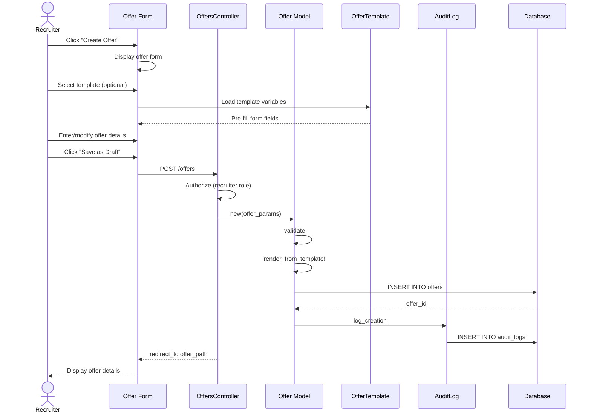

# UC-250: Create Offer

## Metadata

| Attribute | Value |
|-----------|-------|
| **ID** | UC-250 |
| **Name** | Create Offer |
| **Functional Area** | Offer Management |
| **Primary Actor** | Recruiter (ACT-02) |
| **Priority** | P1 |
| **Complexity** | Medium |
| **Status** | Draft |

## Description

A recruiter creates a new job offer for a candidate who has progressed through the interview process and received a positive hiring decision. The offer includes compensation details (salary, bonus, equity), start date, and employment terms. The offer can be created from scratch or by using an offer template.

## Actors

| Actor | Role in Use Case |
|-------|------------------|
| Recruiter (ACT-02) | Creates and configures the offer details |
| Hiring Manager (ACT-03) | May provide compensation guidance |

## Preconditions

- [ ] User is authenticated and has Recruiter or Admin role
- [ ] Application exists and is in an appropriate stage (typically post-interview)
- [ ] Candidate has not withdrawn from consideration
- [ ] No other active offer exists for this application

## Postconditions

### Success
- [ ] New Offer record created with status = 'draft'
- [ ] Offer linked to application and candidate
- [ ] Offer template variables substituted if template used
- [ ] Audit log entry created

### Failure
- [ ] No offer record created
- [ ] User shown validation errors
- [ ] No audit entry (nothing to audit)

## Triggers

- Recruiter clicks "Create Offer" from application detail page
- Recruiter clicks "Make Offer" from candidate profile
- Hiring manager requests offer creation after hiring decision

## Basic Flow



| Step | Actor | Action | System Response |
|------|-------|--------|-----------------|
| 1 | Recruiter | Clicks "Create Offer" from application | System displays offer creation form |
| 2 | Recruiter | Selects offer template (optional) | Form pre-populates with template defaults |
| 3 | Recruiter | Enters position title | Title field populated |
| 4 | Recruiter | Enters base salary | Salary field captured |
| 5 | Recruiter | Selects salary period (yearly/monthly/hourly) | Period set |
| 6 | Recruiter | Selects currency | Currency set (default USD) |
| 7 | Recruiter | Enters signing bonus (optional) | Bonus captured |
| 8 | Recruiter | Enters annual bonus target % (optional) | Bonus target set |
| 9 | Recruiter | Selects equity type (options/RSU/none) | Equity type set |
| 10 | Recruiter | Enters equity shares (if applicable) | Equity details captured |
| 11 | Recruiter | Enters vesting schedule (if applicable) | Vesting schedule set |
| 12 | Recruiter | Selects employment type | Employment type set |
| 13 | Recruiter | Enters proposed start date | Start date captured |
| 14 | Recruiter | Enters offer expiration date | Expiration set |
| 15 | Recruiter | Enters work location | Location captured |
| 16 | Recruiter | Enters department | Department set |
| 17 | Recruiter | Enters reports-to manager | Reporting line set |
| 18 | Recruiter | Adds custom terms (optional) | Custom terms captured |
| 19 | Recruiter | Clicks "Save as Draft" | System validates all fields |
| 20 | System | Validates required fields | Validation passes |
| 21 | System | Creates Offer record | Offer saved with status='draft' |
| 22 | System | Renders template content | Rendered content stored |
| 23 | System | Creates audit log entry | Audit record saved |
| 24 | System | Redirects to offer detail page | Offer detail displayed |

## Alternative Flows

### AF-1: Create and Submit for Approval

**Trigger:** Recruiter clicks "Save and Submit for Approval" instead of "Save as Draft" at step 19

| Step | Actor | Action | System Response |
|------|-------|--------|-----------------|
| 19a | Recruiter | Clicks "Submit for Approval" | System validates all fields |
| 20a | System | Creates Offer with status='pending_approval' | Offer saved |
| 21a | System | Creates OfferApproval records | Approval chain created |
| 22a | System | Notifies first approver | Email sent to approver |
| 23a | System | Redirects to offer detail | Shows "Pending Approval" status |

**Resumption:** Use case ends (triggers UC-252 for approver)

### AF-2: Create Without Template

**Trigger:** No offer templates exist or recruiter chooses not to use template

| Step | Actor | Action | System Response |
|------|-------|--------|-----------------|
| 2a | Recruiter | Skips template selection | Form displayed with empty fields |
| 3a | Recruiter | Enters all fields manually | Fields captured |

**Resumption:** Continues at step 19 of basic flow

### AF-3: Preview Rendered Offer

**Trigger:** Recruiter wants to preview offer letter before saving

| Step | Actor | Action | System Response |
|------|-------|--------|-----------------|
| 18a | Recruiter | Clicks "Preview" | System renders template with current values |
| 18b | System | Displays rendered offer letter | Preview modal shown |
| 18c | Recruiter | Reviews and closes preview | Returns to form |

**Resumption:** Continues at step 19 of basic flow

## Exception Flows

### EF-1: Validation Failure

**Trigger:** Required fields missing or invalid at step 20

| Step | Actor | Action | System Response |
|------|-------|--------|-----------------|
| 20.1 | System | Detects validation errors | Highlights invalid fields |
| 20.2 | System | Displays error messages | Shows specific errors |
| 20.3 | Recruiter | Corrects invalid fields | Fields updated |
| 20.4 | Recruiter | Resubmits form | System re-validates |

**Resolution:** Returns to step 20, continues if valid

### EF-2: Active Offer Already Exists

**Trigger:** Another offer in non-terminal status exists for this application

| Step | Actor | Action | System Response |
|------|-------|--------|-----------------|
| E.1 | System | Detects existing active offer | Displays warning |
| E.2 | Recruiter | Withdraws existing offer first | Existing offer withdrawn |
| E.3 | Recruiter | Retries offer creation | Creation proceeds |

**Resolution:** Continue from step 1 or cancel

### EF-3: Template Not Available

**Trigger:** Selected template has been deactivated

| Step | Actor | Action | System Response |
|------|-------|--------|-----------------|
| 2.1 | System | Detects inactive template | Displays warning |
| 2.2 | Recruiter | Selects different template or proceeds without | Form updated |

**Resolution:** Continues from step 3

## Business Rules

| ID | Rule | Description |
|----|------|-------------|
| BR-250.1 | Required Fields | Title and salary are always required |
| BR-250.2 | Expiration Date | Expiration date must be in the future |
| BR-250.3 | Salary Validation | Salary must be greater than 0 |
| BR-250.4 | Single Active Offer | Only one non-terminal offer per application |
| BR-250.5 | Equity Consistency | If equity_type is not 'none', shares must be specified |
| BR-250.6 | Template Rendering | Variables not found in template are left blank |

## Data Requirements

### Input Data

| Field | Type | Required | Validation |
|-------|------|----------|------------|
| application_id | integer | Yes | Must exist and be active |
| offer_template_id | integer | No | Must exist and be active |
| title | string | Yes | Max 255 chars |
| salary | decimal | Yes | > 0 |
| salary_period | enum | Yes | yearly, monthly, hourly |
| currency | string | No | ISO 4217, default USD |
| signing_bonus | decimal | No | >= 0 |
| annual_bonus_target | decimal | No | 0-100 (percentage) |
| equity_type | enum | No | options, rsu, none |
| equity_shares | integer | Conditional | Required if equity_type != none |
| equity_vesting_schedule | string | No | Max 255 chars |
| employment_type | enum | Yes | full_time, part_time, contractor, intern |
| proposed_start_date | date | No | Must be in future |
| expires_at | datetime | No | Must be in future |
| work_location | string | No | Max 255 chars |
| department | string | No | Max 255 chars |
| reports_to | string | No | Max 255 chars |
| custom_terms | text | No | Additional terms |

### Output Data

| Field | Type | Description |
|-------|------|-------------|
| id | integer | Unique offer identifier |
| status | enum | 'draft' (default) |
| rendered_content | text | Rendered offer letter content |
| created_at | datetime | Timestamp of creation |

## Database Transactions

### Tables Affected

| Table | Operation | Conditions |
|-------|-----------|------------|
| offers | CREATE | Always |
| offer_approvals | CREATE | If submitting for approval (AF-1) |
| audit_logs | CREATE | Always |

### Transaction Detail

```sql
-- Create Offer Transaction
BEGIN TRANSACTION;

-- Step 1: Insert offer record
INSERT INTO offers (
    organization_id,
    application_id,
    offer_template_id,
    created_by_id,
    title,
    salary,
    salary_period,
    currency,
    signing_bonus,
    annual_bonus_target,
    equity_type,
    equity_shares,
    equity_vesting_schedule,
    employment_type,
    proposed_start_date,
    expires_at,
    work_location,
    department,
    reports_to,
    custom_terms,
    rendered_content,
    status,
    created_at,
    updated_at
) VALUES (
    @organization_id,
    @application_id,
    @offer_template_id,
    @current_user_id,
    @title,
    @salary,
    @salary_period,
    @currency,
    @signing_bonus,
    @annual_bonus_target,
    @equity_type,
    @equity_shares,
    @equity_vesting_schedule,
    @employment_type,
    @proposed_start_date,
    @expires_at,
    @work_location,
    @department,
    @reports_to,
    @custom_terms,
    @rendered_content,
    'draft',
    NOW(),
    NOW()
);

SET @offer_id = LAST_INSERT_ID();

-- Step 2: Create audit log entry
INSERT INTO audit_logs (
    organization_id,
    user_id,
    action,
    auditable_type,
    auditable_id,
    metadata,
    ip_address,
    user_agent,
    created_at
) VALUES (
    @organization_id,
    @current_user_id,
    'offer.created',
    'Offer',
    @offer_id,
    JSON_OBJECT(
        'application_id', @application_id,
        'title', @title,
        'salary', @salary,
        'status', 'draft'
    ),
    @ip_address,
    @user_agent,
    NOW()
);

COMMIT;
```

### Rollback Scenarios

| Scenario | Rollback Action |
|----------|-----------------|
| Validation failure | No transaction started, return errors |
| Template rendering failure | Full rollback, return error |
| Audit log failure | Log error but commit offer (non-critical) |

## UI/UX Requirements

### Screen/Component

- **Location:** /admin/applications/:id/offers/new
- **Entry Point:**
  - "Create Offer" button on application detail page
  - "Make Offer" from candidate actions menu
- **Key Elements:**
  - Template selector dropdown
  - Compensation section (salary, bonus, equity)
  - Employment details section
  - Preview button for rendered offer letter
  - Action buttons: "Save as Draft", "Submit for Approval", "Cancel"

### Form Layout

```
+----------------------------------------------------------+
| Create Offer for [Candidate Name]                         |
| Position: [Job Title]                                     |
+----------------------------------------------------------+
| Offer Template                                            |
| +------------------------------------------------------+ |
| | Select template (optional)                         v | |
| +------------------------------------------------------+ |
|                                                          |
| Position Title *                                         |
| +------------------------------------------------------+ |
| |                                                      | |
| +------------------------------------------------------+ |
|                                                          |
| COMPENSATION                                             |
| +------------------------------------------------------+ |
| | Base Salary *          Period *         Currency     | |
| | +--------------+       +----------+    +--------+   | |
| | |              |       | Yearly v |    | USD  v |   | |
| | +--------------+       +----------+    +--------+   | |
| |                                                      | |
| | Signing Bonus          Annual Bonus Target (%)       | |
| | +--------------+       +--------------+              | |
| | |              |       |              |              | |
| | +--------------+       +--------------+              | |
| |                                                      | |
| | Equity Type            Shares         Vesting        | |
| | +----------+          +--------+     +-----------+  | |
| | | None   v |          |        |     |           |  | |
| | +----------+          +--------+     +-----------+  | |
| +------------------------------------------------------+ |
|                                                          |
| EMPLOYMENT DETAILS                                       |
| +------------------------------------------------------+ |
| | Employment Type *      Start Date      Expiration    | |
| | +-------------+       +----------+    +----------+   | |
| | | Full-time v |       |          |    |          |   | |
| | +-------------+       +----------+    +----------+   | |
| |                                                      | |
| | Location               Department      Reports To    | |
| | +-------------+       +----------+    +----------+   | |
| | |             |       |          |    |          |   | |
| | +-------------+       +----------+    +----------+   | |
| +------------------------------------------------------+ |
|                                                          |
| Custom Terms                                             |
| +------------------------------------------------------+ |
| |                                                      | |
| |                                                      | |
| +------------------------------------------------------+ |
|                                                          |
| Total First Year Compensation: $XXX,XXX                  |
|                                                          |
+----------------------------------------------------------+
| [Cancel]    [Preview]    [Save as Draft]  [Submit for Approval] |
+----------------------------------------------------------+
```

## Non-Functional Requirements

| Requirement | Target |
|-------------|--------|
| Response Time | Form load < 1s, save < 2s |
| Availability | 99.9% |
| Template Render | < 500ms |

## Security Considerations

- [x] Authentication required
- [x] Authorization check: User must have recruiter or admin role
- [x] Organization scoping: Offer created within user's organization only
- [x] Salary encryption: Compensation data encrypted at rest
- [x] Audit logging: Creation logged with user, timestamp, IP

## Related Use Cases

| Use Case | Relationship |
|----------|--------------|
| UC-251 Submit Offer for Approval | Can follow this use case |
| UC-254 Send Offer to Candidate | Follows after approval |
| UC-257 Negotiate Offer | Can follow if terms need revision |
| UC-260 Manage Offer Templates | Provides templates for this use case |
| UC-205 Make Hiring Decision | Typically precedes this use case |

---

## Data Model References

> Cross-references to [DATA_MODEL.md](../DATA_MODEL.md) and [CRUD_MATRIX.md](../CRUD_MATRIX.md)

### Subject Areas

| Subject Area | ID | Relationship |
|--------------|-----|--------------|
| Offer Management | SA-08 | Primary |
| Application Pipeline | SA-05 | Secondary |
| Compliance & Audit | SA-09 | Reference |

### Entities CRUD

| Entity | C | R | U | D | Notes |
|--------|---|---|---|---|-------|
| Offer | ✓ | | | | Created as draft in step 21 |
| OfferTemplate | | ✓ | | | Read to get template content |
| Application | | ✓ | | | Read to link offer |
| Candidate | | ✓ | | | Read for template variables |
| Job | | ✓ | | | Read for template variables |
| AuditLog | ✓ | | | | Created in step 23 |

**Legend:** C = Create, R = Read, U = Update, D = Delete

---

## Process Model References

> Cross-references to [PROCESS_MODEL.md](../PROCESS_MODEL.md) and [PROCESS_CRUD_MATRIX.md](../PROCESS_CRUD_MATRIX.md)

| Attribute | Value | Link |
|-----------|-------|------|
| **Elementary Business Process** | EP-0801: Create Offer | [PROCESS_MODEL.md#ep-0801](../PROCESS_MODEL.md#ep-0801-create-offer) |
| **Business Process** | BP-301: Offer Creation | [PROCESS_MODEL.md#bp-301](../PROCESS_MODEL.md#bp-301-offer-creation) |
| **Business Function** | BF-03: Offer & Onboarding | [PROCESS_MODEL.md#bf-03](../PROCESS_MODEL.md#bf-03-offer--onboarding) |

### EBP Details

| Attribute | Value |
|-----------|-------|
| **Trigger** | Recruiter initiates offer creation from application or candidate view |
| **Input** | Compensation details, employment terms, offer template (optional) |
| **Output** | New Offer record in draft status with rendered content |
| **Business Rules** | BR-250.1 through BR-250.6 (see Business Rules section) |

---

## Traceability Matrix

> Complete artifact mapping for requirements traceability

| Artifact Type | ID | Name | Link |
|---------------|-----|------|------|
| **Use Case** | UC-250 | Create Offer | *(this document)* |
| **Elementary Process** | EP-0801 | Create Offer | [PROCESS_MODEL.md](../PROCESS_MODEL.md#ep-0801-create-offer) |
| **Business Process** | BP-301 | Offer Creation | [PROCESS_MODEL.md](../PROCESS_MODEL.md#bp-301-offer-creation) |
| **Business Function** | BF-03 | Offer & Onboarding | [PROCESS_MODEL.md](../PROCESS_MODEL.md#bf-03-offer--onboarding) |
| **Primary Actor** | ACT-02 | Recruiter | [ACTORS.md](../ACTORS.md#act-02-recruiter) |
| **Subject Area (Primary)** | SA-08 | Offer Management | [DATA_MODEL.md](../DATA_MODEL.md#sa-08-offer-management) |
| **Subject Area (Secondary)** | SA-05 | Application Pipeline | [DATA_MODEL.md](../DATA_MODEL.md#sa-05-application-pipeline) |
| **CRUD Matrix Row** | UC-250 | - | [CRUD_MATRIX.md](../CRUD_MATRIX.md#uc-250) |
| **Process CRUD Row** | EP-0801 | - | [PROCESS_CRUD_MATRIX.md](../PROCESS_CRUD_MATRIX.md#ep-0801) |

### Implementation Artifacts

| Artifact Type | Path/Reference | Status |
|---------------|----------------|--------|
| Controller | `app/controllers/admin/offers_controller.rb` | Implemented |
| Model | `app/models/offer.rb` | Implemented |
| Service | `app/services/offers/create_service.rb` | Planned |
| Policy | `app/policies/offer_policy.rb` | Implemented |
| View | `app/views/admin/offers/new.html.erb` | Implemented |
| Test | `test/controllers/admin/offers_controller_test.rb` | Implemented |

---

## Open Questions

1. Should we support multiple offer letters for different countries/regions?
2. What is the maximum retention period for declined/withdrawn offers?
3. Should equity details require HR or Finance approval automatically?

## Change History

| Version | Date | Author | Changes |
|---------|------|--------|---------|
| 0.1 | 2026-01-25 | System | Initial draft |
