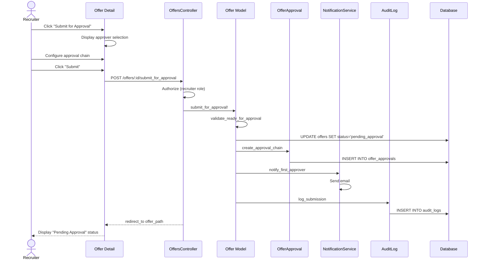

# UC-251: Submit Offer for Approval

## Metadata

| Attribute | Value |
|-----------|-------|
| **ID** | UC-251 |
| **Name** | Submit Offer for Approval |
| **Functional Area** | Offer Management |
| **Primary Actor** | Recruiter (ACT-02) |
| **Priority** | P1 |
| **Complexity** | Medium |
| **Status** | Draft |

## Description

A recruiter submits a draft offer to one or more approvers for review and approval. The approval workflow supports sequential multi-step approval where approvers must approve in order based on their assigned sequence. The offer cannot be sent to the candidate until all required approvals are obtained.

## Actors

| Actor | Role in Use Case |
|-------|------------------|
| Recruiter (ACT-02) | Submits the offer for approval |
| Hiring Manager (ACT-03) | Primary approver in approval chain |
| Executive (ACT-05) | Additional approver for executive-level offers |

## Preconditions

- [ ] User is authenticated and has Recruiter or Admin role
- [ ] Offer exists with status = 'draft'
- [ ] Offer has all required fields populated
- [ ] At least one approver is configured for the organization or offer

## Postconditions

### Success
- [ ] Offer status changed to 'pending_approval'
- [ ] OfferApproval records created for each approver
- [ ] First approver notified via email
- [ ] Audit log entry created

### Failure
- [ ] Offer status remains 'draft'
- [ ] No approval records created
- [ ] User shown validation errors

## Triggers

- Recruiter clicks "Submit for Approval" on draft offer
- Recruiter creates offer with "Save and Submit for Approval" action (UC-250 AF-1)

## Basic Flow



| Step | Actor | Action | System Response |
|------|-------|--------|-----------------|
| 1 | Recruiter | Views draft offer | Offer detail page displayed |
| 2 | Recruiter | Clicks "Submit for Approval" | System displays approval configuration |
| 3 | Recruiter | Selects first approver (usually Hiring Manager) | Approver added to chain |
| 4 | Recruiter | Adds additional approvers if needed | Approval chain configured |
| 5 | Recruiter | Sets approval sequence | Order determined |
| 6 | Recruiter | Adds optional note for approvers | Note captured |
| 7 | Recruiter | Clicks "Submit" | System validates offer completeness |
| 8 | System | Validates required fields present | Validation passes |
| 9 | System | Updates offer status to 'pending_approval' | Status changed |
| 10 | System | Creates OfferApproval records | Approvals created with sequence |
| 11 | System | Sends notification to first approver | Email sent |
| 12 | System | Creates audit log entry | Audit record saved |
| 13 | System | Redirects to offer detail | "Pending Approval" status shown |

## Alternative Flows

### AF-1: Use Default Approval Chain

**Trigger:** Organization has default offer approvers configured

| Step | Actor | Action | System Response |
|------|-------|--------|-----------------|
| 3a | System | Pre-populates default approvers | Default chain displayed |
| 4a | Recruiter | Accepts defaults or modifies | Chain configured |

**Resumption:** Continues at step 6 of basic flow

### AF-2: Single Approver

**Trigger:** Only one approver required (small organization)

| Step | Actor | Action | System Response |
|------|-------|--------|-----------------|
| 3a | Recruiter | Selects single approver | One approval required |
| 4a | System | Skips additional approver step | Simplified flow |

**Resumption:** Continues at step 6 of basic flow

### AF-3: Compensation-Based Routing

**Trigger:** Offer salary exceeds threshold requiring additional approval

| Step | Actor | Action | System Response |
|------|-------|--------|-----------------|
| 8a | System | Detects salary above threshold | Additional approver required |
| 8b | System | Adds executive approver to chain | Finance/Executive added |
| 8c | System | Notifies recruiter of addition | Warning displayed |

**Resumption:** Continues at step 9 of basic flow

## Exception Flows

### EF-1: Incomplete Offer

**Trigger:** Required fields missing at step 8

| Step | Actor | Action | System Response |
|------|-------|--------|-----------------|
| 8.1 | System | Detects missing required fields | Displays errors |
| 8.2 | System | Lists incomplete fields | Error details shown |
| 8.3 | Recruiter | Edits offer to complete | Returns to edit mode |
| 8.4 | Recruiter | Retries submission | Validation re-runs |

**Resolution:** Returns to step 8, continues if valid

### EF-2: No Approvers Available

**Trigger:** No valid approvers configured or all approvers inactive

| Step | Actor | Action | System Response |
|------|-------|--------|-----------------|
| 3.1 | System | No approvers available | Warning displayed |
| 3.2 | Recruiter | Contacts admin to configure | Manual intervention |

**Resolution:** Cannot proceed until approvers configured

### EF-3: Approver Conflict of Interest

**Trigger:** Selected approver is the hiring manager for their own position

| Step | Actor | Action | System Response |
|------|-------|--------|-----------------|
| 4.1 | System | Detects conflict | Warning displayed |
| 4.2 | Recruiter | Selects different approver | Chain updated |

**Resolution:** Continues from step 5

## Business Rules

| ID | Rule | Description |
|----|------|-------------|
| BR-251.1 | Draft Status Required | Only draft offers can be submitted for approval |
| BR-251.2 | Minimum Approvers | At least one approver required |
| BR-251.3 | Sequential Approval | Approvers must respond in sequence order |
| BR-251.4 | Salary Threshold | Offers above org threshold require additional approver |
| BR-251.5 | Approver Uniqueness | Same user cannot appear twice in approval chain |
| BR-251.6 | Active Approvers | All approvers must be active users |

## Data Requirements

### Input Data

| Field | Type | Required | Validation |
|-------|------|----------|------------|
| offer_id | integer | Yes | Must exist with status='draft' |
| approvers | array | Yes | At least one approver |
| approvers[].user_id | integer | Yes | Must be active user with approval permission |
| approvers[].sequence | integer | Yes | Unique positive integer |
| submission_note | text | No | Max 1000 chars |

### Output Data

| Field | Type | Description |
|-------|------|-------------|
| offer.status | enum | 'pending_approval' |
| offer_approvals | array | Created approval records |
| first_approver_notified | boolean | Email sent confirmation |

## Database Transactions

### Tables Affected

| Table | Operation | Conditions |
|-------|-----------|------------|
| offers | UPDATE | Set status to 'pending_approval' |
| offer_approvals | CREATE | One per approver |
| audit_logs | CREATE | Always |

### Transaction Detail

```sql
-- Submit Offer for Approval Transaction
BEGIN TRANSACTION;

-- Step 1: Update offer status
UPDATE offers
SET status = 'pending_approval',
    updated_at = NOW()
WHERE id = @offer_id
  AND status = 'draft';

-- Verify update succeeded
IF ROW_COUNT() = 0 THEN
    ROLLBACK;
    SIGNAL SQLSTATE '45000' SET MESSAGE_TEXT = 'Offer not in draft status';
END IF;

-- Step 2: Create approval records
INSERT INTO offer_approvals (
    offer_id,
    approver_id,
    sequence,
    status,
    requested_at,
    created_at,
    updated_at
) VALUES
    (@offer_id, @approver1_id, 1, 'pending', NOW(), NOW(), NOW()),
    (@offer_id, @approver2_id, 2, 'pending', NOW(), NOW(), NOW());

-- Step 3: Create audit log entry
INSERT INTO audit_logs (
    organization_id,
    user_id,
    action,
    auditable_type,
    auditable_id,
    metadata,
    ip_address,
    user_agent,
    created_at
) VALUES (
    @organization_id,
    @current_user_id,
    'offer.submitted_for_approval',
    'Offer',
    @offer_id,
    JSON_OBJECT(
        'approvers', JSON_ARRAY(@approver1_id, @approver2_id),
        'submission_note', @submission_note
    ),
    @ip_address,
    @user_agent,
    NOW()
);

COMMIT;
```

### Rollback Scenarios

| Scenario | Rollback Action |
|----------|-----------------|
| Validation failure | No transaction started, return errors |
| Status update failure | Full rollback |
| Notification failure | Log error, do not rollback (non-blocking) |

## UI/UX Requirements

### Screen/Component

- **Location:** /admin/offers/:id/submit_for_approval
- **Entry Point:**
  - "Submit for Approval" button on offer detail page
  - "Save and Submit" on offer creation form
- **Key Elements:**
  - Approver selector with search
  - Drag-and-drop sequence ordering
  - Note field for approvers
  - Offer summary display

### Form Layout

```
+----------------------------------------------------------+
| Submit Offer for Approval                                 |
+----------------------------------------------------------+
| Offer Summary                                             |
| +------------------------------------------------------+ |
| | Candidate: [Candidate Name]                          | |
| | Position: [Job Title]                                | |
| | Salary: $XXX,XXX / year                             | |
| | Total First Year: $XXX,XXX                          | |
| +------------------------------------------------------+ |
|                                                          |
| Approval Chain                                           |
| +------------------------------------------------------+ |
| | 1. [Hiring Manager Name]              [x Remove]     | |
| |    hiring_manager@company.com                        | |
| +------------------------------------------------------+ |
| | 2. [Executive Name]                   [x Remove]     | |
| |    executive@company.com                             | |
| +------------------------------------------------------+ |
| | [+ Add Approver]                                     | |
| +------------------------------------------------------+ |
|                                                          |
| Note for Approvers (optional)                            |
| +------------------------------------------------------+ |
| |                                                      | |
| +------------------------------------------------------+ |
|                                                          |
+----------------------------------------------------------+
| [Cancel]                              [Submit for Approval] |
+----------------------------------------------------------+
```

## Non-Functional Requirements

| Requirement | Target |
|-------------|--------|
| Response Time | Submit action < 2s |
| Email Delivery | Within 5 minutes |
| Availability | 99.9% |

## Security Considerations

- [x] Authentication required
- [x] Authorization check: User must have recruiter role and access to application
- [x] Organization scoping: Only organization's offers accessible
- [x] Audit logging: Submission logged with approver chain

## Related Use Cases

| Use Case | Relationship |
|----------|--------------|
| UC-250 Create Offer | Precedes this use case |
| UC-252 Approve Offer | Follows for each approver |
| UC-253 Reject Offer | Alternative outcome |
| UC-254 Send Offer to Candidate | Follows after all approvals |

---

## Data Model References

> Cross-references to [DATA_MODEL.md](../DATA_MODEL.md) and [CRUD_MATRIX.md](../CRUD_MATRIX.md)

### Subject Areas

| Subject Area | ID | Relationship |
|--------------|-----|--------------|
| Offer Management | SA-08 | Primary |
| Identity & Access | SA-01 | Secondary |
| Compliance & Audit | SA-09 | Reference |

### Entities CRUD

| Entity | C | R | U | D | Notes |
|--------|---|---|---|---|-------|
| Offer | | ✓ | ✓ | | Status updated to pending_approval |
| OfferApproval | ✓ | | | | Created for each approver |
| User | | ✓ | | | Read for approver selection |
| AuditLog | ✓ | | | | Created for submission |

**Legend:** C = Create, R = Read, U = Update, D = Delete

---

## Process Model References

> Cross-references to [PROCESS_MODEL.md](../PROCESS_MODEL.md) and [PROCESS_CRUD_MATRIX.md](../PROCESS_CRUD_MATRIX.md)

| Attribute | Value | Link |
|-----------|-------|------|
| **Elementary Business Process** | EP-0811: Submit Offer for Approval | [PROCESS_MODEL.md#ep-0811](../PROCESS_MODEL.md#ep-0811-submit-offer-for-approval) |
| **Business Process** | BP-302: Offer Approval | [PROCESS_MODEL.md#bp-302](../PROCESS_MODEL.md#bp-302-offer-approval) |
| **Business Function** | BF-03: Offer & Onboarding | [PROCESS_MODEL.md#bf-03](../PROCESS_MODEL.md#bf-03-offer--onboarding) |

### EBP Details

| Attribute | Value |
|-----------|-------|
| **Trigger** | Recruiter initiates approval submission from offer detail or creation |
| **Input** | Draft offer, approval chain configuration |
| **Output** | Offer in pending_approval status with OfferApproval records |
| **Business Rules** | BR-251.1 through BR-251.6 (see Business Rules section) |

---

## Traceability Matrix

> Complete artifact mapping for requirements traceability

| Artifact Type | ID | Name | Link |
|---------------|-----|------|------|
| **Use Case** | UC-251 | Submit Offer for Approval | *(this document)* |
| **Elementary Process** | EP-0811 | Submit Offer for Approval | [PROCESS_MODEL.md](../PROCESS_MODEL.md#ep-0811-submit-offer-for-approval) |
| **Business Process** | BP-302 | Offer Approval | [PROCESS_MODEL.md](../PROCESS_MODEL.md#bp-302-offer-approval) |
| **Business Function** | BF-03 | Offer & Onboarding | [PROCESS_MODEL.md](../PROCESS_MODEL.md#bf-03-offer--onboarding) |
| **Primary Actor** | ACT-02 | Recruiter | [ACTORS.md](../ACTORS.md#act-02-recruiter) |
| **Subject Area (Primary)** | SA-08 | Offer Management | [DATA_MODEL.md](../DATA_MODEL.md#sa-08-offer-management) |
| **Subject Area (Secondary)** | SA-01 | Identity & Access | [DATA_MODEL.md](../DATA_MODEL.md#sa-01-identity--access) |
| **CRUD Matrix Row** | UC-251 | - | [CRUD_MATRIX.md](../CRUD_MATRIX.md#uc-251) |
| **Process CRUD Row** | EP-0811 | - | [PROCESS_CRUD_MATRIX.md](../PROCESS_CRUD_MATRIX.md#ep-0811) |

### Implementation Artifacts

| Artifact Type | Path/Reference | Status |
|---------------|----------------|--------|
| Controller | `app/controllers/admin/offers_controller.rb` | Implemented |
| Model | `app/models/offer.rb` | Implemented |
| Model | `app/models/offer_approval.rb` | Implemented |
| Service | `app/services/offers/submit_for_approval_service.rb` | Planned |
| Policy | `app/policies/offer_policy.rb` | Implemented |
| View | `app/views/admin/offers/submit_for_approval.html.erb` | Planned |
| Test | `test/models/offer_test.rb` | Implemented |

---

## Open Questions

1. Should we support parallel approval (any approver can approve) vs sequential?
2. What is the SLA for approver response before escalation?
3. Should approvers be able to delegate their approval authority?

## Change History

| Version | Date | Author | Changes |
|---------|------|--------|---------|
| 0.1 | 2026-01-25 | System | Initial draft |
