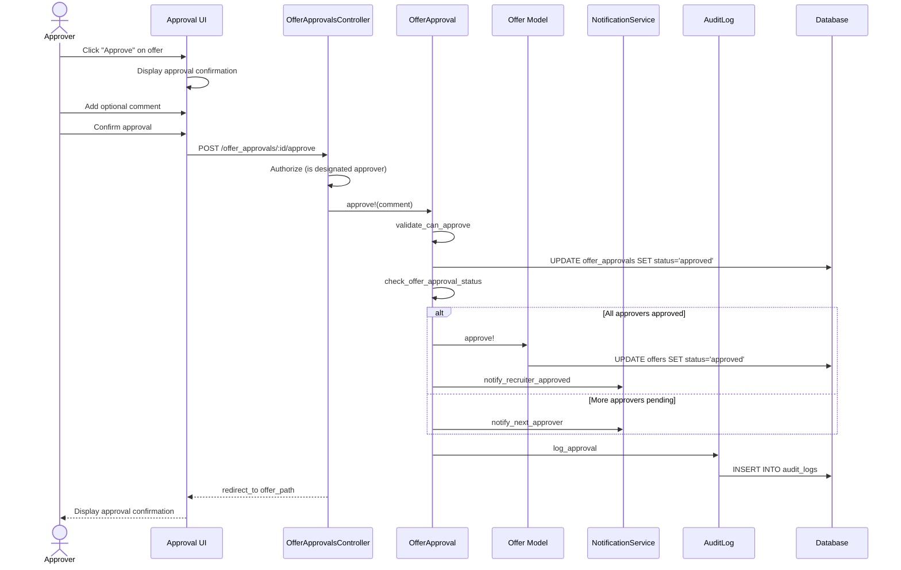

# UC-252: Approve Offer

## Metadata

| Attribute | Value |
|-----------|-------|
| **ID** | UC-252 |
| **Name** | Approve Offer |
| **Functional Area** | Offer Management |
| **Primary Actor** | Hiring Manager (ACT-03) |
| **Priority** | P1 |
| **Complexity** | Low |
| **Status** | Draft |

## Description

An approver (typically Hiring Manager or Executive) reviews and approves a pending offer. When the approver is in a sequential approval chain, approving advances the offer to the next approver. When all approvers have approved, the offer status changes to 'approved' and can be sent to the candidate.

## Actors

| Actor | Role in Use Case |
|-------|------------------|
| Hiring Manager (ACT-03) | Primary approver, reviews offer details |
| Executive (ACT-05) | Secondary approver for high-value offers |

## Preconditions

- [ ] User is authenticated and is a designated approver for this offer
- [ ] Offer exists with status = 'pending_approval'
- [ ] It is this approver's turn in the sequence (all prior approvers have approved)
- [ ] OfferApproval record exists with status = 'pending' for this user

## Postconditions

### Success
- [ ] OfferApproval status changed to 'approved'
- [ ] If last approver: Offer status changed to 'approved'
- [ ] If not last approver: Next approver notified
- [ ] Recruiter notified of approval
- [ ] Audit log entry created

### Failure
- [ ] OfferApproval status unchanged
- [ ] User shown error message

## Triggers

- Approver clicks "Approve" from offer approval email link
- Approver clicks "Approve" from pending approvals dashboard
- Approver clicks "Approve" from offer detail page

## Basic Flow



| Step | Actor | Action | System Response |
|------|-------|--------|-----------------|
| 1 | Approver | Receives approval notification | Email with offer summary |
| 2 | Approver | Clicks approval link or navigates to offer | Offer detail displayed |
| 3 | Approver | Reviews offer details | Offer summary shown |
| 4 | Approver | Reviews compensation package | Salary, bonus, equity displayed |
| 5 | Approver | Clicks "Approve" | Approval dialog displayed |
| 6 | Approver | Enters optional comment | Comment captured |
| 7 | Approver | Confirms approval | System validates approval eligibility |
| 8 | System | Updates OfferApproval to 'approved' | Approval recorded |
| 9 | System | Checks if all approvers complete | Approval chain evaluated |
| 10 | System | If complete: Updates Offer to 'approved' | Offer status changed |
| 11 | System | Notifies recruiter | Email sent |
| 12 | System | Creates audit log entry | Audit record saved |
| 13 | System | Displays approval confirmation | Success message shown |

## Alternative Flows

### AF-1: Not Final Approver

**Trigger:** Additional approvers remain in the sequence

| Step | Actor | Action | System Response |
|------|-------|--------|-----------------|
| 9a | System | Detects more approvers in chain | Next approver identified |
| 10a | System | Sends notification to next approver | Email sent |
| 11a | System | Updates UI to show pending next approver | Status shows next in chain |

**Resumption:** Use case ends (next approver will receive UC-252)

### AF-2: Approve from Email

**Trigger:** Approver clicks "Approve" button in email notification

| Step | Actor | Action | System Response |
|------|-------|--------|-----------------|
| 1a | Approver | Clicks "Approve" in email | Direct link to approval page |
| 2a | System | Authenticates user | Login required if not authenticated |
| 3a | System | Displays approval confirmation | Approval dialog shown |

**Resumption:** Continues at step 6 of basic flow

### AF-3: Approve from Dashboard

**Trigger:** Approver reviews pending approvals from dashboard

| Step | Actor | Action | System Response |
|------|-------|--------|-----------------|
| 1a | Approver | Views pending approvals dashboard | List of pending items |
| 2a | Approver | Clicks on offer approval | Offer detail displayed |

**Resumption:** Continues at step 3 of basic flow

## Exception Flows

### EF-1: Out of Sequence Approval

**Trigger:** Approver tries to approve before their turn

| Step | Actor | Action | System Response |
|------|-------|--------|-----------------|
| 7.1 | System | Detects prior approvals pending | Error displayed |
| 7.2 | System | Shows approval chain status | Current position shown |
| 7.3 | Approver | Waits for prior approvers | Cannot proceed |

**Resolution:** Must wait for prior approvers

### EF-2: Offer Already Processed

**Trigger:** Offer has been withdrawn or already approved

| Step | Actor | Action | System Response |
|------|-------|--------|-----------------|
| 7.1 | System | Detects offer not pending_approval | Error displayed |
| 7.2 | System | Shows current offer status | Status explanation shown |

**Resolution:** No action needed

### EF-3: Approval Permission Revoked

**Trigger:** Approver's role changed since approval request

| Step | Actor | Action | System Response |
|------|-------|--------|-----------------|
| 7.1 | System | Detects user no longer approver | Access denied |
| 7.2 | System | Notifies recruiter to reassign | Admin notification |

**Resolution:** Recruiter must reassign approver

## Business Rules

| ID | Rule | Description |
|----|------|-------------|
| BR-252.1 | Sequential Approval | Must be approver's turn in sequence |
| BR-252.2 | Single Approval | Each approver can only approve once |
| BR-252.3 | Pending Status Required | Approval must have status = 'pending' |
| BR-252.4 | Final Approval | Last approval triggers offer status change |
| BR-252.5 | Comment Optional | Approval comments are optional |
| BR-252.6 | Notification Required | Recruiter must be notified of approval |

## Data Requirements

### Input Data

| Field | Type | Required | Validation |
|-------|------|----------|------------|
| offer_approval_id | integer | Yes | Must exist and be pending |
| comment | text | No | Max 1000 chars |

### Output Data

| Field | Type | Description |
|-------|------|-------------|
| offer_approval.status | enum | 'approved' |
| offer_approval.responded_at | datetime | Timestamp of approval |
| offer.status | enum | 'approved' if final approver |

## Database Transactions

### Tables Affected

| Table | Operation | Conditions |
|-------|-----------|------------|
| offer_approvals | UPDATE | Set status to 'approved' |
| offers | UPDATE | If final approval, set status to 'approved' |
| audit_logs | CREATE | Always |

### Transaction Detail

```sql
-- Approve Offer Transaction
BEGIN TRANSACTION;

-- Step 1: Update approval record
UPDATE offer_approvals
SET status = 'approved',
    comments = @comment,
    responded_at = NOW(),
    updated_at = NOW()
WHERE id = @offer_approval_id
  AND status = 'pending'
  AND approver_id = @current_user_id;

-- Verify update succeeded
IF ROW_COUNT() = 0 THEN
    ROLLBACK;
    SIGNAL SQLSTATE '45000' SET MESSAGE_TEXT = 'Approval not allowed';
END IF;

-- Step 2: Check if all approvals complete
SET @pending_count = (
    SELECT COUNT(*) FROM offer_approvals
    WHERE offer_id = @offer_id AND status = 'pending'
);

SET @rejected_count = (
    SELECT COUNT(*) FROM offer_approvals
    WHERE offer_id = @offer_id AND status = 'rejected'
);

-- Step 3: If all approved, update offer status
IF @pending_count = 0 AND @rejected_count = 0 THEN
    UPDATE offers
    SET status = 'approved',
        updated_at = NOW()
    WHERE id = @offer_id;
END IF;

-- Step 4: Create audit log entry
INSERT INTO audit_logs (
    organization_id,
    user_id,
    action,
    auditable_type,
    auditable_id,
    metadata,
    ip_address,
    user_agent,
    created_at
) VALUES (
    @organization_id,
    @current_user_id,
    'offer_approval.approved',
    'OfferApproval',
    @offer_approval_id,
    JSON_OBJECT(
        'offer_id', @offer_id,
        'comment', @comment,
        'is_final_approval', @pending_count = 0
    ),
    @ip_address,
    @user_agent,
    NOW()
);

COMMIT;
```

### Rollback Scenarios

| Scenario | Rollback Action |
|----------|-----------------|
| Not approver's turn | Full rollback, return error |
| Already approved | No transaction, return error |
| Notification failure | Log error, do not rollback |

## UI/UX Requirements

### Screen/Component

- **Location:** /admin/offer_approvals/:id
- **Entry Point:**
  - Email notification link
  - Pending approvals dashboard
  - Offer detail page
- **Key Elements:**
  - Offer summary with compensation
  - Candidate and job information
  - Approval chain status
  - Approve/Reject buttons
  - Comment field

### Form Layout

```
+----------------------------------------------------------+
| Offer Approval Request                                    |
+----------------------------------------------------------+
| Candidate: [Candidate Name]                               |
| Position: [Job Title]                                     |
| Department: [Department Name]                             |
|                                                          |
| COMPENSATION SUMMARY                                      |
| +------------------------------------------------------+ |
| | Base Salary:        $150,000 / year                  | |
| | Signing Bonus:      $25,000                          | |
| | Annual Bonus:       15% target                       | |
| | Equity:             10,000 options (4-year vest)     | |
| | ----------------------------------------------------- | |
| | Total First Year:   $197,500                         | |
| +------------------------------------------------------+ |
|                                                          |
| APPROVAL CHAIN                                           |
| +------------------------------------------------------+ |
| | 1. [Hiring Manager]     [v] Approved 2h ago          | |
| | 2. [You]                [ ] Pending <-- Your turn    | |
| | 3. [Finance Director]   [ ] Waiting                  | |
| +------------------------------------------------------+ |
|                                                          |
| Submission Note from Recruiter:                          |
| "Strong candidate, competitive market rate"              |
|                                                          |
| Your Comment (optional)                                  |
| +------------------------------------------------------+ |
| |                                                      | |
| +------------------------------------------------------+ |
|                                                          |
+----------------------------------------------------------+
| [Reject with Feedback]                         [Approve] |
+----------------------------------------------------------+
```

## Non-Functional Requirements

| Requirement | Target |
|-------------|--------|
| Response Time | Approval action < 1s |
| Email Delivery | Within 2 minutes |
| Availability | 99.9% |

## Security Considerations

- [x] Authentication required
- [x] Authorization check: User must be designated approver
- [x] Sequence validation: Must be approver's turn
- [x] Audit logging: Approval action logged with timestamp

## Related Use Cases

| Use Case | Relationship |
|----------|--------------|
| UC-251 Submit Offer for Approval | Precedes this use case |
| UC-253 Reject Offer | Alternative to this use case |
| UC-254 Send Offer to Candidate | Follows after all approvals |

---

## Data Model References

> Cross-references to [DATA_MODEL.md](../DATA_MODEL.md) and [CRUD_MATRIX.md](../CRUD_MATRIX.md)

### Subject Areas

| Subject Area | ID | Relationship |
|--------------|-----|--------------|
| Offer Management | SA-08 | Primary |
| Identity & Access | SA-01 | Secondary |
| Compliance & Audit | SA-09 | Reference |

### Entities CRUD

| Entity | C | R | U | D | Notes |
|--------|---|---|---|---|-------|
| OfferApproval | | ✓ | ✓ | | Status updated to approved |
| Offer | | ✓ | ✓ | | Status updated if final approval |
| User | | ✓ | | | Read for approver validation |
| AuditLog | ✓ | | | | Created for approval action |

**Legend:** C = Create, R = Read, U = Update, D = Delete

---

## Process Model References

> Cross-references to [PROCESS_MODEL.md](../PROCESS_MODEL.md) and [PROCESS_CRUD_MATRIX.md](../PROCESS_CRUD_MATRIX.md)

| Attribute | Value | Link |
|-----------|-------|------|
| **Elementary Business Process** | EP-0812: Approve Offer | [PROCESS_MODEL.md#ep-0812](../PROCESS_MODEL.md#ep-0812-approve-offer) |
| **Business Process** | BP-302: Offer Approval | [PROCESS_MODEL.md#bp-302](../PROCESS_MODEL.md#bp-302-offer-approval) |
| **Business Function** | BF-03: Offer & Onboarding | [PROCESS_MODEL.md#bf-03](../PROCESS_MODEL.md#bf-03-offer--onboarding) |

### EBP Details

| Attribute | Value |
|-----------|-------|
| **Trigger** | Approver receives notification or accesses pending approval |
| **Input** | Pending OfferApproval, optional comment |
| **Output** | Approved OfferApproval, potentially approved Offer |
| **Business Rules** | BR-252.1 through BR-252.6 (see Business Rules section) |

---

## Traceability Matrix

> Complete artifact mapping for requirements traceability

| Artifact Type | ID | Name | Link |
|---------------|-----|------|------|
| **Use Case** | UC-252 | Approve Offer | *(this document)* |
| **Elementary Process** | EP-0812 | Approve Offer | [PROCESS_MODEL.md](../PROCESS_MODEL.md#ep-0812-approve-offer) |
| **Business Process** | BP-302 | Offer Approval | [PROCESS_MODEL.md](../PROCESS_MODEL.md#bp-302-offer-approval) |
| **Business Function** | BF-03 | Offer & Onboarding | [PROCESS_MODEL.md](../PROCESS_MODEL.md#bf-03-offer--onboarding) |
| **Primary Actor** | ACT-03 | Hiring Manager | [ACTORS.md](../ACTORS.md#act-03-hiring-manager) |
| **Subject Area (Primary)** | SA-08 | Offer Management | [DATA_MODEL.md](../DATA_MODEL.md#sa-08-offer-management) |
| **CRUD Matrix Row** | UC-252 | - | [CRUD_MATRIX.md](../CRUD_MATRIX.md#uc-252) |
| **Process CRUD Row** | EP-0812 | - | [PROCESS_CRUD_MATRIX.md](../PROCESS_CRUD_MATRIX.md#ep-0812) |

### Implementation Artifacts

| Artifact Type | Path/Reference | Status |
|---------------|----------------|--------|
| Controller | `app/controllers/admin/offer_approvals_controller.rb` | Planned |
| Model | `app/models/offer_approval.rb` | Implemented |
| Policy | `app/policies/offer_approval_policy.rb` | Planned |
| View | `app/views/admin/offer_approvals/show.html.erb` | Planned |
| Test | `test/models/offer_approval_test.rb` | Implemented |

---

## Open Questions

1. Should approvers be able to request changes instead of outright rejecting?
2. What is the timeout for approver response before escalation?
3. Should we support mobile approval via push notification?

## Change History

| Version | Date | Author | Changes |
|---------|------|--------|---------|
| 0.1 | 2026-01-25 | System | Initial draft |
