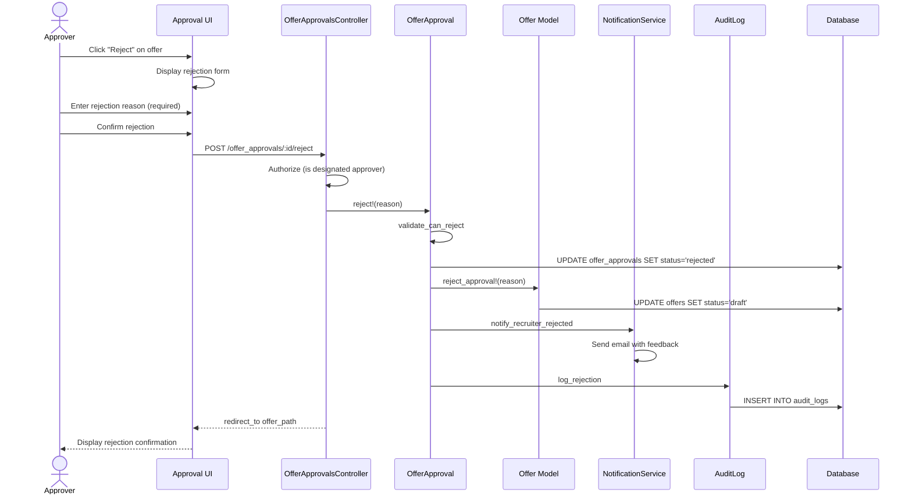

# UC-253: Reject Offer

## Metadata

| Attribute | Value |
|-----------|-------|
| **ID** | UC-253 |
| **Name** | Reject Offer |
| **Functional Area** | Offer Management |
| **Primary Actor** | Hiring Manager (ACT-03) |
| **Priority** | P1 |
| **Complexity** | Low |
| **Status** | Draft |

## Description

An approver (typically Hiring Manager or Executive) reviews a pending offer and rejects it, providing feedback on why the offer cannot be approved. The rejection returns the offer to draft status so the recruiter can revise the terms and resubmit for approval.

## Actors

| Actor | Role in Use Case |
|-------|------------------|
| Hiring Manager (ACT-03) | Primary approver, rejects offer with feedback |
| Executive (ACT-05) | Secondary approver for high-value offers |

## Preconditions

- [ ] User is authenticated and is a designated approver for this offer
- [ ] Offer exists with status = 'pending_approval'
- [ ] It is this approver's turn in the sequence (all prior approvers have approved)
- [ ] OfferApproval record exists with status = 'pending' for this user

## Postconditions

### Success
- [ ] OfferApproval status changed to 'rejected'
- [ ] Offer status changed back to 'draft'
- [ ] Rejection reason appended to offer notes
- [ ] Recruiter notified of rejection with feedback
- [ ] Audit log entry created

### Failure
- [ ] OfferApproval status unchanged
- [ ] User shown error message

## Triggers

- Approver clicks "Reject" from offer approval email link
- Approver clicks "Reject" from pending approvals dashboard
- Approver clicks "Reject" from offer detail page

## Basic Flow



| Step | Actor | Action | System Response |
|------|-------|--------|-----------------|
| 1 | Approver | Receives approval notification | Email with offer summary |
| 2 | Approver | Clicks approval link or navigates to offer | Offer detail displayed |
| 3 | Approver | Reviews offer details | Offer summary shown |
| 4 | Approver | Identifies issue with offer | Determines rejection reason |
| 5 | Approver | Clicks "Reject" | Rejection dialog displayed |
| 6 | Approver | Enters rejection reason (required) | Reason captured |
| 7 | Approver | Suggests corrections (optional) | Suggestions captured |
| 8 | Approver | Confirms rejection | System validates rejection |
| 9 | System | Updates OfferApproval to 'rejected' | Approval record updated |
| 10 | System | Returns Offer to 'draft' status | Offer can be edited |
| 11 | System | Appends rejection reason to offer notes | Feedback preserved |
| 12 | System | Notifies recruiter with feedback | Email sent |
| 13 | System | Creates audit log entry | Audit record saved |
| 14 | System | Displays rejection confirmation | Success message shown |

## Alternative Flows

### AF-1: Reject with Suggested Changes

**Trigger:** Approver wants to provide specific guidance for revision

| Step | Actor | Action | System Response |
|------|-------|--------|-----------------|
| 7a | Approver | Enters detailed suggestions | Suggestions captured |
| 7b | Approver | Specifies preferred values | Target values noted |

**Resumption:** Continues at step 8 of basic flow

### AF-2: Reject from Email Quick Action

**Trigger:** Approver clicks "Reject" directly from email (if enabled)

| Step | Actor | Action | System Response |
|------|-------|--------|-----------------|
| 1a | Approver | Clicks "Reject" in email | Redirected to rejection form |
| 2a | System | Pre-fills offer context | Streamlined rejection flow |

**Resumption:** Continues at step 6 of basic flow

## Exception Flows

### EF-1: Missing Rejection Reason

**Trigger:** Approver tries to reject without providing a reason

| Step | Actor | Action | System Response |
|------|-------|--------|-----------------|
| 8.1 | System | Detects empty rejection reason | Error displayed |
| 8.2 | System | Highlights required field | Form focus on reason |
| 8.3 | Approver | Enters rejection reason | Reason provided |
| 8.4 | Approver | Retries rejection | Validation re-runs |

**Resolution:** Returns to step 8, continues if valid

### EF-2: Out of Sequence Rejection

**Trigger:** Approver tries to reject before their turn

| Step | Actor | Action | System Response |
|------|-------|--------|-----------------|
| 8.1 | System | Detects prior approvals pending | Error displayed |
| 8.2 | System | Shows approval chain status | Current position shown |
| 8.3 | Approver | Waits for prior approvers | Cannot proceed |

**Resolution:** Must wait for prior approvers

### EF-3: Offer Already Processed

**Trigger:** Offer has been withdrawn or already fully processed

| Step | Actor | Action | System Response |
|------|-------|--------|-----------------|
| 8.1 | System | Detects offer not pending_approval | Error displayed |
| 8.2 | System | Shows current offer status | Status explanation shown |

**Resolution:** No action needed

## Business Rules

| ID | Rule | Description |
|----|------|-------------|
| BR-253.1 | Reason Required | Rejection reason is mandatory |
| BR-253.2 | Sequential Check | Must be approver's turn in sequence |
| BR-253.3 | Single Response | Each approver can only respond once |
| BR-253.4 | Draft Reversion | Rejection returns offer to draft status |
| BR-253.5 | Feedback Preserved | Rejection reason appended to offer notes |
| BR-253.6 | Notification Required | Recruiter must be notified with feedback |

## Data Requirements

### Input Data

| Field | Type | Required | Validation |
|-------|------|----------|------------|
| offer_approval_id | integer | Yes | Must exist and be pending |
| reason | text | Yes | Min 10 chars, max 2000 chars |
| suggested_changes | text | No | Max 2000 chars |

### Output Data

| Field | Type | Description |
|-------|------|-------------|
| offer_approval.status | enum | 'rejected' |
| offer_approval.responded_at | datetime | Timestamp of rejection |
| offer.status | enum | 'draft' |
| offer.custom_terms | text | Includes rejection feedback |

## Database Transactions

### Tables Affected

| Table | Operation | Conditions |
|-------|-----------|------------|
| offer_approvals | UPDATE | Set status to 'rejected' |
| offers | UPDATE | Set status back to 'draft', update notes |
| audit_logs | CREATE | Always |

### Transaction Detail

```sql
-- Reject Offer Transaction
BEGIN TRANSACTION;

-- Step 1: Update approval record
UPDATE offer_approvals
SET status = 'rejected',
    comments = @reason,
    responded_at = NOW(),
    updated_at = NOW()
WHERE id = @offer_approval_id
  AND status = 'pending'
  AND approver_id = @current_user_id;

-- Verify update succeeded
IF ROW_COUNT() = 0 THEN
    ROLLBACK;
    SIGNAL SQLSTATE '45000' SET MESSAGE_TEXT = 'Rejection not allowed';
END IF;

-- Step 2: Return offer to draft status
UPDATE offers
SET status = 'draft',
    custom_terms = CONCAT(
        COALESCE(custom_terms, ''),
        '\n\n--- Rejection Feedback (', NOW(), ') ---\n',
        @reason,
        CASE WHEN @suggested_changes IS NOT NULL
             THEN CONCAT('\n\nSuggested changes: ', @suggested_changes)
             ELSE '' END
    ),
    updated_at = NOW()
WHERE id = @offer_id;

-- Step 3: Create audit log entry
INSERT INTO audit_logs (
    organization_id,
    user_id,
    action,
    auditable_type,
    auditable_id,
    metadata,
    ip_address,
    user_agent,
    created_at
) VALUES (
    @organization_id,
    @current_user_id,
    'offer_approval.rejected',
    'OfferApproval',
    @offer_approval_id,
    JSON_OBJECT(
        'offer_id', @offer_id,
        'reason', @reason,
        'suggested_changes', @suggested_changes
    ),
    @ip_address,
    @user_agent,
    NOW()
);

COMMIT;
```

### Rollback Scenarios

| Scenario | Rollback Action |
|----------|-----------------|
| Not approver's turn | Full rollback, return error |
| Missing reason | No transaction started, return validation error |
| Already responded | No transaction, return error |
| Notification failure | Log error, do not rollback |

## UI/UX Requirements

### Screen/Component

- **Location:** /admin/offer_approvals/:id/reject
- **Entry Point:**
  - "Reject" button on approval page
  - Email notification link
- **Key Elements:**
  - Offer summary for context
  - Rejection reason field (required)
  - Suggested changes field (optional)
  - Confirmation button

### Form Layout

```
+----------------------------------------------------------+
| Reject Offer                                              |
+----------------------------------------------------------+
| Candidate: [Candidate Name]                               |
| Position: [Job Title]                                     |
| Proposed Salary: $150,000 / year                         |
|                                                          |
| Rejection Reason *                                        |
| +------------------------------------------------------+ |
| | Salary is above the approved band for this level.    | |
| | Maximum approved for L4 is $140,000.                 | |
| |                                                      | |
| +------------------------------------------------------+ |
| (Minimum 10 characters required)                         |
|                                                          |
| Suggested Changes (optional)                             |
| +------------------------------------------------------+ |
| | Consider offering $138,000 with a higher signing     | |
| | bonus of $30,000 instead.                            | |
| +------------------------------------------------------+ |
|                                                          |
| ! This will return the offer to draft status for the    |
|   recruiter to revise.                                   |
|                                                          |
+----------------------------------------------------------+
| [Cancel]                            [Confirm Rejection]   |
+----------------------------------------------------------+
```

## Non-Functional Requirements

| Requirement | Target |
|-------------|--------|
| Response Time | Rejection action < 1s |
| Email Delivery | Within 2 minutes |
| Availability | 99.9% |

## Security Considerations

- [x] Authentication required
- [x] Authorization check: User must be designated approver
- [x] Sequence validation: Must be approver's turn
- [x] Audit logging: Rejection action logged with reason

## Related Use Cases

| Use Case | Relationship |
|----------|--------------|
| UC-251 Submit Offer for Approval | Precedes this use case |
| UC-252 Approve Offer | Alternative to this use case |
| UC-257 Negotiate Offer | May follow to revise and resubmit |
| UC-250 Create Offer | Return to edit offer after rejection |

---

## Data Model References

> Cross-references to [DATA_MODEL.md](../DATA_MODEL.md) and [CRUD_MATRIX.md](../CRUD_MATRIX.md)

### Subject Areas

| Subject Area | ID | Relationship |
|--------------|-----|--------------|
| Offer Management | SA-08 | Primary |
| Identity & Access | SA-01 | Secondary |
| Compliance & Audit | SA-09 | Reference |

### Entities CRUD

| Entity | C | R | U | D | Notes |
|--------|---|---|---|---|-------|
| OfferApproval | | ✓ | ✓ | | Status updated to rejected |
| Offer | | ✓ | ✓ | | Status reverted to draft |
| User | | ✓ | | | Read for approver validation |
| AuditLog | ✓ | | | | Created for rejection action |

**Legend:** C = Create, R = Read, U = Update, D = Delete

---

## Process Model References

> Cross-references to [PROCESS_MODEL.md](../PROCESS_MODEL.md) and [PROCESS_CRUD_MATRIX.md](../PROCESS_CRUD_MATRIX.md)

| Attribute | Value | Link |
|-----------|-------|------|
| **Elementary Business Process** | EP-0813: Reject Offer | [PROCESS_MODEL.md#ep-0813](../PROCESS_MODEL.md#ep-0813-reject-offer) |
| **Business Process** | BP-302: Offer Approval | [PROCESS_MODEL.md#bp-302](../PROCESS_MODEL.md#bp-302-offer-approval) |
| **Business Function** | BF-03: Offer & Onboarding | [PROCESS_MODEL.md#bf-03](../PROCESS_MODEL.md#bf-03-offer--onboarding) |

### EBP Details

| Attribute | Value |
|-----------|-------|
| **Trigger** | Approver determines offer terms are not acceptable |
| **Input** | Pending OfferApproval, rejection reason |
| **Output** | Rejected OfferApproval, Offer reverted to draft |
| **Business Rules** | BR-253.1 through BR-253.6 (see Business Rules section) |

---

## Traceability Matrix

> Complete artifact mapping for requirements traceability

| Artifact Type | ID | Name | Link |
|---------------|-----|------|------|
| **Use Case** | UC-253 | Reject Offer | *(this document)* |
| **Elementary Process** | EP-0813 | Reject Offer | [PROCESS_MODEL.md](../PROCESS_MODEL.md#ep-0813-reject-offer) |
| **Business Process** | BP-302 | Offer Approval | [PROCESS_MODEL.md](../PROCESS_MODEL.md#bp-302-offer-approval) |
| **Business Function** | BF-03 | Offer & Onboarding | [PROCESS_MODEL.md](../PROCESS_MODEL.md#bf-03-offer--onboarding) |
| **Primary Actor** | ACT-03 | Hiring Manager | [ACTORS.md](../ACTORS.md#act-03-hiring-manager) |
| **Subject Area (Primary)** | SA-08 | Offer Management | [DATA_MODEL.md](../DATA_MODEL.md#sa-08-offer-management) |
| **CRUD Matrix Row** | UC-253 | - | [CRUD_MATRIX.md](../CRUD_MATRIX.md#uc-253) |
| **Process CRUD Row** | EP-0813 | - | [PROCESS_CRUD_MATRIX.md](../PROCESS_CRUD_MATRIX.md#ep-0813) |

### Implementation Artifacts

| Artifact Type | Path/Reference | Status |
|---------------|----------------|--------|
| Controller | `app/controllers/admin/offer_approvals_controller.rb` | Planned |
| Model | `app/models/offer_approval.rb` | Implemented |
| Policy | `app/policies/offer_approval_policy.rb` | Planned |
| View | `app/views/admin/offer_approvals/reject.html.erb` | Planned |
| Test | `test/models/offer_approval_test.rb` | Implemented |

---

## Open Questions

1. Should rejection reasons be categorized for analytics?
2. How many revision cycles should be allowed before escalation?
3. Should there be a "request changes" option separate from full rejection?

## Change History

| Version | Date | Author | Changes |
|---------|------|--------|---------|
| 0.1 | 2026-01-25 | System | Initial draft |
