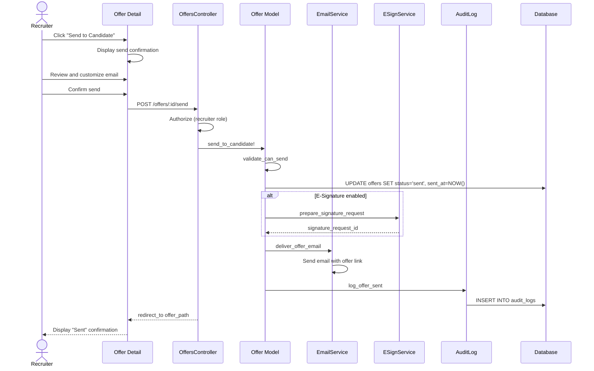

# UC-254: Send Offer to Candidate

## Metadata

| Attribute | Value |
|-----------|-------|
| **ID** | UC-254 |
| **Name** | Send Offer to Candidate |
| **Functional Area** | Offer Management |
| **Primary Actor** | Recruiter (ACT-02) |
| **Priority** | P1 |
| **Complexity** | Medium |
| **Status** | Draft |

## Description

A recruiter sends an approved offer to the candidate for their review and response. The offer letter is delivered via email with a link to view full details and respond. The offer includes an expiration date by which the candidate must respond. For organizations using e-signatures, the offer document is prepared for electronic signing.

## Actors

| Actor | Role in Use Case |
|-------|------------------|
| Recruiter (ACT-02) | Sends the approved offer to candidate |
| Candidate (ACT-07) | Receives and reviews the offer |

## Preconditions

- [ ] User is authenticated and has Recruiter or Admin role
- [ ] Offer exists with status = 'approved'
- [ ] Candidate has valid email address
- [ ] Offer has not expired

## Postconditions

### Success
- [ ] Offer status changed to 'sent'
- [ ] sent_at timestamp recorded
- [ ] Candidate receives email with offer details
- [ ] Offer viewable in candidate portal
- [ ] E-signature document prepared (if enabled)
- [ ] Audit log entry created

### Failure
- [ ] Offer status remains 'approved'
- [ ] User shown error message
- [ ] Email delivery failure logged

## Triggers

- Recruiter clicks "Send to Candidate" on approved offer
- Automated send when offer is approved (if configured)

## Basic Flow



| Step | Actor | Action | System Response |
|------|-------|--------|-----------------|
| 1 | Recruiter | Views approved offer | Offer detail displayed |
| 2 | Recruiter | Clicks "Send to Candidate" | Send confirmation dialog displayed |
| 3 | Recruiter | Reviews offer summary | Summary includes all key terms |
| 4 | Recruiter | Customizes email message (optional) | Email content updated |
| 5 | Recruiter | Confirms expiration date | Date verified or adjusted |
| 6 | Recruiter | Clicks "Send" | System validates offer ready to send |
| 7 | System | Validates offer is approved | Validation passes |
| 8 | System | Updates offer status to 'sent' | Status changed |
| 9 | System | Records sent_at timestamp | Timestamp captured |
| 10 | System | Prepares e-signature document (if enabled) | Document ready for signing |
| 11 | System | Sends email to candidate | Email delivered |
| 12 | System | Creates audit log entry | Audit record saved |
| 13 | System | Displays send confirmation | Success message shown |

## Alternative Flows

### AF-1: Send Without E-Signature

**Trigger:** Organization does not use e-signature integration

| Step | Actor | Action | System Response |
|------|-------|--------|-----------------|
| 10a | System | Skips e-signature preparation | Plain offer letter sent |
| 10b | System | Includes PDF attachment | Offer letter as PDF |

**Resumption:** Continues at step 11 of basic flow

### AF-2: Schedule Send for Later

**Trigger:** Recruiter wants to send at specific time

| Step | Actor | Action | System Response |
|------|-------|--------|-----------------|
| 4a | Recruiter | Selects "Schedule for later" | Date/time picker displayed |
| 4b | Recruiter | Chooses send date/time | Scheduled send configured |
| 5a | System | Queues offer for scheduled send | Job scheduled |
| 6a | System | Displays scheduled confirmation | Send time shown |

**Resumption:** Use case ends (actual send triggered by scheduler)

### AF-3: Send with CC to Hiring Manager

**Trigger:** Recruiter wants to copy hiring manager

| Step | Actor | Action | System Response |
|------|-------|--------|-----------------|
| 4a | Recruiter | Enables CC to hiring manager | CC option selected |
| 11a | System | Sends copy to hiring manager | Additional email sent |

**Resumption:** Continues at step 12 of basic flow

## Exception Flows

### EF-1: Invalid Candidate Email

**Trigger:** Candidate email address is invalid or bounces

| Step | Actor | Action | System Response |
|------|-------|--------|-----------------|
| 11.1 | System | Detects email delivery failure | Error logged |
| 11.2 | System | Notifies recruiter of failure | Alert displayed |
| 11.3 | Recruiter | Updates candidate email | Email corrected |
| 11.4 | Recruiter | Retries send | Send attempted again |

**Resolution:** Retry after email correction

### EF-2: Offer Already Expired

**Trigger:** Expiration date has passed before send

| Step | Actor | Action | System Response |
|------|-------|--------|-----------------|
| 7.1 | System | Detects expired offer | Error displayed |
| 7.2 | System | Prompts for new expiration date | Date picker shown |
| 7.3 | Recruiter | Sets new expiration date | Date updated |
| 7.4 | Recruiter | Retries send | Send proceeds |

**Resolution:** Continue after date update

### EF-3: E-Signature Service Unavailable

**Trigger:** E-signature integration is down

| Step | Actor | Action | System Response |
|------|-------|--------|-----------------|
| 10.1 | System | E-signature service timeout | Warning displayed |
| 10.2 | System | Offers to send without e-signature | Option presented |
| 10.3 | Recruiter | Chooses to proceed or wait | Decision captured |

**Resolution:** Send without e-signature or retry later

## Business Rules

| ID | Rule | Description |
|----|------|-------------|
| BR-254.1 | Approved Status Required | Only approved offers can be sent |
| BR-254.2 | Valid Email Required | Candidate must have valid email address |
| BR-254.3 | Future Expiration | Expiration date must be in the future |
| BR-254.4 | Single Send | Offer can only be sent once (resend creates notification) |
| BR-254.5 | E-Sign Preparation | If org uses e-signature, document must be prepared |
| BR-254.6 | Audit Trail | Send action must be logged |

## Data Requirements

### Input Data

| Field | Type | Required | Validation |
|-------|------|----------|------------|
| offer_id | integer | Yes | Must exist with status='approved' |
| email_message | text | No | Custom message, max 2000 chars |
| expires_at | datetime | No | Must be in future if provided |
| cc_hiring_manager | boolean | No | Default false |
| scheduled_send_at | datetime | No | Must be in future |

### Output Data

| Field | Type | Description |
|-------|------|-------------|
| offer.status | enum | 'sent' |
| offer.sent_at | datetime | Timestamp of send |
| email_delivered | boolean | Delivery confirmation |
| signature_request_id | string | E-signature tracking ID (if applicable) |

## Database Transactions

### Tables Affected

| Table | Operation | Conditions |
|-------|-----------|------------|
| offers | UPDATE | Set status to 'sent', record sent_at |
| offer_documents | CREATE | If e-signature enabled |
| audit_logs | CREATE | Always |

### Transaction Detail

```sql
-- Send Offer to Candidate Transaction
BEGIN TRANSACTION;

-- Step 1: Update offer status
UPDATE offers
SET status = 'sent',
    sent_at = NOW(),
    expires_at = COALESCE(@new_expires_at, expires_at),
    updated_at = NOW()
WHERE id = @offer_id
  AND status = 'approved';

-- Verify update succeeded
IF ROW_COUNT() = 0 THEN
    ROLLBACK;
    SIGNAL SQLSTATE '45000' SET MESSAGE_TEXT = 'Offer not in approved status';
END IF;

-- Step 2: Create e-signature document record (if applicable)
IF @esign_enabled THEN
    INSERT INTO offer_documents (
        offer_id,
        document_type,
        filename,
        storage_key,
        status,
        signature_request_id,
        sent_at,
        created_at,
        updated_at
    ) VALUES (
        @offer_id,
        'offer_letter',
        @filename,
        @storage_key,
        'pending_signature',
        @signature_request_id,
        NOW(),
        NOW(),
        NOW()
    );
END IF;

-- Step 3: Create audit log entry
INSERT INTO audit_logs (
    organization_id,
    user_id,
    action,
    auditable_type,
    auditable_id,
    metadata,
    ip_address,
    user_agent,
    created_at
) VALUES (
    @organization_id,
    @current_user_id,
    'offer.sent_to_candidate',
    'Offer',
    @offer_id,
    JSON_OBJECT(
        'candidate_email', @candidate_email,
        'esign_enabled', @esign_enabled,
        'cc_hiring_manager', @cc_hiring_manager
    ),
    @ip_address,
    @user_agent,
    NOW()
);

COMMIT;
```

### Rollback Scenarios

| Scenario | Rollback Action |
|----------|-----------------|
| Not approved status | Full rollback, return error |
| E-signature failure | Log warning, continue without e-sign |
| Email delivery failure | Log error, status still 'sent' but flag for retry |

## UI/UX Requirements

### Screen/Component

- **Location:** /admin/offers/:id/send
- **Entry Point:**
  - "Send to Candidate" button on approved offer
- **Key Elements:**
  - Offer summary for final review
  - Email preview and customization
  - Expiration date confirmation
  - Send confirmation button

### Form Layout

```
+----------------------------------------------------------+
| Send Offer to Candidate                                   |
+----------------------------------------------------------+
| OFFER SUMMARY                                             |
| +------------------------------------------------------+ |
| | Candidate: [Candidate Name]                          | |
| | Email: candidate@email.com                           | |
| | Position: [Job Title]                                | |
| | Salary: $150,000 / year                             | |
| | Start Date: March 15, 2026                          | |
| | Expires: February 1, 2026 (7 days from now)         | |
| +------------------------------------------------------+ |
|                                                          |
| EMAIL PREVIEW                                            |
| +------------------------------------------------------+ |
| | Subject: Offer Letter - [Job Title] at [Company]    | |
| | ---------------------------------------------------- | |
| | Dear [Candidate First Name],                        | |
| |                                                      | |
| | We are pleased to extend an offer for the position  | |
| | of [Job Title] at [Company Name]...                 | |
| |                                                      | |
| | [Click to view full offer]                          | |
| +------------------------------------------------------+ |
|                                                          |
| Customize Message (optional)                             |
| +------------------------------------------------------+ |
| | Add a personal note to the candidate...             | |
| +------------------------------------------------------+ |
|                                                          |
| [ ] CC Hiring Manager ([HM Name])                        |
| [ ] Request e-signature (if available)                   |
|                                                          |
| Expiration Date                                          |
| +----------------------+                                 |
| | February 1, 2026   |v|                                 |
| +----------------------+                                 |
|                                                          |
+----------------------------------------------------------+
| [Cancel]                                      [Send Offer] |
+----------------------------------------------------------+
```

## Non-Functional Requirements

| Requirement | Target |
|-------------|--------|
| Response Time | Send action < 3s |
| Email Delivery | Within 5 minutes |
| E-Sign Preparation | < 30 seconds |
| Availability | 99.9% |

## Security Considerations

- [x] Authentication required
- [x] Authorization check: User must have recruiter role and access to application
- [x] Secure offer link: Token-based access for candidate
- [x] Audit logging: Send action logged with recipient
- [x] Email encryption: TLS for email delivery

## Related Use Cases

| Use Case | Relationship |
|----------|--------------|
| UC-252 Approve Offer | Precedes this use case |
| UC-255 Candidate Accept Offer | Follows when candidate accepts |
| UC-256 Candidate Decline Offer | Follows when candidate declines |
| UC-261 E-Sign Offer Letter | Invoked when e-signature used |
| UC-257 Negotiate Offer | May follow if candidate wants changes |

---

## Data Model References

> Cross-references to [DATA_MODEL.md](../DATA_MODEL.md) and [CRUD_MATRIX.md](../CRUD_MATRIX.md)

### Subject Areas

| Subject Area | ID | Relationship |
|--------------|-----|--------------|
| Offer Management | SA-08 | Primary |
| Communication | SA-10 | Secondary |
| Compliance & Audit | SA-09 | Reference |

### Entities CRUD

| Entity | C | R | U | D | Notes |
|--------|---|---|---|---|-------|
| Offer | | ✓ | ✓ | | Status updated to sent |
| OfferDocument | ✓ | | | | Created if e-signature enabled |
| Candidate | | ✓ | | | Read for email address |
| EmailLog | ✓ | | | | Email send recorded |
| AuditLog | ✓ | | | | Created for send action |

**Legend:** C = Create, R = Read, U = Update, D = Delete

---

## Process Model References

> Cross-references to [PROCESS_MODEL.md](../PROCESS_MODEL.md) and [PROCESS_CRUD_MATRIX.md](../PROCESS_CRUD_MATRIX.md)

| Attribute | Value | Link |
|-----------|-------|------|
| **Elementary Business Process** | EP-0821: Send Offer to Candidate | [PROCESS_MODEL.md#ep-0821](../PROCESS_MODEL.md#ep-0821-send-offer-to-candidate) |
| **Business Process** | BP-303: Offer Delivery | [PROCESS_MODEL.md#bp-303](../PROCESS_MODEL.md#bp-303-offer-delivery) |
| **Business Function** | BF-03: Offer & Onboarding | [PROCESS_MODEL.md#bf-03](../PROCESS_MODEL.md#bf-03-offer--onboarding) |

### EBP Details

| Attribute | Value |
|-----------|-------|
| **Trigger** | Recruiter initiates send after offer approval |
| **Input** | Approved offer, candidate email, optional custom message |
| **Output** | Sent offer with email delivered and optional e-signature request |
| **Business Rules** | BR-254.1 through BR-254.6 (see Business Rules section) |

---

## Traceability Matrix

> Complete artifact mapping for requirements traceability

| Artifact Type | ID | Name | Link |
|---------------|-----|------|------|
| **Use Case** | UC-254 | Send Offer to Candidate | *(this document)* |
| **Elementary Process** | EP-0821 | Send Offer to Candidate | [PROCESS_MODEL.md](../PROCESS_MODEL.md#ep-0821-send-offer-to-candidate) |
| **Business Process** | BP-303 | Offer Delivery | [PROCESS_MODEL.md](../PROCESS_MODEL.md#bp-303-offer-delivery) |
| **Business Function** | BF-03 | Offer & Onboarding | [PROCESS_MODEL.md](../PROCESS_MODEL.md#bf-03-offer--onboarding) |
| **Primary Actor** | ACT-02 | Recruiter | [ACTORS.md](../ACTORS.md#act-02-recruiter) |
| **Subject Area (Primary)** | SA-08 | Offer Management | [DATA_MODEL.md](../DATA_MODEL.md#sa-08-offer-management) |
| **Subject Area (Secondary)** | SA-10 | Communication | [DATA_MODEL.md](../DATA_MODEL.md#sa-10-communication) |
| **CRUD Matrix Row** | UC-254 | - | [CRUD_MATRIX.md](../CRUD_MATRIX.md#uc-254) |
| **Process CRUD Row** | EP-0821 | - | [PROCESS_CRUD_MATRIX.md](../PROCESS_CRUD_MATRIX.md#ep-0821) |

### Implementation Artifacts

| Artifact Type | Path/Reference | Status |
|---------------|----------------|--------|
| Controller | `app/controllers/admin/offers_controller.rb` | Implemented |
| Model | `app/models/offer.rb` | Implemented |
| Mailer | `app/mailers/offer_mailer.rb` | Planned |
| Service | `app/services/offers/send_service.rb` | Planned |
| Policy | `app/policies/offer_policy.rb` | Implemented |
| View | `app/views/admin/offers/send.html.erb` | Planned |
| Test | `test/models/offer_test.rb` | Implemented |

---

## Open Questions

1. Should we support resending offers if candidate didn't receive?
2. What e-signature providers should we integrate with?
3. Should offers be viewable without authentication via secure link?

## Change History

| Version | Date | Author | Changes |
|---------|------|--------|---------|
| 0.1 | 2026-01-25 | System | Initial draft |
