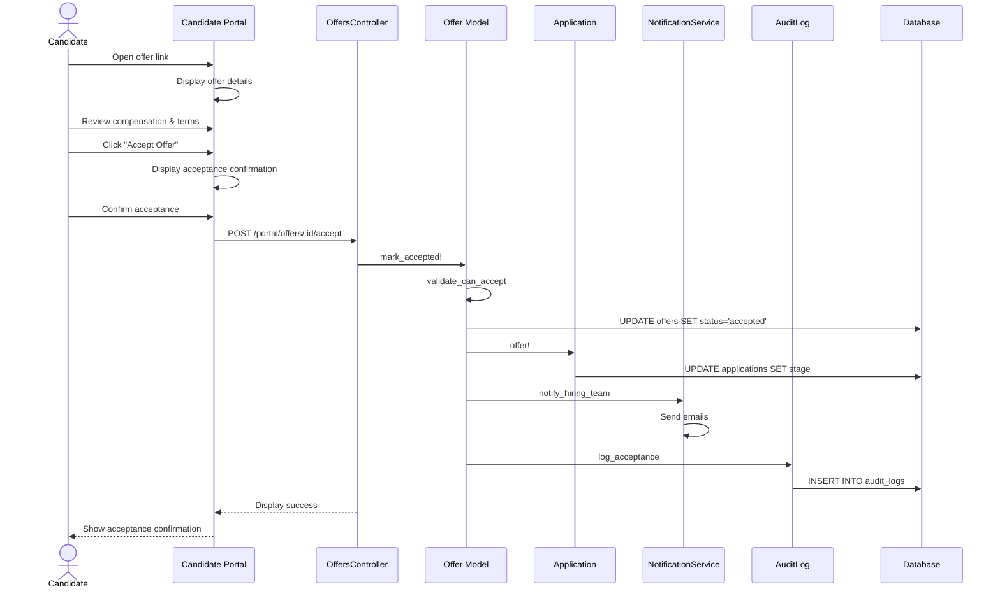

# UC-255: Candidate Accept Offer

## Metadata

| Attribute | Value |
|-----------|-------|
| **ID** | UC-255 |
| **Name** | Candidate Accept Offer |
| **Functional Area** | Offer Management |
| **Primary Actor** | Candidate (ACT-07) |
| **Priority** | P1 |
| **Complexity** | Low |
| **Status** | Draft |

## Description

A candidate reviews a job offer sent to them and formally accepts the offer terms. Upon acceptance, the offer status changes to 'accepted', the application moves to the 'offered' stage, and the hiring team is notified. If e-signature is enabled, the candidate signs the offer letter electronically.

## Actors

| Actor | Role in Use Case |
|-------|------------------|
| Candidate (ACT-07) | Reviews and accepts the offer |
| Recruiter (ACT-02) | Receives notification of acceptance |
| Hiring Manager (ACT-03) | Receives notification of acceptance |

## Preconditions

- [ ] Offer exists with status = 'sent'
- [ ] Offer has not expired (expires_at > current time)
- [ ] Candidate has access to offer via email link or portal

## Postconditions

### Success
- [ ] Offer status changed to 'accepted'
- [ ] response set to 'accepted'
- [ ] responded_at timestamp recorded
- [ ] Application status updated (offered stage)
- [ ] E-signature completed (if required)
- [ ] Recruiter and Hiring Manager notified
- [ ] Audit log entry created

### Failure
- [ ] Offer status remains 'sent'
- [ ] Candidate shown error message

## Triggers

- Candidate clicks "Accept Offer" from offer email link
- Candidate clicks "Accept Offer" in candidate portal
- Candidate completes e-signature on offer document

## Basic Flow



| Step | Actor | Action | System Response |
|------|-------|--------|-----------------|
| 1 | Candidate | Receives offer email | Email with offer link delivered |
| 2 | Candidate | Clicks link to view offer | Offer detail page displayed |
| 3 | Candidate | Reviews position title | Title confirmed |
| 4 | Candidate | Reviews compensation package | Salary, bonus, equity shown |
| 5 | Candidate | Reviews start date | Proposed start date shown |
| 6 | Candidate | Reviews employment terms | Terms and conditions displayed |
| 7 | Candidate | Clicks "Accept Offer" | Acceptance confirmation dialog |
| 8 | Candidate | Reads acceptance acknowledgment | Terms acknowledgment displayed |
| 9 | Candidate | Confirms acceptance | System validates offer status |
| 10 | System | Validates offer is sent and not expired | Validation passes |
| 11 | System | Updates offer status to 'accepted' | Status changed |
| 12 | System | Records response and timestamp | Response captured |
| 13 | System | Updates application stage | Application moved to offered |
| 14 | System | Notifies recruiter and hiring manager | Emails sent |
| 15 | System | Creates audit log entry | Audit record saved |
| 16 | System | Displays acceptance confirmation | Success message with next steps |

## Alternative Flows

### AF-1: Accept with E-Signature

**Trigger:** Organization requires electronic signature

| Step | Actor | Action | System Response |
|------|-------|--------|-----------------|
| 7a | System | Displays e-signature interface | Signing UI shown |
| 8a | Candidate | Reviews offer document | Full document displayed |
| 9a | Candidate | Draws or types signature | Signature captured |
| 10a | Candidate | Clicks "Sign and Accept" | Signature validated |
| 11a | System | Records signature | Signature stored securely |

**Resumption:** Continues at step 11 of basic flow

### AF-2: Accept from Candidate Portal

**Trigger:** Candidate has registered account

| Step | Actor | Action | System Response |
|------|-------|--------|-----------------|
| 1a | Candidate | Logs into candidate portal | Dashboard displayed |
| 2a | Candidate | Views pending offers | Offer listed |
| 3a | Candidate | Selects offer to review | Offer detail shown |

**Resumption:** Continues at step 3 of basic flow

### AF-3: Accept via Mobile

**Trigger:** Candidate accesses offer on mobile device

| Step | Actor | Action | System Response |
|------|-------|--------|-----------------|
| 2a | System | Detects mobile device | Mobile-optimized view |
| 3a | Candidate | Swipes through offer sections | Progressive disclosure |
| 8a | Candidate | Taps to sign (touch signature) | Touch signature captured |

**Resumption:** Continues at step 11 of basic flow

## Exception Flows

### EF-1: Offer Expired

**Trigger:** Current time is past expires_at

| Step | Actor | Action | System Response |
|------|-------|--------|-----------------|
| 10.1 | System | Detects expired offer | Error displayed |
| 10.2 | System | Shows expiration message | Contact info provided |
| 10.3 | System | Notifies recruiter | Alert sent |
| 10.4 | Candidate | Contacts recruiter | Manual intervention required |

**Resolution:** Recruiter may create new offer

### EF-2: Offer Already Responded

**Trigger:** Offer status is not 'sent'

| Step | Actor | Action | System Response |
|------|-------|--------|-----------------|
| 10.1 | System | Detects non-sent status | Message displayed |
| 10.2 | System | Shows current offer status | Status explanation |

**Resolution:** No action needed

### EF-3: E-Signature Failure

**Trigger:** E-signature service unavailable or fails

| Step | Actor | Action | System Response |
|------|-------|--------|-----------------|
| 11.1 | System | E-signature fails | Error displayed |
| 11.2 | System | Offers alternative acceptance | Checkbox acceptance available |
| 11.3 | Candidate | Accepts via checkbox | Alternative acceptance recorded |

**Resolution:** Continue with alternative acceptance

## Business Rules

| ID | Rule | Description |
|----|------|-------------|
| BR-255.1 | Sent Status Required | Only sent offers can be accepted |
| BR-255.2 | Not Expired | Offer must not be past expiration date |
| BR-255.3 | Single Response | Offer can only be accepted once |
| BR-255.4 | E-Sign If Required | If org requires e-signature, must be completed |
| BR-255.5 | Application Update | Application automatically moves to offered stage |
| BR-255.6 | Team Notification | Hiring team must be notified of acceptance |

## Data Requirements

### Input Data

| Field | Type | Required | Validation |
|-------|------|----------|------------|
| offer_id | integer | Yes | Must exist with status='sent' |
| acceptance_confirmed | boolean | Yes | Must be true |
| signature_data | binary | Conditional | Required if e-signature enabled |
| signature_ip_address | string | Yes | Captured automatically |

### Output Data

| Field | Type | Description |
|-------|------|-------------|
| offer.status | enum | 'accepted' |
| offer.response | string | 'accepted' |
| offer.responded_at | datetime | Timestamp of acceptance |
| application.stage | enum | 'offered' |

## Database Transactions

### Tables Affected

| Table | Operation | Conditions |
|-------|-----------|------------|
| offers | UPDATE | Set status to 'accepted', record response |
| applications | UPDATE | Move to offered stage |
| offer_documents | UPDATE | If e-signature, mark signed |
| audit_logs | CREATE | Always |

### Transaction Detail

```sql
-- Accept Offer Transaction
BEGIN TRANSACTION;

-- Step 1: Update offer status
UPDATE offers
SET status = 'accepted',
    response = 'accepted',
    responded_at = NOW(),
    updated_at = NOW()
WHERE id = @offer_id
  AND status = 'sent'
  AND (expires_at IS NULL OR expires_at > NOW());

-- Verify update succeeded
IF ROW_COUNT() = 0 THEN
    ROLLBACK;
    SIGNAL SQLSTATE '45000' SET MESSAGE_TEXT = 'Offer cannot be accepted';
END IF;

-- Step 2: Update application stage
UPDATE applications
SET status = 'offered',
    updated_at = NOW()
WHERE id = @application_id
  AND status != 'offered';

-- Step 3: Record e-signature (if applicable)
IF @signature_data IS NOT NULL THEN
    UPDATE offer_documents
    SET status = 'signed',
        signed_at = NOW(),
        signature_ip_address = @ip_address,
        updated_at = NOW()
    WHERE offer_id = @offer_id
      AND document_type = 'offer_letter';
END IF;

-- Step 4: Create audit log entry
INSERT INTO audit_logs (
    organization_id,
    user_id,
    action,
    auditable_type,
    auditable_id,
    metadata,
    ip_address,
    user_agent,
    created_at
) VALUES (
    @organization_id,
    NULL, -- Candidate action, no user_id
    'offer.accepted',
    'Offer',
    @offer_id,
    JSON_OBJECT(
        'candidate_id', @candidate_id,
        'esigned', @signature_data IS NOT NULL,
        'accepted_from', @source
    ),
    @ip_address,
    @user_agent,
    NOW()
);

COMMIT;
```

### Rollback Scenarios

| Scenario | Rollback Action |
|----------|-----------------|
| Offer not sent status | Full rollback, return error |
| Offer expired | Full rollback, show expiration message |
| E-signature failure | Offer fallback acceptance if permitted |
| Notification failure | Log error, do not rollback |

## UI/UX Requirements

### Screen/Component

- **Location:** /portal/offers/:token or /portal/offers/:id
- **Entry Point:**
  - Email link with secure token
  - Candidate portal offers section
- **Key Elements:**
  - Offer summary with all terms
  - E-signature interface (if enabled)
  - Accept/Decline buttons
  - Terms acknowledgment checkbox

### Form Layout

```
+----------------------------------------------------------+
|                    [Company Logo]                         |
|                                                          |
|                  Job Offer                                |
+----------------------------------------------------------+
| Dear [Candidate Name],                                    |
|                                                          |
| We are pleased to offer you the position of:             |
|                                                          |
| +------------------------------------------------------+ |
| | POSITION                                             | |
| | [Job Title]                                          | |
| | [Department] | [Location]                            | |
| +------------------------------------------------------+ |
|                                                          |
| +------------------------------------------------------+ |
| | COMPENSATION                                         | |
| | Base Salary: $150,000 / year                        | |
| | Signing Bonus: $25,000                              | |
| | Annual Bonus: 15% target                            | |
| | Equity: 10,000 stock options                        | |
| |         4-year vesting, 1-year cliff                | |
| +------------------------------------------------------+ |
|                                                          |
| +------------------------------------------------------+ |
| | EMPLOYMENT DETAILS                                   | |
| | Type: Full-time                                      | |
| | Start Date: March 15, 2026                          | |
| | Reports To: [Manager Name]                          | |
| +------------------------------------------------------+ |
|                                                          |
| [View Full Offer Letter PDF]                             |
|                                                          |
| +------------------------------------------------------+ |
| | RESPOND BY: February 1, 2026                        | |
| +------------------------------------------------------+ |
|                                                          |
| [ ] I have read and agree to the terms of this offer    |
|                                                          |
+----------------------------------------------------------+
| [Decline Offer]                          [Accept Offer]   |
+----------------------------------------------------------+
```

### Acceptance Confirmation

```
+----------------------------------------------------------+
|              Congratulations!                             |
|                                                          |
|      You have accepted the offer for                     |
|           [Job Title]                                    |
|                                                          |
| What happens next:                                       |
| - Your recruiter will reach out within 24 hours         |
| - You'll receive onboarding information before          |
|   your start date of March 15, 2026                     |
| - Download your signed offer letter below               |
|                                                          |
| [Download Signed Offer Letter]                           |
|                                                          |
| Questions? Contact [Recruiter Name]                      |
| [recruiter@company.com]                                  |
+----------------------------------------------------------+
```

## Non-Functional Requirements

| Requirement | Target |
|-------------|--------|
| Response Time | Accept action < 2s |
| Page Load | < 3s on mobile |
| E-Signature | < 5s to process |
| Availability | 99.9% |

## Security Considerations

- [x] Token-based access: Secure link prevents unauthorized access
- [x] IP logging: Acceptance IP address recorded
- [x] E-signature audit: Full audit trail for legal compliance
- [x] Expiration enforcement: Cannot accept expired offers
- [x] Single-use acceptance: Prevents double acceptance

## Related Use Cases

| Use Case | Relationship |
|----------|--------------|
| UC-254 Send Offer to Candidate | Precedes this use case |
| UC-256 Candidate Decline Offer | Alternative to this use case |
| UC-259 Mark as Hired | Typically follows acceptance |
| UC-261 E-Sign Offer Letter | Invoked during acceptance |

---

## Data Model References

> Cross-references to [DATA_MODEL.md](../DATA_MODEL.md) and [CRUD_MATRIX.md](../CRUD_MATRIX.md)

### Subject Areas

| Subject Area | ID | Relationship |
|--------------|-----|--------------|
| Offer Management | SA-08 | Primary |
| Application Pipeline | SA-05 | Secondary |
| Compliance & Audit | SA-09 | Reference |

### Entities CRUD

| Entity | C | R | U | D | Notes |
|--------|---|---|---|---|-------|
| Offer | | ✓ | ✓ | | Status updated to accepted |
| Application | | ✓ | ✓ | | Stage updated to offered |
| OfferDocument | | ✓ | ✓ | | Marked as signed if e-signature |
| AuditLog | ✓ | | | | Created for acceptance |

**Legend:** C = Create, R = Read, U = Update, D = Delete

---

## Process Model References

> Cross-references to [PROCESS_MODEL.md](../PROCESS_MODEL.md) and [PROCESS_CRUD_MATRIX.md](../PROCESS_CRUD_MATRIX.md)

| Attribute | Value | Link |
|-----------|-------|------|
| **Elementary Business Process** | EP-0822: Accept Offer | [PROCESS_MODEL.md#ep-0822](../PROCESS_MODEL.md#ep-0822-accept-offer) |
| **Business Process** | BP-303: Offer Delivery | [PROCESS_MODEL.md#bp-303](../PROCESS_MODEL.md#bp-303-offer-delivery) |
| **Business Function** | BF-03: Offer & Onboarding | [PROCESS_MODEL.md#bf-03](../PROCESS_MODEL.md#bf-03-offer--onboarding) |

### EBP Details

| Attribute | Value |
|-----------|-------|
| **Trigger** | Candidate clicks accept from offer email or portal |
| **Input** | Sent offer, optional e-signature |
| **Output** | Accepted offer, updated application stage |
| **Business Rules** | BR-255.1 through BR-255.6 (see Business Rules section) |

---

## Traceability Matrix

> Complete artifact mapping for requirements traceability

| Artifact Type | ID | Name | Link |
|---------------|-----|------|------|
| **Use Case** | UC-255 | Candidate Accept Offer | *(this document)* |
| **Elementary Process** | EP-0822 | Accept Offer | [PROCESS_MODEL.md](../PROCESS_MODEL.md#ep-0822-accept-offer) |
| **Business Process** | BP-303 | Offer Delivery | [PROCESS_MODEL.md](../PROCESS_MODEL.md#bp-303-offer-delivery) |
| **Business Function** | BF-03 | Offer & Onboarding | [PROCESS_MODEL.md](../PROCESS_MODEL.md#bf-03-offer--onboarding) |
| **Primary Actor** | ACT-07 | Candidate | [ACTORS.md](../ACTORS.md#act-07-candidate) |
| **Subject Area (Primary)** | SA-08 | Offer Management | [DATA_MODEL.md](../DATA_MODEL.md#sa-08-offer-management) |
| **Subject Area (Secondary)** | SA-05 | Application Pipeline | [DATA_MODEL.md](../DATA_MODEL.md#sa-05-application-pipeline) |
| **CRUD Matrix Row** | UC-255 | - | [CRUD_MATRIX.md](../CRUD_MATRIX.md#uc-255) |
| **Process CRUD Row** | EP-0822 | - | [PROCESS_CRUD_MATRIX.md](../PROCESS_CRUD_MATRIX.md#ep-0822) |

### Implementation Artifacts

| Artifact Type | Path/Reference | Status |
|---------------|----------------|--------|
| Controller | `app/controllers/portal/offers_controller.rb` | Planned |
| Model | `app/models/offer.rb` | Implemented |
| View | `app/views/portal/offers/show.html.erb` | Planned |
| Test | `test/models/offer_test.rb` | Implemented |

---

## Open Questions

1. Should we require additional identity verification before acceptance?
2. What is the grace period for expired offers?
3. Should candidates be able to add acceptance conditions/notes?

## Change History

| Version | Date | Author | Changes |
|---------|------|--------|---------|
| 0.1 | 2026-01-25 | System | Initial draft |
