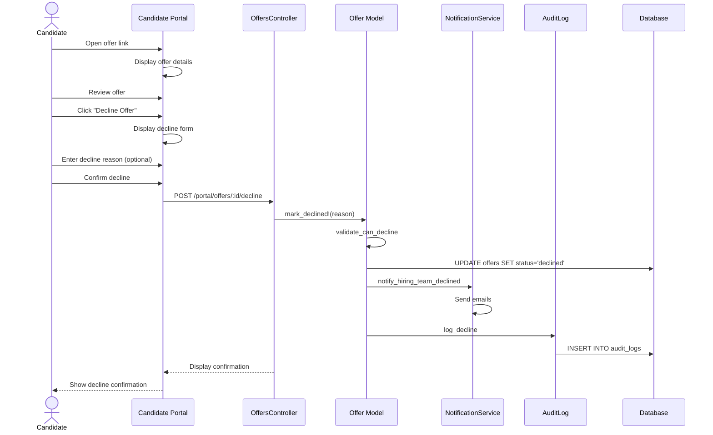

# UC-256: Candidate Decline Offer

## Metadata

| Attribute | Value |
|-----------|-------|
| **ID** | UC-256 |
| **Name** | Candidate Decline Offer |
| **Functional Area** | Offer Management |
| **Primary Actor** | Candidate (ACT-07) |
| **Priority** | P1 |
| **Complexity** | Low |
| **Status** | Draft |

## Description

A candidate reviews a job offer sent to them and decides to decline it. The candidate may optionally provide a reason for declining. Upon decline, the offer status changes to 'declined', and the hiring team is notified so they can consider alternative candidates or adjust their offer strategy.

## Actors

| Actor | Role in Use Case |
|-------|------------------|
| Candidate (ACT-07) | Declines the offer with optional reason |
| Recruiter (ACT-02) | Receives notification of decline |
| Hiring Manager (ACT-03) | Receives notification of decline |

## Preconditions

- [ ] Offer exists with status = 'sent'
- [ ] Offer has not expired (expires_at > current time or no expiration)
- [ ] Candidate has access to offer via email link or portal

## Postconditions

### Success
- [ ] Offer status changed to 'declined'
- [ ] response set to 'declined'
- [ ] decline_reason captured (if provided)
- [ ] responded_at timestamp recorded
- [ ] Recruiter and Hiring Manager notified
- [ ] Audit log entry created

### Failure
- [ ] Offer status remains 'sent'
- [ ] Candidate shown error message

## Triggers

- Candidate clicks "Decline Offer" from offer email link
- Candidate clicks "Decline Offer" in candidate portal
- Candidate responds to offer email with decline intent

## Basic Flow



| Step | Actor | Action | System Response |
|------|-------|--------|-----------------|
| 1 | Candidate | Receives offer email | Email with offer link delivered |
| 2 | Candidate | Clicks link to view offer | Offer detail page displayed |
| 3 | Candidate | Reviews offer details | Offer summary shown |
| 4 | Candidate | Decides to decline | Makes decision |
| 5 | Candidate | Clicks "Decline Offer" | Decline confirmation dialog displayed |
| 6 | Candidate | Selects decline reason category (optional) | Category captured |
| 7 | Candidate | Enters additional comments (optional) | Comments captured |
| 8 | Candidate | Confirms decline | System validates offer status |
| 9 | System | Validates offer is sent | Validation passes |
| 10 | System | Updates offer status to 'declined' | Status changed |
| 11 | System | Records response and reason | Response captured |
| 12 | System | Records responded_at timestamp | Timestamp captured |
| 13 | System | Notifies recruiter and hiring manager | Emails sent |
| 14 | System | Creates audit log entry | Audit record saved |
| 15 | System | Displays decline confirmation | Thank you message shown |

## Alternative Flows

### AF-1: Decline with Detailed Feedback

**Trigger:** Candidate wants to provide detailed reason

| Step | Actor | Action | System Response |
|------|-------|--------|-----------------|
| 6a | Candidate | Selects "Other" reason category | Text area expanded |
| 7a | Candidate | Provides detailed explanation | Feedback captured |
| 7b | Candidate | Indicates if open to future opportunities | Preference noted |

**Resumption:** Continues at step 8 of basic flow

### AF-2: Decline Before Reviewing Full Offer

**Trigger:** Candidate declines immediately without detailed review

| Step | Actor | Action | System Response |
|------|-------|--------|-----------------|
| 3a | Candidate | Clicks "Decline" without full review | Confirmation prompted |
| 4a | System | Asks to confirm decision | "Are you sure?" dialog |
| 5a | Candidate | Confirms immediate decline | Proceeds to step 6 |

**Resumption:** Continues at step 6 of basic flow

### AF-3: Request to Negotiate Instead

**Trigger:** Candidate wants to negotiate rather than decline

| Step | Actor | Action | System Response |
|------|-------|--------|-----------------|
| 5a | Candidate | Clicks "Negotiate" instead of "Decline" | Negotiation form shown |
| 6a | System | Redirects to negotiation flow | Triggers UC-257 |

**Resumption:** Use case ends (transitions to UC-257)

## Exception Flows

### EF-1: Offer Expired

**Trigger:** Current time is past expires_at

| Step | Actor | Action | System Response |
|------|-------|--------|-----------------|
| 9.1 | System | Detects expired offer | Message displayed |
| 9.2 | System | Shows offer expired status | Already expired |
| 9.3 | System | Marks as expired instead | Status = 'expired' |

**Resolution:** Offer marked as expired, team notified

### EF-2: Offer Already Responded

**Trigger:** Offer status is not 'sent'

| Step | Actor | Action | System Response |
|------|-------|--------|-----------------|
| 9.1 | System | Detects non-sent status | Message displayed |
| 9.2 | System | Shows current offer status | Status explanation |

**Resolution:** No action needed

## Business Rules

| ID | Rule | Description |
|----|------|-------------|
| BR-256.1 | Sent Status Required | Only sent offers can be declined |
| BR-256.2 | Reason Optional | Decline reason is optional but encouraged |
| BR-256.3 | Single Response | Offer can only be declined once |
| BR-256.4 | Team Notification | Hiring team must be notified of decline |
| BR-256.5 | Reason Categories | Standard decline reason categories available |
| BR-256.6 | Talent Pool Option | Candidate can opt into future opportunities |

## Data Requirements

### Input Data

| Field | Type | Required | Validation |
|-------|------|----------|------------|
| offer_id | integer | Yes | Must exist with status='sent' |
| decline_reason_category | enum | No | From predefined list |
| decline_reason | text | No | Max 2000 chars |
| open_to_future | boolean | No | Default false |
| decline_ip_address | string | Yes | Captured automatically |

### Output Data

| Field | Type | Description |
|-------|------|-------------|
| offer.status | enum | 'declined' |
| offer.response | string | 'declined' |
| offer.decline_reason | text | Reason for declining |
| offer.responded_at | datetime | Timestamp of decline |

## Database Transactions

### Tables Affected

| Table | Operation | Conditions |
|-------|-----------|------------|
| offers | UPDATE | Set status to 'declined', record response |
| audit_logs | CREATE | Always |
| talent_pool_candidates | CREATE | If open_to_future = true |

### Transaction Detail

```sql
-- Decline Offer Transaction
BEGIN TRANSACTION;

-- Step 1: Update offer status
UPDATE offers
SET status = 'declined',
    response = 'declined',
    decline_reason = CONCAT(
        COALESCE(@decline_reason_category, ''),
        CASE WHEN @decline_reason IS NOT NULL
             THEN CONCAT(': ', @decline_reason)
             ELSE '' END
    ),
    responded_at = NOW(),
    updated_at = NOW()
WHERE id = @offer_id
  AND status = 'sent';

-- Verify update succeeded
IF ROW_COUNT() = 0 THEN
    ROLLBACK;
    SIGNAL SQLSTATE '45000' SET MESSAGE_TEXT = 'Offer cannot be declined';
END IF;

-- Step 2: Add to talent pool if candidate opts in
IF @open_to_future = TRUE THEN
    INSERT INTO talent_pool_candidates (
        talent_pool_id,
        candidate_id,
        source,
        created_at,
        updated_at
    )
    SELECT
        tp.id,
        @candidate_id,
        'declined_offer',
        NOW(),
        NOW()
    FROM talent_pools tp
    WHERE tp.organization_id = @organization_id
      AND tp.name = 'Declined - Future Opportunities'
    ON DUPLICATE KEY UPDATE updated_at = NOW();
END IF;

-- Step 3: Create audit log entry
INSERT INTO audit_logs (
    organization_id,
    user_id,
    action,
    auditable_type,
    auditable_id,
    metadata,
    ip_address,
    user_agent,
    created_at
) VALUES (
    @organization_id,
    NULL, -- Candidate action, no user_id
    'offer.declined',
    'Offer',
    @offer_id,
    JSON_OBJECT(
        'candidate_id', @candidate_id,
        'decline_reason_category', @decline_reason_category,
        'open_to_future', @open_to_future
    ),
    @ip_address,
    @user_agent,
    NOW()
);

COMMIT;
```

### Rollback Scenarios

| Scenario | Rollback Action |
|----------|-----------------|
| Offer not sent status | Full rollback, return error |
| Already responded | No transaction, show current status |
| Notification failure | Log error, do not rollback |

## UI/UX Requirements

### Screen/Component

- **Location:** /portal/offers/:token/decline
- **Entry Point:**
  - "Decline Offer" button on offer view
  - Email link with decline action
- **Key Elements:**
  - Reason category dropdown
  - Free-text reason field
  - Future opportunities checkbox
  - Confirmation button

### Form Layout

```
+----------------------------------------------------------+
| Decline Offer                                             |
+----------------------------------------------------------+
| We're sorry to hear you're not able to accept this offer.|
|                                                          |
| OFFER SUMMARY                                             |
| +------------------------------------------------------+ |
| | Position: [Job Title]                                | |
| | Company: [Company Name]                              | |
| | Salary: $150,000 / year                             | |
| +------------------------------------------------------+ |
|                                                          |
| Reason for Declining (optional)                          |
| +------------------------------------------------------+ |
| | Select a reason...                                 v | |
| +------------------------------------------------------+ |
|   o Accepted another offer                               |
|   o Compensation not competitive                         |
|   o Location/commute concerns                            |
|   o Role not a good fit                                  |
|   o Personal/family reasons                              |
|   o Staying with current employer                        |
|   o Other                                                |
|                                                          |
| Additional Comments (optional)                           |
| +------------------------------------------------------+ |
| | Help us understand your decision...                  | |
| |                                                      | |
| +------------------------------------------------------+ |
|                                                          |
| [ ] Keep me in mind for future opportunities            |
|                                                          |
| This feedback is confidential and helps us improve      |
| our offers for future candidates.                       |
|                                                          |
+----------------------------------------------------------+
| [Go Back]                          [Confirm Decline]      |
+----------------------------------------------------------+
```

### Decline Confirmation

```
+----------------------------------------------------------+
| Thank You                                                 |
|                                                          |
| We appreciate you letting us know about your decision.   |
|                                                          |
| We wish you all the best in your career!                 |
|                                                          |
| [If open_to_future checked:]                             |
| We've noted your interest in future opportunities        |
| and will reach out if a suitable role becomes available. |
|                                                          |
+----------------------------------------------------------+
```

## Non-Functional Requirements

| Requirement | Target |
|-------------|--------|
| Response Time | Decline action < 2s |
| Page Load | < 3s |
| Availability | 99.9% |

## Security Considerations

- [x] Token-based access: Secure link prevents unauthorized access
- [x] IP logging: Decline IP address recorded
- [x] Expiration enforcement: Cannot decline expired offers
- [x] Single-use response: Prevents double response
- [x] Reason confidentiality: Decline reasons not shared with third parties

## Related Use Cases

| Use Case | Relationship |
|----------|--------------|
| UC-254 Send Offer to Candidate | Precedes this use case |
| UC-255 Candidate Accept Offer | Alternative to this use case |
| UC-257 Negotiate Offer | Alternative if candidate wants changes |
| UC-250 Create Offer | May follow to create new offer for other candidate |

---

## Data Model References

> Cross-references to [DATA_MODEL.md](../DATA_MODEL.md) and [CRUD_MATRIX.md](../CRUD_MATRIX.md)

### Subject Areas

| Subject Area | ID | Relationship |
|--------------|-----|--------------|
| Offer Management | SA-08 | Primary |
| Candidate | SA-04 | Secondary |
| Compliance & Audit | SA-09 | Reference |

### Entities CRUD

| Entity | C | R | U | D | Notes |
|--------|---|---|---|---|-------|
| Offer | | ✓ | ✓ | | Status updated to declined |
| TalentPoolCandidate | ✓ | | | | Created if open to future |
| AuditLog | ✓ | | | | Created for decline |

**Legend:** C = Create, R = Read, U = Update, D = Delete

---

## Process Model References

> Cross-references to [PROCESS_MODEL.md](../PROCESS_MODEL.md) and [PROCESS_CRUD_MATRIX.md](../PROCESS_CRUD_MATRIX.md)

| Attribute | Value | Link |
|-----------|-------|------|
| **Elementary Business Process** | EP-0823: Decline Offer | [PROCESS_MODEL.md#ep-0823](../PROCESS_MODEL.md#ep-0823-decline-offer) |
| **Business Process** | BP-303: Offer Delivery | [PROCESS_MODEL.md#bp-303](../PROCESS_MODEL.md#bp-303-offer-delivery) |
| **Business Function** | BF-03: Offer & Onboarding | [PROCESS_MODEL.md#bf-03](../PROCESS_MODEL.md#bf-03-offer--onboarding) |

### EBP Details

| Attribute | Value |
|-----------|-------|
| **Trigger** | Candidate clicks decline from offer email or portal |
| **Input** | Sent offer, optional decline reason |
| **Output** | Declined offer with optional reason captured |
| **Business Rules** | BR-256.1 through BR-256.6 (see Business Rules section) |

---

## Traceability Matrix

> Complete artifact mapping for requirements traceability

| Artifact Type | ID | Name | Link |
|---------------|-----|------|------|
| **Use Case** | UC-256 | Candidate Decline Offer | *(this document)* |
| **Elementary Process** | EP-0823 | Decline Offer | [PROCESS_MODEL.md](../PROCESS_MODEL.md#ep-0823-decline-offer) |
| **Business Process** | BP-303 | Offer Delivery | [PROCESS_MODEL.md](../PROCESS_MODEL.md#bp-303-offer-delivery) |
| **Business Function** | BF-03 | Offer & Onboarding | [PROCESS_MODEL.md](../PROCESS_MODEL.md#bf-03-offer--onboarding) |
| **Primary Actor** | ACT-07 | Candidate | [ACTORS.md](../ACTORS.md#act-07-candidate) |
| **Subject Area (Primary)** | SA-08 | Offer Management | [DATA_MODEL.md](../DATA_MODEL.md#sa-08-offer-management) |
| **CRUD Matrix Row** | UC-256 | - | [CRUD_MATRIX.md](../CRUD_MATRIX.md#uc-256) |
| **Process CRUD Row** | EP-0823 | - | [PROCESS_CRUD_MATRIX.md](../PROCESS_CRUD_MATRIX.md#ep-0823) |

### Implementation Artifacts

| Artifact Type | Path/Reference | Status |
|---------------|----------------|--------|
| Controller | `app/controllers/portal/offers_controller.rb` | Planned |
| Model | `app/models/offer.rb` | Implemented |
| View | `app/views/portal/offers/decline.html.erb` | Planned |
| Test | `test/models/offer_test.rb` | Implemented |

---

## Open Questions

1. Should decline reasons be visible to future recruiters for this candidate?
2. How long should we retain decline reason data?
3. Should we integrate with analytics to track decline reason trends?

## Change History

| Version | Date | Author | Changes |
|---------|------|--------|---------|
| 0.1 | 2026-01-25 | System | Initial draft |
