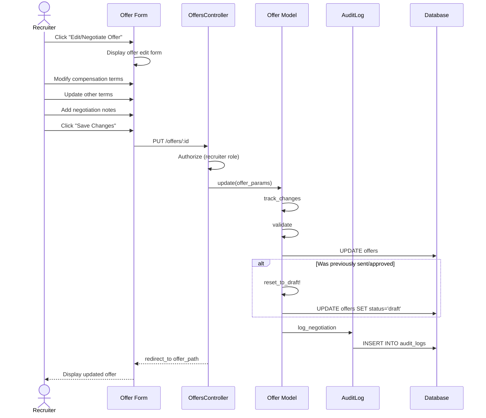

# UC-257: Negotiate Offer

## Metadata

| Attribute | Value |
|-----------|-------|
| **ID** | UC-257 |
| **Name** | Negotiate Offer |
| **Functional Area** | Offer Management |
| **Primary Actor** | Recruiter (ACT-02) |
| **Priority** | P2 |
| **Complexity** | Medium |
| **Status** | Draft |

## Description

A recruiter revises an offer based on candidate negotiation requests or internal feedback. This can occur when a candidate requests changes to compensation, start date, or other terms, or when an approver rejects an offer with suggested modifications. The revised offer goes through the approval workflow again before being sent to the candidate.

## Actors

| Actor | Role in Use Case |
|-------|------------------|
| Recruiter (ACT-02) | Revises offer terms based on negotiation |
| Candidate (ACT-07) | Initiates negotiation request |
| Hiring Manager (ACT-03) | Approves revised terms |

## Preconditions

- [ ] User is authenticated and has Recruiter or Admin role
- [ ] Offer exists (in draft, sent, or negotiating status)
- [ ] User has permission to modify the offer

## Postconditions

### Success
- [ ] Offer terms updated with new values
- [ ] Offer status set to 'draft' (requiring re-approval)
- [ ] Previous terms preserved in history
- [ ] Audit log entry created for changes
- [ ] Negotiation notes captured

### Failure
- [ ] Offer unchanged
- [ ] User shown validation errors

## Triggers

- Candidate requests changes to sent offer (via portal or email)
- Recruiter initiates revision of draft offer
- Offer rejected by approver with suggested changes
- Recruiter receives verbal negotiation from candidate

## Basic Flow



| Step | Actor | Action | System Response |
|------|-------|--------|-----------------|
| 1 | Recruiter | Receives negotiation request | Request from candidate or approver |
| 2 | Recruiter | Navigates to offer | Offer detail displayed |
| 3 | Recruiter | Clicks "Edit" or "Negotiate" | Edit form displayed |
| 4 | Recruiter | Reviews current terms | Current values shown |
| 5 | Recruiter | Modifies salary amount | New salary captured |
| 6 | Recruiter | Adjusts signing bonus | New bonus captured |
| 7 | Recruiter | Updates equity offer | New equity terms captured |
| 8 | Recruiter | Modifies start date | New date captured |
| 9 | Recruiter | Adds negotiation notes | Context documented |
| 10 | Recruiter | Clicks "Save Changes" | System validates changes |
| 11 | System | Tracks changes from previous values | Delta calculated |
| 12 | System | Validates updated terms | Validation passes |
| 13 | System | Resets status to draft (if needed) | Status changed |
| 14 | System | Saves updated offer | Changes persisted |
| 15 | System | Creates audit log with changes | Audit record saved |
| 16 | System | Displays updated offer | Success confirmation shown |

## Alternative Flows

### AF-1: Candidate-Initiated Negotiation

**Trigger:** Candidate submits negotiation request via portal

| Step | Actor | Action | System Response |
|------|-------|--------|-----------------|
| 1a | Candidate | Clicks "Request Changes" on sent offer | Negotiation form displayed |
| 2a | Candidate | Specifies desired changes | Request captured |
| 3a | Candidate | Submits negotiation request | Request sent to recruiter |
| 4a | System | Notifies recruiter | Email notification |
| 5a | System | Marks offer as 'negotiating' | Status updated |

**Resumption:** Recruiter receives notification, continues at step 2 of basic flow

### AF-2: Counter-Offer

**Trigger:** Recruiter sends modified terms back to candidate

| Step | Actor | Action | System Response |
|------|-------|--------|-----------------|
| 16a | Recruiter | Clicks "Submit for Approval" | Approval flow triggered |
| 17a | System | Routes through approval chain | UC-251 invoked |
| 18a | System | After approval, sends revised offer | UC-254 invoked |

**Resumption:** Use case ends (flows to approval and send)

### AF-3: Revision After Rejection

**Trigger:** Offer was rejected by approver with feedback

| Step | Actor | Action | System Response |
|------|-------|--------|-----------------|
| 1a | Recruiter | Views rejected offer | Rejection feedback shown |
| 2a | System | Pre-highlights suggested changes | Fields marked |
| 3a | Recruiter | Applies suggested modifications | Terms updated |

**Resumption:** Continues at step 10 of basic flow

## Exception Flows

### EF-1: Exceeds Compensation Band

**Trigger:** Requested changes exceed approved compensation band

| Step | Actor | Action | System Response |
|------|-------|--------|-----------------|
| 11.1 | System | Detects exceeds band | Warning displayed |
| 11.2 | System | Shows band limits | Limits displayed |
| 11.3 | Recruiter | Adjusts to within band | Terms modified |
| 11.4 | Recruiter | OR requests exception approval | Exception flow |

**Resolution:** Adjust values or request exception

### EF-2: Negotiation Limit Reached

**Trigger:** Maximum negotiation rounds exceeded

| Step | Actor | Action | System Response |
|------|-------|--------|-----------------|
| 11.1 | System | Detects max rounds reached | Warning displayed |
| 11.2 | System | Requires manager override | Approval required |
| 11.3 | Recruiter | Gets manager approval | Override granted |

**Resolution:** Manager override or final offer

### EF-3: Candidate Withdrew During Negotiation

**Trigger:** Candidate withdraws while negotiation in progress

| Step | Actor | Action | System Response |
|------|-------|--------|-----------------|
| E.1 | System | Detects withdrawal | Alert shown |
| E.2 | System | Cancels negotiation | Status updated |
| E.3 | System | Notifies recruiter | Email sent |

**Resolution:** Negotiation cancelled

## Business Rules

| ID | Rule | Description |
|----|------|-------------|
| BR-257.1 | Editable Statuses | Only draft, rejected, or negotiating offers can be edited |
| BR-257.2 | Re-Approval Required | Changes to sent/approved offers require re-approval |
| BR-257.3 | Change Tracking | All changes must be tracked with previous values |
| BR-257.4 | Compensation Bands | Warning if changes exceed job's compensation band |
| BR-257.5 | Negotiation History | Full negotiation history preserved |
| BR-257.6 | Max Rounds | Organization may set maximum negotiation rounds |

## Data Requirements

### Input Data

| Field | Type | Required | Validation |
|-------|------|----------|------------|
| offer_id | integer | Yes | Must exist and be editable |
| salary | decimal | No | Must be > 0 if provided |
| signing_bonus | decimal | No | Must be >= 0 |
| annual_bonus_target | decimal | No | 0-100 |
| equity_shares | integer | No | Must be > 0 if equity_type != none |
| proposed_start_date | date | No | Must be in future |
| negotiation_notes | text | No | Max 2000 chars |
| candidate_request | text | No | What candidate requested |

### Output Data

| Field | Type | Description |
|-------|------|-------------|
| offer (updated) | object | Updated offer record |
| changes | object | Delta of changed fields |
| previous_values | object | Snapshot of previous values |

## Database Transactions

### Tables Affected

| Table | Operation | Conditions |
|-------|-----------|------------|
| offers | UPDATE | Updated terms, potentially status |
| offer_negotiations | CREATE | Track negotiation round |
| audit_logs | CREATE | Always |

### Transaction Detail

```sql
-- Negotiate Offer Transaction
BEGIN TRANSACTION;

-- Step 1: Capture previous values
INSERT INTO offer_negotiations (
    offer_id,
    round_number,
    initiated_by,
    previous_salary,
    previous_bonus,
    previous_equity,
    requested_salary,
    requested_bonus,
    requested_equity,
    candidate_request,
    recruiter_notes,
    created_at
) VALUES (
    @offer_id,
    (SELECT COALESCE(MAX(round_number), 0) + 1 FROM offer_negotiations WHERE offer_id = @offer_id),
    @initiated_by,
    (SELECT salary FROM offers WHERE id = @offer_id),
    (SELECT signing_bonus FROM offers WHERE id = @offer_id),
    (SELECT equity_shares FROM offers WHERE id = @offer_id),
    @new_salary,
    @new_bonus,
    @new_equity,
    @candidate_request,
    @recruiter_notes,
    NOW()
);

-- Step 2: Update offer with new terms
UPDATE offers
SET salary = COALESCE(@new_salary, salary),
    signing_bonus = COALESCE(@new_bonus, signing_bonus),
    annual_bonus_target = COALESCE(@new_bonus_target, annual_bonus_target),
    equity_shares = COALESCE(@new_equity, equity_shares),
    proposed_start_date = COALESCE(@new_start_date, proposed_start_date),
    custom_terms = CONCAT(COALESCE(custom_terms, ''), @negotiation_notes),
    status = CASE
        WHEN status IN ('sent', 'approved') THEN 'draft'
        ELSE status
    END,
    updated_at = NOW()
WHERE id = @offer_id;

-- Step 3: Clear any previous approvals if returning to draft
DELETE FROM offer_approvals
WHERE offer_id = @offer_id
  AND status = 'pending';

-- Step 4: Create audit log entry
INSERT INTO audit_logs (
    organization_id,
    user_id,
    action,
    auditable_type,
    auditable_id,
    metadata,
    ip_address,
    user_agent,
    created_at
) VALUES (
    @organization_id,
    @current_user_id,
    'offer.negotiated',
    'Offer',
    @offer_id,
    JSON_OBJECT(
        'changes', JSON_OBJECT(
            'salary', JSON_OBJECT('from', @old_salary, 'to', @new_salary),
            'bonus', JSON_OBJECT('from', @old_bonus, 'to', @new_bonus),
            'equity', JSON_OBJECT('from', @old_equity, 'to', @new_equity)
        ),
        'initiated_by', @initiated_by,
        'candidate_request', @candidate_request
    ),
    @ip_address,
    @user_agent,
    NOW()
);

COMMIT;
```

### Rollback Scenarios

| Scenario | Rollback Action |
|----------|-----------------|
| Validation failure | Full rollback, return errors |
| Compensation band violation | Warning only (soft limit) |
| Concurrent edit | Rollback, show conflict |

## UI/UX Requirements

### Screen/Component

- **Location:** /admin/offers/:id/edit
- **Entry Point:**
  - "Edit" button on draft offer
  - "Negotiate" button on sent offer
  - "Revise" from rejection notification
- **Key Elements:**
  - Side-by-side comparison of old vs new values
  - Change indicator badges
  - Negotiation history timeline
  - Notes section for context

### Form Layout

```
+----------------------------------------------------------+
| Negotiate Offer                                           |
+----------------------------------------------------------+
| Candidate: [Candidate Name] | Position: [Job Title]       |
+----------------------------------------------------------+
|                                                          |
| CANDIDATE'S REQUEST (if applicable)                       |
| +------------------------------------------------------+ |
| | "I would like to request a higher base salary of     | |
| | $165,000 and additional signing bonus to cover       | |
| | relocation costs."                                   | |
| +------------------------------------------------------+ |
|                                                          |
| COMPENSATION                                             |
| +------------------------------------------------------+ |
| |                    Current    |    New               | |
| | Base Salary:       $150,000   |  $[160,000    ]     | |
| | Signing Bonus:     $25,000    |  $[35,000     ]     | |
| | Bonus Target:      15%        |  [15         ]%     | |
| | Equity Shares:     10,000     |  [12,000     ]      | |
| +------------------------------------------------------+ |
|                                                          |
| EMPLOYMENT DETAILS                                        |
| +------------------------------------------------------+ |
| |                    Current    |    New               | |
| | Start Date:        Mar 15     |  [Mar 22, 2026]     | |
| | Employment Type:   Full-time  |  [Full-time    v]   | |
| +------------------------------------------------------+ |
|                                                          |
| NEGOTIATION NOTES                                        |
| +------------------------------------------------------+ |
| | Added $10K to base and $10K to signing bonus per     | |
| | candidate request. Within L5 band approval.          | |
| +------------------------------------------------------+ |
|                                                          |
| NEGOTIATION HISTORY                                       |
| +------------------------------------------------------+ |
| | Round 1 (Jan 22): Initial offer sent                 | |
| | Round 2 (Jan 24): Candidate requested higher salary  | |
| | Round 3 (Current): Revising terms                    | |
| +------------------------------------------------------+ |
|                                                          |
+----------------------------------------------------------+
| [Cancel]           [Save Draft]  [Save & Submit for Approval] |
+----------------------------------------------------------+
```

## Non-Functional Requirements

| Requirement | Target |
|-------------|--------|
| Response Time | Save < 2s |
| History Retention | Indefinite |
| Concurrent Edit Detection | Yes |
| Availability | 99.9% |

## Security Considerations

- [x] Authentication required
- [x] Authorization check: User must have recruiter role and access to offer
- [x] Change tracking: All modifications logged
- [x] Audit trail: Complete negotiation history preserved
- [x] Data integrity: Optimistic locking for concurrent edits

## Related Use Cases

| Use Case | Relationship |
|----------|--------------|
| UC-250 Create Offer | Original offer creation |
| UC-251 Submit Offer for Approval | Follows negotiation changes |
| UC-253 Reject Offer | May trigger negotiation |
| UC-254 Send Offer to Candidate | Follows after re-approval |
| UC-255 Candidate Accept Offer | Ends negotiation cycle |
| UC-256 Candidate Decline Offer | Ends negotiation cycle |

---

## Data Model References

> Cross-references to [DATA_MODEL.md](../DATA_MODEL.md) and [CRUD_MATRIX.md](../CRUD_MATRIX.md)

### Subject Areas

| Subject Area | ID | Relationship |
|--------------|-----|--------------|
| Offer Management | SA-08 | Primary |
| Compliance & Audit | SA-09 | Reference |

### Entities CRUD

| Entity | C | R | U | D | Notes |
|--------|---|---|---|---|-------|
| Offer | | ✓ | ✓ | | Terms updated |
| OfferNegotiation | ✓ | ✓ | | | History tracked |
| OfferApproval | | | | ✓ | Pending approvals cleared |
| AuditLog | ✓ | | | | Created for changes |

**Legend:** C = Create, R = Read, U = Update, D = Delete

---

## Process Model References

> Cross-references to [PROCESS_MODEL.md](../PROCESS_MODEL.md) and [PROCESS_CRUD_MATRIX.md](../PROCESS_CRUD_MATRIX.md)

| Attribute | Value | Link |
|-----------|-------|------|
| **Elementary Business Process** | EP-0802/EP-0824: Edit/Negotiate Offer | [PROCESS_MODEL.md#ep-0802](../PROCESS_MODEL.md#ep-0802-edit-offer) |
| **Business Process** | BP-301/BP-303: Offer Creation/Delivery | [PROCESS_MODEL.md#bp-301](../PROCESS_MODEL.md#bp-301-offer-creation) |
| **Business Function** | BF-03: Offer & Onboarding | [PROCESS_MODEL.md#bf-03](../PROCESS_MODEL.md#bf-03-offer--onboarding) |

### EBP Details

| Attribute | Value |
|-----------|-------|
| **Trigger** | Candidate request, approver feedback, or recruiter initiative |
| **Input** | Existing offer, new terms, negotiation context |
| **Output** | Updated offer in draft status with full change history |
| **Business Rules** | BR-257.1 through BR-257.6 (see Business Rules section) |

---

## Traceability Matrix

> Complete artifact mapping for requirements traceability

| Artifact Type | ID | Name | Link |
|---------------|-----|------|------|
| **Use Case** | UC-257 | Negotiate Offer | *(this document)* |
| **Elementary Process** | EP-0802/EP-0824 | Edit/Negotiate Offer | [PROCESS_MODEL.md](../PROCESS_MODEL.md#ep-0802-edit-offer) |
| **Business Process** | BP-301/BP-303 | Offer Creation/Delivery | [PROCESS_MODEL.md](../PROCESS_MODEL.md#bp-301-offer-creation) |
| **Business Function** | BF-03 | Offer & Onboarding | [PROCESS_MODEL.md](../PROCESS_MODEL.md#bf-03-offer--onboarding) |
| **Primary Actor** | ACT-02 | Recruiter | [ACTORS.md](../ACTORS.md#act-02-recruiter) |
| **Subject Area (Primary)** | SA-08 | Offer Management | [DATA_MODEL.md](../DATA_MODEL.md#sa-08-offer-management) |
| **CRUD Matrix Row** | UC-257 | - | [CRUD_MATRIX.md](../CRUD_MATRIX.md#uc-257) |
| **Process CRUD Row** | EP-0824 | - | [PROCESS_CRUD_MATRIX.md](../PROCESS_CRUD_MATRIX.md#ep-0824) |

### Implementation Artifacts

| Artifact Type | Path/Reference | Status |
|---------------|----------------|--------|
| Controller | `app/controllers/admin/offers_controller.rb` | Implemented |
| Model | `app/models/offer.rb` | Implemented |
| Service | `app/services/offers/negotiate_service.rb` | Planned |
| Policy | `app/policies/offer_policy.rb` | Implemented |
| View | `app/views/admin/offers/edit.html.erb` | Implemented |
| Test | `test/models/offer_test.rb` | Implemented |

---

## Open Questions

1. Should we support automated counter-offer suggestions based on market data?
2. What is the maximum number of negotiation rounds before escalation?
3. Should candidates be able to see previous offer versions?

## Change History

| Version | Date | Author | Changes |
|---------|------|--------|---------|
| 0.1 | 2026-01-25 | System | Initial draft |
