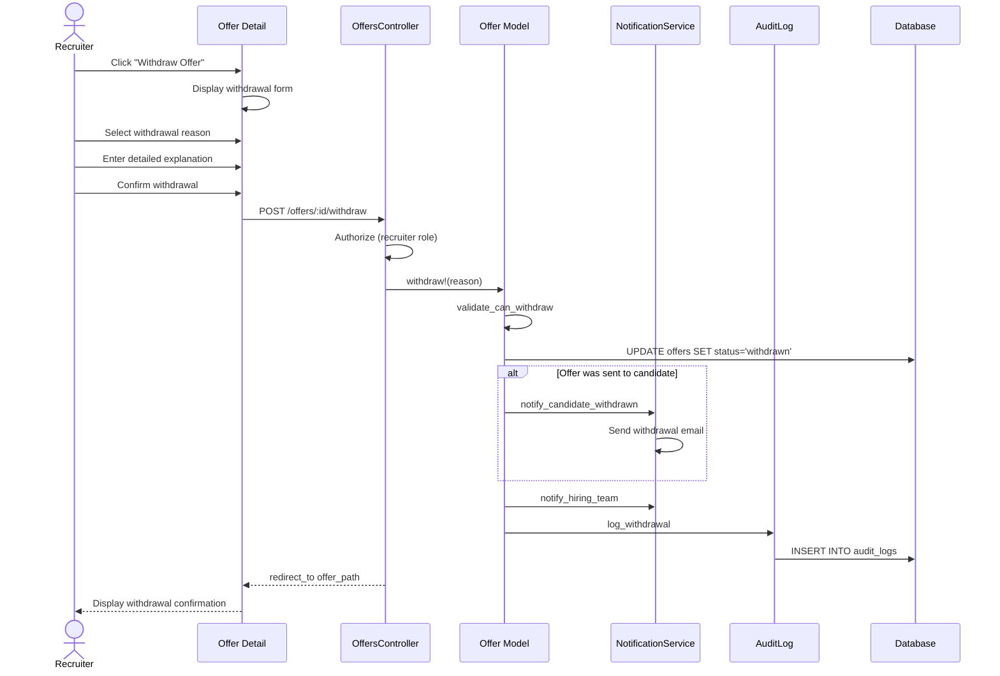

# UC-258: Withdraw Offer

## Metadata

| Attribute | Value |
|-----------|-------|
| **ID** | UC-258 |
| **Name** | Withdraw Offer |
| **Functional Area** | Offer Management |
| **Primary Actor** | Recruiter (ACT-02) |
| **Priority** | P2 |
| **Complexity** | Low |
| **Status** | Draft |

## Description

A recruiter withdraws (rescinds) an offer that has been created but not yet accepted by the candidate. This may occur due to budget changes, position elimination, candidate red flags discovered after offer sent, or business needs. The withdrawal is a significant action that requires documentation and may have legal implications.

## Actors

| Actor | Role in Use Case |
|-------|------------------|
| Recruiter (ACT-02) | Initiates offer withdrawal |
| Hiring Manager (ACT-03) | May need to approve withdrawal |
| Candidate (ACT-07) | Receives withdrawal notification |

## Preconditions

- [ ] User is authenticated and has Recruiter or Admin role
- [ ] Offer exists with status in ('draft', 'pending_approval', 'approved', 'sent')
- [ ] Offer has not been accepted or declined by candidate

## Postconditions

### Success
- [ ] Offer status changed to 'withdrawn'
- [ ] Withdrawal reason documented
- [ ] Candidate notified (if offer was sent)
- [ ] Hiring team notified
- [ ] Audit log entry created

### Failure
- [ ] Offer status unchanged
- [ ] User shown error message

## Triggers

- Recruiter clicks "Withdraw Offer" from offer detail
- Position is cancelled or put on hold
- Background check returns disqualifying results
- Budget reallocation removes position

## Basic Flow



| Step | Actor | Action | System Response |
|------|-------|--------|-----------------|
| 1 | Recruiter | Views offer requiring withdrawal | Offer detail displayed |
| 2 | Recruiter | Clicks "Withdraw Offer" | Withdrawal form displayed |
| 3 | Recruiter | Selects withdrawal reason category | Category captured |
| 4 | Recruiter | Enters detailed explanation | Explanation captured |
| 5 | Recruiter | Acknowledges legal implications | Acknowledgment recorded |
| 6 | Recruiter | Confirms withdrawal | System validates |
| 7 | System | Validates offer can be withdrawn | Validation passes |
| 8 | System | Updates offer status to 'withdrawn' | Status changed |
| 9 | System | Records withdrawal reason | Reason persisted |
| 10 | System | Sends notification to candidate (if sent) | Email delivered |
| 11 | System | Notifies hiring team | Team notified |
| 12 | System | Creates audit log entry | Audit record saved |
| 13 | System | Displays withdrawal confirmation | Success message shown |

## Alternative Flows

### AF-1: Withdrawal Before Sending

**Trigger:** Offer is still in draft or pending_approval status

| Step | Actor | Action | System Response |
|------|-------|--------|-----------------|
| 10a | System | Detects offer not yet sent | Skip candidate notification |
| 11a | System | Only notifies internal team | Internal notification only |

**Resumption:** Continues at step 12 of basic flow

### AF-2: Withdrawal Requires Approval

**Trigger:** Organization policy requires approval for withdrawals

| Step | Actor | Action | System Response |
|------|-------|--------|-----------------|
| 6a | System | Detects approval required | Approval request created |
| 7a | System | Routes to hiring manager | Notification sent |
| 8a | Hiring Manager | Reviews and approves | Approval recorded |

**Resumption:** Continues at step 8 of basic flow

### AF-3: Cancel Withdrawal

**Trigger:** Recruiter decides not to proceed

| Step | Actor | Action | System Response |
|------|-------|--------|-----------------|
| 6a | Recruiter | Clicks "Cancel" | Form closed |
| 7a | System | Discards withdrawal request | No changes made |

**Resumption:** Use case ends, offer unchanged

## Exception Flows

### EF-1: Offer Already Responded

**Trigger:** Candidate has accepted or declined the offer

| Step | Actor | Action | System Response |
|------|-------|--------|-----------------|
| 7.1 | System | Detects offer has response | Error displayed |
| 7.2 | System | Shows current offer status | Status shown |
| 7.3 | System | Explains cannot withdraw | Guidance provided |

**Resolution:** Cannot withdraw, offer already resolved

### EF-2: Missing Withdrawal Reason

**Trigger:** Recruiter tries to withdraw without reason

| Step | Actor | Action | System Response |
|------|-------|--------|-----------------|
| 6.1 | System | Detects missing reason | Error displayed |
| 6.2 | System | Highlights required field | Form validation |
| 6.3 | Recruiter | Provides reason | Reason entered |
| 6.4 | Recruiter | Retries withdrawal | Validation re-runs |

**Resolution:** Returns to step 6, continues if valid

### EF-3: Candidate Notification Failure

**Trigger:** Email delivery fails

| Step | Actor | Action | System Response |
|------|-------|--------|-----------------|
| 10.1 | System | Email delivery fails | Error logged |
| 10.2 | System | Queues for retry | Retry scheduled |
| 10.3 | System | Alerts recruiter | Warning displayed |

**Resolution:** Manual follow-up may be needed

## Business Rules

| ID | Rule | Description |
|----|------|-------------|
| BR-258.1 | Not Responded | Cannot withdraw accepted or declined offers |
| BR-258.2 | Reason Required | Withdrawal reason is mandatory |
| BR-258.3 | Candidate Notification | If offer was sent, candidate must be notified |
| BR-258.4 | Legal Acknowledgment | Withdrawing sent offers requires legal acknowledgment |
| BR-258.5 | Documentation | Full documentation required for compliance |
| BR-258.6 | Irreversible | Withdrawal cannot be undone (new offer required) |

## Data Requirements

### Input Data

| Field | Type | Required | Validation |
|-------|------|----------|------------|
| offer_id | integer | Yes | Must exist with valid status |
| withdrawal_reason_category | enum | Yes | From predefined list |
| withdrawal_reason | text | Yes | Min 20 chars, max 2000 chars |
| legal_acknowledged | boolean | Yes | Must be true if offer was sent |

### Output Data

| Field | Type | Description |
|-------|------|-------------|
| offer.status | enum | 'withdrawn' |
| offer.withdrawal_reason | text | Documented reason |
| offer.withdrawn_at | datetime | Timestamp of withdrawal |
| candidate_notified | boolean | Whether candidate was notified |

## Database Transactions

### Tables Affected

| Table | Operation | Conditions |
|-------|-----------|------------|
| offers | UPDATE | Set status to 'withdrawn' |
| offer_approvals | UPDATE | Cancel pending approvals |
| audit_logs | CREATE | Always |

### Transaction Detail

```sql
-- Withdraw Offer Transaction
BEGIN TRANSACTION;

-- Step 1: Verify offer can be withdrawn
SELECT status INTO @current_status
FROM offers
WHERE id = @offer_id
FOR UPDATE;

IF @current_status IN ('accepted', 'declined', 'withdrawn', 'expired') THEN
    ROLLBACK;
    SIGNAL SQLSTATE '45000' SET MESSAGE_TEXT = 'Offer cannot be withdrawn';
END IF;

-- Step 2: Update offer status
UPDATE offers
SET status = 'withdrawn',
    custom_terms = CONCAT(
        COALESCE(custom_terms, ''),
        '\n\n--- Withdrawal (', NOW(), ') ---\n',
        'Reason: ', @withdrawal_reason_category, '\n',
        @withdrawal_reason
    ),
    updated_at = NOW()
WHERE id = @offer_id;

-- Step 3: Cancel any pending approvals
UPDATE offer_approvals
SET status = 'cancelled',
    comments = 'Offer withdrawn',
    responded_at = NOW(),
    updated_at = NOW()
WHERE offer_id = @offer_id
  AND status = 'pending';

-- Step 4: Create audit log entry
INSERT INTO audit_logs (
    organization_id,
    user_id,
    action,
    auditable_type,
    auditable_id,
    metadata,
    ip_address,
    user_agent,
    created_at
) VALUES (
    @organization_id,
    @current_user_id,
    'offer.withdrawn',
    'Offer',
    @offer_id,
    JSON_OBJECT(
        'previous_status', @current_status,
        'reason_category', @withdrawal_reason_category,
        'reason', @withdrawal_reason,
        'candidate_notified', @current_status = 'sent'
    ),
    @ip_address,
    @user_agent,
    NOW()
);

COMMIT;
```

### Rollback Scenarios

| Scenario | Rollback Action |
|----------|-----------------|
| Offer already responded | Full rollback, return error |
| Missing reason | No transaction started |
| Notification failure | Log error, do not rollback |

## UI/UX Requirements

### Screen/Component

- **Location:** /admin/offers/:id/withdraw
- **Entry Point:**
  - "Withdraw" button on offer detail
  - "More Actions" menu on offer list
- **Key Elements:**
  - Warning about action severity
  - Reason category dropdown
  - Detailed explanation field
  - Legal acknowledgment checkbox
  - Confirmation button

### Form Layout

```
+----------------------------------------------------------+
| Withdraw Offer                                            |
+----------------------------------------------------------+
|                                                          |
| ! WARNING: This action cannot be undone                   |
|                                                          |
| OFFER SUMMARY                                             |
| +------------------------------------------------------+ |
| | Candidate: [Candidate Name]                          | |
| | Position: [Job Title]                                | |
| | Status: [Current Status]                             | |
| | Salary: $150,000 / year                             | |
| +------------------------------------------------------+ |
|                                                          |
| Withdrawal Reason *                                       |
| +------------------------------------------------------+ |
| | Select a reason...                                 v | |
| +------------------------------------------------------+ |
|   o Position eliminated                                  |
|   o Budget constraints                                   |
|   o Candidate disqualified (background check)            |
|   o Internal candidate selected                          |
|   o Business restructuring                               |
|   o Other                                                |
|                                                          |
| Detailed Explanation *                                    |
| +------------------------------------------------------+ |
| | Provide a detailed explanation for this withdrawal.  | |
| | This will be documented for compliance purposes.     | |
| |                                                      | |
| |                                                      | |
| +------------------------------------------------------+ |
| (Minimum 20 characters required)                         |
|                                                          |
| [If offer was sent to candidate:]                        |
| [ ] I acknowledge that withdrawing a sent offer may      |
|     have legal implications and the candidate will       |
|     be notified of this withdrawal.                      |
|                                                          |
+----------------------------------------------------------+
| [Cancel]                            [Withdraw Offer]      |
+----------------------------------------------------------+
```

### Withdrawal Confirmation

```
+----------------------------------------------------------+
| Offer Withdrawn                                           |
|                                                          |
| The offer has been withdrawn.                            |
|                                                          |
| [If candidate was notified:]                             |
| The candidate has been notified via email.               |
|                                                          |
| Next Steps:                                              |
| - Review other candidates in the pipeline                |
| - Consider creating a new offer if needed                |
|                                                          |
| [View Pipeline]         [Create New Offer]               |
+----------------------------------------------------------+
```

## Non-Functional Requirements

| Requirement | Target |
|-------------|--------|
| Response Time | Withdrawal action < 2s |
| Email Delivery | Within 5 minutes |
| Availability | 99.9% |

## Security Considerations

- [x] Authentication required
- [x] Authorization check: User must have recruiter role and access to offer
- [x] Legal acknowledgment: Required for sent offers
- [x] Audit trail: Complete documentation of withdrawal
- [x] Irreversibility: Status cannot be changed back

## Related Use Cases

| Use Case | Relationship |
|----------|--------------|
| UC-250 Create Offer | May follow to create replacement offer |
| UC-254 Send Offer to Candidate | Withdrawal reverses this |
| UC-105 Reject Candidate | May be alternative action |
| UC-008 Close Job | May trigger multiple withdrawals |

---

## Data Model References

> Cross-references to [DATA_MODEL.md](../DATA_MODEL.md) and [CRUD_MATRIX.md](../CRUD_MATRIX.md)

### Subject Areas

| Subject Area | ID | Relationship |
|--------------|-----|--------------|
| Offer Management | SA-08 | Primary |
| Communication | SA-10 | Secondary |
| Compliance & Audit | SA-09 | Reference |

### Entities CRUD

| Entity | C | R | U | D | Notes |
|--------|---|---|---|---|-------|
| Offer | | ✓ | ✓ | | Status updated to withdrawn |
| OfferApproval | | ✓ | ✓ | | Pending approvals cancelled |
| AuditLog | ✓ | | | | Created for withdrawal |

**Legend:** C = Create, R = Read, U = Update, D = Delete

---

## Process Model References

> Cross-references to [PROCESS_MODEL.md](../PROCESS_MODEL.md) and [PROCESS_CRUD_MATRIX.md](../PROCESS_CRUD_MATRIX.md)

| Attribute | Value | Link |
|-----------|-------|------|
| **Elementary Business Process** | EP-0825: Withdraw Offer | [PROCESS_MODEL.md#ep-0825](../PROCESS_MODEL.md#ep-0825-withdraw-offer) |
| **Business Process** | BP-303: Offer Delivery | [PROCESS_MODEL.md#bp-303](../PROCESS_MODEL.md#bp-303-offer-delivery) |
| **Business Function** | BF-03: Offer & Onboarding | [PROCESS_MODEL.md#bf-03](../PROCESS_MODEL.md#bf-03-offer--onboarding) |

### EBP Details

| Attribute | Value |
|-----------|-------|
| **Trigger** | Business decision to rescind offer |
| **Input** | Active offer, withdrawal reason |
| **Output** | Withdrawn offer with documented reason |
| **Business Rules** | BR-258.1 through BR-258.6 (see Business Rules section) |

---

## Traceability Matrix

> Complete artifact mapping for requirements traceability

| Artifact Type | ID | Name | Link |
|---------------|-----|------|------|
| **Use Case** | UC-258 | Withdraw Offer | *(this document)* |
| **Elementary Process** | EP-0825 | Withdraw Offer | [PROCESS_MODEL.md](../PROCESS_MODEL.md#ep-0825-withdraw-offer) |
| **Business Process** | BP-303 | Offer Delivery | [PROCESS_MODEL.md](../PROCESS_MODEL.md#bp-303-offer-delivery) |
| **Business Function** | BF-03 | Offer & Onboarding | [PROCESS_MODEL.md](../PROCESS_MODEL.md#bf-03-offer--onboarding) |
| **Primary Actor** | ACT-02 | Recruiter | [ACTORS.md](../ACTORS.md#act-02-recruiter) |
| **Subject Area (Primary)** | SA-08 | Offer Management | [DATA_MODEL.md](../DATA_MODEL.md#sa-08-offer-management) |
| **CRUD Matrix Row** | UC-258 | - | [CRUD_MATRIX.md](../CRUD_MATRIX.md#uc-258) |
| **Process CRUD Row** | EP-0825 | - | [PROCESS_CRUD_MATRIX.md](../PROCESS_CRUD_MATRIX.md#ep-0825) |

### Implementation Artifacts

| Artifact Type | Path/Reference | Status |
|---------------|----------------|--------|
| Controller | `app/controllers/admin/offers_controller.rb` | Implemented |
| Model | `app/models/offer.rb` | Implemented |
| Policy | `app/policies/offer_policy.rb` | Implemented |
| View | `app/views/admin/offers/withdraw.html.erb` | Planned |
| Mailer | `app/mailers/offer_mailer.rb` | Planned |
| Test | `test/models/offer_test.rb` | Implemented |

---

## Open Questions

1. Should we integrate with legal review workflow for sent offer withdrawals?
2. What is the required waiting period before reoffering to the same candidate?
3. Should withdrawal reasons be analyzed for process improvement?

## Change History

| Version | Date | Author | Changes |
|---------|------|--------|---------|
| 0.1 | 2026-01-25 | System | Initial draft |
