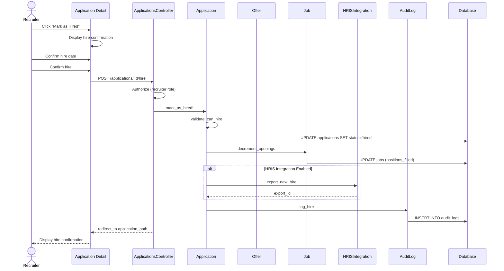

# UC-259: Mark as Hired

## Metadata

| Attribute | Value |
|-----------|-------|
| **ID** | UC-259 |
| **Name** | Mark as Hired |
| **Functional Area** | Offer Management |
| **Primary Actor** | Recruiter (ACT-02) |
| **Priority** | P1 |
| **Complexity** | Medium |
| **Status** | Draft |

## Description

A recruiter marks a candidate as hired after they have accepted the offer and completed any required pre-employment steps. This action finalizes the hiring process, updates the application status to 'hired', and can trigger onboarding workflows and HRIS integration to create the new employee record.

## Actors

| Actor | Role in Use Case |
|-------|------------------|
| Recruiter (ACT-02) | Marks candidate as hired |
| Hiring Manager (ACT-03) | May receive notification |
| Integration Gateway (ACT-12) | Exports hire to HRIS |

## Preconditions

- [ ] User is authenticated and has Recruiter or Admin role
- [ ] Offer exists with status = 'accepted'
- [ ] Application exists and is active
- [ ] Required pre-employment checks completed (if configured)

## Postconditions

### Success
- [ ] Application status changed to 'hired'
- [ ] Hire date recorded
- [ ] Job position count decremented (if tracking)
- [ ] HRIS export triggered (if integrated)
- [ ] Onboarding workflow initiated (if configured)
- [ ] Hiring team notified
- [ ] Audit log entry created

### Failure
- [ ] Application status unchanged
- [ ] User shown error message

## Triggers

- Recruiter clicks "Mark as Hired" on accepted offer
- Recruiter clicks "Complete Hire" from application detail
- Automated trigger when all pre-employment requirements met

## Basic Flow



| Step | Actor | Action | System Response |
|------|-------|--------|-----------------|
| 1 | Recruiter | Views application with accepted offer | Application detail displayed |
| 2 | Recruiter | Clicks "Mark as Hired" | Hire confirmation dialog displayed |
| 3 | Recruiter | Confirms start date | Date verified |
| 4 | Recruiter | Reviews hire summary | Summary displayed |
| 5 | Recruiter | Confirms hire | System validates eligibility |
| 6 | System | Validates offer is accepted | Validation passes |
| 7 | System | Validates pre-employment complete | Checks passed |
| 8 | System | Updates application status to 'hired' | Status changed |
| 9 | System | Records hire date | Date persisted |
| 10 | System | Updates job position count | Openings decremented |
| 11 | System | Triggers HRIS export (if enabled) | Export initiated |
| 12 | System | Initiates onboarding workflow | Onboarding started |
| 13 | System | Notifies hiring team | Emails sent |
| 14 | System | Creates audit log entry | Audit record saved |
| 15 | System | Displays hire confirmation | Success with next steps |

## Alternative Flows

### AF-1: Mark Hired Without HRIS

**Trigger:** HRIS integration not configured

| Step | Actor | Action | System Response |
|------|-------|--------|-----------------|
| 11a | System | Detects no HRIS integration | Skip export step |
| 12a | System | Continues with internal completion | Status updated |

**Resumption:** Continues at step 12 of basic flow

### AF-2: Partial Hire (Multiple Positions)

**Trigger:** Job has multiple openings

| Step | Actor | Action | System Response |
|------|-------|--------|-----------------|
| 10a | System | Decrements filled positions | Count updated |
| 10b | System | Checks if job should close | Remaining openings checked |
| 10c | System | Keeps job open if openings remain | Job status unchanged |

**Resumption:** Continues at step 11 of basic flow

### AF-3: Close Job After Hire

**Trigger:** This was the last opening for the job

| Step | Actor | Action | System Response |
|------|-------|--------|-----------------|
| 10a | System | Detects last position filled | Prompt shown |
| 10b | Recruiter | Chooses to close job | Close job triggered |
| 10c | System | Updates job status to 'closed' | Job closed |
| 10d | System | Sends rejection notifications | Other candidates notified |

**Resumption:** Continues at step 11 of basic flow

## Exception Flows

### EF-1: Offer Not Accepted

**Trigger:** Offer status is not 'accepted'

| Step | Actor | Action | System Response |
|------|-------|--------|-----------------|
| 6.1 | System | Detects offer not accepted | Error displayed |
| 6.2 | System | Shows current offer status | Status explanation |

**Resolution:** Must have accepted offer first

### EF-2: Pre-Employment Incomplete

**Trigger:** Required background check or other checks not complete

| Step | Actor | Action | System Response |
|------|-------|--------|-----------------|
| 7.1 | System | Detects incomplete requirements | Warning displayed |
| 7.2 | System | Lists pending requirements | Checklist shown |
| 7.3 | Recruiter | Overrides (with permission) | Override recorded |
| 7.4 | Recruiter | OR completes requirements | Requirements fulfilled |

**Resolution:** Complete requirements or override with authorization

### EF-3: HRIS Export Failure

**Trigger:** HRIS integration fails

| Step | Actor | Action | System Response |
|------|-------|--------|-----------------|
| 11.1 | System | HRIS export fails | Warning displayed |
| 11.2 | System | Queues for retry | Retry scheduled |
| 11.3 | System | Completes hire internally | Hire recorded |
| 11.4 | System | Alerts admin | Notification sent |

**Resolution:** Hire completes, HRIS sync retried

## Business Rules

| ID | Rule | Description |
|----|------|-------------|
| BR-259.1 | Accepted Offer Required | Only applications with accepted offers can be hired |
| BR-259.2 | Pre-Employment Complete | All required checks must pass (configurable) |
| BR-259.3 | Single Hire | Cannot hire same candidate for same job twice |
| BR-259.4 | Position Tracking | Job openings decremented on hire |
| BR-259.5 | Auto-Close Option | Can auto-close job when last position filled |
| BR-259.6 | Irreversible | Hire status cannot be reverted (new process required) |

## Data Requirements

### Input Data

| Field | Type | Required | Validation |
|-------|------|----------|------------|
| application_id | integer | Yes | Must have accepted offer |
| hire_date | date | No | Defaults to offer start date |
| close_job | boolean | No | Whether to close job after hire |
| override_requirements | boolean | No | Skip pre-employment check (admin only) |
| notes | text | No | Any hire notes |

### Output Data

| Field | Type | Description |
|-------|------|-------------|
| application.status | enum | 'hired' |
| application.hired_at | datetime | Timestamp of hire action |
| job.positions_filled | integer | Incremented count |
| hris_export_id | string | HRIS record reference (if applicable) |

## Database Transactions

### Tables Affected

| Table | Operation | Conditions |
|-------|-----------|------------|
| applications | UPDATE | Set status to 'hired' |
| jobs | UPDATE | Increment positions_filled |
| hris_exports | CREATE | If HRIS integration enabled |
| audit_logs | CREATE | Always |
| hiring_decisions | UPDATE | Mark as completed |

### Transaction Detail

```sql
-- Mark as Hired Transaction
BEGIN TRANSACTION;

-- Step 1: Verify application can be hired
SELECT a.status, o.status as offer_status
INTO @app_status, @offer_status
FROM applications a
JOIN offers o ON o.application_id = a.id
WHERE a.id = @application_id
FOR UPDATE;

IF @offer_status != 'accepted' THEN
    ROLLBACK;
    SIGNAL SQLSTATE '45000' SET MESSAGE_TEXT = 'Offer must be accepted';
END IF;

-- Step 2: Update application status
UPDATE applications
SET status = 'hired',
    hired_at = NOW(),
    updated_at = NOW()
WHERE id = @application_id;

-- Step 3: Update job positions
UPDATE jobs
SET positions_filled = positions_filled + 1,
    updated_at = NOW()
WHERE id = @job_id;

-- Step 4: Close job if requested and all positions filled
IF @close_job = TRUE OR (
    SELECT positions_filled >= headcount
    FROM jobs WHERE id = @job_id
) THEN
    UPDATE jobs
    SET status = 'closed',
        closed_at = NOW(),
        close_reason = 'filled',
        updated_at = NOW()
    WHERE id = @job_id;
END IF;

-- Step 5: Create HRIS export record (if applicable)
IF @hris_enabled THEN
    INSERT INTO hris_exports (
        organization_id,
        application_id,
        candidate_id,
        export_type,
        status,
        payload,
        created_at
    ) VALUES (
        @organization_id,
        @application_id,
        @candidate_id,
        'new_hire',
        'pending',
        @hire_payload,
        NOW()
    );
END IF;

-- Step 6: Create audit log entry
INSERT INTO audit_logs (
    organization_id,
    user_id,
    action,
    auditable_type,
    auditable_id,
    metadata,
    ip_address,
    user_agent,
    created_at
) VALUES (
    @organization_id,
    @current_user_id,
    'application.hired',
    'Application',
    @application_id,
    JSON_OBJECT(
        'candidate_id', @candidate_id,
        'job_id', @job_id,
        'offer_id', @offer_id,
        'hire_date', @hire_date,
        'hris_export', @hris_enabled
    ),
    @ip_address,
    @user_agent,
    NOW()
);

COMMIT;
```

### Rollback Scenarios

| Scenario | Rollback Action |
|----------|-----------------|
| Offer not accepted | Full rollback, return error |
| Pre-employment incomplete | Warning, allow override |
| HRIS failure | Log error, complete hire |

## UI/UX Requirements

### Screen/Component

- **Location:** /admin/applications/:id/hire
- **Entry Point:**
  - "Mark as Hired" button on application with accepted offer
  - "Complete Hire" from offer detail
- **Key Elements:**
  - Hire summary with candidate and job info
  - Pre-employment checklist status
  - Hire date confirmation
  - Job closure option

### Form Layout

```
+----------------------------------------------------------+
| Complete Hire                                             |
+----------------------------------------------------------+
|                                                          |
| CANDIDATE SUMMARY                                         |
| +------------------------------------------------------+ |
| | [Photo] [Candidate Name]                             | |
| |         candidate@email.com                          | |
| +------------------------------------------------------+ |
|                                                          |
| POSITION                                                  |
| +------------------------------------------------------+ |
| | Job Title: [Job Title]                               | |
| | Department: [Department]                             | |
| | Location: [Location]                                 | |
| | Start Date: March 15, 2026                          | |
| +------------------------------------------------------+ |
|                                                          |
| OFFER ACCEPTED                                           |
| +------------------------------------------------------+ |
| | Base Salary: $150,000 / year                        | |
| | Signing Bonus: $25,000                              | |
| | Accepted: January 20, 2026                          | |
| +------------------------------------------------------+ |
|                                                          |
| PRE-EMPLOYMENT CHECKLIST                                 |
| +------------------------------------------------------+ |
| | [v] Background Check - Passed                        | |
| | [v] Reference Check - Completed                      | |
| | [v] I-9 Verification - Pending Section 2            | |
| | [ ] Drug Screen - Not Required                       | |
| +------------------------------------------------------+ |
|                                                          |
| Hire Date                                                |
| +----------------------+                                 |
| | March 15, 2026     |v|                                 |
| +----------------------+                                 |
|                                                          |
| [ ] Close job after this hire (2 of 3 positions filled)  |
|                                                          |
| Notes (optional)                                         |
| +------------------------------------------------------+ |
| |                                                      | |
| +------------------------------------------------------+ |
|                                                          |
+----------------------------------------------------------+
| [Cancel]                              [Complete Hire]     |
+----------------------------------------------------------+
```

### Hire Confirmation

```
+----------------------------------------------------------+
| Congratulations!                                          |
|                                                          |
| [Candidate Name] has been marked as hired for            |
| [Job Title]                                              |
|                                                          |
| Start Date: March 15, 2026                               |
|                                                          |
| Next Steps:                                              |
| - Onboarding workflow has been initiated                 |
| - HRIS export is in progress                            |
| - New hire paperwork will be sent automatically          |
|                                                          |
| [View Onboarding Tasks]    [Return to Pipeline]         |
+----------------------------------------------------------+
```

## Non-Functional Requirements

| Requirement | Target |
|-------------|--------|
| Response Time | Hire action < 3s |
| HRIS Export | Within 15 minutes |
| Availability | 99.9% |

## Security Considerations

- [x] Authentication required
- [x] Authorization check: User must have recruiter role
- [x] Pre-employment override: Requires admin permission
- [x] Audit trail: Complete hire documentation
- [x] Data sync: Secure HRIS transmission

## Related Use Cases

| Use Case | Relationship |
|----------|--------------|
| UC-255 Candidate Accept Offer | Precedes this use case |
| UC-302 Initiate Background Check | Pre-employment requirement |
| UC-454 Export Hire to HRIS | Follows this use case |
| UC-008 Close Job | May be triggered by this use case |

---

## Data Model References

> Cross-references to [DATA_MODEL.md](../DATA_MODEL.md) and [CRUD_MATRIX.md](../CRUD_MATRIX.md)

### Subject Areas

| Subject Area | ID | Relationship |
|--------------|-----|--------------|
| Offer Management | SA-08 | Primary |
| Application Pipeline | SA-05 | Primary |
| Job Requisition | SA-03 | Secondary |
| Integration | SA-11 | Reference |

### Entities CRUD

| Entity | C | R | U | D | Notes |
|--------|---|---|---|---|-------|
| Application | | ✓ | ✓ | | Status updated to hired |
| Offer | | ✓ | | | Read for validation |
| Job | | ✓ | ✓ | | Positions filled updated |
| HrisExport | ✓ | | | | Created if HRIS enabled |
| AuditLog | ✓ | | | | Created for hire action |

**Legend:** C = Create, R = Read, U = Update, D = Delete

---

## Process Model References

> Cross-references to [PROCESS_MODEL.md](../PROCESS_MODEL.md) and [PROCESS_CRUD_MATRIX.md](../PROCESS_CRUD_MATRIX.md)

| Attribute | Value | Link |
|-----------|-------|------|
| **Elementary Business Process** | EP-0831: Mark as Hired | [PROCESS_MODEL.md#ep-0831](../PROCESS_MODEL.md#ep-0831-mark-as-hired) |
| **Business Process** | BP-304: Hire Finalization | [PROCESS_MODEL.md#bp-304](../PROCESS_MODEL.md#bp-304-hire-finalization) |
| **Business Function** | BF-03: Offer & Onboarding | [PROCESS_MODEL.md#bf-03](../PROCESS_MODEL.md#bf-03-offer--onboarding) |

### EBP Details

| Attribute | Value |
|-----------|-------|
| **Trigger** | Recruiter initiates after offer acceptance and pre-employment complete |
| **Input** | Application with accepted offer, hire date |
| **Output** | Hired application, updated job, HRIS export |
| **Business Rules** | BR-259.1 through BR-259.6 (see Business Rules section) |

---

## Traceability Matrix

> Complete artifact mapping for requirements traceability

| Artifact Type | ID | Name | Link |
|---------------|-----|------|------|
| **Use Case** | UC-259 | Mark as Hired | *(this document)* |
| **Elementary Process** | EP-0831 | Mark as Hired | [PROCESS_MODEL.md](../PROCESS_MODEL.md#ep-0831-mark-as-hired) |
| **Business Process** | BP-304 | Hire Finalization | [PROCESS_MODEL.md](../PROCESS_MODEL.md#bp-304-hire-finalization) |
| **Business Function** | BF-03 | Offer & Onboarding | [PROCESS_MODEL.md](../PROCESS_MODEL.md#bf-03-offer--onboarding) |
| **Primary Actor** | ACT-02 | Recruiter | [ACTORS.md](../ACTORS.md#act-02-recruiter) |
| **Subject Area (Primary)** | SA-08 | Offer Management | [DATA_MODEL.md](../DATA_MODEL.md#sa-08-offer-management) |
| **Subject Area (Secondary)** | SA-05 | Application Pipeline | [DATA_MODEL.md](../DATA_MODEL.md#sa-05-application-pipeline) |
| **CRUD Matrix Row** | UC-259 | - | [CRUD_MATRIX.md](../CRUD_MATRIX.md#uc-259) |
| **Process CRUD Row** | EP-0831 | - | [PROCESS_CRUD_MATRIX.md](../PROCESS_CRUD_MATRIX.md#ep-0831) |

### Implementation Artifacts

| Artifact Type | Path/Reference | Status |
|---------------|----------------|--------|
| Controller | `app/controllers/admin/applications_controller.rb` | Implemented |
| Model | `app/models/application.rb` | Implemented |
| Model | `app/models/offer.rb` | Implemented |
| Service | `app/services/applications/hire_service.rb` | Planned |
| Policy | `app/policies/application_policy.rb` | Implemented |
| View | `app/views/admin/applications/hire.html.erb` | Planned |
| Test | `test/models/application_test.rb` | Implemented |

---

## Open Questions

1. Should we support batch hiring for multiple accepted offers?
2. What is the integration priority for various HRIS systems?
3. Should there be a probation period tracking feature?

## Change History

| Version | Date | Author | Changes |
|---------|------|--------|---------|
| 0.1 | 2026-01-25 | System | Initial draft |
