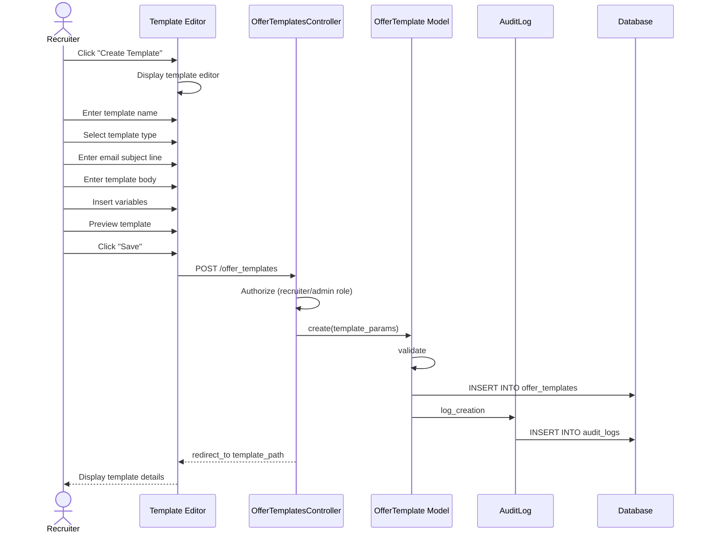

# UC-260: Manage Offer Templates

## Metadata

| Attribute | Value |
|-----------|-------|
| **ID** | UC-260 |
| **Name** | Manage Offer Templates |
| **Functional Area** | Offer Management |
| **Primary Actor** | Recruiter (ACT-02) |
| **Priority** | P2 |
| **Complexity** | Medium |
| **Status** | Draft |

## Description

A recruiter or administrator creates, edits, and manages offer letter templates that can be used when creating offers. Templates support variable substitution for candidate and offer details, enabling consistent and professional offer letters across the organization. Different template types can be configured for various employment types (standard, executive, contractor, intern).

## Actors

| Actor | Role in Use Case |
|-------|------------------|
| Recruiter (ACT-02) | Creates and manages templates |
| System Administrator (ACT-01) | Configures organization-wide templates |

## Preconditions

- [ ] User is authenticated and has Recruiter or Admin role
- [ ] User has permission to manage offer templates

## Postconditions

### Success (Create)
- [ ] New OfferTemplate record created
- [ ] Template available for use in offer creation
- [ ] Audit log entry created

### Success (Edit)
- [ ] OfferTemplate record updated
- [ ] Existing offers using template unaffected
- [ ] Audit log entry created

### Success (Delete/Deactivate)
- [ ] Template marked as inactive
- [ ] Existing offers retain their rendered content
- [ ] Audit log entry created

### Failure
- [ ] Template unchanged
- [ ] User shown validation errors

## Triggers

- Admin clicks "Manage Templates" from settings
- Recruiter clicks "Create Template" from offer creation flow
- Admin clicks "Edit" on existing template

## Basic Flow (Create Template)



| Step | Actor | Action | System Response |
|------|-------|--------|-----------------|
| 1 | Recruiter | Navigates to template management | Template list displayed |
| 2 | Recruiter | Clicks "Create Template" | Template editor displayed |
| 3 | Recruiter | Enters template name | Name captured |
| 4 | Recruiter | Selects template type | Type set (standard/executive/etc) |
| 5 | Recruiter | Enters email subject line | Subject captured |
| 6 | Recruiter | Enters template body | Rich text editor content |
| 7 | Recruiter | Inserts variable placeholders | Variables added to body |
| 8 | Recruiter | Clicks "Preview" | Preview with sample data shown |
| 9 | Recruiter | Reviews rendered output | Output verified |
| 10 | Recruiter | Clicks "Save" | System validates template |
| 11 | System | Validates required fields | Validation passes |
| 12 | System | Saves template | Template persisted |
| 13 | System | Creates audit log entry | Audit record saved |
| 14 | System | Displays template detail | Success confirmation shown |

## Alternative Flows

### AF-1: Edit Existing Template

**Trigger:** Recruiter clicks "Edit" on existing template

| Step | Actor | Action | System Response |
|------|-------|--------|-----------------|
| 1a | Recruiter | Clicks "Edit" on template | Editor with current content |
| 2a | Recruiter | Modifies template content | Changes captured |
| 3a | Recruiter | Saves changes | Template updated |

**Resumption:** Continues at step 11 of basic flow

### AF-2: Duplicate Template

**Trigger:** Recruiter wants to create new template based on existing

| Step | Actor | Action | System Response |
|------|-------|--------|-----------------|
| 1a | Recruiter | Clicks "Duplicate" on template | New template form with copied content |
| 2a | System | Pre-fills form with existing content | Name modified to "Copy of..." |
| 3a | Recruiter | Modifies as needed | Changes captured |

**Resumption:** Continues at step 10 of basic flow

### AF-3: Set as Default Template

**Trigger:** Admin wants template to be default for type

| Step | Actor | Action | System Response |
|------|-------|--------|-----------------|
| 14a | Recruiter | Clicks "Set as Default" | Confirmation prompt |
| 14b | System | Removes default from other templates of same type | Previous default cleared |
| 14c | System | Sets this template as default | Default flag set |

**Resumption:** Use case ends

### AF-4: Deactivate Template

**Trigger:** Template should no longer be available

| Step | Actor | Action | System Response |
|------|-------|--------|-----------------|
| 1a | Recruiter | Clicks "Deactivate" on template | Confirmation prompt |
| 2a | Recruiter | Confirms deactivation | Template marked inactive |
| 3a | System | Removes from available templates | Hidden from selection |

**Resumption:** Use case ends

## Exception Flows

### EF-1: Validation Failure

**Trigger:** Required fields missing

| Step | Actor | Action | System Response |
|------|-------|--------|-----------------|
| 11.1 | System | Detects validation errors | Errors displayed |
| 11.2 | System | Highlights invalid fields | Form validation |
| 11.3 | Recruiter | Corrects errors | Fields updated |
| 11.4 | Recruiter | Retries save | Validation re-runs |

**Resolution:** Returns to step 11, continues if valid

### EF-2: Invalid Variable Syntax

**Trigger:** Template contains malformed variables

| Step | Actor | Action | System Response |
|------|-------|--------|-----------------|
| 11.1 | System | Detects invalid variable syntax | Warning displayed |
| 11.2 | System | Highlights problematic variables | Variables marked |
| 11.3 | Recruiter | Corrects variable syntax | Variables fixed |

**Resolution:** Continue after correction

### EF-3: Template In Use

**Trigger:** Attempt to delete template used by active offers

| Step | Actor | Action | System Response |
|------|-------|--------|-----------------|
| 1.1 | System | Detects template in use | Warning displayed |
| 1.2 | System | Shows count of offers using template | Usage stats shown |
| 1.3 | System | Offers deactivation instead | Deactivate option |

**Resolution:** Deactivate instead of delete

## Business Rules

| ID | Rule | Description |
|----|------|-------------|
| BR-260.1 | Required Fields | Name, body, and type are required |
| BR-260.2 | Variable Syntax | Variables must use {{variable_name}} format |
| BR-260.3 | Single Default | Only one default template per type |
| BR-260.4 | No Hard Delete | Templates are deactivated, not deleted |
| BR-260.5 | Existing Offers | Changes don't affect already-rendered offers |
| BR-260.6 | Available Variables | Only predefined variables are available |

## Data Requirements

### Input Data

| Field | Type | Required | Validation |
|-------|------|----------|------------|
| name | string | Yes | Max 255 chars, unique in org |
| template_type | enum | Yes | standard, executive, contractor, intern |
| subject_line | string | No | Max 255 chars |
| body | text | Yes | Min 100 chars |
| available_variables | array | No | Must be valid variable names |
| is_default | boolean | No | Default false |
| active | boolean | No | Default true |

### Output Data

| Field | Type | Description |
|-------|------|-------------|
| id | integer | Unique template identifier |
| created_at | datetime | Creation timestamp |
| updated_at | datetime | Last modification timestamp |

### Available Variables

| Variable | Description | Example |
|----------|-------------|---------|
| {{candidate_name}} | Full name | John Smith |
| {{candidate_first_name}} | First name | John |
| {{candidate_email}} | Email address | john@email.com |
| {{job_title}} | Position title | Software Engineer |
| {{department}} | Department name | Engineering |
| {{location}} | Work location | San Francisco, CA |
| {{salary}} | Formatted salary | $150,000 |
| {{salary_period}} | Pay period | yearly |
| {{currency}} | Currency code | USD |
| {{signing_bonus}} | Formatted bonus | $25,000 |
| {{annual_bonus_target}} | Bonus percentage | 15% |
| {{equity_type}} | Equity type | stock options |
| {{equity_shares}} | Number of shares | 10,000 |
| {{equity_vesting_schedule}} | Vesting terms | 4-year, 1-year cliff |
| {{start_date}} | Formatted start date | March 15, 2026 |
| {{employment_type}} | Employment type | Full Time |
| {{reports_to}} | Manager name | Jane Doe |
| {{company_name}} | Organization name | Acme Corp |
| {{offer_expiration_date}} | Expiration date | February 1, 2026 |

## Database Transactions

### Tables Affected

| Table | Operation | Conditions |
|-------|-----------|------------|
| offer_templates | CREATE/UPDATE | Template management |
| audit_logs | CREATE | Always |

### Transaction Detail

```sql
-- Create Offer Template Transaction
BEGIN TRANSACTION;

-- Step 1: Insert template record
INSERT INTO offer_templates (
    organization_id,
    name,
    template_type,
    subject_line,
    body,
    available_variables,
    is_default,
    active,
    created_at,
    updated_at
) VALUES (
    @organization_id,
    @name,
    @template_type,
    @subject_line,
    @body,
    @available_variables,
    @is_default,
    true,
    NOW(),
    NOW()
);

SET @template_id = LAST_INSERT_ID();

-- Step 2: If setting as default, clear other defaults of same type
IF @is_default = TRUE THEN
    UPDATE offer_templates
    SET is_default = false,
        updated_at = NOW()
    WHERE organization_id = @organization_id
      AND template_type = @template_type
      AND id != @template_id;
END IF;

-- Step 3: Create audit log entry
INSERT INTO audit_logs (
    organization_id,
    user_id,
    action,
    auditable_type,
    auditable_id,
    metadata,
    ip_address,
    user_agent,
    created_at
) VALUES (
    @organization_id,
    @current_user_id,
    'offer_template.created',
    'OfferTemplate',
    @template_id,
    JSON_OBJECT(
        'name', @name,
        'type', @template_type,
        'is_default', @is_default
    ),
    @ip_address,
    @user_agent,
    NOW()
);

COMMIT;
```

### Rollback Scenarios

| Scenario | Rollback Action |
|----------|-----------------|
| Validation failure | No transaction started |
| Duplicate name | Rollback, return error |

## UI/UX Requirements

### Screen/Component

- **Location:** /admin/settings/offer_templates
- **Entry Point:**
  - Settings > Offer Templates
  - Offer creation "Manage Templates" link
- **Key Elements:**
  - Template list with type badges
  - Rich text editor with variable insertion
  - Preview pane
  - Variable reference sidebar

### Template List

```
+----------------------------------------------------------+
| Offer Templates                         [+ Create Template] |
+----------------------------------------------------------+
| Search templates...                                       |
| Filter: [All Types v]                                    |
+----------------------------------------------------------+
| NAME                  TYPE        DEFAULT   STATUS        |
+----------------------------------------------------------+
| Standard Offer        Standard    [*]       Active        |
|                                            [Edit] [...]   |
+----------------------------------------------------------+
| Executive Package     Executive   [*]       Active        |
|                                            [Edit] [...]   |
+----------------------------------------------------------+
| Contractor Agreement  Contractor  [ ]       Active        |
|                                            [Edit] [...]   |
+----------------------------------------------------------+
| Intern Offer Letter   Intern      [*]       Active        |
|                                            [Edit] [...]   |
+----------------------------------------------------------+
| Old Template (v1)     Standard    [ ]       Inactive      |
|                                            [Edit] [...]   |
+----------------------------------------------------------+
```

### Template Editor

```
+----------------------------------------------------------+
| Create Offer Template                                     |
+----------------------------------------------------------+
| Template Name *                                           |
| +------------------------------------------------------+ |
| | Standard Offer Letter                                | |
| +------------------------------------------------------+ |
|                                                          |
| Template Type *                                          |
| +------------------------------------------------------+ |
| | Standard                                           v | |
| +------------------------------------------------------+ |
|                                                          |
| Email Subject Line                                       |
| +------------------------------------------------------+ |
| | Offer Letter - {{job_title}} at {{company_name}}    | |
| +------------------------------------------------------+ |
|                                                          |
| +------------------------------------------------------+ |
| | TEMPLATE BODY                        | VARIABLES     | |
| | +----------------------------------+ | +------------+ | |
| | | Dear {{candidate_first_name}},  | | | Click to   | | |
| | |                                  | | | insert:    | | |
| | | We are pleased to extend an     | | |            | | |
| | | offer for the position of       | | | Candidate  | | |
| | | {{job_title}} at               | | | - name     | | |
| | | {{company_name}}.               | | | - email    | | |
| | |                                  | | |            | | |
| | | COMPENSATION                     | | | Position   | | |
| | | Base Salary: {{salary}}         | | | - title    | | |
| | | ...                             | | | - dept     | | |
| | +----------------------------------+ | +------------+ | |
| +------------------------------------------------------+ |
|                                                          |
| [ ] Set as default for Standard type                     |
|                                                          |
| PREVIEW                                                   |
| +------------------------------------------------------+ |
| | Dear John,                                           | |
| |                                                      | |
| | We are pleased to extend an offer for the position   | |
| | of Software Engineer at Acme Corp...                 | |
| +------------------------------------------------------+ |
|                                                          |
+----------------------------------------------------------+
| [Cancel]                                     [Save Template] |
+----------------------------------------------------------+
```

## Non-Functional Requirements

| Requirement | Target |
|-------------|--------|
| Response Time | Save < 2s |
| Preview Render | < 500ms |
| Template Size | Max 100KB |
| Availability | 99.9% |

## Security Considerations

- [x] Authentication required
- [x] Authorization check: User must have recruiter or admin role
- [x] XSS prevention: Template content sanitized
- [x] Audit logging: All changes tracked
- [x] Organization scoping: Templates scoped to organization

## Related Use Cases

| Use Case | Relationship |
|----------|--------------|
| UC-250 Create Offer | Uses templates from this use case |
| UC-254 Send Offer to Candidate | Renders template content |
| UC-505 Configure Organization Settings | Organization template settings |

---

## Data Model References

> Cross-references to [DATA_MODEL.md](../DATA_MODEL.md) and [CRUD_MATRIX.md](../CRUD_MATRIX.md)

### Subject Areas

| Subject Area | ID | Relationship |
|--------------|-----|--------------|
| Offer Management | SA-08 | Primary |
| Organization | SA-02 | Secondary |
| Compliance & Audit | SA-09 | Reference |

### Entities CRUD

| Entity | C | R | U | D | Notes |
|--------|---|---|---|---|-------|
| OfferTemplate | ✓ | ✓ | ✓ | | Full CRUD operations |
| AuditLog | ✓ | | | | Created for changes |

**Legend:** C = Create, R = Read, U = Update, D = Delete (soft delete only)

---

## Process Model References

> Cross-references to [PROCESS_MODEL.md](../PROCESS_MODEL.md) and [PROCESS_CRUD_MATRIX.md](../PROCESS_CRUD_MATRIX.md)

| Attribute | Value | Link |
|-----------|-------|------|
| **Elementary Business Process** | EP-0832: Manage Offer Templates | [PROCESS_MODEL.md#ep-0832](../PROCESS_MODEL.md#ep-0832-manage-offer-templates) |
| **Business Process** | BP-304: Hire Finalization | [PROCESS_MODEL.md#bp-304](../PROCESS_MODEL.md#bp-304-hire-finalization) |
| **Business Function** | BF-03: Offer & Onboarding | [PROCESS_MODEL.md#bf-03](../PROCESS_MODEL.md#bf-03-offer--onboarding) |

### EBP Details

| Attribute | Value |
|-----------|-------|
| **Trigger** | Admin or recruiter initiates template management |
| **Input** | Template name, type, body with variables |
| **Output** | New or updated offer template |
| **Business Rules** | BR-260.1 through BR-260.6 (see Business Rules section) |

---

## Traceability Matrix

> Complete artifact mapping for requirements traceability

| Artifact Type | ID | Name | Link |
|---------------|-----|------|------|
| **Use Case** | UC-260 | Manage Offer Templates | *(this document)* |
| **Elementary Process** | EP-0832 | Manage Offer Templates | [PROCESS_MODEL.md](../PROCESS_MODEL.md#ep-0832-manage-offer-templates) |
| **Business Process** | BP-304 | Hire Finalization | [PROCESS_MODEL.md](../PROCESS_MODEL.md#bp-304-hire-finalization) |
| **Business Function** | BF-03 | Offer & Onboarding | [PROCESS_MODEL.md](../PROCESS_MODEL.md#bf-03-offer--onboarding) |
| **Primary Actor** | ACT-02 | Recruiter | [ACTORS.md](../ACTORS.md#act-02-recruiter) |
| **Subject Area (Primary)** | SA-08 | Offer Management | [DATA_MODEL.md](../DATA_MODEL.md#sa-08-offer-management) |
| **CRUD Matrix Row** | UC-260 | - | [CRUD_MATRIX.md](../CRUD_MATRIX.md#uc-260) |
| **Process CRUD Row** | EP-0832 | - | [PROCESS_CRUD_MATRIX.md](../PROCESS_CRUD_MATRIX.md#ep-0832) |

### Implementation Artifacts

| Artifact Type | Path/Reference | Status |
|---------------|----------------|--------|
| Controller | `app/controllers/admin/offer_templates_controller.rb` | Implemented |
| Model | `app/models/offer_template.rb` | Implemented |
| Policy | `app/policies/offer_template_policy.rb` | Planned |
| View | `app/views/admin/offer_templates/` | Implemented |
| Test | `test/models/offer_template_test.rb` | Implemented |

---

## Open Questions

1. Should we support conditional sections in templates (e.g., equity section only if applicable)?
2. Should templates support multiple languages?
3. Should we provide pre-built template library for quick start?

## Change History

| Version | Date | Author | Changes |
|---------|------|--------|---------|
| 0.1 | 2026-01-25 | System | Initial draft |
