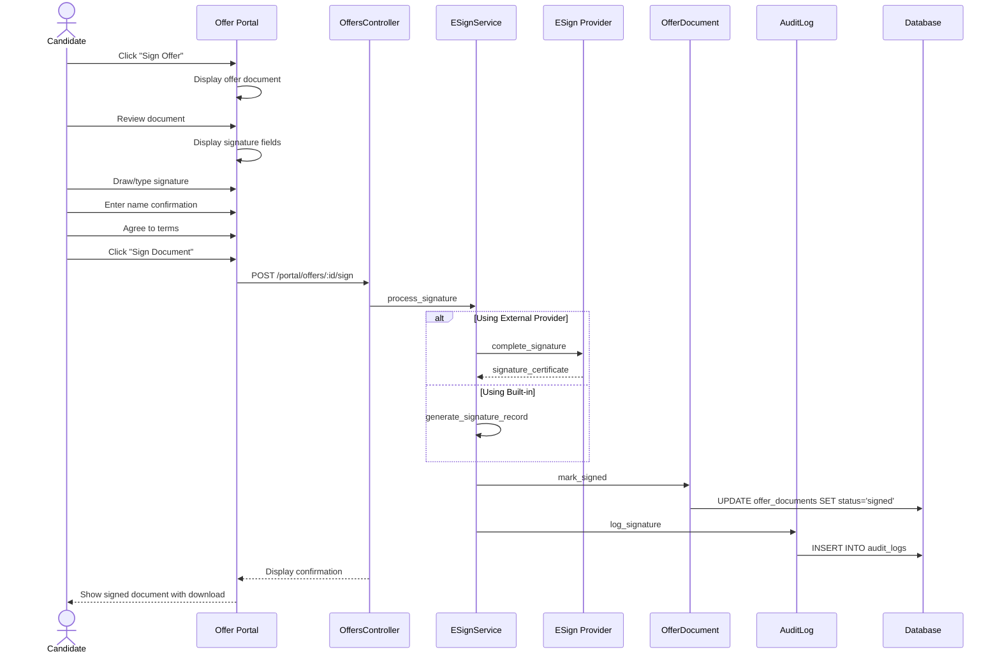

# UC-261: E-Sign Offer Letter

## Metadata

| Attribute | Value |
|-----------|-------|
| **ID** | UC-261 |
| **Name** | E-Sign Offer Letter |
| **Functional Area** | Offer Management |
| **Primary Actor** | Candidate (ACT-07) |
| **Priority** | P2 |
| **Complexity** | Medium |
| **Status** | Draft |

## Description

A candidate electronically signs the offer letter document as part of accepting a job offer. The e-signature process captures the candidate's legally binding consent to the offer terms, including a digital signature, timestamp, and IP address for compliance and audit purposes. This integrates with e-signature providers (DocuSign, HelloSign) or can use the built-in signature capture.

## Actors

| Actor | Role in Use Case |
|-------|------------------|
| Candidate (ACT-07) | Signs the offer letter electronically |
| Recruiter (ACT-02) | Receives notification of signed document |
| Integration Gateway (ACT-12) | Communicates with e-signature provider |

## Preconditions

- [ ] Offer exists with status = 'sent'
- [ ] Offer document has been prepared for signature
- [ ] Candidate has access to offer via email link or portal
- [ ] E-signature capability enabled for organization

## Postconditions

### Success
- [ ] Offer document marked as signed
- [ ] Signature data captured and stored securely
- [ ] signed_at timestamp recorded
- [ ] Signature certificate generated (if using provider)
- [ ] Signed document available for download
- [ ] Recruiter notified of signature
- [ ] Audit log entry created

### Failure
- [ ] Document remains unsigned
- [ ] Candidate shown error message
- [ ] Retry available

## Triggers

- Candidate clicks "Sign Offer" from offer acceptance flow
- Candidate clicks signature link in offer email
- Candidate opens offer document and initiates signing

## Basic Flow



| Step | Actor | Action | System Response |
|------|-------|--------|-----------------|
| 1 | Candidate | Clicks "Sign Offer" from offer view | Document displayed for signing |
| 2 | Candidate | Reviews full offer document | Document contents shown |
| 3 | Candidate | Scrolls to review all pages | Progress tracked |
| 4 | Candidate | Locates signature field | Signature area highlighted |
| 5 | Candidate | Draws signature (or types name) | Signature captured |
| 6 | Candidate | Enters full legal name | Name confirmation captured |
| 7 | Candidate | Checks consent checkbox | Agreement confirmed |
| 8 | Candidate | Clicks "Sign Document" | System processes signature |
| 9 | System | Captures signature data | Signature recorded |
| 10 | System | Records timestamp and IP | Audit data captured |
| 11 | System | Generates signature certificate | Certificate created |
| 12 | System | Applies signature to document | Document finalized |
| 13 | System | Marks document as signed | Status updated |
| 14 | System | Notifies recruiter | Email sent |
| 15 | System | Creates audit log entry | Audit record saved |
| 16 | System | Displays signed document | Download available |

## Alternative Flows

### AF-1: Using External E-Signature Provider

**Trigger:** Organization uses DocuSign, HelloSign, or similar

| Step | Actor | Action | System Response |
|------|-------|--------|-----------------|
| 1a | Candidate | Clicks "Sign Offer" | Redirected to provider |
| 2a | Provider | Displays document in provider UI | Provider interface shown |
| 3a | Candidate | Signs using provider flow | Signature captured by provider |
| 4a | Provider | Sends webhook to system | Signature completion notified |
| 5a | System | Downloads signed document | Document retrieved |

**Resumption:** Continues at step 13 of basic flow

### AF-2: Type Signature Instead of Draw

**Trigger:** Candidate prefers typed signature

| Step | Actor | Action | System Response |
|------|-------|--------|-----------------|
| 5a | Candidate | Selects "Type Signature" option | Text input displayed |
| 5b | Candidate | Types full name | Name converted to signature font |
| 5c | Candidate | Selects signature style | Style applied |

**Resumption:** Continues at step 6 of basic flow

### AF-3: Mobile Signature

**Trigger:** Candidate signing on mobile device

| Step | Actor | Action | System Response |
|------|-------|--------|-----------------|
| 1a | System | Detects mobile device | Mobile-optimized view |
| 5a | Candidate | Draws with finger/stylus | Touch signature captured |
| 5b | System | Enlarges signature area | Better mobile experience |

**Resumption:** Continues at step 6 of basic flow

### AF-4: Download Before Signing

**Trigger:** Candidate wants to review offline first

| Step | Actor | Action | System Response |
|------|-------|--------|-----------------|
| 2a | Candidate | Clicks "Download PDF" | Unsigned PDF downloaded |
| 2b | Candidate | Reviews offline | Time to review |
| 2c | Candidate | Returns to sign | Signature flow resumes |

**Resumption:** Continues at step 4 of basic flow

## Exception Flows

### EF-1: Signature Provider Unavailable

**Trigger:** External e-signature service is down

| Step | Actor | Action | System Response |
|------|-------|--------|-----------------|
| 1.1 | System | Detects provider unavailable | Error message |
| 1.2 | System | Offers built-in alternative | Fallback option |
| 1.3 | Candidate | Uses built-in signing | Proceeds with alternative |

**Resolution:** Use built-in e-signature

### EF-2: Signature Not Captured Properly

**Trigger:** Signature drawing fails or is unclear

| Step | Actor | Action | System Response |
|------|-------|--------|-----------------|
| 9.1 | System | Detects invalid signature | Warning displayed |
| 9.2 | System | Requests signature redo | Clear button shown |
| 9.3 | Candidate | Redraws signature | New signature captured |

**Resolution:** Retry signature capture

### EF-3: Session Timeout During Signing

**Trigger:** Candidate takes too long, session expires

| Step | Actor | Action | System Response |
|------|-------|--------|-----------------|
| E.1 | System | Detects session timeout | Session warning |
| E.2 | System | Saves progress | Partial state preserved |
| E.3 | Candidate | Re-authenticates | Session restored |
| E.4 | System | Restores signing progress | Resume from last step |

**Resolution:** Resume after re-authentication

### EF-4: Document Modified After Preparation

**Trigger:** Offer terms changed after document prepared

| Step | Actor | Action | System Response |
|------|-------|--------|-----------------|
| 8.1 | System | Detects document hash mismatch | Error displayed |
| 8.2 | System | Requires document regeneration | New document needed |
| 8.3 | Recruiter | Resends offer with new document | Fresh document prepared |

**Resolution:** Restart with updated document

## Business Rules

| ID | Rule | Description |
|----|------|-------------|
| BR-261.1 | Sent Status Required | Only sent offers can be signed |
| BR-261.2 | Document Review | Candidate must scroll through full document |
| BR-261.3 | Name Confirmation | Typed name must match candidate record |
| BR-261.4 | Consent Required | Must check agreement checkbox |
| BR-261.5 | Single Signature | Document can only be signed once |
| BR-261.6 | Audit Trail | Complete signature audit trail required |
| BR-261.7 | Legal Compliance | Must meet ESIGN Act and UETA requirements |

## Data Requirements

### Input Data

| Field | Type | Required | Validation |
|-------|------|----------|------------|
| offer_id | integer | Yes | Must have sent status |
| signature_data | binary | Yes | Image or SVG of signature |
| signature_type | enum | Yes | draw, type |
| full_name | string | Yes | Must match candidate name |
| consent_agreed | boolean | Yes | Must be true |
| ip_address | string | Yes | Captured automatically |
| user_agent | string | Yes | Captured automatically |

### Output Data

| Field | Type | Description |
|-------|------|-------------|
| offer_document.status | enum | 'signed' |
| offer_document.signed_at | datetime | Timestamp of signature |
| offer_document.signature_ip_address | string | IP at signing |
| signature_certificate | object | Provider certificate (if applicable) |
| signed_document_url | string | URL to signed PDF |

## Database Transactions

### Tables Affected

| Table | Operation | Conditions |
|-------|-----------|------------|
| offer_documents | UPDATE | Mark as signed |
| signature_records | CREATE | Store signature details |
| audit_logs | CREATE | Always |

### Transaction Detail

```sql
-- E-Sign Offer Letter Transaction
BEGIN TRANSACTION;

-- Step 1: Verify document can be signed
SELECT od.status, od.document_hash
INTO @doc_status, @doc_hash
FROM offer_documents od
JOIN offers o ON o.id = od.offer_id
WHERE od.id = @document_id
  AND o.status = 'sent'
FOR UPDATE;

IF @doc_status != 'pending_signature' THEN
    ROLLBACK;
    SIGNAL SQLSTATE '45000' SET MESSAGE_TEXT = 'Document cannot be signed';
END IF;

-- Step 2: Create signature record
INSERT INTO signature_records (
    offer_document_id,
    signer_name,
    signer_email,
    signature_type,
    signature_data,
    ip_address,
    user_agent,
    consent_text,
    signed_at,
    created_at
) VALUES (
    @document_id,
    @full_name,
    @candidate_email,
    @signature_type,
    @signature_data,
    @ip_address,
    @user_agent,
    @consent_text,
    NOW(),
    NOW()
);

-- Step 3: Update document status
UPDATE offer_documents
SET status = 'signed',
    signed_at = NOW(),
    signed_by_id = @candidate_id,
    signature_ip_address = @ip_address,
    signed_document_key = @signed_document_key,
    updated_at = NOW()
WHERE id = @document_id;

-- Step 4: Create audit log entry
INSERT INTO audit_logs (
    organization_id,
    user_id,
    action,
    auditable_type,
    auditable_id,
    metadata,
    ip_address,
    user_agent,
    created_at
) VALUES (
    @organization_id,
    NULL, -- Candidate action
    'offer_document.signed',
    'OfferDocument',
    @document_id,
    JSON_OBJECT(
        'offer_id', @offer_id,
        'candidate_id', @candidate_id,
        'signature_type', @signature_type,
        'provider', @provider_name
    ),
    @ip_address,
    @user_agent,
    NOW()
);

COMMIT;
```

### Rollback Scenarios

| Scenario | Rollback Action |
|----------|-----------------|
| Document already signed | No transaction, return error |
| Signature validation fails | Full rollback |
| Provider error | Log error, offer retry |
| Storage failure | Rollback, retry with different storage |

## UI/UX Requirements

### Screen/Component

- **Location:** /portal/offers/:token/sign
- **Entry Point:**
  - "Sign Offer" button on offer view
  - Direct link from email
- **Key Elements:**
  - Document viewer with scroll tracking
  - Signature pad (draw or type)
  - Name confirmation field
  - Consent checkbox
  - Sign button

### Signing Interface

```
+----------------------------------------------------------+
| Sign Your Offer Letter                                    |
+----------------------------------------------------------+
|                                                          |
| DOCUMENT                                                  |
| +------------------------------------------------------+ |
| |                                                      | |
| | [Offer Letter Document - Page 1 of 3]               | |
| |                                                      | |
| | Dear John Smith,                                     | |
| |                                                      | |
| | We are pleased to extend an offer...                 | |
| |                                                      | |
| | [Scroll to continue - 67% complete]                  | |
| |                                                      | |
| +------------------------------------------------------+ |
|                                                          |
| SIGNATURE                                                 |
| +------------------------------------------------------+ |
| | [ Draw Signature ] [ Type Signature ]                | |
| | +--------------------------------------------------+ | |
| | |                                                  | | |
| | |     [Signature Pad - Draw Here]                 | | |
| | |                                                  | | |
| | +--------------------------------------------------+ | |
| | [Clear]                                              | |
| +------------------------------------------------------+ |
|                                                          |
| Full Legal Name *                                        |
| +------------------------------------------------------+ |
| | John Smith                                           | |
| +------------------------------------------------------+ |
|                                                          |
| [x] I agree that my electronic signature is the legal    |
|     equivalent of my manual signature on this document.  |
|     I consent to be legally bound by this document.      |
|                                                          |
| [x] I acknowledge that I have read and understand the    |
|     terms of this offer letter.                          |
|                                                          |
+----------------------------------------------------------+
|                                        [Sign Document]    |
+----------------------------------------------------------+
```

### Signature Complete

```
+----------------------------------------------------------+
| Document Signed Successfully                              |
|                                                          |
|     [Checkmark Icon]                                     |
|                                                          |
| Your offer letter has been signed on                     |
| January 25, 2026 at 3:45 PM EST                         |
|                                                          |
| A copy of the signed document has been sent to:          |
| john.smith@email.com                                     |
|                                                          |
| [Download Signed PDF]                                    |
|                                                          |
| Next Steps:                                              |
| - Your recruiter will be in touch shortly               |
| - Onboarding information will be sent before your       |
|   start date of March 15, 2026                          |
|                                                          |
+----------------------------------------------------------+
```

## Non-Functional Requirements

| Requirement | Target |
|-------------|--------|
| Response Time | Signature capture < 2s |
| Document Load | < 3s |
| Provider Timeout | 30s |
| Availability | 99.9% |
| Signature Storage | Encrypted at rest |

## Security Considerations

- [x] Secure transmission: TLS encryption for all data
- [x] Signature encryption: Signature data encrypted at rest
- [x] Tamper detection: Document hash verification
- [x] Audit trail: Complete signature audit log
- [x] Legal compliance: ESIGN Act and UETA compliant
- [x] IP logging: Source IP recorded for each signature

## Related Use Cases

| Use Case | Relationship |
|----------|--------------|
| UC-254 Send Offer to Candidate | Prepares document for signing |
| UC-255 Candidate Accept Offer | E-sign is part of acceptance |
| UC-259 Mark as Hired | May follow completion of signing |

---

## Data Model References

> Cross-references to [DATA_MODEL.md](../DATA_MODEL.md) and [CRUD_MATRIX.md](../CRUD_MATRIX.md)

### Subject Areas

| Subject Area | ID | Relationship |
|--------------|-----|--------------|
| Offer Management | SA-08 | Primary |
| Integration | SA-11 | Secondary |
| Compliance & Audit | SA-09 | Reference |

### Entities CRUD

| Entity | C | R | U | D | Notes |
|--------|---|---|---|---|-------|
| OfferDocument | | ✓ | ✓ | | Marked as signed |
| SignatureRecord | ✓ | | | | Created for signature |
| AuditLog | ✓ | | | | Created for signing |

**Legend:** C = Create, R = Read, U = Update, D = Delete

---

## Process Model References

> Cross-references to [PROCESS_MODEL.md](../PROCESS_MODEL.md) and [PROCESS_CRUD_MATRIX.md](../PROCESS_CRUD_MATRIX.md)

| Attribute | Value | Link |
|-----------|-------|------|
| **Elementary Business Process** | EP-0821: Send Offer to Candidate | [PROCESS_MODEL.md#ep-0821](../PROCESS_MODEL.md#ep-0821-send-offer-to-candidate) |
| **Business Process** | BP-303: Offer Delivery | [PROCESS_MODEL.md#bp-303](../PROCESS_MODEL.md#bp-303-offer-delivery) |
| **Business Function** | BF-03: Offer & Onboarding | [PROCESS_MODEL.md#bf-03](../PROCESS_MODEL.md#bf-03-offer--onboarding) |

### EBP Details

| Attribute | Value |
|-----------|-------|
| **Trigger** | Candidate initiates signing as part of offer acceptance |
| **Input** | Prepared offer document, candidate signature |
| **Output** | Signed document with legal signature record |
| **Business Rules** | BR-261.1 through BR-261.7 (see Business Rules section) |

---

## Traceability Matrix

> Complete artifact mapping for requirements traceability

| Artifact Type | ID | Name | Link |
|---------------|-----|------|------|
| **Use Case** | UC-261 | E-Sign Offer Letter | *(this document)* |
| **Elementary Process** | EP-0821 | Send Offer to Candidate | [PROCESS_MODEL.md](../PROCESS_MODEL.md#ep-0821-send-offer-to-candidate) |
| **Business Process** | BP-303 | Offer Delivery | [PROCESS_MODEL.md](../PROCESS_MODEL.md#bp-303-offer-delivery) |
| **Business Function** | BF-03 | Offer & Onboarding | [PROCESS_MODEL.md](../PROCESS_MODEL.md#bf-03-offer--onboarding) |
| **Primary Actor** | ACT-07 | Candidate | [ACTORS.md](../ACTORS.md#act-07-candidate) |
| **Subject Area (Primary)** | SA-08 | Offer Management | [DATA_MODEL.md](../DATA_MODEL.md#sa-08-offer-management) |
| **CRUD Matrix Row** | UC-261 | - | [CRUD_MATRIX.md](../CRUD_MATRIX.md#uc-261) |
| **Process CRUD Row** | EP-0821 | - | [PROCESS_CRUD_MATRIX.md](../PROCESS_CRUD_MATRIX.md#ep-0821) |

### Implementation Artifacts

| Artifact Type | Path/Reference | Status |
|---------------|----------------|--------|
| Controller | `app/controllers/portal/offer_documents_controller.rb` | Planned |
| Model | `app/models/offer_document.rb` | Planned |
| Service | `app/services/esign/signature_service.rb` | Planned |
| View | `app/views/portal/offer_documents/sign.html.erb` | Planned |
| Integration | `app/integrations/docusign/` | Planned |
| Integration | `app/integrations/hellosign/` | Planned |
| Test | `test/services/esign/signature_service_test.rb` | Planned |

---

## Open Questions

1. Which e-signature providers should we integrate with first?
2. Should we support witness signatures for certain offer types?
3. What is the retention period for signature records?

## Change History

| Version | Date | Author | Changes |
|---------|------|--------|---------|
| 0.1 | 2026-01-25 | System | Initial draft |
