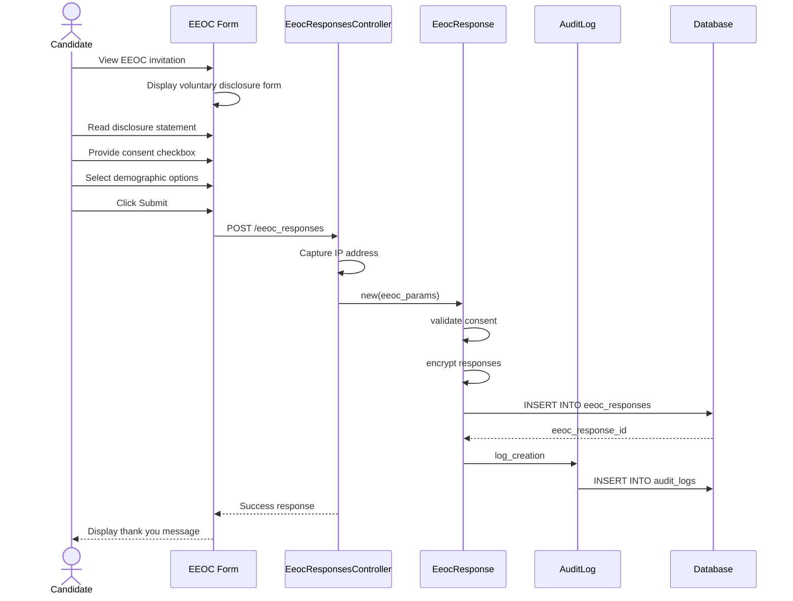

# UC-300: Collect EEOC Data

## Metadata

| Attribute | Value |
|-----------|-------|
| **ID** | UC-300 |
| **Name** | Collect EEOC Data |
| **Functional Area** | Compliance & Audit |
| **Primary Actor** | Candidate (ACT-07) |
| **Priority** | P1 |
| **Complexity** | Low |
| **Status** | Draft |

## Description

A candidate voluntarily provides demographic information for Equal Employment Opportunity Commission (EEOC) compliance purposes. This data is collected separately from the hiring decision process to ensure it cannot influence employment decisions. The candidate can decline to provide any or all information.

## Actors

| Actor | Role in Use Case |
|-------|------------------|
| Candidate (ACT-07) | Voluntarily provides demographic information |
| System (ACT-13) | Presents form and stores encrypted data |

## Preconditions

- [ ] Candidate has an active application in the system
- [ ] Organization has EEOC collection enabled in settings
- [ ] EEOC form has not been previously completed for this application

## Postconditions

### Success
- [ ] EeocResponse record created with encrypted demographic data
- [ ] Consent timestamp and IP address recorded
- [ ] Audit log entry created for data collection
- [ ] Data stored separately from hiring decision records

### Failure
- [ ] No EeocResponse record created if candidate declines consent
- [ ] Form can be re-presented at a later collection context

## Triggers

- Candidate completes job application (collection_context: application)
- Candidate receives follow-up email invitation (collection_context: post_apply_email)
- Candidate reaches offer stage (collection_context: offer_stage)

## Basic Flow



| Step | Actor | Action | System Response |
|------|-------|--------|-----------------|
| 1 | Candidate | Views EEOC invitation | System displays voluntary disclosure form |
| 2 | Candidate | Reads disclosure statement | Statement explains voluntary nature and data protection |
| 3 | Candidate | Checks consent checkbox | Consent acknowledged |
| 4 | Candidate | Selects gender (or "Prefer not to say") | Selection recorded |
| 5 | Candidate | Selects race/ethnicity (or "Prefer not to say") | Selection recorded |
| 6 | Candidate | Selects veteran status (or "Prefer not to say") | Selection recorded |
| 7 | Candidate | Selects disability status (or "Prefer not to say") | Selection recorded |
| 8 | Candidate | Clicks "Submit" | System validates consent |
| 9 | System | Captures IP address and timestamp | Metadata recorded |
| 10 | System | Encrypts and stores responses | EeocResponse created |
| 11 | System | Creates audit log entry | Audit trail maintained |
| 12 | System | Displays confirmation | Thank you message shown |

## Alternative Flows

### AF-1: Candidate Declines All Information

**Trigger:** Candidate does not wish to provide any demographic data at step 4-7

| Step | Actor | Action | System Response |
|------|-------|--------|-----------------|
| 4a | Candidate | Selects "Prefer not to say" for all fields | All fields set to prefer_not_to_say |
| 5a | Candidate | Clicks Submit | System accepts valid response |
| 6a | System | Saves with all_declined = true | Response recorded |

**Resumption:** Returns to step 11 of basic flow

### AF-2: Candidate Skips EEOC Form

**Trigger:** Candidate clicks "Skip" or closes form without submitting

| Step | Actor | Action | System Response |
|------|-------|--------|-----------------|
| 2a | Candidate | Clicks "Skip" or "Not Now" | No EeocResponse created |
| 3a | System | Records skip event | May re-present at later context |

**Resumption:** Use case ends, may trigger at next collection context

### AF-3: Collection via Email Link

**Trigger:** Candidate receives post-application email with EEOC survey link

| Step | Actor | Action | System Response |
|------|-------|--------|-----------------|
| 0a | System | Sends EEOC collection email | Email delivered to candidate |
| 1a | Candidate | Clicks link in email | Opens secure EEOC form |
| 2a | System | Validates token and application | Form displayed if valid |

**Resumption:** Continues at step 2 of basic flow

## Exception Flows

### EF-1: Already Submitted

**Trigger:** Candidate attempts to resubmit EEOC data

| Step | Actor | Action | System Response |
|------|-------|--------|-----------------|
| E.1 | System | Detects existing EeocResponse | Displays existing submission notice |
| E.2 | Candidate | Acknowledges | Form not shown |

**Resolution:** Candidate cannot modify submitted EEOC data

### EF-2: Consent Not Provided

**Trigger:** Candidate tries to submit without consent checkbox at step 8

| Step | Actor | Action | System Response |
|------|-------|--------|-----------------|
| 8.1 | System | Detects missing consent | Displays consent requirement message |
| 8.2 | Candidate | Checks consent box or skips | Re-validates or exits |

**Resolution:** Returns to step 3 if consent provided, otherwise exits

## Business Rules

| ID | Rule | Description |
|----|------|-------------|
| BR-300.1 | Voluntary Collection | All EEOC data collection must be clearly voluntary |
| BR-300.2 | Consent Required | Data cannot be stored without explicit consent |
| BR-300.3 | Separation from Hiring | EEOC data must be stored separately and not accessible during hiring decisions |
| BR-300.4 | One Response Per Application | Only one EeocResponse allowed per application |
| BR-300.5 | Valid Options | All responses must be from predefined valid values |
| BR-300.6 | Encrypted Storage | All demographic data must be encrypted at rest |

## Data Requirements

### Input Data

| Field | Type | Required | Validation |
|-------|------|----------|------------|
| application_id | integer | Yes | Must exist and belong to candidate |
| consent_given | boolean | Yes | Must be true to save data |
| gender | enum | No | male, female, non_binary, prefer_not_to_say |
| race_ethnicity | enum | No | hispanic_latino, white, black, asian, native_american, pacific_islander, two_or_more, prefer_not_to_say |
| veteran_status | enum | No | protected_veteran, not_veteran, prefer_not_to_say |
| disability_status | enum | No | yes, no, prefer_not_to_say |
| collection_context | enum | Yes | application, post_apply_email, offer_stage |

### Output Data

| Field | Type | Description |
|-------|------|-------------|
| id | integer | Unique EEOC response identifier |
| consent_timestamp | datetime | When consent was given |
| consent_ip_address | string | IP address at consent time |
| created_at | datetime | Record creation timestamp |

## Database Transactions

### Tables Affected

| Table | Operation | Conditions |
|-------|-----------|------------|
| eeoc_responses | CREATE | Always on successful submission |
| audit_logs | CREATE | Always |

### Transaction Detail

```sql
-- Collect EEOC Data Transaction
BEGIN TRANSACTION;

-- Step 1: Insert EEOC response with encrypted data
INSERT INTO eeoc_responses (
    organization_id,
    application_id,
    gender,
    race_ethnicity,
    veteran_status,
    disability_status,
    consent_given,
    consent_timestamp,
    consent_ip_address,
    collection_context,
    created_at,
    updated_at
) VALUES (
    @organization_id,
    @application_id,
    @gender_encrypted,
    @race_ethnicity_encrypted,
    @veteran_status_encrypted,
    @disability_status_encrypted,
    true,
    NOW(),
    @ip_address,
    @collection_context,
    NOW(),
    NOW()
);

SET @eeoc_response_id = LAST_INSERT_ID();

-- Step 2: Create audit log entry
INSERT INTO audit_logs (
    organization_id,
    user_id,
    action,
    auditable_type,
    auditable_id,
    metadata,
    ip_address,
    created_at
) VALUES (
    @organization_id,
    NULL,
    'eeoc_response.created',
    'EeocResponse',
    @eeoc_response_id,
    JSON_OBJECT(
        'collection_context', @collection_context,
        'application_id', @application_id
    ),
    @ip_address,
    NOW()
);

COMMIT;
```

### Rollback Scenarios

| Scenario | Rollback Action |
|----------|-----------------|
| Validation failure | No transaction started, return errors |
| Database error | Full rollback, display error message |

## UI/UX Requirements

### Screen/Component

- **Location:** /eeoc/new or embedded in application flow
- **Entry Point:**
  - After application submission
  - Via email link
  - At offer stage
- **Key Elements:**
  - Clear voluntary disclosure statement
  - Consent checkbox (must be unchecked by default)
  - Radio buttons for each demographic category
  - "Prefer not to say" option for each field
  - Submit and Skip buttons

### Form Layout

```
+----------------------------------------------------------+
| Voluntary Self-Identification                             |
+----------------------------------------------------------+
| This information is completely voluntary. Your responses  |
| will not affect your application and are kept separate    |
| from hiring decisions.                                    |
|                                                           |
| [x] I consent to provide this voluntary information       |
|                                                           |
| Gender:                                                   |
| ( ) Male                                                  |
| ( ) Female                                                |
| ( ) Non-binary                                            |
| ( ) Prefer not to say                                     |
|                                                           |
| Race/Ethnicity:                                           |
| ( ) Hispanic or Latino                                    |
| ( ) White                                                 |
| ( ) Black or African American                             |
| ( ) Asian                                                 |
| ( ) American Indian or Alaska Native                      |
| ( ) Native Hawaiian or Pacific Islander                   |
| ( ) Two or More Races                                     |
| ( ) Prefer not to say                                     |
|                                                           |
| Veteran Status:                                           |
| ( ) I am a protected veteran                              |
| ( ) I am not a veteran                                    |
| ( ) Prefer not to say                                     |
|                                                           |
| Disability Status:                                        |
| ( ) Yes, I have a disability                              |
| ( ) No, I do not have a disability                        |
| ( ) Prefer not to say                                     |
|                                                           |
+----------------------------------------------------------+
| [Skip]                                        [Submit]    |
+----------------------------------------------------------+
```

## Non-Functional Requirements

| Requirement | Target |
|-------------|--------|
| Response Time | Form submission < 1 second |
| Availability | 99.9% |
| Data Encryption | AES-256 for all demographic fields |

## Security Considerations

- [x] Authentication not strictly required (candidate may use token)
- [x] Data encryption: All demographic fields encrypted at rest
- [x] Audit logging: Collection event logged with IP address
- [x] Access control: Demographic data not accessible during hiring workflow
- [x] Compliance role only can access individual records

## Related Use Cases

| Use Case | Relationship |
|----------|--------------|
| UC-100 Apply for Job | Often invoked after application submission |
| UC-306 Generate EEOC Report | Consumes aggregated EEOC data |
| UC-301 Record Consent | Related consent tracking |

---

## Data Model References

> Cross-references to [DATA_MODEL.md](../DATA_MODEL.md) and [CRUD_MATRIX.md](../CRUD_MATRIX.md)

### Subject Areas

| Subject Area | ID | Relationship |
|--------------|-----|--------------|
| Compliance & Audit | SA-09 | Primary |
| Application Pipeline | SA-05 | Secondary |
| Candidate | SA-04 | Reference |

### Entities CRUD

| Entity | C | R | U | D | Notes |
|--------|---|---|---|---|-------|
| EeocResponse | ✓ | | | | Created in step 10 |
| Application | | ✓ | | | Read to validate ownership |
| AuditLog | ✓ | | | | Created in step 11 |

**Legend:** C = Create, R = Read, U = Update, D = Delete

---

## Process Model References

> Cross-references to [PROCESS_MODEL.md](../PROCESS_MODEL.md) and [PROCESS_CRUD_MATRIX.md](../PROCESS_CRUD_MATRIX.md)

| Attribute | Value | Link |
|-----------|-------|------|
| **Elementary Business Process** | EP-0901: Collect EEOC Data | [PROCESS_MODEL.md#ep-0901](../PROCESS_MODEL.md#ep-0901-collect-eeoc-data) |
| **Business Process** | BP-401: EEOC Compliance | [PROCESS_MODEL.md#bp-401](../PROCESS_MODEL.md#bp-401-eeoc-compliance) |
| **Business Function** | BF-04: Compliance Management | [PROCESS_MODEL.md#bf-04](../PROCESS_MODEL.md#bf-04-compliance-management) |

### EBP Details

| Attribute | Value |
|-----------|-------|
| **Trigger** | Candidate submits application or receives EEOC survey |
| **Input** | Voluntary demographic selections with consent |
| **Output** | Encrypted EeocResponse record |
| **Business Rules** | BR-300.1 through BR-300.6 (see Business Rules section) |

---

## Traceability Matrix

> Complete artifact mapping for requirements traceability

| Artifact Type | ID | Name | Link |
|---------------|-----|------|------|
| **Use Case** | UC-300 | Collect EEOC Data | *(this document)* |
| **Elementary Process** | EP-0901 | Collect EEOC Data | [PROCESS_MODEL.md](../PROCESS_MODEL.md#ep-0901-collect-eeoc-data) |
| **Business Process** | BP-401 | EEOC Compliance | [PROCESS_MODEL.md](../PROCESS_MODEL.md#bp-401-eeoc-compliance) |
| **Business Function** | BF-04 | Compliance Management | [PROCESS_MODEL.md](../PROCESS_MODEL.md#bf-04-compliance-management) |
| **Primary Actor** | ACT-07 | Candidate | [ACTORS.md](../ACTORS.md#act-07-candidate) |
| **Subject Area (Primary)** | SA-09 | Compliance & Audit | [DATA_MODEL.md](../DATA_MODEL.md#sa-09-compliance--audit) |
| **Subject Area (Secondary)** | SA-05 | Application Pipeline | [DATA_MODEL.md](../DATA_MODEL.md#sa-05-application-pipeline) |
| **CRUD Matrix Row** | UC-300 | - | [CRUD_MATRIX.md](../CRUD_MATRIX.md#uc-300) |
| **Process CRUD Row** | EP-0901 | - | [PROCESS_CRUD_MATRIX.md](../PROCESS_CRUD_MATRIX.md#ep-0901) |

### Implementation Artifacts

| Artifact Type | Path/Reference | Status |
|---------------|----------------|--------|
| Controller | `app/controllers/eeoc_responses_controller.rb` | Implemented |
| Model | `app/models/eeoc_response.rb` | Implemented |
| Policy | `app/policies/eeoc_response_policy.rb` | Implemented |
| View | `app/views/eeoc_responses/new.html.erb` | Implemented |
| Test | `test/models/eeoc_response_test.rb` | Implemented |

---

## Open Questions

1. Should candidates be able to update their EEOC responses after submission?
2. What is the appropriate follow-up timing for post_apply_email collection?

## Change History

| Version | Date | Author | Changes |
|---------|------|--------|---------|
| 0.1 | 2026-01-25 | System | Initial draft |
