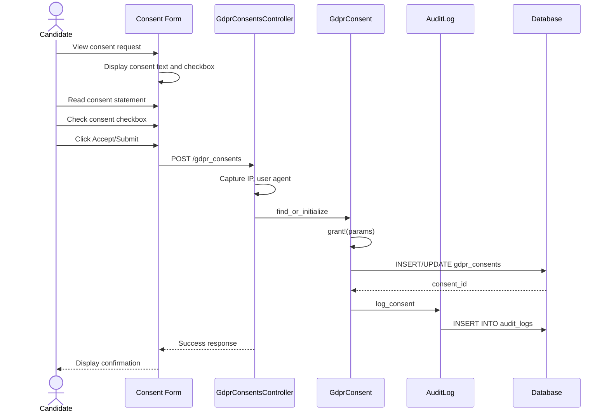

# UC-301: Record Consent

## Metadata

| Attribute | Value |
|-----------|-------|
| **ID** | UC-301 |
| **Name** | Record Consent |
| **Functional Area** | Compliance & Audit |
| **Primary Actor** | Candidate (ACT-07) |
| **Priority** | P1 |
| **Complexity** | Low |
| **Status** | Draft |

## Description

A candidate provides explicit consent for data processing activities as required by GDPR and other privacy regulations. The system captures the consent type, timestamp, method of collection, and IP address. Candidates can grant or withdraw consent for different processing purposes independently.

## Actors

| Actor | Role in Use Case |
|-------|------------------|
| Candidate (ACT-07) | Grants or withdraws consent for data processing |
| System (ACT-13) | Records consent with full audit trail |

## Preconditions

- [ ] Candidate record exists in the system
- [ ] Organization has GDPR mode or consent tracking enabled
- [ ] Consent form is accessible to the candidate

## Postconditions

### Success
- [ ] GdprConsent record created or updated
- [ ] Consent timestamp and metadata captured
- [ ] Audit trail maintained for compliance
- [ ] Candidate can proceed with consented activities

### Failure
- [ ] No consent record created
- [ ] Data processing activities blocked for non-consented purposes

## Triggers

- Candidate begins job application (data_processing consent)
- Candidate opts into marketing communications (marketing consent)
- Candidate authorizes background check (background_check consent)
- Candidate agrees to third-party data sharing (third_party_sharing consent)
- Candidate withdraws previously granted consent

## Basic Flow



| Step | Actor | Action | System Response |
|------|-------|--------|-----------------|
| 1 | Candidate | Views consent request | System displays consent form with legal text |
| 2 | Candidate | Reads consent statement | Full consent text displayed |
| 3 | Candidate | Checks consent checkbox | Consent acknowledged |
| 4 | Candidate | Clicks "Accept" or "Submit" | System validates input |
| 5 | System | Captures metadata | IP address, user agent, timestamp recorded |
| 6 | System | Creates/updates GdprConsent | Record saved with granted=true |
| 7 | System | Creates audit log | Consent event logged |
| 8 | System | Displays confirmation | Success message shown |

## Alternative Flows

### AF-1: Withdraw Consent

**Trigger:** Candidate wants to withdraw previously granted consent

| Step | Actor | Action | System Response |
|------|-------|--------|-----------------|
| 1a | Candidate | Navigates to privacy settings | System shows consent statuses |
| 2a | Candidate | Clicks "Withdraw" for consent type | Confirmation dialog shown |
| 3a | Candidate | Confirms withdrawal | System processes withdrawal |
| 4a | System | Updates GdprConsent | granted=false, withdrawn_at set |
| 5a | System | Logs withdrawal | Audit trail updated |
| 6a | System | Triggers dependent actions | May affect data processing |

**Resumption:** Use case ends

### AF-2: Multiple Consent Types

**Trigger:** Candidate presented with multiple consent options simultaneously

| Step | Actor | Action | System Response |
|------|-------|--------|-----------------|
| 1b | System | Displays consent bundle | Multiple consent types shown |
| 2b | Candidate | Selects desired consents | Can choose individually |
| 3b | System | Creates separate records | One GdprConsent per type |

**Resumption:** Continues at step 5 of basic flow for each consent

### AF-3: Consent via Email Link

**Trigger:** Candidate receives consent request via email

| Step | Actor | Action | System Response |
|------|-------|--------|-----------------|
| 0c | System | Sends consent request email | Email with secure link sent |
| 1c | Candidate | Clicks link in email | Token validated |
| 2c | System | Displays consent form | collection_method = email_link |

**Resumption:** Continues at step 2 of basic flow

## Exception Flows

### EF-1: Required Consent Declined

**Trigger:** Candidate declines required data_processing consent

| Step | Actor | Action | System Response |
|------|-------|--------|-----------------|
| E.1 | Candidate | Declines required consent | System displays warning |
| E.2 | System | Explains consequences | Cannot proceed without consent |
| E.3 | Candidate | Confirms decline or reconsiders | Process halted or continues |

**Resolution:** Application process cannot continue without data_processing consent

### EF-2: Consent Already Recorded

**Trigger:** Candidate attempts to grant already-active consent

| Step | Actor | Action | System Response |
|------|-------|--------|-----------------|
| E.1 | System | Detects active consent | Displays current consent status |
| E.2 | Candidate | Acknowledges | No duplicate record created |

**Resolution:** Existing consent remains valid

## Business Rules

| ID | Rule | Description |
|----|------|-------------|
| BR-301.1 | Explicit Consent | Consent must be explicit, not pre-checked |
| BR-301.2 | Granular Consent | Each consent type tracked separately |
| BR-301.3 | Easy Withdrawal | Withdrawal must be as easy as granting |
| BR-301.4 | Consent Text | Full consent text must be presented and recorded |
| BR-301.5 | Timestamp Required | All consent actions must have precise timestamps |
| BR-301.6 | Data Processing Required | data_processing consent required to create application |

## Data Requirements

### Input Data

| Field | Type | Required | Validation |
|-------|------|----------|------------|
| candidate_id | integer | Yes | Must exist in organization |
| consent_type | enum | Yes | data_processing, marketing, third_party_sharing, background_check |
| granted | boolean | Yes | true for grant, false for withdraw |
| collection_method | enum | No | application_form, email_link, portal, verbal |

### Output Data

| Field | Type | Description |
|-------|------|-------------|
| id | integer | Unique consent record identifier |
| granted_at | datetime | When consent was granted |
| withdrawn_at | datetime | When consent was withdrawn (if applicable) |
| ip_address | string | IP address at consent time |
| user_agent | string | Browser/client information |

## Database Transactions

### Tables Affected

| Table | Operation | Conditions |
|-------|-----------|------------|
| gdpr_consents | CREATE/UPDATE | When granting or withdrawing |
| audit_logs | CREATE | Always |

### Transaction Detail

```sql
-- Record Consent Transaction (Grant)
BEGIN TRANSACTION;

-- Step 1: Insert or update consent record
INSERT INTO gdpr_consents (
    organization_id,
    candidate_id,
    consent_type,
    granted,
    granted_at,
    withdrawn_at,
    ip_address,
    user_agent,
    collection_method,
    created_at,
    updated_at
) VALUES (
    @organization_id,
    @candidate_id,
    @consent_type,
    true,
    NOW(),
    NULL,
    @ip_address,
    @user_agent,
    @collection_method,
    NOW(),
    NOW()
)
ON DUPLICATE KEY UPDATE
    granted = true,
    granted_at = NOW(),
    withdrawn_at = NULL,
    ip_address = @ip_address,
    user_agent = @user_agent,
    collection_method = @collection_method,
    updated_at = NOW();

SET @consent_id = LAST_INSERT_ID();

-- Step 2: Create audit log
INSERT INTO audit_logs (
    organization_id,
    user_id,
    action,
    auditable_type,
    auditable_id,
    metadata,
    ip_address,
    created_at
) VALUES (
    @organization_id,
    NULL,
    'gdpr_consent.granted',
    'GdprConsent',
    @consent_id,
    JSON_OBJECT(
        'consent_type', @consent_type,
        'candidate_id', @candidate_id,
        'collection_method', @collection_method
    ),
    @ip_address,
    NOW()
);

COMMIT;
```

### Withdraw Consent Transaction

```sql
-- Record Consent Transaction (Withdraw)
BEGIN TRANSACTION;

UPDATE gdpr_consents
SET granted = false,
    withdrawn_at = NOW(),
    updated_at = NOW()
WHERE candidate_id = @candidate_id
  AND consent_type = @consent_type;

INSERT INTO audit_logs (
    organization_id,
    user_id,
    action,
    auditable_type,
    auditable_id,
    metadata,
    ip_address,
    created_at
) VALUES (
    @organization_id,
    NULL,
    'gdpr_consent.withdrawn',
    'GdprConsent',
    @consent_id,
    JSON_OBJECT('consent_type', @consent_type),
    @ip_address,
    NOW()
);

COMMIT;
```

### Rollback Scenarios

| Scenario | Rollback Action |
|----------|-----------------|
| Validation failure | No transaction started |
| Database error | Full rollback |

## UI/UX Requirements

### Screen/Component

- **Location:** Integrated into application flow, candidate portal privacy settings
- **Entry Point:**
  - Application form
  - Email consent link
  - Portal privacy settings page
- **Key Elements:**
  - Clear consent text
  - Unchecked checkbox by default
  - Accept/Decline buttons
  - Link to full privacy policy

### Form Layout

```
+----------------------------------------------------------+
| Data Processing Consent                                   |
+----------------------------------------------------------+
| We need your consent to process your personal data for    |
| recruitment purposes.                                     |
|                                                           |
| By checking this box, you consent to:                     |
| - Storage of your application data                        |
| - Review by our hiring team                               |
| - Communication regarding your application                |
|                                                           |
| Read our full [Privacy Policy]                            |
|                                                           |
| [ ] I consent to the processing of my personal data       |
|     for recruitment purposes as described above.          |
|                                                           |
+----------------------------------------------------------+
| [Decline]                                      [Accept]   |
+----------------------------------------------------------+

+----------------------------------------------------------+
| Marketing Communications (Optional)                       |
+----------------------------------------------------------+
| [ ] I would like to receive updates about future job      |
|     opportunities and company news.                       |
|                                                           |
| You can withdraw this consent at any time.                |
+----------------------------------------------------------+
```

## Non-Functional Requirements

| Requirement | Target |
|-------------|--------|
| Response Time | Consent recording < 500ms |
| Availability | 99.9% |
| Audit Trail | Complete record of all consent actions |

## Security Considerations

- [x] Authentication: Candidate identity verified via token or login
- [x] Data integrity: Consent records immutable once created
- [x] Audit logging: Full audit trail of consent events
- [x] GDPR compliance: Meets Article 7 consent requirements

## Related Use Cases

| Use Case | Relationship |
|----------|--------------|
| UC-100 Apply for Job | Requires data_processing consent |
| UC-302 Initiate Background Check | Requires background_check consent |
| UC-309 Process Data Deletion Request | May require consent verification |
| UC-300 Collect EEOC Data | Related voluntary consent |

---

## Data Model References

> Cross-references to [DATA_MODEL.md](../DATA_MODEL.md) and [CRUD_MATRIX.md](../CRUD_MATRIX.md)

### Subject Areas

| Subject Area | ID | Relationship |
|--------------|-----|--------------|
| Compliance & Audit | SA-09 | Primary |
| Candidate | SA-04 | Secondary |

### Entities CRUD

| Entity | C | R | U | D | Notes |
|--------|---|---|---|---|-------|
| GdprConsent | ✓ | ✓ | ✓ | | Created/updated on consent actions |
| Candidate | | ✓ | | | Read to validate ownership |
| AuditLog | ✓ | | | | Created for each consent action |

**Legend:** C = Create, R = Read, U = Update, D = Delete

---

## Process Model References

> Cross-references to [PROCESS_MODEL.md](../PROCESS_MODEL.md) and [PROCESS_CRUD_MATRIX.md](../PROCESS_CRUD_MATRIX.md)

| Attribute | Value | Link |
|-----------|-------|------|
| **Elementary Business Process** | EP-0911: Record Consent | [PROCESS_MODEL.md#ep-0911](../PROCESS_MODEL.md#ep-0911-record-consent) |
| **Business Process** | BP-402: GDPR/Privacy Compliance | [PROCESS_MODEL.md#bp-402](../PROCESS_MODEL.md#bp-402-gdprprivacy-compliance) |
| **Business Function** | BF-04: Compliance Management | [PROCESS_MODEL.md#bf-04](../PROCESS_MODEL.md#bf-04-compliance-management) |

### EBP Details

| Attribute | Value |
|-----------|-------|
| **Trigger** | Candidate action requiring consent or explicit consent request |
| **Input** | Consent type, candidate acknowledgment |
| **Output** | GdprConsent record with full metadata |
| **Business Rules** | BR-301.1 through BR-301.6 (see Business Rules section) |

---

## Traceability Matrix

> Complete artifact mapping for requirements traceability

| Artifact Type | ID | Name | Link |
|---------------|-----|------|------|
| **Use Case** | UC-301 | Record Consent | *(this document)* |
| **Elementary Process** | EP-0911 | Record Consent | [PROCESS_MODEL.md](../PROCESS_MODEL.md#ep-0911-record-consent) |
| **Business Process** | BP-402 | GDPR/Privacy Compliance | [PROCESS_MODEL.md](../PROCESS_MODEL.md#bp-402-gdprprivacy-compliance) |
| **Business Function** | BF-04 | Compliance Management | [PROCESS_MODEL.md](../PROCESS_MODEL.md#bf-04-compliance-management) |
| **Primary Actor** | ACT-07 | Candidate | [ACTORS.md](../ACTORS.md#act-07-candidate) |
| **Subject Area (Primary)** | SA-09 | Compliance & Audit | [DATA_MODEL.md](../DATA_MODEL.md#sa-09-compliance--audit) |
| **Subject Area (Secondary)** | SA-04 | Candidate | [DATA_MODEL.md](../DATA_MODEL.md#sa-04-candidate) |
| **CRUD Matrix Row** | UC-301 | - | [CRUD_MATRIX.md](../CRUD_MATRIX.md#uc-301) |
| **Process CRUD Row** | EP-0911 | - | [PROCESS_CRUD_MATRIX.md](../PROCESS_CRUD_MATRIX.md#ep-0911) |

### Implementation Artifacts

| Artifact Type | Path/Reference | Status |
|---------------|----------------|--------|
| Controller | `app/controllers/gdpr_consents_controller.rb` | Implemented |
| Model | `app/models/gdpr_consent.rb` | Implemented |
| Policy | `app/policies/gdpr_consent_policy.rb` | Implemented |
| View | `app/views/gdpr_consents/` | Implemented |
| Test | `test/models/gdpr_consent_test.rb` | Implemented |

---

## Open Questions

1. How long should consent records be retained after candidate data deletion?
2. Should consent renewal be required after a certain time period?

## Change History

| Version | Date | Author | Changes |
|---------|------|--------|---------|
| 0.1 | 2026-01-25 | System | Initial draft |
