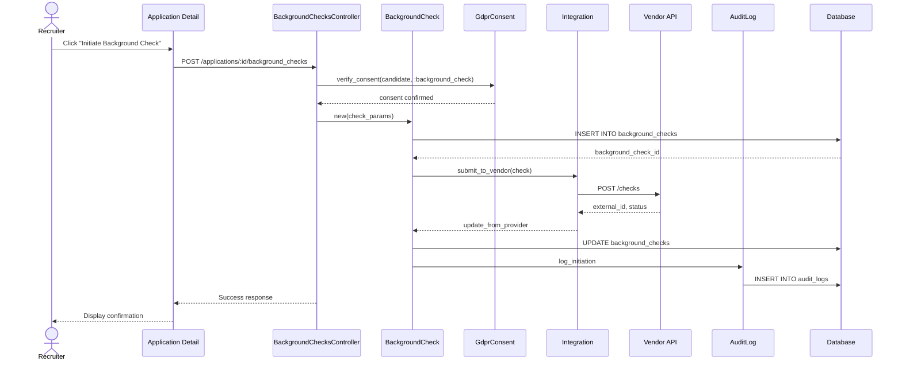

# UC-302: Initiate Background Check

## Metadata

| Attribute | Value |
|-----------|-------|
| **ID** | UC-302 |
| **Name** | Initiate Background Check |
| **Functional Area** | Compliance & Audit |
| **Primary Actor** | Recruiter (ACT-02) |
| **Priority** | P1 |
| **Complexity** | Medium |
| **Status** | Draft |

## Description

A recruiter initiates a background check for a candidate who has reached the appropriate stage in the hiring pipeline. The system verifies consent, sends the request to the configured background check vendor, and tracks the status of the screening process.

## Actors

| Actor | Role in Use Case |
|-------|------------------|
| Recruiter (ACT-02) | Initiates the background check request |
| Candidate (ACT-07) | Must have provided background_check consent |
| Background Screening Vendor (ACT-10) | Receives and processes the check request |
| Integration Gateway (ACT-12) | Handles communication with vendor API |

## Preconditions

- [ ] Candidate has an active application
- [ ] Application is in background_check stage or appropriate pipeline stage
- [ ] Candidate has granted background_check consent (GdprConsent)
- [ ] Organization has background check integration configured
- [ ] User has permission to initiate background checks

## Postconditions

### Success
- [ ] BackgroundCheck record created with status 'pending' or 'consent_required'
- [ ] Request sent to background check vendor
- [ ] Candidate notified of background check initiation
- [ ] Audit log entry created

### Failure
- [ ] No BackgroundCheck record created
- [ ] Error message displayed to recruiter
- [ ] Integration error logged

## Triggers

- Recruiter clicks "Initiate Background Check" on application detail page
- Application moves to background_check stage (automated trigger if configured)
- Bulk action to initiate checks for multiple candidates

## Basic Flow



| Step | Actor | Action | System Response |
|------|-------|--------|-----------------|
| 1 | Recruiter | Clicks "Initiate Background Check" | System displays check configuration |
| 2 | Recruiter | Selects check types (criminal, employment, etc.) | Check types recorded |
| 3 | Recruiter | Confirms initiation | System validates request |
| 4 | System | Verifies candidate consent | GdprConsent.background_check confirmed |
| 5 | System | Creates BackgroundCheck record | Record with status 'pending' |
| 6 | System | Submits to vendor via integration | API call to vendor |
| 7 | System | Updates with external ID | Vendor reference stored |
| 8 | System | Creates audit log | Initiation logged |
| 9 | System | Sends notification to candidate | Email notification sent |
| 10 | System | Displays confirmation | Success message shown |

## Alternative Flows

### AF-1: Consent Not Yet Granted

**Trigger:** Candidate has not granted background_check consent at step 4

| Step | Actor | Action | System Response |
|------|-------|--------|-----------------|
| 4a | System | Detects missing consent | Displays consent required message |
| 5a | System | Creates check with status 'consent_required' | Record created awaiting consent |
| 6a | System | Sends consent request to candidate | Email with consent link sent |
| 7a | Candidate | Grants consent | Consent recorded |
| 8a | System | Automatically submits check | Continues to step 6 |

**Resumption:** Check proceeds after consent granted

### AF-2: Multiple Check Types

**Trigger:** Recruiter selects multiple check types (criminal, employment, education)

| Step | Actor | Action | System Response |
|------|-------|--------|-----------------|
| 2a | Recruiter | Selects multiple check types | All types recorded in check_types array |
| 5a | System | Creates single BackgroundCheck | check_types = ['criminal', 'employment'] |

**Resumption:** Continues at step 6 of basic flow

### AF-3: Re-initiate Cancelled Check

**Trigger:** Previous check was cancelled and needs to be re-initiated

| Step | Actor | Action | System Response |
|------|-------|--------|-----------------|
| 1a | System | Detects previous cancelled check | Shows previous check history |
| 2a | Recruiter | Confirms new check initiation | New check created |

**Resumption:** Continues at step 3 of basic flow

## Exception Flows

### EF-1: Integration Not Configured

**Trigger:** Organization has no active background check integration

| Step | Actor | Action | System Response |
|------|-------|--------|-----------------|
| E.1 | System | Detects missing integration | Displays configuration error |
| E.2 | System | Provides admin contact | Suggests contacting admin |

**Resolution:** Admin must configure integration first

### EF-2: Vendor API Error

**Trigger:** Background check vendor returns error at step 6

| Step | Actor | Action | System Response |
|------|-------|--------|-----------------|
| 6.1 | System | Receives vendor error | Logs integration error |
| 6.2 | System | Sets status to 'pending' | Will retry automatically |
| 6.3 | System | Displays warning | Notifies of pending submission |

**Resolution:** System will retry, or recruiter can manually retry

### EF-3: Candidate Already Has Active Check

**Trigger:** An in_progress check exists for this application

| Step | Actor | Action | System Response |
|------|-------|--------|-----------------|
| E.1 | System | Detects active check | Displays existing check status |
| E.2 | Recruiter | Views existing check | Cannot create duplicate |

**Resolution:** Must wait for existing check to complete or cancel it

## Business Rules

| ID | Rule | Description |
|----|------|-------------|
| BR-302.1 | Consent Required | Background check cannot proceed without explicit consent |
| BR-302.2 | One Active Check | Only one active check per application at a time |
| BR-302.3 | Integration Required | Organization must have configured background check integration |
| BR-302.4 | Valid Check Types | Check types must be from approved list |
| BR-302.5 | Application Stage | Application should be in appropriate stage for background check |
| BR-302.6 | Audit Trail | All check initiations must be logged |

## Data Requirements

### Input Data

| Field | Type | Required | Validation |
|-------|------|----------|------------|
| application_id | integer | Yes | Must exist and be active |
| check_types | array | Yes | Valid check type values |
| consent_method | enum | No | email, portal, in_person |
| notes | text | No | Max 2000 chars |

### Output Data

| Field | Type | Description |
|-------|------|-------------|
| id | integer | BackgroundCheck record ID |
| status | enum | pending, consent_required, in_progress |
| external_id | string | Vendor reference ID |
| submitted_at | datetime | When submitted to vendor |
| estimated_days | integer | Estimated completion time |

## Database Transactions

### Tables Affected

| Table | Operation | Conditions |
|-------|-----------|------------|
| background_checks | CREATE | Always |
| integration_logs | CREATE | On vendor API call |
| audit_logs | CREATE | Always |

### Transaction Detail

```sql
-- Initiate Background Check Transaction
BEGIN TRANSACTION;

-- Step 1: Verify consent exists
SELECT id FROM gdpr_consents
WHERE candidate_id = @candidate_id
  AND consent_type = 'background_check'
  AND granted = true
  AND withdrawn_at IS NULL;

-- Step 2: Create background check record
INSERT INTO background_checks (
    organization_id,
    application_id,
    candidate_id,
    integration_id,
    requested_by_id,
    status,
    check_types,
    consent_method,
    created_at,
    updated_at
) VALUES (
    @organization_id,
    @application_id,
    @candidate_id,
    @integration_id,
    @current_user_id,
    'pending',
    @check_types,
    @consent_method,
    NOW(),
    NOW()
);

SET @check_id = LAST_INSERT_ID();

-- Step 3: Log integration activity
INSERT INTO integration_logs (
    integration_id,
    action,
    status,
    direction,
    request_data,
    created_at
) VALUES (
    @integration_id,
    'background_check.initiate',
    'pending',
    'outbound',
    JSON_OBJECT('check_id', @check_id, 'check_types', @check_types),
    NOW()
);

-- Step 4: Create audit log
INSERT INTO audit_logs (
    organization_id,
    user_id,
    action,
    auditable_type,
    auditable_id,
    metadata,
    ip_address,
    created_at
) VALUES (
    @organization_id,
    @current_user_id,
    'background_check.initiated',
    'BackgroundCheck',
    @check_id,
    JSON_OBJECT(
        'application_id', @application_id,
        'candidate_id', @candidate_id,
        'check_types', @check_types
    ),
    @ip_address,
    NOW()
);

COMMIT;
```

### Rollback Scenarios

| Scenario | Rollback Action |
|----------|-----------------|
| Consent not found | No check created, error returned |
| Vendor API failure | Check remains pending, will retry |
| Database error | Full rollback |

## UI/UX Requirements

### Screen/Component

- **Location:** /admin/applications/:id/background_checks/new
- **Entry Point:**
  - "Initiate Background Check" button on application detail
  - Background check stage action
- **Key Elements:**
  - Check type selection (checkboxes)
  - Consent status indicator
  - Candidate information summary
  - Estimated completion time
  - Submit and Cancel buttons

### Form Layout

```
+----------------------------------------------------------+
| Initiate Background Check                                 |
+----------------------------------------------------------+
| Candidate: John Smith                                     |
| Application: Senior Developer - REQ-2024-001              |
| Consent Status: [✓] Granted on Jan 20, 2026               |
|                                                           |
| Select Check Types:                                       |
| [✓] Criminal Background                                   |
| [✓] Employment Verification                               |
| [ ] Education Verification                                |
| [ ] Credit Check                                          |
| [ ] Drug Screening                                        |
| [ ] Identity Verification                                 |
| [ ] Driving Record                                        |
| [ ] Professional License                                  |
|                                                           |
| Estimated Completion: 3-5 business days                   |
|                                                           |
| Notes (internal):                                         |
| +------------------------------------------------------+ |
| |                                                      | |
| +------------------------------------------------------+ |
|                                                           |
+----------------------------------------------------------+
| [Cancel]                              [Initiate Check]    |
+----------------------------------------------------------+
```

## Non-Functional Requirements

| Requirement | Target |
|-------------|--------|
| Response Time | Check initiation < 3 seconds |
| Availability | 99.9% |
| Retry Logic | Failed submissions retry up to 3 times |
| Data Security | PII encrypted in transit and at rest |

## Security Considerations

- [x] Authentication required (recruiter role)
- [x] Authorization: User must have permission for background checks
- [x] Consent verification before any data sharing
- [x] PII encrypted when sent to vendor
- [x] Audit logging of all check activities

## Related Use Cases

| Use Case | Relationship |
|----------|--------------|
| UC-301 Record Consent | Must have background_check consent |
| UC-303 Receive Screening Results | Follows this use case |
| UC-304 Initiate Adverse Action | May follow if results negative |
| UC-103 Move Stage | Application may move to background_check stage |

---

## Data Model References

> Cross-references to [DATA_MODEL.md](../DATA_MODEL.md) and [CRUD_MATRIX.md](../CRUD_MATRIX.md)

### Subject Areas

| Subject Area | ID | Relationship |
|--------------|-----|--------------|
| Compliance & Audit | SA-09 | Primary |
| Integration | SA-11 | Secondary |
| Application Pipeline | SA-05 | Reference |

### Entities CRUD

| Entity | C | R | U | D | Notes |
|--------|---|---|---|---|-------|
| BackgroundCheck | ✓ | | | | Created in step 5 |
| GdprConsent | | ✓ | | | Read to verify consent |
| Integration | | ✓ | | | Read for vendor configuration |
| IntegrationLog | ✓ | | | | Created for API call |
| Application | | ✓ | | | Read for candidate context |
| AuditLog | ✓ | | | | Created in step 8 |

**Legend:** C = Create, R = Read, U = Update, D = Delete

---

## Process Model References

> Cross-references to [PROCESS_MODEL.md](../PROCESS_MODEL.md) and [PROCESS_CRUD_MATRIX.md](../PROCESS_CRUD_MATRIX.md)

| Attribute | Value | Link |
|-----------|-------|------|
| **Elementary Business Process** | EP-0921: Initiate Background Check | [PROCESS_MODEL.md#ep-0921](../PROCESS_MODEL.md#ep-0921-initiate-background-check) |
| **Business Process** | BP-403: Background Verification | [PROCESS_MODEL.md#bp-403](../PROCESS_MODEL.md#bp-403-background-verification) |
| **Business Function** | BF-04: Compliance Management | [PROCESS_MODEL.md#bf-04](../PROCESS_MODEL.md#bf-04-compliance-management) |

### EBP Details

| Attribute | Value |
|-----------|-------|
| **Trigger** | Recruiter action or pipeline stage trigger |
| **Input** | Application, check types, candidate consent |
| **Output** | BackgroundCheck record submitted to vendor |
| **Business Rules** | BR-302.1 through BR-302.6 (see Business Rules section) |

---

## Traceability Matrix

> Complete artifact mapping for requirements traceability

| Artifact Type | ID | Name | Link |
|---------------|-----|------|------|
| **Use Case** | UC-302 | Initiate Background Check | *(this document)* |
| **Elementary Process** | EP-0921 | Initiate Background Check | [PROCESS_MODEL.md](../PROCESS_MODEL.md#ep-0921-initiate-background-check) |
| **Business Process** | BP-403 | Background Verification | [PROCESS_MODEL.md](../PROCESS_MODEL.md#bp-403-background-verification) |
| **Business Function** | BF-04 | Compliance Management | [PROCESS_MODEL.md](../PROCESS_MODEL.md#bf-04-compliance-management) |
| **Primary Actor** | ACT-02 | Recruiter | [ACTORS.md](../ACTORS.md#act-02-recruiter) |
| **Subject Area (Primary)** | SA-09 | Compliance & Audit | [DATA_MODEL.md](../DATA_MODEL.md#sa-09-compliance--audit) |
| **Subject Area (Secondary)** | SA-11 | Integration | [DATA_MODEL.md](../DATA_MODEL.md#sa-11-integration) |
| **CRUD Matrix Row** | UC-302 | - | [CRUD_MATRIX.md](../CRUD_MATRIX.md#uc-302) |
| **Process CRUD Row** | EP-0921 | - | [PROCESS_CRUD_MATRIX.md](../PROCESS_CRUD_MATRIX.md#ep-0921) |

### Implementation Artifacts

| Artifact Type | Path/Reference | Status |
|---------------|----------------|--------|
| Controller | `app/controllers/admin/background_checks_controller.rb` | Implemented |
| Model | `app/models/background_check.rb` | Implemented |
| Service | `app/services/background_checks/initiate_service.rb` | Planned |
| Policy | `app/policies/background_check_policy.rb` | Implemented |
| Test | `test/models/background_check_test.rb` | Implemented |

---

## Open Questions

1. Should automatic check initiation be supported when application enters stage?
2. What is the maximum number of retry attempts for failed vendor submissions?

## Change History

| Version | Date | Author | Changes |
|---------|------|--------|---------|
| 0.1 | 2026-01-25 | System | Initial draft |
