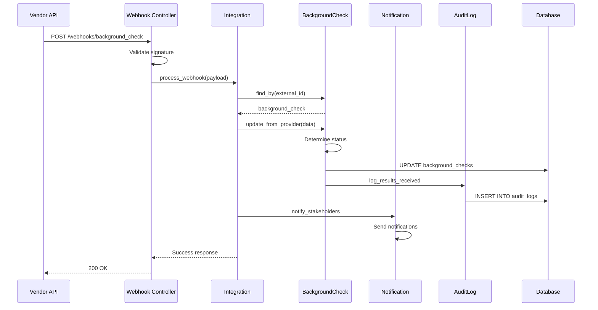

# UC-303: Receive Screening Results

## Metadata

| Attribute | Value |
|-----------|-------|
| **ID** | UC-303 |
| **Name** | Receive Screening Results |
| **Functional Area** | Compliance & Audit |
| **Primary Actor** | Background Screening Vendor (ACT-10) |
| **Priority** | P1 |
| **Complexity** | Medium |
| **Status** | Draft |

## Description

The system receives background check results from an external screening vendor via webhook or API callback. Results are processed, stored securely, and appropriate stakeholders are notified. If results indicate issues (consider/adverse), the check is flagged for review.

## Actors

| Actor | Role in Use Case |
|-------|------------------|
| Background Screening Vendor (ACT-10) | Sends results via webhook/API |
| Integration Gateway (ACT-12) | Receives and validates incoming data |
| Notification Engine (ACT-13) | Sends notifications to stakeholders |
| Recruiter (ACT-02) | Notified of results (secondary) |
| Compliance Officer (ACT-06) | Reviews flagged results (secondary) |

## Preconditions

- [ ] BackgroundCheck record exists with status 'in_progress'
- [ ] Integration is configured with valid webhook secret
- [ ] External ID matches a known background check

## Postconditions

### Success
- [ ] BackgroundCheck record updated with results
- [ ] Status changed to 'completed' or 'review_required'
- [ ] Result details and summary stored
- [ ] Recruiter notified of results
- [ ] Audit log entry created

### Failure
- [ ] Webhook rejected if signature invalid
- [ ] Error logged for unknown external IDs
- [ ] Retry mechanism for transient failures

## Triggers

- Vendor sends webhook notification when check completes
- Vendor sends status update during check processing
- System polls vendor API for status (if polling configured)

## Basic Flow



| Step | Actor | Action | System Response |
|------|-------|--------|-----------------|
| 1 | Vendor | Sends webhook with results | System receives request |
| 2 | System | Validates webhook signature | Signature verified against secret |
| 3 | System | Extracts external_id and payload | Data parsed |
| 4 | System | Looks up BackgroundCheck by external_id | Record found |
| 5 | System | Updates check with result data | result, result_details, result_summary stored |
| 6 | System | Determines appropriate status | 'completed' or 'review_required' |
| 7 | System | Updates timestamps | completed_at set |
| 8 | System | Creates audit log entry | Results receipt logged |
| 9 | System | Sends notifications | Recruiter notified |
| 10 | System | Returns success response | 200 OK to vendor |

## Alternative Flows

### AF-1: Results Require Review

**Trigger:** Result is 'consider' or 'adverse' at step 6

| Step | Actor | Action | System Response |
|------|-------|--------|-----------------|
| 6a | System | Detects non-clear result | Status set to 'review_required' |
| 7a | System | Notifies compliance team | Additional notification sent |
| 8a | System | Flags for manual review | Check appears in review queue |

**Resumption:** Continues at step 8 of basic flow

### AF-2: Status Update (Not Final)

**Trigger:** Webhook indicates in-progress status update, not completion

| Step | Actor | Action | System Response |
|------|-------|--------|-----------------|
| 5a | System | Detects status update | estimated_days may be updated |
| 6a | System | Keeps status as 'in_progress' | No completion processing |
| 7a | System | Updates any changed fields | Record updated |

**Resumption:** Use case ends, awaits final results

### AF-3: Partial Results

**Trigger:** Some check types complete while others pending

| Step | Actor | Action | System Response |
|------|-------|--------|-----------------|
| 5a | System | Receives partial results | result_details updated incrementally |
| 6a | System | Keeps status as 'in_progress' | Awaiting remaining checks |

**Resumption:** Use case re-triggers when more results arrive

## Exception Flows

### EF-1: Invalid Webhook Signature

**Trigger:** Signature validation fails at step 2

| Step | Actor | Action | System Response |
|------|-------|--------|-----------------|
| E.1 | System | Detects invalid signature | Logs security warning |
| E.2 | System | Returns 401 Unauthorized | Request rejected |

**Resolution:** Vendor must retry with correct signature

### EF-2: Unknown External ID

**Trigger:** No BackgroundCheck found at step 4

| Step | Actor | Action | System Response |
|------|-------|--------|-----------------|
| E.1 | System | Detects unknown external_id | Logs warning |
| E.2 | System | Returns 404 Not Found | Request acknowledged but not processed |

**Resolution:** Manual investigation required

### EF-3: Malformed Payload

**Trigger:** Webhook payload cannot be parsed

| Step | Actor | Action | System Response |
|------|-------|--------|-----------------|
| E.1 | System | Detects parse error | Logs error with raw payload |
| E.2 | System | Returns 400 Bad Request | Request rejected |

**Resolution:** Vendor notified of format issue

## Business Rules

| ID | Rule | Description |
|----|------|-------------|
| BR-303.1 | Signature Validation | All webhooks must have valid signature |
| BR-303.2 | Idempotency | Duplicate webhooks handled gracefully |
| BR-303.3 | Review for Adverse | Non-clear results require compliance review |
| BR-303.4 | Secure Storage | Result details stored with encryption |
| BR-303.5 | Notification | Stakeholders notified within 5 minutes of receipt |
| BR-303.6 | Audit Trail | All result receipts must be logged |

## Data Requirements

### Input Data (Webhook Payload)

| Field | Type | Required | Validation |
|-------|------|----------|------------|
| external_id | string | Yes | Must match existing check |
| status | enum | Yes | in_progress, completed |
| result | enum | Conditional | clear, consider, adverse, incomplete |
| result_summary | string | No | Human-readable summary |
| result_details | object | No | Detailed findings by check type |
| estimated_days | integer | No | Updated completion estimate |
| external_url | string | No | Link to vendor portal |

### Output Data

| Field | Type | Description |
|-------|------|-------------|
| background_check.status | enum | Updated status |
| background_check.result | enum | Check result |
| background_check.completed_at | datetime | Completion timestamp |
| integration_log | record | API interaction logged |

## Database Transactions

### Tables Affected

| Table | Operation | Conditions |
|-------|-----------|------------|
| background_checks | UPDATE | Always |
| integration_logs | CREATE | Always |
| audit_logs | CREATE | Always |
| notifications | CREATE | If configured |

### Transaction Detail

```sql
-- Receive Screening Results Transaction
BEGIN TRANSACTION;

-- Step 1: Find the background check
SELECT id, application_id, candidate_id
FROM background_checks
WHERE external_id = @external_id
  AND organization_id = @organization_id;

-- Step 2: Update background check with results
UPDATE background_checks
SET status = CASE
    WHEN @result IN ('consider', 'adverse') THEN 'review_required'
    ELSE 'completed'
    END,
    result = @result,
    result_summary = @result_summary,
    result_details = @result_details,
    external_url = @external_url,
    completed_at = CASE WHEN @result IS NOT NULL THEN NOW() ELSE completed_at END,
    updated_at = NOW()
WHERE id = @check_id;

-- Step 3: Log integration activity
INSERT INTO integration_logs (
    integration_id,
    action,
    status,
    direction,
    request_data,
    response_data,
    duration_ms,
    created_at
) VALUES (
    @integration_id,
    'background_check.results_received',
    'success',
    'inbound',
    @webhook_payload,
    JSON_OBJECT('check_id', @check_id, 'result', @result),
    @duration_ms,
    NOW()
);

-- Step 4: Create audit log
INSERT INTO audit_logs (
    organization_id,
    user_id,
    action,
    auditable_type,
    auditable_id,
    metadata,
    created_at
) VALUES (
    @organization_id,
    NULL,
    'background_check.results_received',
    'BackgroundCheck',
    @check_id,
    JSON_OBJECT(
        'result', @result,
        'status', @new_status,
        'external_id', @external_id
    ),
    NOW()
);

COMMIT;
```

### Rollback Scenarios

| Scenario | Rollback Action |
|----------|-----------------|
| Unknown external_id | No transaction, return 404 |
| Database error | Full rollback, return 500 |

## UI/UX Requirements

### Screen/Component

- **Location:** Results displayed on application detail page
- **Entry Point:**
  - Background check section on application
  - Compliance review queue
- **Key Elements:**
  - Result badge (Clear/Consider/Adverse)
  - Result summary text
  - Link to vendor portal
  - Detailed findings (expandable)
  - Review action buttons (if review_required)

### Results Display

```
+----------------------------------------------------------+
| Background Check Results                                  |
+----------------------------------------------------------+
| Status: [Completed] [Review Required]                     |
| Result: [Consider] - Issues found                         |
| Completed: Jan 25, 2026 at 2:30 PM                        |
|                                                           |
| Summary:                                                  |
| Criminal background check revealed a misdemeanor          |
| conviction from 2020.                                     |
|                                                           |
| [View Full Report in Vendor Portal]                       |
|                                                           |
| Check Details:                                            |
| +------------------------------------------------------+ |
| | Criminal:    [Consider] - 1 record found             | |
| | Employment:  [Clear] - Verified 3 employers          | |
| | Education:   [Clear] - Degree confirmed              | |
| +------------------------------------------------------+ |
|                                                           |
| [Initiate Adverse Action]  [Finalize Review - Clear]     |
+----------------------------------------------------------+
```

## Non-Functional Requirements

| Requirement | Target |
|-------------|--------|
| Response Time | Webhook processing < 5 seconds |
| Availability | Webhook endpoint 99.9% |
| Notification Delay | < 5 minutes from receipt |
| Idempotency | Handle duplicate webhooks |

## Security Considerations

- [x] Webhook signature validation using HMAC
- [x] Result details encrypted at rest
- [x] Access restricted to authorized roles
- [x] Audit trail of all result access
- [x] PII redaction in logs

## Related Use Cases

| Use Case | Relationship |
|----------|--------------|
| UC-302 Initiate Background Check | Precedes this use case |
| UC-304 Initiate Adverse Action | May follow if results adverse |
| UC-307 View Audit Trail | Results visible in audit trail |

---

## Data Model References

> Cross-references to [DATA_MODEL.md](../DATA_MODEL.md) and [CRUD_MATRIX.md](../CRUD_MATRIX.md)

### Subject Areas

| Subject Area | ID | Relationship |
|--------------|-----|--------------|
| Compliance & Audit | SA-09 | Primary |
| Integration | SA-11 | Secondary |

### Entities CRUD

| Entity | C | R | U | D | Notes |
|--------|---|---|---|---|-------|
| BackgroundCheck | | ✓ | ✓ | | Read by external_id, updated with results |
| IntegrationLog | ✓ | | | | Created for webhook receipt |
| AuditLog | ✓ | | | | Created for results receipt |
| Notification | ✓ | | | | Created to notify stakeholders |

**Legend:** C = Create, R = Read, U = Update, D = Delete

---

## Process Model References

> Cross-references to [PROCESS_MODEL.md](../PROCESS_MODEL.md) and [PROCESS_CRUD_MATRIX.md](../PROCESS_CRUD_MATRIX.md)

| Attribute | Value | Link |
|-----------|-------|------|
| **Elementary Business Process** | EP-0922: Receive Screening Results | [PROCESS_MODEL.md#ep-0922](../PROCESS_MODEL.md#ep-0922-receive-screening-results) |
| **Business Process** | BP-403: Background Verification | [PROCESS_MODEL.md#bp-403](../PROCESS_MODEL.md#bp-403-background-verification) |
| **Business Function** | BF-04: Compliance Management | [PROCESS_MODEL.md#bf-04](../PROCESS_MODEL.md#bf-04-compliance-management) |

### EBP Details

| Attribute | Value |
|-----------|-------|
| **Trigger** | Vendor webhook or API callback with results |
| **Input** | Webhook payload with check results |
| **Output** | Updated BackgroundCheck record, stakeholder notifications |
| **Business Rules** | BR-303.1 through BR-303.6 (see Business Rules section) |

---

## Traceability Matrix

> Complete artifact mapping for requirements traceability

| Artifact Type | ID | Name | Link |
|---------------|-----|------|------|
| **Use Case** | UC-303 | Receive Screening Results | *(this document)* |
| **Elementary Process** | EP-0922 | Receive Screening Results | [PROCESS_MODEL.md](../PROCESS_MODEL.md#ep-0922-receive-screening-results) |
| **Business Process** | BP-403 | Background Verification | [PROCESS_MODEL.md](../PROCESS_MODEL.md#bp-403-background-verification) |
| **Business Function** | BF-04 | Compliance Management | [PROCESS_MODEL.md](../PROCESS_MODEL.md#bf-04-compliance-management) |
| **Primary Actor** | ACT-10 | Background Screening Vendor | [ACTORS.md](../ACTORS.md#act-10-background-screening-vendor) |
| **Subject Area (Primary)** | SA-09 | Compliance & Audit | [DATA_MODEL.md](../DATA_MODEL.md#sa-09-compliance--audit) |
| **Subject Area (Secondary)** | SA-11 | Integration | [DATA_MODEL.md](../DATA_MODEL.md#sa-11-integration) |
| **CRUD Matrix Row** | UC-303 | - | [CRUD_MATRIX.md](../CRUD_MATRIX.md#uc-303) |
| **Process CRUD Row** | EP-0922 | - | [PROCESS_CRUD_MATRIX.md](../PROCESS_CRUD_MATRIX.md#ep-0922) |

### Implementation Artifacts

| Artifact Type | Path/Reference | Status |
|---------------|----------------|--------|
| Controller | `app/controllers/webhooks/background_checks_controller.rb` | Planned |
| Model | `app/models/background_check.rb` | Implemented |
| Service | `app/services/background_checks/process_results_service.rb` | Planned |
| Test | `test/models/background_check_test.rb` | Implemented |

---

## Open Questions

1. What is the retention policy for detailed result data?
2. Should the system support multiple vendor formats?

## Change History

| Version | Date | Author | Changes |
|---------|------|--------|---------|
| 0.1 | 2026-01-25 | System | Initial draft |
