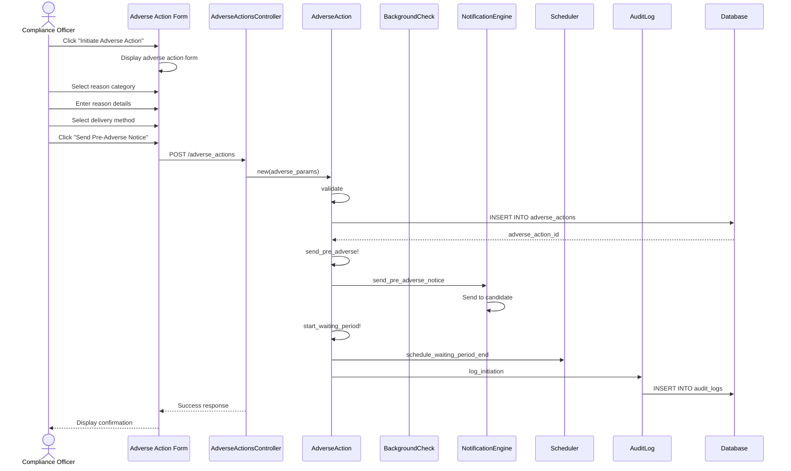

# UC-304: Initiate Adverse Action

## Metadata

| Attribute | Value |
|-----------|-------|
| **ID** | UC-304 |
| **Name** | Initiate Adverse Action |
| **Functional Area** | Compliance & Audit |
| **Primary Actor** | Compliance Officer (ACT-06) |
| **Priority** | P1 |
| **Complexity** | High |
| **Status** | Draft |

## Description

A compliance officer initiates the adverse action process when background check results indicate issues that may impact the hiring decision. Per FCRA requirements, a pre-adverse action notice must be sent to the candidate before any final adverse employment action is taken. This starts the mandatory waiting period during which the candidate can dispute findings.

## Actors

| Actor | Role in Use Case |
|-------|------------------|
| Compliance Officer (ACT-06) | Initiates adverse action process |
| Notification Engine (ACT-13) | Sends pre-adverse notice to candidate |
| Candidate (ACT-07) | Receives notice and may dispute (secondary) |
| Scheduler (ACT-11) | Tracks waiting period expiration |

## Preconditions

- [ ] BackgroundCheck exists with status 'review_required' or result 'consider'/'adverse'
- [ ] No active AdverseAction exists for this application
- [ ] User has compliance officer role or appropriate permissions
- [ ] Application is in active status

## Postconditions

### Success
- [ ] AdverseAction record created with status 'draft' or 'pre_adverse_sent'
- [ ] Pre-adverse action notice sent to candidate
- [ ] Waiting period timer started (5 business days)
- [ ] Background check report provided to candidate
- [ ] Audit log entry created

### Failure
- [ ] No AdverseAction record created
- [ ] Error message displayed
- [ ] Process can be retried

## Triggers

- Compliance officer reviews flagged background check results
- Compliance officer clicks "Initiate Adverse Action" on review queue
- Background check with 'consider' or 'adverse' result requires action

## Basic Flow



| Step | Actor | Action | System Response |
|------|-------|--------|-----------------|
| 1 | Compliance Officer | Clicks "Initiate Adverse Action" | System displays adverse action form |
| 2 | Compliance Officer | Reviews background check findings | Findings displayed for reference |
| 3 | Compliance Officer | Selects reason category | background_check, credential_verification, etc. |
| 4 | Compliance Officer | Enters detailed reason | Free text explaining specific concerns |
| 5 | Compliance Officer | Drafts pre-adverse notice content | Notice text editable from template |
| 6 | Compliance Officer | Selects delivery method | email, mail, or both |
| 7 | Compliance Officer | Clicks "Send Pre-Adverse Notice" | System validates input |
| 8 | System | Creates AdverseAction record | Status 'pre_adverse_sent' |
| 9 | System | Sends pre-adverse notice | Email/mail sent to candidate |
| 10 | System | Attaches background check report | Copy of report to candidate |
| 11 | System | Calculates waiting period end | 5 business days from send date |
| 12 | System | Schedules waiting period job | Timer set for follow-up |
| 13 | System | Creates audit log | Initiation logged |
| 14 | System | Displays confirmation | Success message with next steps |

## Alternative Flows

### AF-1: Save as Draft

**Trigger:** Compliance officer wants to save without sending notice at step 7

| Step | Actor | Action | System Response |
|------|-------|--------|-----------------|
| 7a | Compliance Officer | Clicks "Save as Draft" | System validates and saves |
| 8a | System | Creates AdverseAction | Status 'draft' |
| 9a | System | No notice sent | Can be edited later |

**Resumption:** Returns to draft for future editing and sending

### AF-2: Delivery by Mail Only

**Trigger:** Compliance officer selects mail-only delivery at step 6

| Step | Actor | Action | System Response |
|------|-------|--------|-----------------|
| 6a | Compliance Officer | Selects "Mail" delivery | Mail delivery selected |
| 9a | System | Generates printable notice | PDF created |
| 10a | System | Records mailing address | Address captured |
| 11a | Compliance Officer | Confirms mailing | Manual mailing required |

**Resumption:** Continues at step 11 of basic flow

### AF-3: Link to Existing Background Check

**Trigger:** Multiple background checks exist for application

| Step | Actor | Action | System Response |
|------|-------|--------|-----------------|
| 2a | System | Shows multiple checks | List of checks displayed |
| 2b | Compliance Officer | Selects relevant check | Check linked to action |

**Resumption:** Continues at step 3 of basic flow

## Exception Flows

### EF-1: Active Adverse Action Exists

**Trigger:** AdverseAction already in progress for application

| Step | Actor | Action | System Response |
|------|-------|--------|-----------------|
| E.1 | System | Detects existing action | Error displayed |
| E.2 | System | Shows existing action status | Links to existing record |

**Resolution:** Must complete or cancel existing action first

### EF-2: Email Delivery Failure

**Trigger:** Pre-adverse notice email fails to send at step 9

| Step | Actor | Action | System Response |
|------|-------|--------|-----------------|
| 9.1 | System | Detects email failure | Logs delivery error |
| 9.2 | System | Sets status to 'pre_adverse_sent' | Assumes mailing backup |
| 9.3 | System | Alerts compliance officer | Suggests manual follow-up |

**Resolution:** Manual verification of delivery required

### EF-3: Missing Required Information

**Trigger:** Validation fails at step 7

| Step | Actor | Action | System Response |
|------|-------|--------|-----------------|
| E.1 | System | Detects missing fields | Highlights required fields |
| E.2 | Compliance Officer | Completes required fields | Re-validates |

**Resolution:** Returns to step 3

## Business Rules

| ID | Rule | Description |
|----|------|-------------|
| BR-304.1 | Pre-Adverse Required | Pre-adverse notice must be sent before final action |
| BR-304.2 | Report Copy | Candidate must receive copy of background check report |
| BR-304.3 | Rights Summary | FCRA rights summary must be included |
| BR-304.4 | Waiting Period | Minimum 5 business days before final action |
| BR-304.5 | One Active Action | Only one active adverse action per application |
| BR-304.6 | Reason Required | Specific reason must be documented |

## Data Requirements

### Input Data

| Field | Type | Required | Validation |
|-------|------|----------|------------|
| application_id | integer | Yes | Must have flagged background check |
| action_type | enum | Yes | rejection, offer_withdrawal, termination |
| reason_category | enum | Yes | background_check, credential_verification, reference_check, other |
| reason_details | text | Yes | Min 10 characters |
| pre_adverse_content | text | Yes | Notice content |
| pre_adverse_delivery_method | enum | Yes | email, mail, both |
| waiting_period_days | integer | No | Default 5, min 5 |

### Output Data

| Field | Type | Description |
|-------|------|-------------|
| id | integer | AdverseAction record ID |
| status | enum | pre_adverse_sent, waiting_period |
| pre_adverse_sent_at | datetime | When notice was sent |
| waiting_period_ends_at | datetime | When waiting period expires |

## Database Transactions

### Tables Affected

| Table | Operation | Conditions |
|-------|-----------|------------|
| adverse_actions | CREATE | Always |
| email_logs | CREATE | If email delivery |
| audit_logs | CREATE | Always |

### Transaction Detail

```sql
-- Initiate Adverse Action Transaction
BEGIN TRANSACTION;

-- Step 1: Verify no active adverse action exists
SELECT COUNT(*) FROM adverse_actions
WHERE application_id = @application_id
  AND status NOT IN ('completed', 'cancelled');
-- Must be 0

-- Step 2: Create adverse action record
INSERT INTO adverse_actions (
    organization_id,
    application_id,
    initiated_by_id,
    action_type,
    reason_category,
    reason_details,
    status,
    pre_adverse_content,
    pre_adverse_delivery_method,
    pre_adverse_sent_at,
    waiting_period_days,
    waiting_period_ends_at,
    created_at,
    updated_at
) VALUES (
    @organization_id,
    @application_id,
    @current_user_id,
    @action_type,
    @reason_category,
    @reason_details,
    'pre_adverse_sent',
    @pre_adverse_content,
    @pre_adverse_delivery_method,
    NOW(),
    COALESCE(@waiting_period_days, 5),
    @calculated_end_date,
    NOW(),
    NOW()
);

SET @adverse_action_id = LAST_INSERT_ID();

-- Step 3: Log email if sent
INSERT INTO email_logs (
    organization_id,
    recipient_type,
    recipient_id,
    recipient_email,
    subject,
    body,
    status,
    sent_at,
    created_at,
    updated_at
) VALUES (
    @organization_id,
    'Candidate',
    @candidate_id,
    @candidate_email,
    'Pre-Adverse Action Notice',
    @pre_adverse_content,
    'sent',
    NOW(),
    NOW(),
    NOW()
);

-- Step 4: Create audit log
INSERT INTO audit_logs (
    organization_id,
    user_id,
    action,
    auditable_type,
    auditable_id,
    metadata,
    ip_address,
    created_at
) VALUES (
    @organization_id,
    @current_user_id,
    'adverse_action.initiated',
    'AdverseAction',
    @adverse_action_id,
    JSON_OBJECT(
        'application_id', @application_id,
        'action_type', @action_type,
        'reason_category', @reason_category,
        'waiting_period_ends_at', @calculated_end_date
    ),
    @ip_address,
    NOW()
);

COMMIT;
```

### Rollback Scenarios

| Scenario | Rollback Action |
|----------|-----------------|
| Active action exists | No transaction, return error |
| Validation failure | No transaction, return errors |
| Database error | Full rollback |

## UI/UX Requirements

### Screen/Component

- **Location:** /admin/adverse_actions/new?application_id=X
- **Entry Point:**
  - "Initiate Adverse Action" on background check review
  - Compliance review queue
- **Key Elements:**
  - Background check findings summary
  - Reason category dropdown
  - Reason details textarea
  - Pre-adverse notice editor
  - Delivery method selection
  - FCRA rights summary preview
  - Send and Save Draft buttons

### Form Layout

```
+----------------------------------------------------------+
| Initiate Adverse Action                                   |
+----------------------------------------------------------+
| Candidate: John Smith                                     |
| Application: Senior Developer - REQ-2024-001              |
|                                                           |
| Background Check Findings:                                |
| +------------------------------------------------------+ |
| | Criminal: Misdemeanor conviction (2020)              | |
| | Employment: Verified                                 | |
| | Education: Verified                                  | |
| +------------------------------------------------------+ |
|                                                           |
| Action Type: *                                            |
| [ Rejection                                          v ]  |
|                                                           |
| Reason Category: *                                        |
| [ Background Check                                   v ]  |
|                                                           |
| Reason Details: *                                         |
| +------------------------------------------------------+ |
| | The criminal background check revealed a misdemeanor | |
| | conviction that is relevant to the position...       | |
| +------------------------------------------------------+ |
|                                                           |
| Pre-Adverse Notice: *                                     |
| +------------------------------------------------------+ |
| | Dear John Smith,                                     | |
| |                                                      | |
| | We are writing to inform you that we may take        | |
| | adverse action based on information obtained in      | |
| | your background check...                             | |
| +------------------------------------------------------+ |
|                                                           |
| Delivery Method: *                                        |
| ( ) Email only                                            |
| ( ) Mail only                                             |
| (o) Both email and mail                                   |
|                                                           |
| Waiting Period: 5 business days (required by FCRA)        |
|                                                           |
| Attachments:                                              |
| [✓] Background check report (required)                    |
| [✓] FCRA Summary of Rights (required)                     |
|                                                           |
+----------------------------------------------------------+
| [Cancel]    [Save as Draft]    [Send Pre-Adverse Notice]  |
+----------------------------------------------------------+
```

## Non-Functional Requirements

| Requirement | Target |
|-------------|--------|
| Response Time | Form submission < 3 seconds |
| Email Delivery | Within 5 minutes of submission |
| Availability | 99.9% |
| Document Storage | Secure storage for 7 years minimum |

## Security Considerations

- [x] Authentication required (compliance role)
- [x] Authorization: Only compliance officers can initiate
- [x] Audit logging of all adverse action events
- [x] Encrypted storage of reason details
- [x] Secure transmission of candidate notice

## Related Use Cases

| Use Case | Relationship |
|----------|--------------|
| UC-303 Receive Screening Results | Precedes this (triggers review) |
| UC-305 Complete Adverse Action | Follows after waiting period |
| UC-105 Reject Candidate | May be triggered by completed adverse action |
| UC-307 View Audit Trail | Adverse actions visible in audit |

---

## Data Model References

> Cross-references to [DATA_MODEL.md](../DATA_MODEL.md) and [CRUD_MATRIX.md](../CRUD_MATRIX.md)

### Subject Areas

| Subject Area | ID | Relationship |
|--------------|-----|--------------|
| Compliance & Audit | SA-09 | Primary |
| Application Pipeline | SA-05 | Secondary |
| Communication | SA-10 | Reference |

### Entities CRUD

| Entity | C | R | U | D | Notes |
|--------|---|---|---|---|-------|
| AdverseAction | ✓ | | | | Created in step 8 |
| BackgroundCheck | | ✓ | | | Read for findings |
| Application | | ✓ | | | Read for context |
| EmailLog | ✓ | | | | Created for notice delivery |
| AuditLog | ✓ | | | | Created in step 13 |

**Legend:** C = Create, R = Read, U = Update, D = Delete

---

## Process Model References

> Cross-references to [PROCESS_MODEL.md](../PROCESS_MODEL.md) and [PROCESS_CRUD_MATRIX.md](../PROCESS_CRUD_MATRIX.md)

| Attribute | Value | Link |
|-----------|-------|------|
| **Elementary Business Process** | EP-0923: Initiate Adverse Action | [PROCESS_MODEL.md#ep-0923](../PROCESS_MODEL.md#ep-0923-initiate-adverse-action) |
| **Business Process** | BP-403: Background Verification | [PROCESS_MODEL.md#bp-403](../PROCESS_MODEL.md#bp-403-background-verification) |
| **Business Function** | BF-04: Compliance Management | [PROCESS_MODEL.md#bf-04](../PROCESS_MODEL.md#bf-04-compliance-management) |

### EBP Details

| Attribute | Value |
|-----------|-------|
| **Trigger** | Compliance officer reviews flagged background check |
| **Input** | Background check results, adverse action reason |
| **Output** | AdverseAction record, pre-adverse notice sent |
| **Business Rules** | BR-304.1 through BR-304.6 (see Business Rules section) |

---

## Traceability Matrix

> Complete artifact mapping for requirements traceability

| Artifact Type | ID | Name | Link |
|---------------|-----|------|------|
| **Use Case** | UC-304 | Initiate Adverse Action | *(this document)* |
| **Elementary Process** | EP-0923 | Initiate Adverse Action | [PROCESS_MODEL.md](../PROCESS_MODEL.md#ep-0923-initiate-adverse-action) |
| **Business Process** | BP-403 | Background Verification | [PROCESS_MODEL.md](../PROCESS_MODEL.md#bp-403-background-verification) |
| **Business Function** | BF-04 | Compliance Management | [PROCESS_MODEL.md](../PROCESS_MODEL.md#bf-04-compliance-management) |
| **Primary Actor** | ACT-06 | Compliance Officer | [ACTORS.md](../ACTORS.md#act-06-hr-compliance-officer) |
| **Subject Area (Primary)** | SA-09 | Compliance & Audit | [DATA_MODEL.md](../DATA_MODEL.md#sa-09-compliance--audit) |
| **Subject Area (Secondary)** | SA-05 | Application Pipeline | [DATA_MODEL.md](../DATA_MODEL.md#sa-05-application-pipeline) |
| **CRUD Matrix Row** | UC-304 | - | [CRUD_MATRIX.md](../CRUD_MATRIX.md#uc-304) |
| **Process CRUD Row** | EP-0923 | - | [PROCESS_CRUD_MATRIX.md](../PROCESS_CRUD_MATRIX.md#ep-0923) |

### Implementation Artifacts

| Artifact Type | Path/Reference | Status |
|---------------|----------------|--------|
| Controller | `app/controllers/adverse_actions_controller.rb` | Implemented |
| Model | `app/models/adverse_action.rb` | Implemented |
| Policy | `app/policies/adverse_action_policy.rb` | Implemented |
| View | `app/views/adverse_actions/new.html.erb` | Implemented |
| Test | `test/models/adverse_action_test.rb` | Implemented |

---

## Open Questions

1. Should pre-adverse notices be customizable per organization?
2. What happens if candidate email bounces during delivery?

## Change History

| Version | Date | Author | Changes |
|---------|------|--------|---------|
| 0.1 | 2026-01-25 | System | Initial draft |
