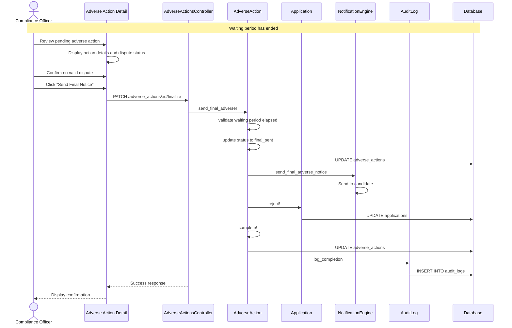

# UC-305: Complete Adverse Action

## Metadata

| Attribute | Value |
|-----------|-------|
| **ID** | UC-305 |
| **Name** | Complete Adverse Action |
| **Functional Area** | Compliance & Audit |
| **Primary Actor** | Compliance Officer (ACT-06) |
| **Priority** | P1 |
| **Complexity** | Medium |
| **Status** | Draft |

## Description

After the mandatory FCRA waiting period has elapsed (typically 5 business days), the compliance officer completes the adverse action process. If the candidate has not successfully disputed the findings, a final adverse action notice is sent and the application is rejected. The process may also be cancelled if the dispute is resolved in the candidate's favor.

## Actors

| Actor | Role in Use Case |
|-------|------------------|
| Compliance Officer (ACT-06) | Completes or cancels the adverse action |
| Scheduler (ACT-11) | Triggers waiting period expiration notification |
| Notification Engine (ACT-13) | Sends final adverse action notice |
| Candidate (ACT-07) | Receives final notice (secondary) |

## Preconditions

- [ ] AdverseAction exists with status 'waiting_period'
- [ ] Waiting period has elapsed (waiting_period_ends_at <= now)
- [ ] User has compliance officer role or appropriate permissions

## Postconditions

### Success (Final Action Taken)
- [ ] AdverseAction status updated to 'final_sent' then 'completed'
- [ ] Final adverse action notice sent to candidate
- [ ] Application rejected automatically
- [ ] Audit log entries created

### Success (Action Cancelled)
- [ ] AdverseAction status updated to 'cancelled'
- [ ] No final notice sent
- [ ] Application remains active
- [ ] Audit log entry created

### Failure
- [ ] Error message displayed
- [ ] No status change made

## Triggers

- Scheduler detects waiting period has ended
- Compliance officer reviews adverse actions in waiting period
- System sends reminder that waiting period has elapsed

## Basic Flow



| Step | Actor | Action | System Response |
|------|-------|--------|-----------------|
| 1 | Scheduler | Detects waiting period ended | Notification sent to compliance |
| 2 | Compliance Officer | Opens adverse action detail | System displays full context |
| 3 | Compliance Officer | Reviews any dispute submissions | Disputes displayed if any |
| 4 | Compliance Officer | Confirms proceeding with final action | Confirmation dialog shown |
| 5 | Compliance Officer | Enters final notice content | Content editable from template |
| 6 | Compliance Officer | Clicks "Send Final Notice" | System validates |
| 7 | System | Verifies waiting period elapsed | Business days calculated |
| 8 | System | Updates status to 'final_sent' | Status changed |
| 9 | System | Sends final adverse action notice | Email/mail sent |
| 10 | System | Rejects the application | Application status to 'rejected' |
| 11 | System | Updates status to 'completed' | Adverse action completed |
| 12 | System | Creates audit log entries | Full audit trail |
| 13 | System | Displays confirmation | Success message shown |

## Alternative Flows

### AF-1: Cancel Due to Resolved Dispute

**Trigger:** Candidate dispute resolved in their favor at step 3

| Step | Actor | Action | System Response |
|------|-------|--------|-----------------|
| 3a | Compliance Officer | Reviews dispute resolution | Dispute details shown |
| 4a | Compliance Officer | Clicks "Cancel Adverse Action" | Confirmation dialog |
| 5a | Compliance Officer | Enters cancellation reason | Reason documented |
| 6a | System | Updates status to 'cancelled' | No final notice sent |
| 7a | System | Creates audit log | Cancellation logged |
| 8a | System | Notifies recruiter | Application can proceed |

**Resumption:** Use case ends

### AF-2: Extend Waiting Period

**Trigger:** Candidate requested additional time to dispute

| Step | Actor | Action | System Response |
|------|-------|--------|-----------------|
| 3b | Compliance Officer | Reviews extension request | Request details shown |
| 4b | Compliance Officer | Approves extension | New end date entered |
| 5b | System | Updates waiting_period_ends_at | New deadline set |
| 6b | System | Logs extension | Audit entry created |

**Resumption:** Use case re-triggers at new waiting period end

### AF-3: Candidate Withdrew Application

**Trigger:** Candidate withdrew during waiting period

| Step | Actor | Action | System Response |
|------|-------|--------|-----------------|
| 2a | System | Detects application withdrawn | Displays withdrawal notice |
| 3a | Compliance Officer | Reviews situation | Determines appropriate action |
| 4a | Compliance Officer | Cancels adverse action | No final notice needed |
| 5a | System | Updates status to 'cancelled' | Notes withdrawal reason |

**Resumption:** Use case ends

## Exception Flows

### EF-1: Waiting Period Not Elapsed

**Trigger:** Attempt to complete before waiting period ends

| Step | Actor | Action | System Response |
|------|-------|--------|-----------------|
| E.1 | System | Validates waiting period | Detects not yet elapsed |
| E.2 | System | Displays error | Shows days remaining |

**Resolution:** Must wait for period to end

### EF-2: Application Already Closed

**Trigger:** Application was closed by another process

| Step | Actor | Action | System Response |
|------|-------|--------|-----------------|
| E.1 | System | Detects closed application | Error displayed |
| E.2 | Compliance Officer | Reviews situation | May cancel adverse action |

**Resolution:** Cancel adverse action if appropriate

### EF-3: Dispute Filed After Deadline

**Trigger:** Candidate submits dispute after waiting period

| Step | Actor | Action | System Response |
|------|-------|--------|-----------------|
| E.1 | System | Receives late dispute | Flags for review |
| E.2 | Compliance Officer | Reviews late dispute | Decides on course of action |
| E.3 | Compliance Officer | Proceeds or extends | Either complete or extend |

**Resolution:** Compliance officer discretion

## Business Rules

| ID | Rule | Description |
|----|------|-------------|
| BR-305.1 | Waiting Period Complete | Cannot finalize before waiting period ends |
| BR-305.2 | Final Notice Required | Final adverse notice must be sent before rejection |
| BR-305.3 | Application Rejection | Application automatically rejected on completion |
| BR-305.4 | Cancellation Documented | All cancellations must have documented reason |
| BR-305.5 | Business Days Calculation | Waiting period excludes weekends and holidays |
| BR-305.6 | Dispute Documentation | All disputes must be reviewed and documented |

## Data Requirements

### Input Data

| Field | Type | Required | Validation |
|-------|------|----------|------------|
| adverse_action_id | integer | Yes | Must be in waiting_period status |
| final_adverse_content | text | Yes | Final notice content |
| final_adverse_delivery_method | enum | Yes | email, mail, both |
| cancellation_reason | text | Conditional | Required if cancelling |

### Output Data

| Field | Type | Description |
|-------|------|-------------|
| status | enum | completed or cancelled |
| final_adverse_sent_at | datetime | When final notice sent |
| completed_at | datetime | Completion timestamp |

## Database Transactions

### Tables Affected

| Table | Operation | Conditions |
|-------|-----------|------------|
| adverse_actions | UPDATE | Always |
| applications | UPDATE | If completing (rejection) |
| email_logs | CREATE | If final notice sent |
| stage_transitions | CREATE | If application rejected |
| audit_logs | CREATE | Always |

### Transaction Detail

```sql
-- Complete Adverse Action Transaction
BEGIN TRANSACTION;

-- Step 1: Verify waiting period elapsed
SELECT id, waiting_period_ends_at, application_id
FROM adverse_actions
WHERE id = @adverse_action_id
  AND status = 'waiting_period'
  AND waiting_period_ends_at <= NOW();

-- Step 2: Update adverse action to final_sent
UPDATE adverse_actions
SET status = 'final_sent',
    final_adverse_sent_at = NOW(),
    final_adverse_content = @final_adverse_content,
    final_adverse_delivery_method = @final_adverse_delivery_method,
    updated_at = NOW()
WHERE id = @adverse_action_id;

-- Step 3: Send final notice email
INSERT INTO email_logs (
    organization_id,
    recipient_type,
    recipient_id,
    recipient_email,
    subject,
    body,
    status,
    sent_at,
    created_at,
    updated_at
) VALUES (
    @organization_id,
    'Candidate',
    @candidate_id,
    @candidate_email,
    'Final Adverse Action Notice',
    @final_adverse_content,
    'sent',
    NOW(),
    NOW(),
    NOW()
);

-- Step 4: Reject the application
UPDATE applications
SET status = 'rejected',
    rejected_at = NOW(),
    rejection_notes = 'Rejected due to adverse action - background check',
    updated_at = NOW()
WHERE id = @application_id;

-- Step 5: Create stage transition
INSERT INTO stage_transitions (
    application_id,
    from_stage_id,
    to_stage_id,
    moved_by_id,
    notes,
    created_at
) VALUES (
    @application_id,
    @current_stage_id,
    @rejected_stage_id,
    @current_user_id,
    'Adverse action completed - application rejected',
    NOW()
);

-- Step 6: Complete adverse action
UPDATE adverse_actions
SET status = 'completed',
    updated_at = NOW()
WHERE id = @adverse_action_id;

-- Step 7: Create audit log
INSERT INTO audit_logs (
    organization_id,
    user_id,
    action,
    auditable_type,
    auditable_id,
    metadata,
    ip_address,
    created_at
) VALUES (
    @organization_id,
    @current_user_id,
    'adverse_action.completed',
    'AdverseAction',
    @adverse_action_id,
    JSON_OBJECT(
        'application_id', @application_id,
        'final_status', 'completed',
        'application_rejected', true
    ),
    @ip_address,
    NOW()
);

COMMIT;
```

### Cancel Transaction

```sql
-- Cancel Adverse Action Transaction
BEGIN TRANSACTION;

UPDATE adverse_actions
SET status = 'cancelled',
    reason_details = CONCAT(reason_details, '\n\nCancelled: ', @cancellation_reason),
    updated_at = NOW()
WHERE id = @adverse_action_id;

INSERT INTO audit_logs (
    organization_id,
    user_id,
    action,
    auditable_type,
    auditable_id,
    metadata,
    ip_address,
    created_at
) VALUES (
    @organization_id,
    @current_user_id,
    'adverse_action.cancelled',
    'AdverseAction',
    @adverse_action_id,
    JSON_OBJECT(
        'cancellation_reason', @cancellation_reason,
        'dispute_resolved', @dispute_resolved
    ),
    @ip_address,
    NOW()
);

COMMIT;
```

### Rollback Scenarios

| Scenario | Rollback Action |
|----------|-----------------|
| Waiting period not elapsed | No transaction, return error |
| Application already closed | No transaction, return error |
| Database error | Full rollback |

## UI/UX Requirements

### Screen/Component

- **Location:** /admin/adverse_actions/:id
- **Entry Point:**
  - Compliance review queue
  - Waiting period ended notification
  - Adverse action list
- **Key Elements:**
  - Waiting period status/countdown
  - Dispute history section
  - Final notice editor
  - Complete and Cancel buttons
  - Audit history

### Action Detail Layout

```
+----------------------------------------------------------+
| Adverse Action - Waiting Period Complete                  |
+----------------------------------------------------------+
| Candidate: John Smith                                     |
| Application: Senior Developer - REQ-2024-001              |
|                                                           |
| Status: [Waiting Period Ended]                            |
| Pre-Adverse Sent: Jan 20, 2026                            |
| Waiting Period Ended: Jan 27, 2026                        |
|                                                           |
| Dispute History:                                          |
| +------------------------------------------------------+ |
| | No disputes received during waiting period           | |
| +------------------------------------------------------+ |
|                                                           |
| Original Reason:                                          |
| +------------------------------------------------------+ |
| | Criminal background check revealed a misdemeanor     | |
| | conviction that is relevant to the position...       | |
| +------------------------------------------------------+ |
|                                                           |
| Final Adverse Notice: *                                   |
| +------------------------------------------------------+ |
| | Dear John Smith,                                     | |
| |                                                      | |
| | After the pre-adverse action notice period, we have  | |
| | decided not to move forward with your application... | |
| +------------------------------------------------------+ |
|                                                           |
| Delivery Method: *                                        |
| ( ) Email only                                            |
| ( ) Mail only                                             |
| (o) Both email and mail                                   |
|                                                           |
| Note: This action will automatically reject the           |
| candidate's application.                                  |
|                                                           |
+----------------------------------------------------------+
| [Cancel Adverse Action]              [Send Final Notice]  |
+----------------------------------------------------------+
```

## Non-Functional Requirements

| Requirement | Target |
|-------------|--------|
| Response Time | Form submission < 3 seconds |
| Email Delivery | Within 5 minutes of submission |
| Business Day Calculation | Accurate to organization timezone |
| Document Retention | 7 years minimum |

## Security Considerations

- [x] Authentication required (compliance role)
- [x] Authorization: Only compliance officers can complete
- [x] Audit logging of completion or cancellation
- [x] Cannot complete before waiting period ends
- [x] All notices encrypted and archived

## Related Use Cases

| Use Case | Relationship |
|----------|--------------|
| UC-304 Initiate Adverse Action | Precedes this use case |
| UC-105 Reject Candidate | Application rejection triggered |
| UC-307 View Audit Trail | Completion visible in audit |

---

## Data Model References

> Cross-references to [DATA_MODEL.md](../DATA_MODEL.md) and [CRUD_MATRIX.md](../CRUD_MATRIX.md)

### Subject Areas

| Subject Area | ID | Relationship |
|--------------|-----|--------------|
| Compliance & Audit | SA-09 | Primary |
| Application Pipeline | SA-05 | Secondary |
| Communication | SA-10 | Reference |

### Entities CRUD

| Entity | C | R | U | D | Notes |
|--------|---|---|---|---|-------|
| AdverseAction | | ✓ | ✓ | | Updated to completed/cancelled |
| Application | | ✓ | ✓ | | Updated to rejected |
| StageTransition | ✓ | | | | Created for rejection |
| EmailLog | ✓ | | | | Created for final notice |
| AuditLog | ✓ | | | | Created for completion |

**Legend:** C = Create, R = Read, U = Update, D = Delete

---

## Process Model References

> Cross-references to [PROCESS_MODEL.md](../PROCESS_MODEL.md) and [PROCESS_CRUD_MATRIX.md](../PROCESS_CRUD_MATRIX.md)

| Attribute | Value | Link |
|-----------|-------|------|
| **Elementary Business Process** | EP-0924: Complete Adverse Action | [PROCESS_MODEL.md#ep-0924](../PROCESS_MODEL.md#ep-0924-complete-adverse-action) |
| **Business Process** | BP-403: Background Verification | [PROCESS_MODEL.md#bp-403](../PROCESS_MODEL.md#bp-403-background-verification) |
| **Business Function** | BF-04: Compliance Management | [PROCESS_MODEL.md#bf-04](../PROCESS_MODEL.md#bf-04-compliance-management) |

### EBP Details

| Attribute | Value |
|-----------|-------|
| **Trigger** | Waiting period elapsed or system notification |
| **Input** | Final notice content, decision to complete or cancel |
| **Output** | Completed adverse action, rejected application (or cancelled) |
| **Business Rules** | BR-305.1 through BR-305.6 (see Business Rules section) |

---

## Traceability Matrix

> Complete artifact mapping for requirements traceability

| Artifact Type | ID | Name | Link |
|---------------|-----|------|------|
| **Use Case** | UC-305 | Complete Adverse Action | *(this document)* |
| **Elementary Process** | EP-0924 | Complete Adverse Action | [PROCESS_MODEL.md](../PROCESS_MODEL.md#ep-0924-complete-adverse-action) |
| **Business Process** | BP-403 | Background Verification | [PROCESS_MODEL.md](../PROCESS_MODEL.md#bp-403-background-verification) |
| **Business Function** | BF-04 | Compliance Management | [PROCESS_MODEL.md](../PROCESS_MODEL.md#bf-04-compliance-management) |
| **Primary Actor** | ACT-06 | Compliance Officer | [ACTORS.md](../ACTORS.md#act-06-hr-compliance-officer) |
| **Subject Area (Primary)** | SA-09 | Compliance & Audit | [DATA_MODEL.md](../DATA_MODEL.md#sa-09-compliance--audit) |
| **Subject Area (Secondary)** | SA-05 | Application Pipeline | [DATA_MODEL.md](../DATA_MODEL.md#sa-05-application-pipeline) |
| **CRUD Matrix Row** | UC-305 | - | [CRUD_MATRIX.md](../CRUD_MATRIX.md#uc-305) |
| **Process CRUD Row** | EP-0924 | - | [PROCESS_CRUD_MATRIX.md](../PROCESS_CRUD_MATRIX.md#ep-0924) |

### Implementation Artifacts

| Artifact Type | Path/Reference | Status |
|---------------|----------------|--------|
| Controller | `app/controllers/adverse_actions_controller.rb` | Implemented |
| Model | `app/models/adverse_action.rb` | Implemented |
| Policy | `app/policies/adverse_action_policy.rb` | Implemented |
| View | `app/views/adverse_actions/show.html.erb` | Implemented |
| Test | `test/models/adverse_action_test.rb` | Implemented |

---

## Open Questions

1. Should there be automatic completion after a grace period beyond waiting period?
2. How should holiday calendars be managed for business day calculations?

## Change History

| Version | Date | Author | Changes |
|---------|------|--------|---------|
| 0.1 | 2026-01-25 | System | Initial draft |
