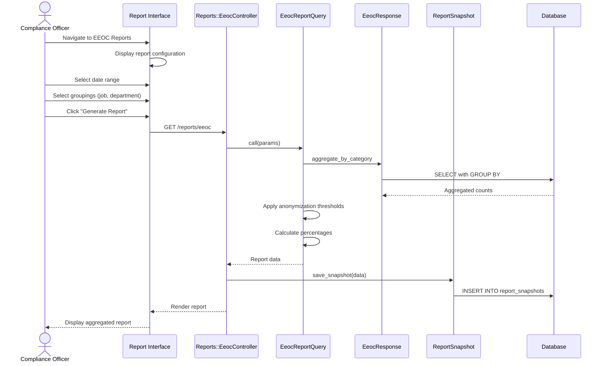

# UC-306: Generate EEOC Report

## Metadata

| Attribute | Value |
|-----------|-------|
| **ID** | UC-306 |
| **Name** | Generate EEOC Report |
| **Functional Area** | Compliance & Audit |
| **Primary Actor** | Compliance Officer (ACT-06) |
| **Priority** | P1 |
| **Complexity** | Medium |
| **Status** | Draft |

## Description

A compliance officer generates an EEOC report for regulatory compliance purposes. The report aggregates voluntarily collected demographic data to show diversity metrics across the applicant flow. Data is anonymized and presented in aggregate to prevent identification of individual candidates.

## Actors

| Actor | Role in Use Case |
|-------|------------------|
| Compliance Officer (ACT-06) | Generates and reviews EEOC reports |
| Executive (ACT-05) | May review aggregate diversity metrics (secondary) |

## Preconditions

- [ ] User has compliance officer or executive role
- [ ] Organization has EEOC collection enabled
- [ ] EeocResponse data exists for the selected period
- [ ] Minimum threshold of responses for anonymization

## Postconditions

### Success
- [ ] EEOC report generated with aggregate statistics
- [ ] Report available for download (CSV, PDF)
- [ ] ReportSnapshot saved for audit trail
- [ ] Access logged for compliance

### Failure
- [ ] Error if insufficient data for anonymization
- [ ] Error logged and user notified

## Triggers

- Compliance officer navigates to EEOC reports section
- Scheduled report generation (quarterly/annual)
- Regulatory audit preparation

## Basic Flow



| Step | Actor | Action | System Response |
|------|-------|--------|-----------------|
| 1 | Compliance Officer | Navigates to EEOC Reports | Report configuration displayed |
| 2 | Compliance Officer | Selects date range | Date range recorded |
| 3 | Compliance Officer | Selects grouping options | Job, department, or overall |
| 4 | Compliance Officer | Clicks "Generate Report" | System processes request |
| 5 | System | Queries EeocResponse data | Aggregate query executed |
| 6 | System | Groups by demographic categories | Counts by gender, race, etc. |
| 7 | System | Applies anonymization threshold | Categories < 5 suppressed |
| 8 | System | Calculates percentages | Percentages computed |
| 9 | System | Saves report snapshot | Audit trail maintained |
| 10 | System | Renders report | Report displayed to user |

## Alternative Flows

### AF-1: Export to PDF

**Trigger:** Compliance officer clicks "Export PDF" at step 10

| Step | Actor | Action | System Response |
|------|-------|--------|-----------------|
| 10a | Compliance Officer | Clicks "Export PDF" | System generates PDF |
| 11a | System | Creates PDF with charts | PDF document created |
| 12a | System | Triggers download | File downloaded |

**Resumption:** Use case ends

### AF-2: Export to CSV

**Trigger:** Compliance officer clicks "Export CSV" at step 10

| Step | Actor | Action | System Response |
|------|-------|--------|-----------------|
| 10b | Compliance Officer | Clicks "Export CSV" | System generates CSV |
| 11b | System | Creates CSV with data | CSV file created |
| 12b | System | Triggers download | File downloaded |

**Resumption:** Use case ends

### AF-3: Applicant Flow Analysis

**Trigger:** Compliance officer selects "Applicant Flow" report type

| Step | Actor | Action | System Response |
|------|-------|--------|-----------------|
| 3a | Compliance Officer | Selects "Applicant Flow" | Additional options shown |
| 4a | Compliance Officer | Selects stages to compare | Application, Interview, Offer, Hired |
| 5a | System | Queries data by stage | Flow analysis computed |
| 6a | System | Calculates conversion rates | Rate by demographic shown |

**Resumption:** Continues at step 7 of basic flow

## Exception Flows

### EF-1: Insufficient Data for Anonymization

**Trigger:** Total responses below minimum threshold

| Step | Actor | Action | System Response |
|------|-------|--------|-----------------|
| E.1 | System | Detects insufficient data | Warning displayed |
| E.2 | System | Shows aggregated total only | No breakdown provided |
| E.3 | Compliance Officer | Adjusts date range | Re-runs with broader range |

**Resolution:** Expand date range or wait for more data

### EF-2: No EEOC Data Available

**Trigger:** No EeocResponse records in date range

| Step | Actor | Action | System Response |
|------|-------|--------|-----------------|
| E.1 | System | Detects no data | Empty report message |
| E.2 | Compliance Officer | Reviews collection settings | May adjust settings |

**Resolution:** Verify EEOC collection is enabled and occurring

### EF-3: Permission Denied

**Trigger:** User lacks compliance permissions

| Step | Actor | Action | System Response |
|------|-------|--------|-----------------|
| E.1 | System | Checks authorization | Permission denied |
| E.2 | System | Redirects to dashboard | Access logged |

**Resolution:** Request appropriate permissions from admin

## Business Rules

| ID | Rule | Description |
|----|------|-------------|
| BR-306.1 | Anonymization Threshold | Categories with fewer than 5 responses are suppressed |
| BR-306.2 | Aggregate Only | Individual-level data never displayed |
| BR-306.3 | Consent Required | Only data with consent_given=true included |
| BR-306.4 | Access Logging | All report access must be logged |
| BR-306.5 | Date Range Limit | Maximum 5-year historical data |
| BR-306.6 | Role Restriction | Only compliance and executive roles can access |

## Data Requirements

### Input Data

| Field | Type | Required | Validation |
|-------|------|----------|------------|
| start_date | date | Yes | Not in future |
| end_date | date | Yes | >= start_date |
| group_by | array | No | job, department, location |
| report_type | enum | No | summary, applicant_flow, comparison |

### Output Data

| Field | Type | Description |
|-------|------|-------------|
| total_applications | integer | Total applications in period |
| total_with_eeoc | integer | Applications with EEOC data |
| response_rate | decimal | Percentage who provided data |
| gender_breakdown | object | Counts by gender |
| race_breakdown | object | Counts by race/ethnicity |
| veteran_breakdown | object | Counts by veteran status |
| disability_breakdown | object | Counts by disability status |

## Database Transactions

### Tables Affected

| Table | Operation | Conditions |
|-------|-----------|------------|
| eeoc_responses | READ | Aggregate queries only |
| applications | READ | For application counts |
| report_snapshots | CREATE | Save report for audit |
| audit_logs | CREATE | Log report generation |

### Query Detail

```sql
-- EEOC Summary Report Query
SELECT
    COUNT(*) as total_responses,
    COUNT(CASE WHEN consent_given = true THEN 1 END) as consented_responses,

    -- Gender breakdown
    COUNT(CASE WHEN gender = 'male' AND consent_given = true THEN 1 END) as gender_male,
    COUNT(CASE WHEN gender = 'female' AND consent_given = true THEN 1 END) as gender_female,
    COUNT(CASE WHEN gender = 'non_binary' AND consent_given = true THEN 1 END) as gender_non_binary,
    COUNT(CASE WHEN gender = 'prefer_not_to_say' AND consent_given = true THEN 1 END) as gender_prefer_not,

    -- Race/Ethnicity breakdown
    COUNT(CASE WHEN race_ethnicity = 'hispanic_latino' AND consent_given = true THEN 1 END) as race_hispanic,
    COUNT(CASE WHEN race_ethnicity = 'white' AND consent_given = true THEN 1 END) as race_white,
    COUNT(CASE WHEN race_ethnicity = 'black' AND consent_given = true THEN 1 END) as race_black,
    COUNT(CASE WHEN race_ethnicity = 'asian' AND consent_given = true THEN 1 END) as race_asian,
    COUNT(CASE WHEN race_ethnicity = 'native_american' AND consent_given = true THEN 1 END) as race_native,
    COUNT(CASE WHEN race_ethnicity = 'pacific_islander' AND consent_given = true THEN 1 END) as race_pacific,
    COUNT(CASE WHEN race_ethnicity = 'two_or_more' AND consent_given = true THEN 1 END) as race_multi,

    -- Veteran status
    COUNT(CASE WHEN veteran_status = 'protected_veteran' AND consent_given = true THEN 1 END) as veteran_protected,
    COUNT(CASE WHEN veteran_status = 'not_veteran' AND consent_given = true THEN 1 END) as veteran_not,

    -- Disability status
    COUNT(CASE WHEN disability_status = 'yes' AND consent_given = true THEN 1 END) as disability_yes,
    COUNT(CASE WHEN disability_status = 'no' AND consent_given = true THEN 1 END) as disability_no

FROM eeoc_responses er
JOIN applications a ON er.application_id = a.id
WHERE er.organization_id = @organization_id
  AND er.created_at BETWEEN @start_date AND @end_date
  AND er.consent_given = true;

-- Save report snapshot
INSERT INTO report_snapshots (
    organization_id,
    report_type,
    parameters,
    data,
    generated_by_id,
    created_at
) VALUES (
    @organization_id,
    'eeoc_report',
    JSON_OBJECT('start_date', @start_date, 'end_date', @end_date),
    @report_data,
    @current_user_id,
    NOW()
);

-- Audit log
INSERT INTO audit_logs (
    organization_id,
    user_id,
    action,
    auditable_type,
    auditable_id,
    metadata,
    ip_address,
    created_at
) VALUES (
    @organization_id,
    @current_user_id,
    'report.eeoc_generated',
    'ReportSnapshot',
    @snapshot_id,
    JSON_OBJECT('date_range', @date_range, 'report_type', 'eeoc'),
    @ip_address,
    NOW()
);
```

### Rollback Scenarios

| Scenario | Rollback Action |
|----------|-----------------|
| Permission denied | No query executed |
| Insufficient data | Warning returned, no breakdown |

## UI/UX Requirements

### Screen/Component

- **Location:** /admin/reports/eeoc
- **Entry Point:**
  - Admin reports menu
  - Compliance dashboard
- **Key Elements:**
  - Date range picker
  - Grouping options
  - Summary statistics
  - Demographic charts
  - Export buttons

### Report Layout

```
+----------------------------------------------------------+
| EEOC Compliance Report                                    |
+----------------------------------------------------------+
| Date Range: [Jan 1, 2026] to [Jan 25, 2026]              |
| Group By: [ ] Job  [ ] Department  [✓] Overall            |
| [Generate Report]                                         |
|                                                           |
+----------------------------------------------------------+
| Summary                                                   |
+----------------------------------------------------------+
| Total Applications: 1,245                                 |
| EEOC Response Rate: 78% (971 responses)                   |
|                                                           |
+----------------------------------------------------------+
| Gender Breakdown                 | Race/Ethnicity         |
+----------------------------------------------------------+
| Male:           45%  (437)       | White:        52% (505)|
| Female:         48%  (466)       | Black:        18% (175)|
| Non-binary:      3%   (29)       | Hispanic:     15% (146)|
| Prefer not say:  4%   (39)       | Asian:        10%  (97)|
|                                  | Other:         5%  (48)|
+----------------------------------------------------------+
| Veteran Status                   | Disability Status      |
+----------------------------------------------------------+
| Protected Veteran:  8%  (78)     | Yes:           6%  (58)|
| Not a Veteran:     72% (699)     | No:           74% (719)|
| Prefer not say:    20% (194)     | Prefer not:   20% (194)|
+----------------------------------------------------------+
|                                                           |
| [Export PDF]  [Export CSV]                                |
+----------------------------------------------------------+
```

## Non-Functional Requirements

| Requirement | Target |
|-------------|--------|
| Response Time | Report generation < 5 seconds |
| Data Accuracy | 100% match to source data |
| Anonymization | Categories < 5 always suppressed |
| Export Format | PDF with charts, CSV with raw numbers |

## Security Considerations

- [x] Role-based access (compliance/executive only)
- [x] Aggregate data only (no individual records)
- [x] Anonymization threshold enforced
- [x] All access logged for audit
- [x] Report downloads tracked

## Related Use Cases

| Use Case | Relationship |
|----------|--------------|
| UC-300 Collect EEOC Data | Provides data for this report |
| UC-308 Export Audit Logs | Report access visible in logs |
| UC-354 Diversity Report | Related diversity metrics |

---

## Data Model References

> Cross-references to [DATA_MODEL.md](../DATA_MODEL.md) and [CRUD_MATRIX.md](../CRUD_MATRIX.md)

### Subject Areas

| Subject Area | ID | Relationship |
|--------------|-----|--------------|
| Compliance & Audit | SA-09 | Primary |
| Application Pipeline | SA-05 | Reference |

### Entities CRUD

| Entity | C | R | U | D | Notes |
|--------|---|---|---|---|-------|
| EeocResponse | | ✓ | | | Read for aggregate queries |
| Application | | ✓ | | | Read for application counts |
| ReportSnapshot | ✓ | | | | Created for audit trail |
| AuditLog | ✓ | | | | Created for access logging |

**Legend:** C = Create, R = Read, U = Update, D = Delete

---

## Process Model References

> Cross-references to [PROCESS_MODEL.md](../PROCESS_MODEL.md) and [PROCESS_CRUD_MATRIX.md](../PROCESS_CRUD_MATRIX.md)

| Attribute | Value | Link |
|-----------|-------|------|
| **Elementary Business Process** | EP-0902: Generate EEOC Report | [PROCESS_MODEL.md#ep-0902](../PROCESS_MODEL.md#ep-0902-generate-eeoc-report) |
| **Business Process** | BP-401: EEOC Compliance | [PROCESS_MODEL.md#bp-401](../PROCESS_MODEL.md#bp-401-eeoc-compliance) |
| **Business Function** | BF-04: Compliance Management | [PROCESS_MODEL.md#bf-04](../PROCESS_MODEL.md#bf-04-compliance-management) |

### EBP Details

| Attribute | Value |
|-----------|-------|
| **Trigger** | Compliance officer request or scheduled job |
| **Input** | Date range, grouping parameters |
| **Output** | Aggregated EEOC report with anonymized data |
| **Business Rules** | BR-306.1 through BR-306.6 (see Business Rules section) |

---

## Traceability Matrix

> Complete artifact mapping for requirements traceability

| Artifact Type | ID | Name | Link |
|---------------|-----|------|------|
| **Use Case** | UC-306 | Generate EEOC Report | *(this document)* |
| **Elementary Process** | EP-0902 | Generate EEOC Report | [PROCESS_MODEL.md](../PROCESS_MODEL.md#ep-0902-generate-eeoc-report) |
| **Business Process** | BP-401 | EEOC Compliance | [PROCESS_MODEL.md](../PROCESS_MODEL.md#bp-401-eeoc-compliance) |
| **Business Function** | BF-04 | Compliance Management | [PROCESS_MODEL.md](../PROCESS_MODEL.md#bf-04-compliance-management) |
| **Primary Actor** | ACT-06 | Compliance Officer | [ACTORS.md](../ACTORS.md#act-06-hr-compliance-officer) |
| **Subject Area (Primary)** | SA-09 | Compliance & Audit | [DATA_MODEL.md](../DATA_MODEL.md#sa-09-compliance--audit) |
| **CRUD Matrix Row** | UC-306 | - | [CRUD_MATRIX.md](../CRUD_MATRIX.md#uc-306) |
| **Process CRUD Row** | EP-0902 | - | [PROCESS_CRUD_MATRIX.md](../PROCESS_CRUD_MATRIX.md#ep-0902) |

### Implementation Artifacts

| Artifact Type | Path/Reference | Status |
|---------------|----------------|--------|
| Controller | `app/controllers/reports/eeoc_controller.rb` | Planned |
| Query | `app/queries/eeoc_report_query.rb` | Planned |
| View | `app/views/reports/eeoc/show.html.erb` | Planned |
| Test | `test/queries/eeoc_report_query_test.rb` | Planned |

---

## Open Questions

1. What is the appropriate minimum threshold for anonymization (5 vs 10)?
2. Should historical report snapshots be accessible for trend analysis?

## Change History

| Version | Date | Author | Changes |
|---------|------|--------|---------|
| 0.1 | 2026-01-25 | System | Initial draft |
