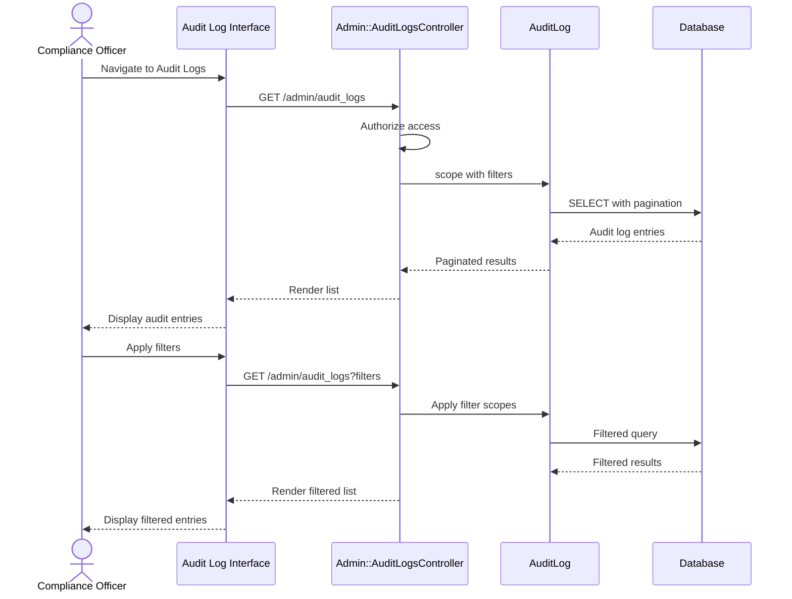

# UC-307: View Audit Trail

## Metadata

| Attribute | Value |
|-----------|-------|
| **ID** | UC-307 |
| **Name** | View Audit Trail |
| **Functional Area** | Compliance & Audit |
| **Primary Actor** | Compliance Officer (ACT-06) |
| **Priority** | P1 |
| **Complexity** | Low |
| **Status** | Draft |

## Description

A compliance officer or administrator views the immutable audit trail to review system activity. The audit log captures all significant actions including user logins, data modifications, hiring decisions, and compliance events. Filters allow drilling down by user, date range, action type, and affected entity.

## Actors

| Actor | Role in Use Case |
|-------|------------------|
| Compliance Officer (ACT-06) | Reviews audit logs for compliance |
| System Administrator (ACT-01) | Reviews logs for security monitoring |
| Hiring Manager (ACT-03) | Views audit trail for their own jobs (limited) |

## Preconditions

- [ ] User is authenticated with appropriate role
- [ ] Audit log data exists in the system
- [ ] User has permission to view audit logs

## Postconditions

### Success
- [ ] Audit log entries displayed based on filters
- [ ] User can navigate through paginated results
- [ ] Access to audit trail logged

### Failure
- [ ] Permission denied message if unauthorized
- [ ] Empty results if no matching entries

## Triggers

- User navigates to audit log section
- User clicks "View History" on a specific record
- Compliance review or audit investigation

## Basic Flow



| Step | Actor | Action | System Response |
|------|-------|--------|-----------------|
| 1 | User | Navigates to Audit Logs | System checks permissions |
| 2 | System | Verifies authorization | Access granted |
| 3 | System | Queries recent audit logs | Default: last 7 days, 50 per page |
| 4 | System | Renders audit log list | Entries displayed |
| 5 | User | Views entry details | Full metadata shown |
| 6 | User | Applies date range filter | Date range selected |
| 7 | User | Selects action type filter | Action type selected |
| 8 | User | Selects user filter | User selected |
| 9 | System | Applies filters | Filtered query executed |
| 10 | System | Displays filtered results | Matching entries shown |

## Alternative Flows

### AF-1: View Entity-Specific Audit Trail

**Trigger:** User clicks "View History" on a specific record (job, application, etc.)

| Step | Actor | Action | System Response |
|------|-------|--------|-----------------|
| 1a | User | Clicks "History" on entity | Context captured |
| 2a | System | Filters by auditable_type/id | Entity-specific logs queried |
| 3a | System | Displays entity history | Timeline view shown |

**Resumption:** Continues at step 5 of basic flow

### AF-2: Search by Request ID

**Trigger:** User has a request ID from error report or support ticket

| Step | Actor | Action | System Response |
|------|-------|--------|-----------------|
| 1b | User | Enters request ID | ID captured |
| 2b | System | Queries by request_id | Matching entries found |
| 3b | System | Displays related entries | All entries from request shown |

**Resumption:** Continues at step 5 of basic flow

### AF-3: View Changes Detail

**Trigger:** User clicks on an entry with recorded_changes

| Step | Actor | Action | System Response |
|------|-------|--------|-----------------|
| 5a | User | Clicks entry to expand | Entry expands |
| 6a | System | Displays recorded_changes | Before/after values shown |
| 7a | System | Highlights changes | Changes visually indicated |

**Resumption:** User continues browsing

## Exception Flows

### EF-1: Permission Denied

**Trigger:** User lacks audit log access permission

| Step | Actor | Action | System Response |
|------|-------|--------|-----------------|
| E.1 | System | Checks authorization | Permission denied |
| E.2 | System | Redirects to dashboard | Error message shown |

**Resolution:** User requests appropriate permissions

### EF-2: No Matching Results

**Trigger:** Filters return no entries

| Step | Actor | Action | System Response |
|------|-------|--------|-----------------|
| E.1 | System | Executes filtered query | Zero results |
| E.2 | System | Displays empty state | Suggests adjusting filters |

**Resolution:** User adjusts filters

## Business Rules

| ID | Rule | Description |
|----|------|-------------|
| BR-307.1 | Immutability | Audit logs cannot be modified or deleted |
| BR-307.2 | Organization Scoping | Users only see logs for their organization |
| BR-307.3 | Role-Based Access | Different roles have different access levels |
| BR-307.4 | Sensitive Data Redaction | Passwords and tokens never shown |
| BR-307.5 | Access Logging | Viewing audit logs is itself audited |
| BR-307.6 | Retention | Audit logs retained for minimum 7 years |

## Data Requirements

### Input Data (Filters)

| Field | Type | Required | Validation |
|-------|------|----------|------------|
| start_date | date | No | Default: 7 days ago |
| end_date | date | No | Default: today |
| user_id | integer | No | Must be valid user |
| action | string | No | From action category list |
| auditable_type | string | No | Valid model type |
| auditable_id | integer | No | Requires auditable_type |
| request_id | string | No | UUID format |

### Output Data

| Field | Type | Description |
|-------|------|-------------|
| id | integer | Audit log entry ID |
| action | string | Action performed |
| user_display_name | string | Who performed action |
| auditable_display_name | string | What was affected |
| metadata | object | Action context |
| recorded_changes | object | Before/after values |
| ip_address | string | Client IP |
| created_at | datetime | When action occurred |

## Database Transactions

### Tables Affected

| Table | Operation | Conditions |
|-------|-----------|------------|
| audit_logs | READ | Always |
| users | READ | For user display names |

### Query Detail

```sql
-- Audit Log Query with Filters
SELECT
    al.id,
    al.action,
    al.auditable_type,
    al.auditable_id,
    al.metadata,
    al.recorded_changes,
    al.ip_address,
    al.user_agent,
    al.request_id,
    al.created_at,
    u.first_name,
    u.last_name
FROM audit_logs al
LEFT JOIN users u ON al.user_id = u.id
WHERE al.organization_id = @organization_id
  AND (@start_date IS NULL OR al.created_at >= @start_date)
  AND (@end_date IS NULL OR al.created_at <= @end_date)
  AND (@user_id IS NULL OR al.user_id = @user_id)
  AND (@action IS NULL OR al.action LIKE @action_pattern)
  AND (@auditable_type IS NULL OR al.auditable_type = @auditable_type)
  AND (@auditable_id IS NULL OR al.auditable_id = @auditable_id)
  AND (@request_id IS NULL OR al.request_id = @request_id)
ORDER BY al.created_at DESC
LIMIT @per_page OFFSET @offset;
```

### Rollback Scenarios

| Scenario | Rollback Action |
|----------|-----------------|
| Permission denied | Query not executed |
| Invalid filters | Return validation errors |

## UI/UX Requirements

### Screen/Component

- **Location:** /admin/audit_logs
- **Entry Point:**
  - Admin menu "Audit Trail"
  - "View History" on entity detail pages
- **Key Elements:**
  - Date range picker
  - User filter dropdown
  - Action type filter
  - Entity type filter
  - Search by request ID
  - Paginated table
  - Entry detail expansion

### Audit Log Layout

```
+----------------------------------------------------------+
| Audit Trail                                               |
+----------------------------------------------------------+
| Filters:                                                  |
| Date Range: [Jan 1, 2026] to [Jan 25, 2026]              |
| User: [All Users               v]                         |
| Action: [All Actions           v]                         |
| Entity: [All Types             v]                         |
| Request ID: [                  ]    [Apply Filters]       |
+----------------------------------------------------------+
| Showing 1-50 of 1,234 entries                             |
+----------------------------------------------------------+
| Time         | User    | Action           | Entity        |
+----------------------------------------------------------+
| Jan 25 14:32 | J.Smith | job.created      | Senior Dev    |
|   > Changes: title: nil -> "Senior Developer"             |
|              department_id: nil -> 5                      |
|   > IP: 192.168.1.100 | Request: abc-123                  |
+----------------------------------------------------------+
| Jan 25 14:28 | System  | application.     | John Doe      |
|              |         | stage_changed    |               |
|   > Changes: current_stage_id: 2 -> 3                     |
|   > Metadata: from_stage: "Screening", to: "Interview"    |
+----------------------------------------------------------+
| Jan 25 14:15 | M.Jones | candidate.       | Jane Smith    |
|              |         | updated          |               |
|   > Changes: phone: "***" -> "***" (redacted)             |
+----------------------------------------------------------+
|              [Previous]    Page 1 of 25    [Next]         |
+----------------------------------------------------------+
```

## Non-Functional Requirements

| Requirement | Target |
|-------------|--------|
| Response Time | Page load < 2 seconds |
| Pagination | 50 entries per page |
| Data Retention | Minimum 7 years |
| Query Performance | Index on (organization_id, created_at) |

## Security Considerations

- [x] Role-based access control enforced
- [x] Organization scoping prevents cross-tenant access
- [x] Sensitive data (passwords, tokens) redacted
- [x] Audit log access is itself logged
- [x] Audit logs immutable (no update/delete)

## Related Use Cases

| Use Case | Relationship |
|----------|--------------|
| UC-308 Export Audit Logs | Export functionality for this data |
| All use cases | Audit log entries created by all actions |

---

## Data Model References

> Cross-references to [DATA_MODEL.md](../DATA_MODEL.md) and [CRUD_MATRIX.md](../CRUD_MATRIX.md)

### Subject Areas

| Subject Area | ID | Relationship |
|--------------|-----|--------------|
| Compliance & Audit | SA-09 | Primary |
| Identity & Access | SA-01 | Reference |

### Entities CRUD

| Entity | C | R | U | D | Notes |
|--------|---|---|---|---|-------|
| AuditLog | | ✓ | | | Read for display |
| User | | ✓ | | | Read for display names |

**Legend:** C = Create, R = Read, U = Update, D = Delete

---

## Process Model References

> Cross-references to [PROCESS_MODEL.md](../PROCESS_MODEL.md) and [PROCESS_CRUD_MATRIX.md](../PROCESS_CRUD_MATRIX.md)

| Attribute | Value | Link |
|-----------|-------|------|
| **Elementary Business Process** | EP-0931: View Audit Trail | [PROCESS_MODEL.md#ep-0931](../PROCESS_MODEL.md#ep-0931-view-audit-trail) |
| **Business Process** | BP-404: Audit Management | [PROCESS_MODEL.md#bp-404](../PROCESS_MODEL.md#bp-404-audit-management) |
| **Business Function** | BF-04: Compliance Management | [PROCESS_MODEL.md#bf-04](../PROCESS_MODEL.md#bf-04-compliance-management) |

### EBP Details

| Attribute | Value |
|-----------|-------|
| **Trigger** | User navigates to audit trail or views entity history |
| **Input** | Filter parameters (date range, user, action, entity) |
| **Output** | Paginated list of audit log entries |
| **Business Rules** | BR-307.1 through BR-307.6 (see Business Rules section) |

---

## Traceability Matrix

> Complete artifact mapping for requirements traceability

| Artifact Type | ID | Name | Link |
|---------------|-----|------|------|
| **Use Case** | UC-307 | View Audit Trail | *(this document)* |
| **Elementary Process** | EP-0931 | View Audit Trail | [PROCESS_MODEL.md](../PROCESS_MODEL.md#ep-0931-view-audit-trail) |
| **Business Process** | BP-404 | Audit Management | [PROCESS_MODEL.md](../PROCESS_MODEL.md#bp-404-audit-management) |
| **Business Function** | BF-04 | Compliance Management | [PROCESS_MODEL.md](../PROCESS_MODEL.md#bf-04-compliance-management) |
| **Primary Actor** | ACT-06 | Compliance Officer | [ACTORS.md](../ACTORS.md#act-06-hr-compliance-officer) |
| **Subject Area (Primary)** | SA-09 | Compliance & Audit | [DATA_MODEL.md](../DATA_MODEL.md#sa-09-compliance--audit) |
| **CRUD Matrix Row** | UC-307 | - | [CRUD_MATRIX.md](../CRUD_MATRIX.md#uc-307) |
| **Process CRUD Row** | EP-0931 | - | [PROCESS_CRUD_MATRIX.md](../PROCESS_CRUD_MATRIX.md#ep-0931) |

### Implementation Artifacts

| Artifact Type | Path/Reference | Status |
|---------------|----------------|--------|
| Controller | `app/controllers/admin/audit_logs_controller.rb` | Implemented |
| Model | `app/models/audit_log.rb` | Implemented |
| View | `app/views/admin/audit_logs/index.html.erb` | Implemented |
| Test | `test/controllers/admin/audit_logs_controller_test.rb` | Implemented |

---

## Open Questions

1. Should there be a full-text search capability for audit logs?
2. What is the appropriate retention period (7 years vs longer)?

## Change History

| Version | Date | Author | Changes |
|---------|------|--------|---------|
| 0.1 | 2026-01-25 | System | Initial draft |
