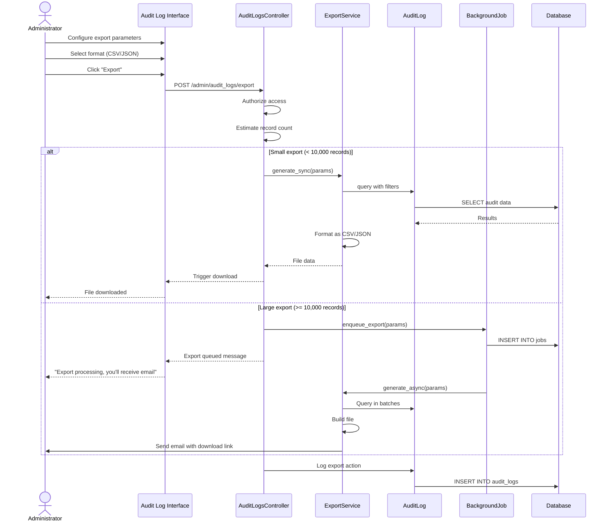

# UC-308: Export Audit Logs

## Metadata

| Attribute | Value |
|-----------|-------|
| **ID** | UC-308 |
| **Name** | Export Audit Logs |
| **Functional Area** | Compliance & Audit |
| **Primary Actor** | System Administrator (ACT-01) |
| **Priority** | P2 |
| **Complexity** | Medium |
| **Status** | Draft |

## Description

A system administrator or compliance officer exports audit log data for external analysis, regulatory audits, or archival purposes. The export supports multiple formats (CSV, JSON) and respects the same filters available in the view interface. Large exports are processed asynchronously.

## Actors

| Actor | Role in Use Case |
|-------|------------------|
| System Administrator (ACT-01) | Exports logs for analysis or archival |
| Compliance Officer (ACT-06) | Exports logs for regulatory audits |
| Scheduler (ACT-11) | Processes async export jobs |

## Preconditions

- [ ] User is authenticated with admin or compliance role
- [ ] Audit log data exists for the requested period
- [ ] User has permission to export audit logs

## Postconditions

### Success
- [ ] Export file generated in requested format
- [ ] File available for download or sent via email
- [ ] Export action logged in audit trail
- [ ] Large exports processed asynchronously

### Failure
- [ ] Error message displayed if export fails
- [ ] Notification sent if async job fails

## Triggers

- User clicks "Export" button on audit log interface
- Scheduled export job runs
- External audit request requires log export

## Basic Flow



| Step | Actor | Action | System Response |
|------|-------|--------|-----------------|
| 1 | Admin | Navigates to export interface | Export options displayed |
| 2 | Admin | Selects date range | Date range captured |
| 3 | Admin | Applies filters (user, action, entity) | Filters applied |
| 4 | Admin | Selects export format | CSV or JSON selected |
| 5 | Admin | Clicks "Export" | System validates request |
| 6 | System | Estimates record count | Count calculated |
| 7 | System | Determines sync/async | Based on record count |
| 8 | System | Generates export file | Data formatted |
| 9 | System | Delivers file or queues job | Download or email |
| 10 | System | Logs export action | Audit entry created |

## Alternative Flows

### AF-1: Large Export (Async)

**Trigger:** Record count exceeds threshold (10,000+) at step 6

| Step | Actor | Action | System Response |
|------|-------|--------|-----------------|
| 7a | System | Detects large export | Async processing selected |
| 8a | System | Queues background job | Job enqueued |
| 9a | System | Displays progress message | "Export processing..." |
| 10a | Scheduler | Processes export job | File generated |
| 11a | System | Sends email with download link | Secure link emailed |
| 12a | Admin | Downloads from link | File downloaded |

**Resumption:** Use case ends

### AF-2: Export Specific Entity History

**Trigger:** User wants history for one candidate, job, etc.

| Step | Actor | Action | System Response |
|------|-------|--------|-----------------|
| 2a | Admin | Filters by entity type and ID | Entity-specific filter |
| 3a | System | Applies entity scope | Only that entity's logs |

**Resumption:** Continues at step 4 of basic flow

### AF-3: Scheduled Export

**Trigger:** Configured scheduled export runs

| Step | Actor | Action | System Response |
|------|-------|--------|-----------------|
| 0a | Scheduler | Triggers scheduled export | Automatic execution |
| 1a | System | Uses configured parameters | Date range: last period |
| 8a | System | Generates export file | Standard processing |
| 9a | System | Emails to configured recipients | Distribution list |

**Resumption:** Use case ends

## Exception Flows

### EF-1: No Data for Export

**Trigger:** Filters return zero records

| Step | Actor | Action | System Response |
|------|-------|--------|-----------------|
| E.1 | System | Detects zero records | Warning displayed |
| E.2 | Admin | Adjusts filters | Re-tries export |

**Resolution:** Adjust filters to include data

### EF-2: Export Job Failure

**Trigger:** Background job fails during processing

| Step | Actor | Action | System Response |
|------|-------|--------|-----------------|
| E.1 | System | Detects job failure | Error logged |
| E.2 | System | Retries job (up to 3 times) | Retry attempted |
| E.3 | System | Sends failure notification | Email to admin |

**Resolution:** Admin investigates and retries

### EF-3: Export Link Expired

**Trigger:** User accesses download link after expiration

| Step | Actor | Action | System Response |
|------|-------|--------|-----------------|
| E.1 | Admin | Clicks expired link | Access denied |
| E.2 | System | Displays expiration message | Re-export suggested |

**Resolution:** Re-run export to generate new file

## Business Rules

| ID | Rule | Description |
|----|------|-------------|
| BR-308.1 | Sync Threshold | Exports < 10,000 records processed synchronously |
| BR-308.2 | Async for Large | Exports >= 10,000 records processed async |
| BR-308.3 | Link Expiration | Download links expire after 24 hours |
| BR-308.4 | Format Support | CSV and JSON formats supported |
| BR-308.5 | Date Limit | Maximum 1 year of data per export |
| BR-308.6 | Audit Logging | All exports logged with parameters |

## Data Requirements

### Input Data

| Field | Type | Required | Validation |
|-------|------|----------|------------|
| start_date | date | Yes | Within retention period |
| end_date | date | Yes | >= start_date, <= 1 year span |
| format | enum | Yes | csv, json |
| user_id | integer | No | Valid user |
| action | string | No | Valid action pattern |
| auditable_type | string | No | Valid model type |
| auditable_id | integer | No | Requires auditable_type |
| email_to | string | No | Valid email for async |

### Output Data

| Field | Type | Description |
|-------|------|-------------|
| file_name | string | Generated filename with timestamp |
| file_size | integer | Size in bytes |
| record_count | integer | Number of entries exported |
| download_url | string | Temporary download URL |
| expires_at | datetime | URL expiration time |

## Database Transactions

### Tables Affected

| Table | Operation | Conditions |
|-------|-----------|------------|
| audit_logs | READ | Query with filters |
| active_storage_blobs | CREATE | Store export file |
| solid_queue_jobs | CREATE | If async export |
| audit_logs | CREATE | Log export action |

### Query Detail

```sql
-- Export Query (batched for large exports)
SELECT
    al.id,
    al.action,
    al.auditable_type,
    al.auditable_id,
    al.user_id,
    u.email as user_email,
    al.metadata,
    al.recorded_changes,
    al.ip_address,
    al.request_id,
    al.created_at
FROM audit_logs al
LEFT JOIN users u ON al.user_id = u.id
WHERE al.organization_id = @organization_id
  AND al.created_at >= @start_date
  AND al.created_at <= @end_date
  AND (@user_id IS NULL OR al.user_id = @user_id)
  AND (@action IS NULL OR al.action LIKE @action_pattern)
  AND (@auditable_type IS NULL OR al.auditable_type = @auditable_type)
ORDER BY al.created_at ASC
LIMIT @batch_size OFFSET @offset;

-- Log export action
INSERT INTO audit_logs (
    organization_id,
    user_id,
    action,
    auditable_type,
    auditable_id,
    metadata,
    ip_address,
    created_at
) VALUES (
    @organization_id,
    @current_user_id,
    'audit_log.exported',
    'AuditLog',
    NULL,
    JSON_OBJECT(
        'start_date', @start_date,
        'end_date', @end_date,
        'format', @format,
        'record_count', @record_count,
        'filters', @filters
    ),
    @ip_address,
    NOW()
);
```

### Rollback Scenarios

| Scenario | Rollback Action |
|----------|-----------------|
| No data for export | Return warning, no file created |
| Job failure | Log error, notify user, allow retry |
| File generation error | Clean up partial files, notify user |

## UI/UX Requirements

### Screen/Component

- **Location:** /admin/audit_logs (export button) or /admin/audit_logs/export
- **Entry Point:**
  - "Export" button on audit log list
  - Admin reports menu
- **Key Elements:**
  - Same filters as view interface
  - Format selector (CSV/JSON)
  - Email field for async delivery
  - Export button
  - Progress indicator for async

### Export Configuration Layout

```
+----------------------------------------------------------+
| Export Audit Logs                                         |
+----------------------------------------------------------+
| Date Range: *                                             |
| From: [Jan 1, 2026      ] To: [Jan 25, 2026     ]        |
|                                                           |
| Filters (optional):                                       |
| User: [All Users                                     v ]  |
| Action Type: [All Actions                            v ]  |
| Entity Type: [All Types                              v ]  |
|                                                           |
| Export Format: *                                          |
| (o) CSV - Spreadsheet compatible                          |
| ( ) JSON - Structured data format                         |
|                                                           |
| Estimated Records: 15,234                                 |
| Note: Large exports will be emailed when complete         |
|                                                           |
| Email To (for large exports):                             |
| [admin@company.com                                     ]  |
|                                                           |
+----------------------------------------------------------+
| [Cancel]                                      [Export]    |
+----------------------------------------------------------+
```

### Progress/Completion Message

```
+----------------------------------------------------------+
| Export In Progress                                        |
+----------------------------------------------------------+
| Your export of 15,234 records is being processed.         |
|                                                           |
| You will receive an email at admin@company.com when       |
| the export is ready for download.                         |
|                                                           |
| The download link will expire in 24 hours.                |
|                                                           |
| [Return to Audit Logs]                                    |
+----------------------------------------------------------+
```

## Non-Functional Requirements

| Requirement | Target |
|-------------|--------|
| Small Export Time | < 5 seconds for < 1,000 records |
| Large Export Time | < 10 minutes for 100,000 records |
| File Size | Compressed if > 10MB |
| Link Expiration | 24 hours |
| Concurrent Exports | Max 3 per user |

## Security Considerations

- [x] Role-based access (admin/compliance only)
- [x] Secure download links (signed URLs)
- [x] Link expiration after 24 hours
- [x] Sensitive data redaction in export
- [x] Export action logged in audit trail
- [x] Email delivery only to verified addresses

## Related Use Cases

| Use Case | Relationship |
|----------|--------------|
| UC-307 View Audit Trail | Export uses same data and filters |
| UC-310 Configure Retention Policy | Affects exportable data range |

---

## Data Model References

> Cross-references to [DATA_MODEL.md](../DATA_MODEL.md) and [CRUD_MATRIX.md](../CRUD_MATRIX.md)

### Subject Areas

| Subject Area | ID | Relationship |
|--------------|-----|--------------|
| Compliance & Audit | SA-09 | Primary |

### Entities CRUD

| Entity | C | R | U | D | Notes |
|--------|---|---|---|---|-------|
| AuditLog | ✓ | ✓ | | | Read for export, create for logging |
| ActiveStorageBlob | ✓ | | | | Store export file |

**Legend:** C = Create, R = Read, U = Update, D = Delete

---

## Process Model References

> Cross-references to [PROCESS_MODEL.md](../PROCESS_MODEL.md) and [PROCESS_CRUD_MATRIX.md](../PROCESS_CRUD_MATRIX.md)

| Attribute | Value | Link |
|-----------|-------|------|
| **Elementary Business Process** | EP-0932: Export Audit Logs | [PROCESS_MODEL.md#ep-0932](../PROCESS_MODEL.md#ep-0932-export-audit-logs) |
| **Business Process** | BP-404: Audit Management | [PROCESS_MODEL.md#bp-404](../PROCESS_MODEL.md#bp-404-audit-management) |
| **Business Function** | BF-04: Compliance Management | [PROCESS_MODEL.md#bf-04](../PROCESS_MODEL.md#bf-04-compliance-management) |

### EBP Details

| Attribute | Value |
|-----------|-------|
| **Trigger** | User request or scheduled job |
| **Input** | Date range, filters, export format |
| **Output** | Downloadable file (CSV/JSON) |
| **Business Rules** | BR-308.1 through BR-308.6 (see Business Rules section) |

---

## Traceability Matrix

> Complete artifact mapping for requirements traceability

| Artifact Type | ID | Name | Link |
|---------------|-----|------|------|
| **Use Case** | UC-308 | Export Audit Logs | *(this document)* |
| **Elementary Process** | EP-0932 | Export Audit Logs | [PROCESS_MODEL.md](../PROCESS_MODEL.md#ep-0932-export-audit-logs) |
| **Business Process** | BP-404 | Audit Management | [PROCESS_MODEL.md](../PROCESS_MODEL.md#bp-404-audit-management) |
| **Business Function** | BF-04 | Compliance Management | [PROCESS_MODEL.md](../PROCESS_MODEL.md#bf-04-compliance-management) |
| **Primary Actor** | ACT-01 | System Administrator | [ACTORS.md](../ACTORS.md#act-01-system-administrator) |
| **Subject Area (Primary)** | SA-09 | Compliance & Audit | [DATA_MODEL.md](../DATA_MODEL.md#sa-09-compliance--audit) |
| **CRUD Matrix Row** | UC-308 | - | [CRUD_MATRIX.md](../CRUD_MATRIX.md#uc-308) |
| **Process CRUD Row** | EP-0932 | - | [PROCESS_CRUD_MATRIX.md](../PROCESS_CRUD_MATRIX.md#ep-0932) |

### Implementation Artifacts

| Artifact Type | Path/Reference | Status |
|---------------|----------------|--------|
| Controller | `app/controllers/admin/audit_logs_controller.rb` | Partial |
| Service | `app/services/audit_logs/export_service.rb` | Planned |
| Job | `app/jobs/audit_log_export_job.rb` | Planned |
| Test | `test/services/audit_logs/export_service_test.rb` | Planned |

---

## Open Questions

1. Should we support PDF format for regulatory submissions?
2. What is the appropriate retention period for export files?

## Change History

| Version | Date | Author | Changes |
|---------|------|--------|---------|
| 0.1 | 2026-01-25 | System | Initial draft |
