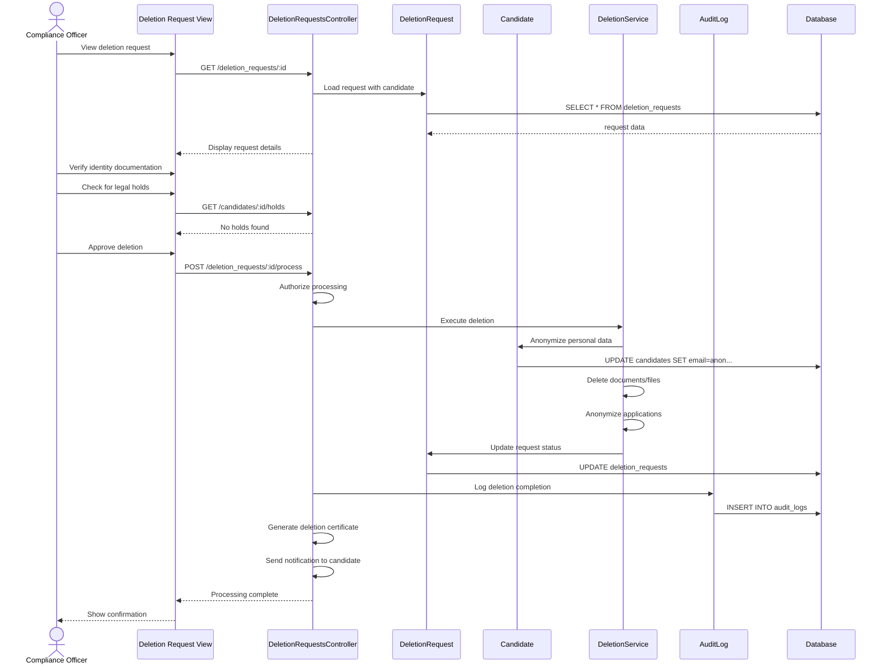

# UC-309: Process Data Deletion Request

## Metadata

| Attribute | Value |
|-----------|-------|
| **ID** | UC-309 |
| **Name** | Process Data Deletion Request |
| **Functional Area** | Compliance & Audit |
| **Primary Actor** | Compliance Officer (ACT-06) |
| **Priority** | P1 |
| **Complexity** | High |
| **Status** | Draft |

## Description

A compliance officer processes a candidate's right-to-deletion request under GDPR or similar privacy regulations. The process involves verifying the requester's identity, checking for legal holds or retention requirements, anonymizing or deleting personal data across all system records, and generating a deletion certificate.

## Actors

| Actor | Role in Use Case |
|-------|------------------|
| Compliance Officer (ACT-06) | Reviews and processes deletion request |
| System Administrator (ACT-01) | Can override holds in emergencies |
| System (ACT-10) | Executes data deletion and anonymization |

## Preconditions

- [ ] User is authenticated and has Compliance Officer or Admin role
- [ ] Deletion request exists (submitted by candidate or on their behalf)
- [ ] Identity of requester has been verified
- [ ] No active legal hold preventing deletion

## Postconditions

### Success
- [ ] Personal data deleted or anonymized
- [ ] Application and candidate records anonymized
- [ ] Resume and documents deleted
- [ ] Audit trail preserved (anonymized)
- [ ] Deletion certificate generated
- [ ] Candidate notified of completion

### Failure
- [ ] Request status set to "blocked" or "requires_review"
- [ ] Reason for block documented
- [ ] Candidate notified of delay/issue

## Triggers

- Candidate submits deletion request via portal
- Candidate emails deletion request
- Compliance officer creates request on behalf of candidate
- Scheduled retention policy execution

## Basic Flow



| Step | Actor | Action | System Response |
|------|-------|--------|-----------------|
| 1 | Compliance Officer | Opens deletion request | Request details displayed |
| 2 | Compliance Officer | Reviews candidate data affected | Data summary shown |
| 3 | Compliance Officer | Verifies identity documentation | Identity confirmed |
| 4 | Compliance Officer | Checks for legal holds | Hold status retrieved |
| 5 | Compliance Officer | Approves deletion | Approval recorded |
| 6 | System | Validates no blocks exist | Validation passes |
| 7 | System | Anonymizes candidate record | PII replaced |
| 8 | System | Deletes documents/files | Files removed |
| 9 | System | Anonymizes related records | Applications, notes updated |
| 10 | System | Updates request status | Status = completed |
| 11 | System | Creates audit log | Deletion logged |
| 12 | System | Generates certificate | PDF created |
| 13 | System | Notifies candidate | Email sent |

## Alternative Flows

### AF-1: Partial Deletion (Legal Hold)

**Trigger:** Legal hold exists for some records

| Step | Actor | Action | System Response |
|------|-------|--------|-----------------|
| 4.1 | System | Detects legal hold | Hold details shown |
| 4.2 | Compliance Officer | Reviews hold scope | Affected records listed |
| 4.3 | Compliance Officer | Approves partial deletion | Scope limited |
| 4.4 | System | Deletes non-held data | Partial execution |

**Resumption:** Returns to step 10 with partial completion

### AF-2: Request Rejection

**Trigger:** Request does not meet requirements

| Step | Actor | Action | System Response |
|------|-------|--------|-----------------|
| 3.1 | Compliance Officer | Identifies invalid request | Reason selected |
| 3.2 | Compliance Officer | Rejects request | Status = rejected |
| 3.3 | System | Notifies requester | Rejection email sent |

**Resumption:** Use case ends

### AF-3: Scheduled Automatic Deletion

**Trigger:** Retention period expired

| Step | Actor | Action | System Response |
|------|-------|--------|-----------------|
| 1.1 | System | Identifies expired data | Batch processing |
| 1.2 | System | Creates deletion request | Auto-generated |
| 1.3 | System | Executes deletion | No approval needed |

**Resumption:** Returns to step 6

## Exception Flows

### EF-1: Active Application Exists

**Trigger:** Candidate has active (non-terminal) application

| Step | Actor | Action | System Response |
|------|-------|--------|-----------------|
| E.1 | System | Detects active application | Block identified |
| E.2 | System | Displays warning | Active job listed |
| E.3 | Compliance Officer | Decides: wait or withdraw | Decision made |
| E.4 | System | Withdraws application if chosen | Application closed |

**Resolution:** Application resolved, deletion proceeds

### EF-2: Identity Verification Failed

**Trigger:** Cannot confirm requester identity

| Step | Actor | Action | System Response |
|------|-------|--------|-----------------|
| E.1 | Compliance Officer | Marks verification failed | Status updated |
| E.2 | System | Requests additional documentation | Email sent |
| E.3 | System | Sets request to pending | Awaiting verification |

**Resolution:** Requester provides additional verification

## Business Rules

| ID | Rule | Description |
|----|------|-------------|
| BR-1 | GDPR Timeline | Must complete within 30 days of verified request |
| BR-2 | Legal Hold Priority | Legal holds override deletion requests |
| BR-3 | Audit Preservation | Audit logs anonymized but not deleted |
| BR-4 | Statistical Data | Aggregate statistics may be retained (anonymized) |
| BR-5 | Identity Verification | Must verify requester is the data subject |
| BR-6 | Certificate Required | Deletion certificate generated for all completions |

## Data Requirements

### Input Data

| Field | Type | Required | Validation |
|-------|------|----------|------------|
| deletion_request_id | integer | Yes | Must exist |
| verification_method | string | Yes | Valid method type |
| verification_notes | text | No | Documentation |
| scope | enum | Yes | 'full' or 'partial' |
| excluded_records | array | If partial | Record IDs to exclude |

### Output Data

| Field | Type | Description |
|-------|------|-------------|
| request_status | string | completed/rejected/blocked |
| completion_date | datetime | When deletion finished |
| certificate_url | string | Link to PDF certificate |
| records_deleted | integer | Count of records affected |
| records_retained | integer | Count retained (if partial) |

## Database Transactions

### Tables Affected

| Table | Operation | Conditions |
|-------|-----------|------------|
| candidates | UPDATE | Anonymize PII fields |
| applications | UPDATE | Anonymize candidate references |
| candidate_documents | DELETE | Remove files |
| candidate_notes | UPDATE | Anonymize content |
| interview_scorecards | UPDATE | Anonymize candidate info |
| deletion_requests | UPDATE | Status update |
| audit_logs | CREATE | Deletion logged |

### Transaction Detail

```sql
BEGIN TRANSACTION;

-- Anonymize candidate record
UPDATE candidates
SET email = 'deleted_' || id || '@anonymized.local',
    first_name = 'Deleted',
    last_name = 'User',
    phone = NULL,
    address = NULL,
    city = NULL,
    state = NULL,
    zip_code = NULL,
    resume_text = NULL,
    custom_fields = '{}',
    deleted_at = NOW(),
    updated_at = NOW()
WHERE id = @candidate_id;

-- Delete documents and files
DELETE FROM active_storage_attachments
WHERE record_type = 'Candidate' AND record_id = @candidate_id;

-- Anonymize applications
UPDATE applications
SET custom_answers = '{}',
    updated_at = NOW()
WHERE candidate_id = @candidate_id;

-- Anonymize notes
UPDATE candidate_notes
SET content = '[Content deleted per GDPR request]',
    updated_at = NOW()
WHERE candidate_id = @candidate_id;

-- Update deletion request
UPDATE deletion_requests
SET status = 'completed',
    completed_at = NOW(),
    completed_by_id = @user_id,
    updated_at = NOW()
WHERE id = @request_id;

-- Create audit log (anonymized)
INSERT INTO audit_logs (
    action, auditable_type, auditable_id, user_id, metadata, created_at
)
VALUES (
    'data_deleted', 'Candidate', @candidate_id, @user_id,
    '{"request_id": @request_id, "scope": "full"}',
    NOW()
);

COMMIT;
```

### Rollback Scenarios

| Scenario | Rollback Action |
|----------|-----------------|
| Partial failure | Full rollback, retry later |
| External storage error | Log error, retry file deletion |

## UI/UX Requirements

### Screen/Component

- **Location:** Compliance > Deletion Requests
- **Entry Point:** Deletion request list or notification
- **Key Elements:**
  - Request details summary
  - Candidate data preview (what will be deleted)
  - Identity verification checklist
  - Legal hold status indicator
  - Scope selector (full/partial)
  - Process/Reject buttons
  - Certificate download link

### Wireframe Reference

`/designs/wireframes/UC-309-deletion-request.png`

## Non-Functional Requirements

| Requirement | Target |
|-------------|--------|
| Response Time | < 30 seconds for full deletion |
| Deadline | 30 days from verified request |
| Audit Retention | Anonymized audit logs kept per policy |

## Security Considerations

- [x] Authentication required
- [x] Authorization check: Compliance officer or admin only
- [x] Identity verification: Required before processing
- [x] Audit logging: Detailed logging of all actions
- [x] Certificate generation: Tamper-evident PDF

## Related Use Cases

| Use Case | Relationship |
|----------|--------------|
| UC-301 Record Consent | Captures initial consent |
| UC-310 Configure Retention Policy | Triggers automatic deletions |
| UC-307 View Audit Trail | Shows anonymized history |

---

## Data Model References

### Subject Areas

| Subject Area | ID | Relationship |
|--------------|-----|--------------|
| Compliance & Audit | SA-09 | Primary |
| Candidate | SA-04 | Primary |

### Entities CRUD

| Entity | C | R | U | D | Notes |
|--------|---|---|---|---|-------|
| DeletionRequest | | ✓ | ✓ | | Status updates |
| Candidate | | ✓ | ✓ | | Anonymized |
| CandidateDocument | | ✓ | | ✓ | Deleted |
| CandidateNote | | ✓ | ✓ | | Anonymized |
| Application | | ✓ | ✓ | | Anonymized |
| AuditLog | ✓ | | | | Immutable entry |

---

## Process Model References

| Attribute | Value | Link |
|-----------|-------|------|
| **Elementary Business Process** | EP-0912: Process Data Deletion Request | [PROCESS_MODEL.md](../PROCESS_MODEL.md) |
| **Business Process** | BP-402: GDPR/Privacy Compliance | [PROCESS_MODEL.md](../PROCESS_MODEL.md) |
| **Business Function** | BF-04: Compliance Management | [PROCESS_MODEL.md](../PROCESS_MODEL.md) |

### EBP Details

| Attribute | Value |
|-----------|-------|
| **Trigger** | Deletion request received or retention expires |
| **Input** | Verified deletion request |
| **Output** | Anonymized/deleted data, deletion certificate |
| **Business Rules** | BR-1 through BR-6 |

---

## Traceability Matrix

| Artifact Type | ID | Name | Link |
|---------------|-----|------|------|
| **Use Case** | UC-309 | Process Data Deletion Request | *(this document)* |
| **Elementary Process** | EP-0912 | Process Data Deletion | [PROCESS_MODEL.md](../PROCESS_MODEL.md) |
| **Business Process** | BP-402 | GDPR/Privacy Compliance | [PROCESS_MODEL.md](../PROCESS_MODEL.md) |
| **Business Function** | BF-04 | Compliance Management | [PROCESS_MODEL.md](../PROCESS_MODEL.md) |
| **Primary Actor** | ACT-06 | Compliance Officer | [ACTORS.md](../ACTORS.md) |
| **Subject Area (Primary)** | SA-09 | Compliance & Audit | [DATA_MODEL.md](../DATA_MODEL.md) |

### Implementation Artifacts

| Artifact Type | Path/Reference | Status |
|---------------|----------------|--------|
| Controller | `app/controllers/admin/deletion_requests_controller.rb` | Implemented |
| Model | `app/models/deletion_request.rb` | Implemented |
| Service | `app/services/process_deletion_request_service.rb` | Implemented |
| Policy | `app/policies/deletion_request_policy.rb` | Implemented |

---

## Open Questions

1. How long to retain deletion certificates?
2. Should we support bulk deletion requests?

## Change History

| Version | Date | Author | Changes |
|---------|------|--------|---------|
| 0.1 | 2026-01-25 | System | Initial draft |
