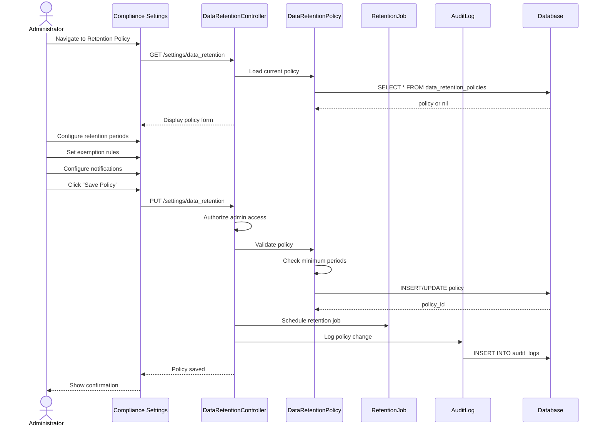

# UC-310: Configure Retention Policy

## Metadata

| Attribute | Value |
|-----------|-------|
| **ID** | UC-310 |
| **Name** | Configure Retention Policy |
| **Functional Area** | Compliance & Audit |
| **Primary Actor** | System Administrator (ACT-01) |
| **Priority** | P2 |
| **Complexity** | Medium |
| **Status** | Draft |

## Description

An administrator configures the organization's data retention policy, specifying how long different types of candidate and application data are retained before automatic deletion or anonymization. The policy ensures compliance with regulations like GDPR while meeting business needs for historical data.

## Actors

| Actor | Role in Use Case |
|-------|------------------|
| System Administrator (ACT-01) | Configures retention rules |
| Compliance Officer (ACT-06) | Reviews and approves policy |
| System (ACT-10) | Executes retention rules on schedule |

## Preconditions

- [ ] User is authenticated and has Admin role
- [ ] Organization exists with compliance settings enabled

## Postconditions

### Success
- [ ] DataRetentionPolicy record created/updated
- [ ] Retention rules configured for each data type
- [ ] Scheduled job configured for automatic enforcement
- [ ] Audit log entry created

### Failure
- [ ] Policy changes not saved
- [ ] Validation errors displayed

## Triggers

- Admin navigates to compliance settings
- Initial organization setup
- Compliance audit identifies policy gaps

## Basic Flow



| Step | Actor | Action | System Response |
|------|-------|--------|-----------------|
| 1 | Administrator | Opens retention policy settings | Current policy displayed |
| 2 | Administrator | Sets candidate retention period | Period saved |
| 3 | Administrator | Sets application retention period | Period saved |
| 4 | Administrator | Configures document retention | Document rules set |
| 5 | Administrator | Sets exemptions (hired candidates) | Exemptions configured |
| 6 | Administrator | Configures warning notifications | Notification rules set |
| 7 | Administrator | Clicks "Save Policy" | Form submitted |
| 8 | System | Validates policy settings | Validation passes |
| 9 | System | Saves policy to database | Policy stored |
| 10 | System | Schedules enforcement job | Cron job updated |
| 11 | System | Creates audit log | Change logged |
| 12 | System | Shows confirmation | Success message |

## Alternative Flows

### AF-1: Copy from Template

**Trigger:** Admin selects a compliance template

| Step | Actor | Action | System Response |
|------|-------|--------|-----------------|
| 1.1 | Administrator | Clicks "Use Template" | Template list shown |
| 1.2 | Administrator | Selects template (e.g., GDPR) | Policy pre-filled |
| 1.3 | Administrator | Customizes as needed | Modifications saved |

**Resumption:** Returns to step 7 to save

### AF-2: Preview Affected Data

**Trigger:** Admin wants to see impact before saving

| Step | Actor | Action | System Response |
|------|-------|--------|-----------------|
| 6.1 | Administrator | Clicks "Preview Impact" | Analysis runs |
| 6.2 | System | Calculates affected records | Count displayed |
| 6.3 | Administrator | Reviews impact | Decides to proceed |

**Resumption:** Returns to step 7

## Exception Flows

### EF-1: Below Minimum Retention

**Trigger:** Period shorter than legal minimum

| Step | Actor | Action | System Response |
|------|-------|--------|-----------------|
| E.1 | System | Validates minimum periods | Below minimum |
| E.2 | System | Displays warning | Legal minimum shown |
| E.3 | Administrator | Adjusts period | - |

**Resolution:** Period adjusted to meet minimum

### EF-2: Conflicting Rules

**Trigger:** Rules contradict each other

| Step | Actor | Action | System Response |
|------|-------|--------|-----------------|
| E.1 | System | Detects conflict | Rules clash |
| E.2 | System | Shows conflict explanation | Details provided |
| E.3 | Administrator | Resolves conflict | - |

**Resolution:** Administrator fixes conflicting rules

## Business Rules

| ID | Rule | Description |
|----|------|-------------|
| BR-1 | Minimum Retention | Cannot set below legal minimums (varies by jurisdiction) |
| BR-2 | Hired Exemption | Hired candidates follow employee retention policy |
| BR-3 | Active Application | Cannot delete candidates with active applications |
| BR-4 | Legal Hold | Legal holds override retention policy |
| BR-5 | Audit Trail | Audit logs have separate, longer retention |
| BR-6 | Warning Period | Candidates notified before deletion |

## Data Requirements

### Input Data

| Field | Type | Required | Validation |
|-------|------|----------|------------|
| candidate_retention_months | integer | Yes | Min 6 months |
| application_retention_months | integer | Yes | Min 6 months |
| document_retention_months | integer | Yes | Min 12 months |
| hired_retention_months | integer | Yes | Follows employment law |
| audit_log_retention_months | integer | Yes | Min 24 months |
| warning_days | integer | Yes | Min 7 days |
| exempt_statuses | array | No | Valid application statuses |

### Output Data

| Field | Type | Description |
|-------|------|-------------|
| policy_id | integer | Policy record ID |
| effective_date | date | When policy takes effect |
| next_run | datetime | Next scheduled enforcement |
| affected_count | integer | Records subject to policy |

## Database Transactions

### Tables Affected

| Table | Operation | Conditions |
|-------|-----------|------------|
| data_retention_policies | CREATE/UPDATE | Policy configuration |
| scheduled_jobs | UPDATE | Enforcement job schedule |
| audit_logs | CREATE | Policy change logging |

### Transaction Detail

```sql
BEGIN TRANSACTION;

-- Create or update retention policy
INSERT INTO data_retention_policies (
    organization_id, candidate_retention_months,
    application_retention_months, document_retention_months,
    hired_retention_months, audit_log_retention_months,
    warning_days, exempt_statuses, effective_date,
    created_at, updated_at
)
VALUES (
    @org_id, @candidate_months, @application_months,
    @document_months, @hired_months, @audit_months,
    @warning_days, @exempt_statuses, @effective_date,
    NOW(), NOW()
)
ON CONFLICT (organization_id) DO UPDATE SET
    candidate_retention_months = @candidate_months,
    application_retention_months = @application_months,
    document_retention_months = @document_months,
    hired_retention_months = @hired_months,
    audit_log_retention_months = @audit_months,
    warning_days = @warning_days,
    exempt_statuses = @exempt_statuses,
    updated_at = NOW();

-- Log policy change
INSERT INTO audit_logs (
    action, auditable_type, auditable_id,
    user_id, metadata, created_at
)
VALUES (
    'retention_policy_updated', 'Organization', @org_id, @user_id,
    '{"changes": {...}}', NOW()
);

COMMIT;
```

### Rollback Scenarios

| Scenario | Rollback Action |
|----------|-----------------|
| Validation failure | No changes saved |
| Database error | Full rollback |

## UI/UX Requirements

### Screen/Component

- **Location:** Settings > Compliance > Data Retention
- **Entry Point:** Compliance settings menu
- **Key Elements:**
  - Retention period inputs with unit selectors
  - Exemption checkboxes
  - Template selector dropdown
  - Preview impact button
  - Schedule display
  - Save/Cancel buttons
  - Help text explaining each setting

### Wireframe Reference

`/designs/wireframes/UC-310-retention-policy.png`

## Non-Functional Requirements

| Requirement | Target |
|-------------|--------|
| Response Time | < 2 seconds |
| Schedule Reliability | 99.9% execution accuracy |
| Preview Performance | < 10 seconds for large datasets |

## Security Considerations

- [x] Authentication required
- [x] Authorization check: Admin only
- [x] Audit logging: All policy changes logged
- [x] Minimum periods: Cannot bypass legal minimums

## Related Use Cases

| Use Case | Relationship |
|----------|--------------|
| UC-309 Process Data Deletion Request | Policy triggers auto-deletion |
| UC-307 View Audit Trail | Audit log retention governed by policy |
| UC-505 Configure Organization Settings | Related configuration |

---

## Data Model References

### Subject Areas

| Subject Area | ID | Relationship |
|--------------|-----|--------------|
| Compliance & Audit | SA-09 | Primary |
| Organization | SA-02 | Secondary |

### Entities CRUD

| Entity | C | R | U | D | Notes |
|--------|---|---|---|---|-------|
| DataRetentionPolicy | ✓ | ✓ | ✓ | | Created or updated |
| Organization | | ✓ | | | Read for context |
| AuditLog | ✓ | | | | Immutable entry |

---

## Process Model References

| Attribute | Value | Link |
|-----------|-------|------|
| **Elementary Business Process** | EP-0913: Configure Retention Policy | [PROCESS_MODEL.md](../PROCESS_MODEL.md) |
| **Business Process** | BP-402: GDPR/Privacy Compliance | [PROCESS_MODEL.md](../PROCESS_MODEL.md) |
| **Business Function** | BF-04: Compliance Management | [PROCESS_MODEL.md](../PROCESS_MODEL.md) |

### EBP Details

| Attribute | Value |
|-----------|-------|
| **Trigger** | Admin accesses retention settings |
| **Input** | Retention periods and exemption rules |
| **Output** | Configured retention policy |
| **Business Rules** | BR-1 through BR-6 |

---

## Traceability Matrix

| Artifact Type | ID | Name | Link |
|---------------|-----|------|------|
| **Use Case** | UC-310 | Configure Retention Policy | *(this document)* |
| **Elementary Process** | EP-0913 | Configure Retention Policy | [PROCESS_MODEL.md](../PROCESS_MODEL.md) |
| **Business Process** | BP-402 | GDPR/Privacy Compliance | [PROCESS_MODEL.md](../PROCESS_MODEL.md) |
| **Business Function** | BF-04 | Compliance Management | [PROCESS_MODEL.md](../PROCESS_MODEL.md) |
| **Primary Actor** | ACT-01 | System Administrator | [ACTORS.md](../ACTORS.md) |
| **Subject Area (Primary)** | SA-09 | Compliance & Audit | [DATA_MODEL.md](../DATA_MODEL.md) |

### Implementation Artifacts

| Artifact Type | Path/Reference | Status |
|---------------|----------------|--------|
| Controller | `app/controllers/admin/data_retention_controller.rb` | Implemented |
| Model | `app/models/data_retention_policy.rb` | Implemented |
| Job | `app/jobs/data_retention_enforcement_job.rb` | Implemented |

---

## Open Questions

1. Should we support multiple policies per org (by department)?
2. Export affected data before deletion?

## Change History

| Version | Date | Author | Changes |
|---------|------|--------|---------|
| 0.1 | 2026-01-25 | System | Initial draft |
