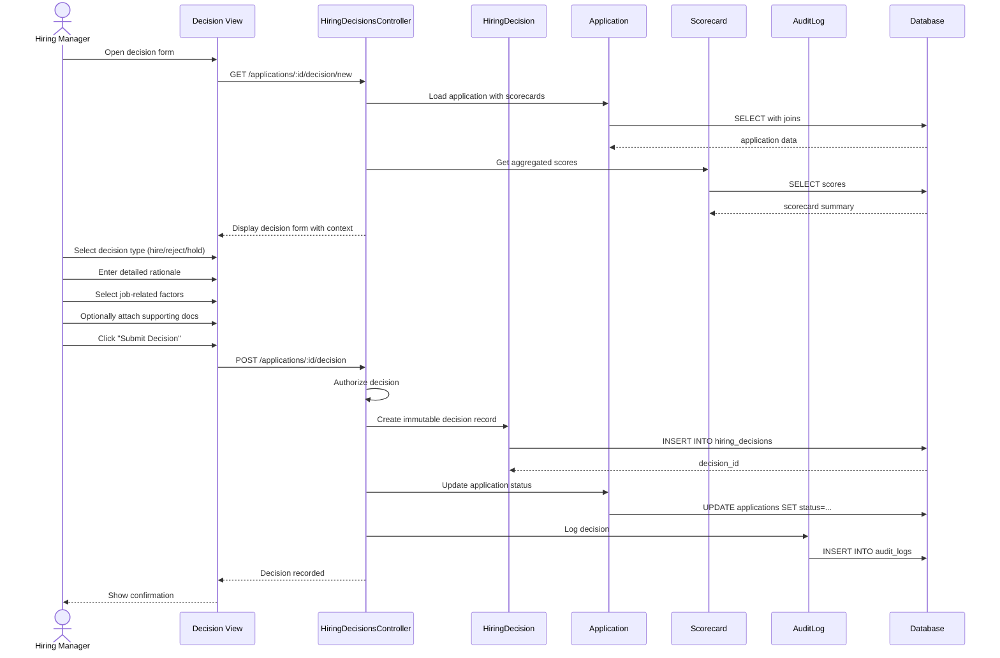

# UC-311: Document Hiring Decision

## Metadata

| Attribute | Value |
|-----------|-------|
| **ID** | UC-311 |
| **Name** | Document Hiring Decision |
| **Functional Area** | Compliance & Audit |
| **Primary Actor** | Hiring Manager (ACT-03) |
| **Priority** | P1 |
| **Complexity** | Medium |
| **Status** | Draft |

## Description

A hiring manager documents the formal hiring decision (hire, reject, or hold) for a candidate with detailed justification. This creates an immutable record for compliance purposes, supporting EEOC/OFCCP requirements for documenting non-discriminatory hiring practices and providing evidence trail for potential audits.

## Actors

| Actor | Role in Use Case |
|-------|------------------|
| Hiring Manager (ACT-03) | Makes and documents decision |
| Recruiter (ACT-02) | May document on behalf of HM |
| Compliance Officer (ACT-06) | Reviews decisions for compliance |

## Preconditions

- [ ] User is authenticated and has Hiring Manager or Recruiter role
- [ ] Application exists and is in terminal or near-terminal stage
- [ ] User has access to the job requisition
- [ ] No existing final decision for this application

## Postconditions

### Success
- [ ] HiringDecision record created (immutable)
- [ ] Decision type, rationale, and factors documented
- [ ] Related scorecard scores referenced
- [ ] Timestamp and decision-maker recorded
- [ ] Audit log entry created
- [ ] Application status updated accordingly

### Failure
- [ ] No decision record created
- [ ] Error message displayed
- [ ] User prompted to provide required information

## Triggers

- Hiring manager selects "Make Decision" from application view
- Application reaches offer or rejection stage
- Compliance review requires decision documentation
- Candidate is being marked as hired

## Basic Flow



| Step | Actor | Action | System Response |
|------|-------|--------|-----------------|
| 1 | Hiring Manager | Opens decision form | Form with context displayed |
| 2 | System | Loads scorecard summary | Interview feedback shown |
| 3 | System | Shows candidate qualifications | Relevant data displayed |
| 4 | Hiring Manager | Selects decision type | Hire/reject/hold chosen |
| 5 | Hiring Manager | Enters rationale | Justification text captured |
| 6 | Hiring Manager | Selects job-related factors | Checkboxes marked |
| 7 | Hiring Manager | Attaches documents (optional) | Files uploaded |
| 8 | Hiring Manager | Submits decision | Form submitted |
| 9 | System | Validates completeness | Required fields checked |
| 10 | System | Creates immutable record | Decision stored |
| 11 | System | Updates application status | Status changed |
| 12 | System | Creates audit log | Action recorded |
| 13 | System | Shows confirmation | Success message |

## Alternative Flows

### AF-1: Decision with Approval Required

**Trigger:** Organization requires approval for certain decisions

| Step | Actor | Action | System Response |
|------|-------|--------|-----------------|
| 8.1 | System | Checks approval requirement | Approval needed |
| 8.2 | System | Routes to approver | Notification sent |
| 8.3 | Approver | Reviews and approves | Approval recorded |
| 8.4 | System | Finalizes decision | Record completed |

**Resumption:** Returns to step 11

### AF-2: Comparative Decision

**Trigger:** Multiple candidates being compared

| Step | Actor | Action | System Response |
|------|-------|--------|-----------------|
| 3.1 | Hiring Manager | Requests comparison view | Side-by-side display |
| 3.2 | System | Shows candidates in final stage | Comparison matrix |
| 3.3 | Hiring Manager | Selects candidate(s) for decision | Selection made |

**Resumption:** Returns to step 4

## Exception Flows

### EF-1: Decision Already Exists

**Trigger:** Final decision already recorded

| Step | Actor | Action | System Response |
|------|-------|--------|-----------------|
| E.1 | System | Checks for existing decision | Decision found |
| E.2 | System | Displays existing decision | Read-only view |
| E.3 | System | Explains immutability | Cannot modify |

**Resolution:** User views existing decision (no modification)

### EF-2: Insufficient Justification

**Trigger:** Rationale too brief or missing required factors

| Step | Actor | Action | System Response |
|------|-------|--------|-----------------|
| E.1 | System | Validates rationale | Insufficient |
| E.2 | System | Shows requirements | Minimum detail needed |
| E.3 | Hiring Manager | Adds more detail | - |

**Resolution:** User provides adequate justification

## Business Rules

| ID | Rule | Description |
|----|------|-------------|
| BR-1 | Immutable Record | Hiring decisions cannot be modified after creation |
| BR-2 | Job-Related Factors | Decision must reference job-related criteria |
| BR-3 | Minimum Rationale | Rejection rationale minimum 50 characters |
| BR-4 | Non-Discriminatory | Factors cannot include protected class characteristics |
| BR-5 | One Decision | Only one final decision per application |
| BR-6 | Authorized Users | Only HM or delegated recruiter can decide |

## Data Requirements

### Input Data

| Field | Type | Required | Validation |
|-------|------|----------|------------|
| application_id | integer | Yes | Valid application |
| decision_type | enum | Yes | hire/reject/hold |
| rationale | text | Yes | Min 50 chars for reject |
| job_related_factors | array | Yes (reject) | At least one factor |
| comparison_notes | text | No | If comparing candidates |
| supporting_documents | array | No | File attachments |

### Output Data

| Field | Type | Description |
|-------|------|-------------|
| decision_id | integer | Immutable decision record |
| decision_type | string | hire/reject/hold |
| decided_at | datetime | Decision timestamp |
| decided_by | integer | User who made decision |

## Database Transactions

### Tables Affected

| Table | Operation | Conditions |
|-------|-----------|------------|
| hiring_decisions | CREATE | Immutable record |
| applications | UPDATE | Status change |
| decision_factors | CREATE | Job-related factors |
| audit_logs | CREATE | Decision audit |

### Transaction Detail

```sql
BEGIN TRANSACTION;

-- Create immutable hiring decision
INSERT INTO hiring_decisions (
    application_id, decision_type, rationale,
    comparison_notes, decided_by_id, decided_at,
    organization_id, created_at
)
VALUES (
    @application_id, @decision_type, @rationale,
    @comparison_notes, @user_id, NOW(),
    @org_id, NOW()
)
RETURNING id INTO @decision_id;

-- Store job-related factors
INSERT INTO decision_factors (hiring_decision_id, factor_type, factor_value)
SELECT @decision_id, factor_type, factor_value
FROM unnest(@factors) AS f(factor_type, factor_value);

-- Update application status
UPDATE applications
SET status = CASE @decision_type
    WHEN 'hire' THEN 'offered'
    WHEN 'reject' THEN 'rejected'
    ELSE status
END,
updated_at = NOW()
WHERE id = @application_id;

-- Create audit log
INSERT INTO audit_logs (
    action, auditable_type, auditable_id,
    user_id, metadata, created_at
)
VALUES (
    'hiring_decision_made', 'Application', @application_id, @user_id,
    '{"decision": @decision_type}', NOW()
);

COMMIT;
```

### Rollback Scenarios

| Scenario | Rollback Action |
|----------|-----------------|
| Validation failure | No records created |
| Database error | Full rollback |

## UI/UX Requirements

### Screen/Component

- **Location:** Application detail > Make Decision
- **Entry Point:** "Make Decision" button in final stages
- **Key Elements:**
  - Candidate summary card
  - Scorecard summary with average scores
  - Decision type selector (hire/reject/hold)
  - Rationale text area with character counter
  - Job-related factors checklist
  - Comparison candidates panel (if applicable)
  - Document attachment area
  - Submit button with confirmation

### Wireframe Reference

`/designs/wireframes/UC-311-hiring-decision.png`

## Non-Functional Requirements

| Requirement | Target |
|-------------|--------|
| Response Time | < 2 seconds |
| Record Immutability | 100% - no modifications allowed |
| Audit Retention | Per retention policy (min 3 years) |

## Security Considerations

- [x] Authentication required
- [x] Authorization check: Hiring manager or delegated recruiter
- [x] Immutability: Record cannot be modified post-creation
- [x] Audit logging: Full decision details logged
- [x] PII protection: Rationale should not include protected info

## Related Use Cases

| Use Case | Relationship |
|----------|--------------|
| UC-205 Make Hiring Decision | Creates the decision |
| UC-105 Reject Candidate | Triggers decision documentation |
| UC-259 Mark as Hired | May trigger decision documentation |
| UC-307 View Audit Trail | Shows decision in history |

---

## Data Model References

### Subject Areas

| Subject Area | ID | Relationship |
|--------------|-----|--------------|
| Compliance & Audit | SA-09 | Primary |
| Evaluation | SA-07 | Secondary |
| Application Pipeline | SA-05 | Secondary |

### Entities CRUD

| Entity | C | R | U | D | Notes |
|--------|---|---|---|---|-------|
| HiringDecision | ✓ | ✓ | | | Immutable after creation |
| DecisionFactor | ✓ | | | | Job-related factors |
| Application | | ✓ | ✓ | | Status update |
| Scorecard | | ✓ | | | Read for context |
| AuditLog | ✓ | | | | Immutable entry |

---

## Process Model References

| Attribute | Value | Link |
|-----------|-------|------|
| **Elementary Business Process** | EP-0933: Document Hiring Decision | [PROCESS_MODEL.md](../PROCESS_MODEL.md) |
| **Business Process** | BP-404: Audit Management | [PROCESS_MODEL.md](../PROCESS_MODEL.md) |
| **Business Function** | BF-04: Compliance Management | [PROCESS_MODEL.md](../PROCESS_MODEL.md) |

### EBP Details

| Attribute | Value |
|-----------|-------|
| **Trigger** | Final stage reached or decision made |
| **Input** | Candidate data, scorecards, decision |
| **Output** | Immutable hiring decision record |
| **Business Rules** | BR-1 through BR-6 |

---

## Traceability Matrix

| Artifact Type | ID | Name | Link |
|---------------|-----|------|------|
| **Use Case** | UC-311 | Document Hiring Decision | *(this document)* |
| **Elementary Process** | EP-0933 | Document Hiring Decision | [PROCESS_MODEL.md](../PROCESS_MODEL.md) |
| **Business Process** | BP-404 | Audit Management | [PROCESS_MODEL.md](../PROCESS_MODEL.md) |
| **Business Function** | BF-04 | Compliance Management | [PROCESS_MODEL.md](../PROCESS_MODEL.md) |
| **Primary Actor** | ACT-03 | Hiring Manager | [ACTORS.md](../ACTORS.md) |
| **Subject Area (Primary)** | SA-09 | Compliance & Audit | [DATA_MODEL.md](../DATA_MODEL.md) |

### Implementation Artifacts

| Artifact Type | Path/Reference | Status |
|---------------|----------------|--------|
| Controller | `app/controllers/admin/hiring_decisions_controller.rb` | Implemented |
| Model | `app/models/hiring_decision.rb` | Implemented |
| Policy | `app/policies/hiring_decision_policy.rb` | Implemented |

---

## Open Questions

1. Should we support decision templates for common rejection reasons?
2. Required training for documenting compliant decisions?

## Change History

| Version | Date | Author | Changes |
|---------|------|--------|---------|
| 0.1 | 2026-01-25 | System | Initial draft |
