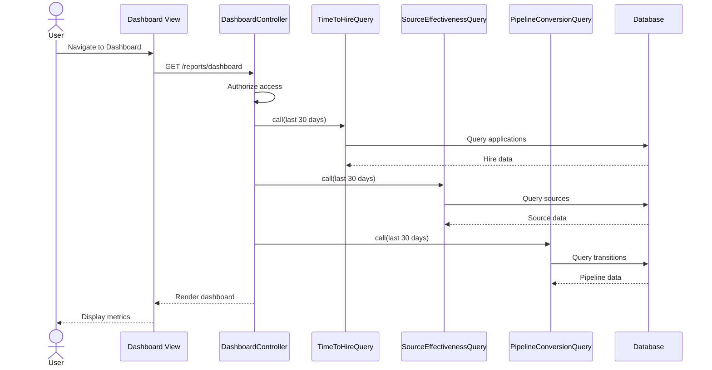

# UC-350: View Dashboard

## Metadata

| Attribute | Value |
|-----------|-------|
| **ID** | UC-350 |
| **Name** | View Dashboard |
| **Functional Area** | Reporting & Analytics |
| **Primary Actor** | Recruiter (ACT-02) |
| **Priority** | P1 |
| **Complexity** | Medium |
| **Status** | Draft |

## Description

Users access the main recruiting dashboard to view key performance indicators and metrics at a glance. The dashboard aggregates data from multiple query objects to present a unified view of recruiting operations, including time-to-hire trends, source effectiveness, pipeline conversion rates, and current pipeline status. Different user roles may see customized dashboard widgets based on their responsibilities.

## Actors

| Actor | Role in Use Case |
|-------|------------------|
| Recruiter (ACT-02) | Primary viewer of operational metrics |
| Hiring Manager (ACT-03) | Views team-specific metrics and pending actions |
| Executive (ACT-05) | Views high-level organizational metrics |
| System Administrator (ACT-01) | Views system health alongside recruiting metrics |

## Preconditions

- [ ] User is authenticated and has access to the organization
- [ ] User has permission to view reports (recruiter, hiring manager, admin, or executive role)
- [ ] Organization has at least some recruiting activity data

## Postconditions

### Success
- [ ] Dashboard displays with current metrics
- [ ] Data is scoped to user's organization
- [ ] Charts and visualizations render correctly
- [ ] No sensitive data exposed beyond user's permission level

### Failure
- [ ] Empty dashboard state shown with helpful guidance
- [ ] Error message displayed if data retrieval fails
- [ ] Graceful degradation if individual widgets fail

## Triggers

- User navigates to /reports/dashboard
- User clicks "Dashboard" link in navigation
- User lands on dashboard as default home page (if configured)

## Basic Flow



| Step | Actor | Action | System Response |
|------|-------|--------|-----------------|
| 1 | User | Navigates to dashboard | System loads dashboard page |
| 2 | System | Checks user authorization | User has view_reports permission |
| 3 | System | Queries TimeToHireQuery | Returns overall metrics, trends |
| 4 | System | Queries SourceEffectivenessQuery | Returns source breakdown |
| 5 | System | Queries PipelineConversionQuery | Returns funnel data |
| 6 | System | Aggregates current pipeline counts | Returns active applications by stage |
| 7 | System | Renders dashboard with Chart.js | Charts and KPIs displayed |
| 8 | User | Views dashboard | Metrics visible, interactive |

## Alternative Flows

### AF-1: Executive Dashboard View

**Trigger:** User has executive role

| Step | Actor | Action | System Response |
|------|-------|--------|-----------------|
| 2a | System | Detects executive role | Loads executive widget set |
| 3a | System | Queries DiversityMetricsQuery | Returns diversity summary |
| 4a | System | Queries OfferAcceptanceQuery | Returns offer trends |
| 5a | System | Renders executive dashboard | High-level KPIs emphasized |

**Resumption:** Use case ends

### AF-2: Hiring Manager Dashboard View

**Trigger:** User has hiring manager role only

| Step | Actor | Action | System Response |
|------|-------|--------|-----------------|
| 2b | System | Detects hiring manager role | Filters to owned jobs |
| 3b | System | Queries with job_id filter | Returns only HM's requisitions |
| 4b | System | Adds pending actions widget | Shows items needing approval |

**Resumption:** Use case ends

### AF-3: Change Date Range Filter

**Trigger:** User changes date range selector

| Step | Actor | Action | System Response |
|------|-------|--------|-----------------|
| 8a | User | Selects new date range | Date picker shows options |
| 8b | System | Re-queries all widgets | New data fetched via Turbo |
| 8c | System | Updates charts | Charts animate to new data |

**Resumption:** Returns to step 8

## Exception Flows

### EF-1: No Data Available

**Trigger:** Organization has no recruiting activity

| Step | Actor | Action | System Response |
|------|-------|--------|-----------------|
| E.1 | System | Detects zero records | Empty state displayed |
| E.2 | System | Shows onboarding guidance | Links to create first job |

**Resolution:** User follows guidance to create data

### EF-2: Query Timeout

**Trigger:** Database query exceeds timeout

| Step | Actor | Action | System Response |
|------|-------|--------|-----------------|
| E.1 | System | Query times out | Error logged |
| E.2 | System | Shows partial dashboard | Available widgets render |
| E.3 | System | Retry option displayed | User can refresh |

**Resolution:** Partial data shown, user can retry

## Business Rules

| ID | Rule | Description |
|----|------|-------------|
| BR-350.1 | Organization Scope | All metrics scoped to Current.organization |
| BR-350.2 | Date Range Default | Default to last 30 days if not specified |
| BR-350.3 | Role-Based Widgets | Widget visibility based on user role |
| BR-350.4 | Data Freshness | Dashboard data is real-time, not cached |
| BR-350.5 | Diversity Restriction | Diversity metrics only visible to admin/executive |

## Data Requirements

### Input Data

| Field | Type | Required | Validation |
|-------|------|----------|------------|
| start_date | date | No | Defaults to 30 days ago |
| end_date | date | No | Defaults to today |
| job_id | integer | No | Must belong to org |
| department_id | integer | No | Must belong to org |

### Output Data

| Field | Type | Description |
|-------|------|-------------|
| time_to_hire | hash | Overall and trend metrics from TimeToHireQuery |
| source_effectiveness | hash | Source breakdown from SourceEffectivenessQuery |
| pipeline_conversion | hash | Funnel data from PipelineConversionQuery |
| active_pipeline | hash | Current applications by stage |

## Database Transactions

### Tables Affected

| Table | Operation | Conditions |
|-------|-----------|------------|
| applications | READ | Aggregated metrics |
| jobs | READ | Job-level rollups |
| stage_transitions | READ | Pipeline conversion |
| offers | READ | Offer metrics (executive) |
| eeoc_responses | READ | Diversity metrics (executive) |

### Transaction Detail

```sql
-- Dashboard queries are read-only, no transactions needed
-- Example aggregation for active pipeline:

SELECT
    stages.name as stage_name,
    stages.color as stage_color,
    COUNT(applications.id) as count
FROM applications
JOIN jobs ON applications.job_id = jobs.id
JOIN stages ON applications.current_stage_id = stages.id
WHERE applications.discarded_at IS NULL
  AND applications.status IN ('new', 'screening', 'interviewing', 'assessment', 'background_check', 'offered')
  AND jobs.organization_id = @organization_id
GROUP BY stages.id, stages.name, stages.color
ORDER BY stages.position;
```

### Rollback Scenarios

| Scenario | Rollback Action |
|----------|-----------------|
| Query failure | Display cached/empty state |
| Partial load | Show available widgets only |

## UI/UX Requirements

### Screen/Component

- **Location:** /reports/dashboard
- **Entry Point:** Main navigation "Dashboard" link
- **Key Elements:**
  - Date range selector (preset options: 7d, 30d, 90d, custom)
  - KPI cards (4-6 key metrics)
  - Time-to-hire trend chart (line)
  - Source effectiveness chart (bar/pie)
  - Pipeline funnel visualization
  - Active pipeline summary

### Wireframe Reference

`/designs/wireframes/UC-350-dashboard.png`

### Dashboard Layout

```
+--------------------------------------------------+
| Dashboard                    [7d] [30d] [90d] [v]|
+--------------------------------------------------+
| +----------+ +----------+ +----------+ +--------+|
| | Time to  | | Offers   | | Pipeline | | Active ||
| | Hire     | | Accepted | | Convert. | | Jobs   ||
| |  23 days | |   78%    | |   12%    | |   14   ||
| +----------+ +----------+ +----------+ +--------+|
+--------------------------------------------------+
| +------------------------+ +--------------------+|
| | Time to Hire Trend     | | Pipeline Funnel    ||
| | [Line Chart]           | | [Funnel Chart]     ||
| |                        | |                    ||
| +------------------------+ +--------------------+|
+--------------------------------------------------+
| +------------------------+ +--------------------+|
| | Source Effectiveness   | | Recent Activity    ||
| | [Bar Chart]            | | - App received     ||
| |                        | | - Interview done   ||
| +------------------------+ +--------------------+|
+--------------------------------------------------+
```

## Non-Functional Requirements

| Requirement | Target |
|-------------|--------|
| Response Time | < 3 seconds full load |
| Chart Rendering | < 1 second after data load |
| Concurrent Users | 100 |
| Data Freshness | Real-time (no caching) |

## Security Considerations

- [x] Authentication required
- [x] Authorization check: Must have reports permission
- [x] Organization scoping: All queries scoped to Current.organization
- [x] Role-based visibility: Diversity metrics restricted to admin/exec
- [ ] No PII displayed on dashboard (aggregated data only)

## Related Use Cases

| Use Case | Relationship |
|----------|--------------|
| UC-351 Time-to-Hire Report | Drill down from dashboard KPI |
| UC-352 Source Effectiveness Report | Drill down from source chart |
| UC-353 Pipeline Conversion Report | Drill down from funnel |
| UC-354 Diversity Report | Executive dashboard widget |
| UC-359 Export Report Data | Export dashboard data |

---

## Data Model References

> Cross-references to [DATA_MODEL.md](../DATA_MODEL.md) and [CRUD_MATRIX.md](../CRUD_MATRIX.md)

### Subject Areas

| Subject Area | ID | Relationship |
|--------------|-----|--------------|
| Application Pipeline | SA-05 | Primary |
| Job Requisition | SA-03 | Secondary |
| Compliance & Audit | SA-09 | Reference (diversity) |

### Entities CRUD

| Entity | C | R | U | D | Notes |
|--------|---|---|---|---|-------|
| Application | | ✓ | | | Aggregated for metrics |
| Job | | ✓ | | | Job-level rollups |
| StageTransition | | ✓ | | | Pipeline conversion |
| Offer | | ✓ | | | Offer metrics |
| EeocResponse | | ✓ | | | Diversity (executive only) |
| ReportSnapshot | | ✓ | | | Optional cached data |

**Legend:** C = Create, R = Read, U = Update, D = Delete

---

## Process Model References

> Cross-references to [PROCESS_MODEL.md](../PROCESS_MODEL.md) and [PROCESS_CRUD_MATRIX.md](../PROCESS_CRUD_MATRIX.md)

| Attribute | Value | Link |
|-----------|-------|------|
| **Elementary Business Process** | EP-1201: View Dashboard | [PROCESS_MODEL.md#ep-1201](../PROCESS_MODEL.md#ep-1201-view-dashboard) |
| **Business Process** | BP-701: Operational Reporting | [PROCESS_MODEL.md#bp-701](../PROCESS_MODEL.md#bp-701-operational-reporting) |
| **Business Function** | BF-07: Analytics & Reporting | [PROCESS_MODEL.md#bf-07](../PROCESS_MODEL.md#bf-07-analytics--reporting) |

### EBP Details

| Attribute | Value |
|-----------|-------|
| **Trigger** | User navigates to dashboard or logs in |
| **Input** | Date range filters (optional) |
| **Output** | Rendered dashboard with KPIs and charts |
| **Business Rules** | BR-350.1 through BR-350.5 |

---

## Traceability Matrix

> Complete artifact mapping for requirements traceability

| Artifact Type | ID | Name | Link |
|---------------|-----|------|------|
| **Use Case** | UC-350 | View Dashboard | *(this document)* |
| **Elementary Process** | EP-1201 | View Dashboard | [PROCESS_MODEL.md](../PROCESS_MODEL.md#ep-1201-view-dashboard) |
| **Business Process** | BP-701 | Operational Reporting | [PROCESS_MODEL.md](../PROCESS_MODEL.md#bp-701-operational-reporting) |
| **Business Function** | BF-07 | Analytics & Reporting | [PROCESS_MODEL.md](../PROCESS_MODEL.md#bf-07-analytics--reporting) |
| **Primary Actor** | ACT-02 | Recruiter | [ACTORS.md](../ACTORS.md#act-02-recruiter) |
| **Subject Area (Primary)** | SA-05 | Application Pipeline | [DATA_MODEL.md](../DATA_MODEL.md#sa-05-application-pipeline) |
| **Subject Area (Secondary)** | SA-03 | Job Requisition | [DATA_MODEL.md](../DATA_MODEL.md#sa-03-job-requisition) |
| **CRUD Matrix Row** | UC-350 | - | [CRUD_MATRIX.md](../CRUD_MATRIX.md#uc-350) |
| **Process CRUD Row** | EP-1201 | - | [PROCESS_CRUD_MATRIX.md](../PROCESS_CRUD_MATRIX.md#ep-1201) |

### Implementation Artifacts

| Artifact Type | Path/Reference | Status |
|---------------|----------------|--------|
| Controller | `app/controllers/reports/dashboard_controller.rb` | Implemented |
| Query | `app/queries/time_to_hire_query.rb` | Implemented |
| Query | `app/queries/source_effectiveness_query.rb` | Implemented |
| Query | `app/queries/pipeline_conversion_query.rb` | Implemented |
| View | `app/views/reports/dashboard/index.html.erb` | Implemented |
| Test | `test/controllers/reports/dashboard_controller_test.rb` | Implemented |

---

## Open Questions

1. Should dashboard widgets be user-customizable?
2. What is the optimal default date range for different user roles?
3. Should we implement dashboard caching for performance at scale?

## Change History

| Version | Date | Author | Changes |
|---------|------|--------|---------|
| 0.1 | 2026-01-25 | System | Initial draft |
