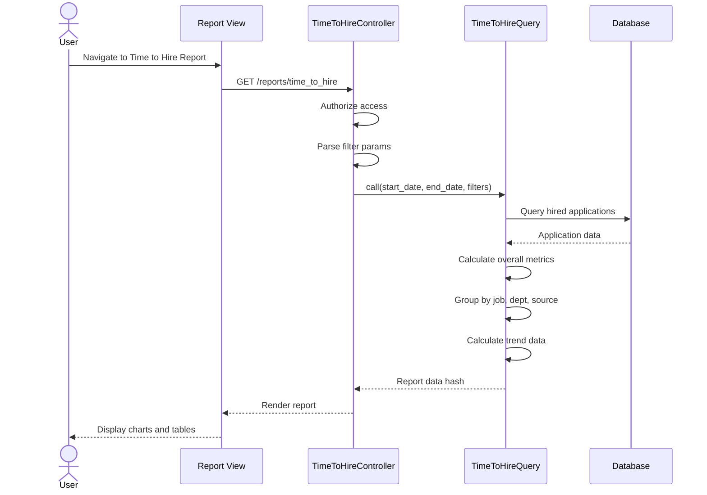

# UC-351: Time-to-Hire Report

## Metadata

| Attribute | Value |
|-----------|-------|
| **ID** | UC-351 |
| **Name** | Time-to-Hire Report |
| **Functional Area** | Reporting & Analytics |
| **Primary Actor** | Recruiter (ACT-02) |
| **Priority** | P1 |
| **Complexity** | Medium |
| **Status** | Draft |

## Description

Users generate and view a detailed time-to-hire analysis report that measures the duration from application submission to hire completion. The report provides overall metrics, breakdowns by job, department, and source, trend analysis over time, and raw application data for drill-down analysis. This report helps identify bottlenecks in the hiring process and benchmark performance.

## Actors

| Actor | Role in Use Case |
|-------|------------------|
| Recruiter (ACT-02) | Primary user analyzing hiring velocity |
| Hiring Manager (ACT-03) | Reviews metrics for their department/jobs |
| Executive (ACT-05) | Reviews organization-wide trends |

## Preconditions

- [ ] User is authenticated with reports access permission
- [ ] Organization has at least one hired application
- [ ] User belongs to the organization being analyzed

## Postconditions

### Success
- [ ] Report displays with time-to-hire metrics
- [ ] Charts render with trend data
- [ ] Breakdowns by job, department, source available
- [ ] Raw data table shows individual hires

### Failure
- [ ] Empty state shown if no hires in date range
- [ ] Error message if query fails
- [ ] Graceful handling of partial data

## Triggers

- User navigates to /reports/time_to_hire
- User clicks "Time to Hire" from dashboard or reports menu
- User clicks drill-down from dashboard KPI

## Basic Flow



| Step | Actor | Action | System Response |
|------|-------|--------|-----------------|
| 1 | User | Navigates to Time to Hire report | System loads report page |
| 2 | System | Authorizes user access | Permission verified |
| 3 | System | Parses date range and filters | Filter parameters extracted |
| 4 | System | Calls TimeToHireQuery | Query executes |
| 5 | System | Calculates overall metrics | Avg, median, min, max days computed |
| 6 | System | Groups by job | Per-job metrics calculated |
| 7 | System | Groups by department | Per-department metrics calculated |
| 8 | System | Groups by source | Per-source metrics calculated |
| 9 | System | Calculates weekly trend | Trend data prepared |
| 10 | System | Renders report with Chart.js | Charts and tables displayed |

## Alternative Flows

### AF-1: Apply Job Filter

**Trigger:** User selects specific job from dropdown

| Step | Actor | Action | System Response |
|------|-------|--------|-----------------|
| 3a | User | Selects job from filter | Filter applied |
| 4a | System | Re-queries with job_id | Data filtered to single job |
| 5a | System | Updates all metrics | Job-specific view displayed |

**Resumption:** Returns to step 10

### AF-2: Apply Department Filter

**Trigger:** User selects specific department

| Step | Actor | Action | System Response |
|------|-------|--------|-----------------|
| 3b | User | Selects department | Filter applied |
| 4b | System | Re-queries with department_id | Data filtered |
| 5b | System | Shows department comparison | Within-dept breakdown |

**Resumption:** Returns to step 10

### AF-3: Export to CSV

**Trigger:** User clicks Export button

| Step | Actor | Action | System Response |
|------|-------|--------|-----------------|
| 10a | User | Clicks "Export CSV" | Export initiated |
| 10b | System | Generates CSV from raw_data | CSV file created |
| 10c | System | Triggers download | File downloads |

**Resumption:** Use case ends

## Exception Flows

### EF-1: No Hires in Date Range

**Trigger:** Zero hired applications in selected period

| Step | Actor | Action | System Response |
|------|-------|--------|-----------------|
| E.1 | System | Detects empty result set | Empty metrics returned |
| E.2 | System | Displays empty state | Message with suggestions |
| E.3 | User | Adjusts date range | Report re-runs |

**Resolution:** User selects different date range

### EF-2: Invalid Date Range

**Trigger:** End date before start date

| Step | Actor | Action | System Response |
|------|-------|--------|-----------------|
| E.1 | System | Validates date range | Validation fails |
| E.2 | System | Shows error message | "End date must be after start date" |
| E.3 | User | Corrects dates | Report runs |

**Resolution:** Valid dates entered

## Business Rules

| ID | Rule | Description |
|----|------|-------------|
| BR-351.1 | Time Calculation | Days = hired_at - applied_at in calendar days |
| BR-351.2 | Hired Only | Only applications with status='hired' included |
| BR-351.3 | Date Filter | hired_at must fall within date range |
| BR-351.4 | Organization Scope | All data scoped to Current.organization |
| BR-351.5 | Median Calculation | Median computed as average of middle values |
| BR-351.6 | Trend Grouping | Trend data grouped by week of hire |

## Data Requirements

### Input Data

| Field | Type | Required | Validation |
|-------|------|----------|------------|
| start_date | date | Yes | Must be valid date |
| end_date | date | Yes | Must be >= start_date |
| job_id | integer | No | Must belong to org |
| department_id | integer | No | Must belong to org |
| source_type | string | No | Valid source type enum |

### Output Data

| Field | Type | Description |
|-------|------|-------------|
| overall.total_hires | integer | Total number of hires |
| overall.average_days | float | Mean days to hire |
| overall.median_days | float | Median days to hire |
| overall.min_days | integer | Fastest hire |
| overall.max_days | integer | Slowest hire |
| by_job | array | Per-job breakdown |
| by_department | array | Per-department breakdown |
| by_source | array | Per-source breakdown |
| trend | array | Weekly trend data |
| raw_data | array | Individual hire records (limit 100) |

## Database Transactions

### Tables Affected

| Table | Operation | Conditions |
|-------|-----------|------------|
| applications | READ | status = 'hired', hired_at in range |
| jobs | READ | Join for job title, department |
| departments | READ | Join for department name |
| candidates | READ | Join for candidate name |

### Transaction Detail

```sql
-- Time to hire query (read-only)
SELECT
    applications.id,
    applications.applied_at,
    applications.hired_at,
    applications.source_type,
    jobs.id as job_id,
    jobs.title as job_title,
    departments.id as department_id,
    departments.name as department_name,
    JULIANDAY(applications.hired_at) - JULIANDAY(applications.applied_at) as days_to_hire
FROM applications
JOIN jobs ON applications.job_id = jobs.id
LEFT JOIN departments ON jobs.department_id = departments.id
WHERE applications.discarded_at IS NULL
  AND applications.status = 'hired'
  AND applications.hired_at BETWEEN @start_date AND @end_date
  AND jobs.organization_id = @organization_id
ORDER BY applications.hired_at DESC;
```

### Rollback Scenarios

| Scenario | Rollback Action |
|----------|-----------------|
| Query timeout | Return cached/partial data |
| Read-only | No rollback needed |

## UI/UX Requirements

### Screen/Component

- **Location:** /reports/time_to_hire
- **Entry Point:** Reports menu, Dashboard drill-down
- **Key Elements:**
  - Date range picker
  - Filter dropdowns (job, department, source)
  - KPI summary cards
  - Trend line chart
  - Breakdown bar charts
  - Raw data table with pagination

### Report Layout

```
+--------------------------------------------------+
| Time to Hire Report                              |
| [Start Date] to [End Date]  [Job v] [Dept v]     |
+--------------------------------------------------+
| +----------+ +----------+ +----------+ +--------+|
| | Total    | | Average  | | Median   | | Range  ||
| | Hires    | | Days     | | Days     | |        ||
| |   47     | |  23.5    | |   21     | | 8-45   ||
| +----------+ +----------+ +----------+ +--------+|
+--------------------------------------------------+
| +-----------------------------------------------+|
| | Time to Hire Trend (Weekly)                   ||
| | [Line Chart - weeks on X, avg days on Y]      ||
| |                                               ||
| +-----------------------------------------------+|
+--------------------------------------------------+
| +---------------------+ +----------------------+|
| | By Department       | | By Source            ||
| | [Bar Chart]         | | [Bar Chart]          ||
| +---------------------+ +----------------------+|
+--------------------------------------------------+
| Raw Data                              [Export CSV]|
| +-----------------------------------------------+|
| | Candidate | Job      | Source | Applied | Days||
| | Jane Doe  | Eng Lead | Ref    | Jan 1   | 21  ||
| | John Smi  | Sr Dev   | Indeed | Jan 3   | 18  ||
| +-----------------------------------------------+|
+--------------------------------------------------+
```

## Non-Functional Requirements

| Requirement | Target |
|-------------|--------|
| Response Time | < 3 seconds for 1000 hires |
| Export Time | < 5 seconds for CSV |
| Chart Rendering | < 1 second |
| Data Accuracy | Real-time, no cache |

## Security Considerations

- [x] Authentication required
- [x] Authorization check: Must have reports permission
- [x] Organization scoping: All queries filtered by org
- [x] Audit logging: Report generation logged
- [ ] PII in raw data: Candidate names visible to authorized users only

## Related Use Cases

| Use Case | Relationship |
|----------|--------------|
| UC-350 View Dashboard | Parent - summary displayed there |
| UC-355 Recruiter Activity Report | Related - productivity correlation |
| UC-356 Open Requisitions Report | Related - aging impacts time-to-hire |
| UC-359 Export Report Data | Extends - export functionality |

---

## Data Model References

> Cross-references to [DATA_MODEL.md](../DATA_MODEL.md) and [CRUD_MATRIX.md](../CRUD_MATRIX.md)

### Subject Areas

| Subject Area | ID | Relationship |
|--------------|-----|--------------|
| Application Pipeline | SA-05 | Primary |
| Job Requisition | SA-03 | Secondary |
| Candidate | SA-04 | Reference |

### Entities CRUD

| Entity | C | R | U | D | Notes |
|--------|---|---|---|---|-------|
| Application | | ✓ | | | Primary data source |
| Job | | ✓ | | | Join for job details |
| Department | | ✓ | | | Join for dept details |
| Candidate | | ✓ | | | Join for candidate name |

**Legend:** C = Create, R = Read, U = Update, D = Delete

---

## Process Model References

> Cross-references to [PROCESS_MODEL.md](../PROCESS_MODEL.md) and [PROCESS_CRUD_MATRIX.md](../PROCESS_CRUD_MATRIX.md)

| Attribute | Value | Link |
|-----------|-------|------|
| **Elementary Business Process** | EP-1202: Generate Time-to-Hire Report | [PROCESS_MODEL.md#ep-1202](../PROCESS_MODEL.md#ep-1202-generate-time-to-hire-report) |
| **Business Process** | BP-701: Operational Reporting | [PROCESS_MODEL.md#bp-701](../PROCESS_MODEL.md#bp-701-operational-reporting) |
| **Business Function** | BF-07: Analytics & Reporting | [PROCESS_MODEL.md#bf-07](../PROCESS_MODEL.md#bf-07-analytics--reporting) |

### EBP Details

| Attribute | Value |
|-----------|-------|
| **Trigger** | User requests time-to-hire report |
| **Input** | Date range, optional job/department/source filters |
| **Output** | Time-to-hire metrics with breakdowns and trends |
| **Business Rules** | BR-351.1 through BR-351.6 |

---

## Traceability Matrix

> Complete artifact mapping for requirements traceability

| Artifact Type | ID | Name | Link |
|---------------|-----|------|------|
| **Use Case** | UC-351 | Time-to-Hire Report | *(this document)* |
| **Elementary Process** | EP-1202 | Generate Time-to-Hire Report | [PROCESS_MODEL.md](../PROCESS_MODEL.md#ep-1202-generate-time-to-hire-report) |
| **Business Process** | BP-701 | Operational Reporting | [PROCESS_MODEL.md](../PROCESS_MODEL.md#bp-701-operational-reporting) |
| **Business Function** | BF-07 | Analytics & Reporting | [PROCESS_MODEL.md](../PROCESS_MODEL.md#bf-07-analytics--reporting) |
| **Primary Actor** | ACT-02 | Recruiter | [ACTORS.md](../ACTORS.md#act-02-recruiter) |
| **Subject Area (Primary)** | SA-05 | Application Pipeline | [DATA_MODEL.md](../DATA_MODEL.md#sa-05-application-pipeline) |
| **Subject Area (Secondary)** | SA-03 | Job Requisition | [DATA_MODEL.md](../DATA_MODEL.md#sa-03-job-requisition) |
| **CRUD Matrix Row** | UC-351 | - | [CRUD_MATRIX.md](../CRUD_MATRIX.md#uc-351) |
| **Process CRUD Row** | EP-1202 | - | [PROCESS_CRUD_MATRIX.md](../PROCESS_CRUD_MATRIX.md#ep-1202) |

### Implementation Artifacts

| Artifact Type | Path/Reference | Status |
|---------------|----------------|--------|
| Controller | `app/controllers/reports/time_to_hire_controller.rb` | Implemented |
| Query | `app/queries/time_to_hire_query.rb` | Implemented |
| View | `app/views/reports/time_to_hire/index.html.erb` | Implemented |
| Test | `test/queries/time_to_hire_query_test.rb` | Implemented |

---

## Open Questions

1. Should we include weekends/holidays in time calculation or use business days?
2. What is the target benchmark for time-to-hire by job level?
3. Should we track time spent in each stage for more granular analysis?

## Change History

| Version | Date | Author | Changes |
|---------|------|--------|---------|
| 0.1 | 2026-01-25 | System | Initial draft |
