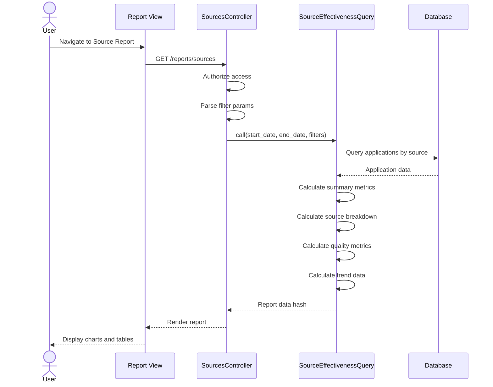

# UC-352: Source Effectiveness Report

## Metadata

| Attribute | Value |
|-----------|-------|
| **ID** | UC-352 |
| **Name** | Source Effectiveness Report |
| **Functional Area** | Reporting & Analytics |
| **Primary Actor** | Recruiter (ACT-02) |
| **Priority** | P1 |
| **Complexity** | Medium |
| **Status** | Draft |

## Description

Users generate and view a source effectiveness analysis report that evaluates the quality and volume of candidates from different recruitment sources. The report tracks applicant volume, conversion rates, quality scores, time-to-hire by source, and ROI metrics. This helps recruiters optimize their sourcing strategy and allocate recruiting budget effectively.

## Actors

| Actor | Role in Use Case |
|-------|------------------|
| Recruiter (ACT-02) | Analyzes source performance for strategy |
| Executive (ACT-05) | Reviews source ROI for budget decisions |
| System Administrator (ACT-01) | May configure source categories |

## Preconditions

- [ ] User is authenticated with reports access permission
- [ ] Organization has applications with source data
- [ ] Applications have source_type populated

## Postconditions

### Success
- [ ] Report displays source breakdown metrics
- [ ] Quality scores calculated per source
- [ ] Conversion rates displayed
- [ ] Trend data shows source performance over time

### Failure
- [ ] Empty state if no applications in date range
- [ ] Error handling for missing source data
- [ ] Graceful degradation for partial data

## Triggers

- User navigates to /reports/sources
- User clicks "Source Effectiveness" from reports menu
- User drills down from dashboard source widget

## Basic Flow



| Step | Actor | Action | System Response |
|------|-------|--------|-----------------|
| 1 | User | Navigates to Source Effectiveness report | System loads report page |
| 2 | System | Authorizes user access | Permission verified |
| 3 | System | Parses date range and filters | Filter parameters extracted |
| 4 | System | Calls SourceEffectivenessQuery | Query executes |
| 5 | System | Calculates summary metrics | Total apps, sources, hires |
| 6 | System | Groups by source type | Per-source counts and rates |
| 7 | System | Calculates quality scores | Composite quality metric |
| 8 | System | Calculates weekly trend | Applications by source over time |
| 9 | System | Computes quality by source | Rating, time-to-hire, interview rate |
| 10 | System | Renders report with Chart.js | Charts and tables displayed |

## Alternative Flows

### AF-1: Filter by Job

**Trigger:** User selects specific job

| Step | Actor | Action | System Response |
|------|-------|--------|-----------------|
| 3a | User | Selects job from dropdown | Filter applied |
| 4a | System | Re-queries with job_id | Source data for single job |
| 5a | System | Updates all metrics | Job-specific source analysis |

**Resumption:** Returns to step 10

### AF-2: Compare Sources

**Trigger:** User wants side-by-side comparison

| Step | Actor | Action | System Response |
|------|-------|--------|-----------------|
| 10a | User | Selects two sources to compare | Comparison view triggered |
| 10b | System | Displays side-by-side metrics | Detailed comparison shown |

**Resumption:** User continues analysis

### AF-3: Export to CSV

**Trigger:** User clicks Export

| Step | Actor | Action | System Response |
|------|-------|--------|-----------------|
| 10a | User | Clicks "Export CSV" | Export initiated |
| 10b | System | Generates CSV with source data | File created |
| 10c | System | Triggers download | File downloads |

**Resumption:** Use case ends

## Exception Flows

### EF-1: No Source Data

**Trigger:** Applications missing source_type

| Step | Actor | Action | System Response |
|------|-------|--------|-----------------|
| E.1 | System | Detects null source_type | Groups as "Unknown" |
| E.2 | System | Shows warning | "Some applications have no source" |

**Resolution:** Report includes "Unknown" category

### EF-2: No Applications in Range

**Trigger:** Zero applications in date range

| Step | Actor | Action | System Response |
|------|-------|--------|-----------------|
| E.1 | System | Empty result set | Empty state displayed |
| E.2 | System | Suggests different range | Date guidance shown |

**Resolution:** User adjusts date range

## Business Rules

| ID | Rule | Description |
|----|------|-------------|
| BR-352.1 | Source Types | Valid sources: direct, referral, job_board, agency, social, career_site |
| BR-352.2 | Conversion Rate | % of applicants from source who were hired |
| BR-352.3 | Quality Score | Composite of conversion (40%), rating (30%), interview rate (30%) |
| BR-352.4 | Interview Rate | % of applicants who reached interview stage |
| BR-352.5 | Organization Scope | All data scoped to Current.organization |
| BR-352.6 | Active vs Total | In-progress excludes rejected/withdrawn |

## Data Requirements

### Input Data

| Field | Type | Required | Validation |
|-------|------|----------|------------|
| start_date | date | Yes | Valid date |
| end_date | date | Yes | >= start_date |
| job_id | integer | No | Must belong to org |
| department_id | integer | No | Must belong to org |

### Output Data

| Field | Type | Description |
|-------|------|-------------|
| summary.total_applications | integer | Total apps in range |
| summary.unique_sources | integer | Count of distinct sources |
| summary.total_hires | integer | Total hires from all sources |
| summary.overall_conversion | float | Overall conversion percentage |
| by_source | array | Per-source breakdown |
| by_source[].source_type | string | Source identifier |
| by_source[].applications | integer | Count of applications |
| by_source[].hired | integer | Count of hires |
| by_source[].conversion_rate | float | Hire rate percentage |
| by_source[].quality_score | float | Composite quality (0-100) |
| trend | array | Weekly breakdown by source |
| quality_metrics | array | Detailed quality per source |

## Database Transactions

### Tables Affected

| Table | Operation | Conditions |
|-------|-----------|------------|
| applications | READ | applied_at in range |
| jobs | READ | Join for department filter |

### Transaction Detail

```sql
-- Source effectiveness query (read-only)
-- Summary by source
SELECT
    source_type,
    COUNT(*) as total_applications,
    SUM(CASE WHEN status = 'hired' THEN 1 ELSE 0 END) as hires,
    SUM(CASE WHEN status IN ('new', 'screening', 'interviewing', 'assessment', 'background_check', 'offered') THEN 1 ELSE 0 END) as in_progress,
    SUM(CASE WHEN status = 'rejected' THEN 1 ELSE 0 END) as rejected,
    AVG(CASE WHEN rating IS NOT NULL THEN rating ELSE NULL END) as avg_rating
FROM applications
JOIN jobs ON applications.job_id = jobs.id
WHERE applications.discarded_at IS NULL
  AND applications.applied_at BETWEEN @start_date AND @end_date
  AND jobs.organization_id = @organization_id
GROUP BY source_type
ORDER BY total_applications DESC;

-- Interview rate by source
SELECT
    source_type,
    COUNT(*) as total,
    SUM(CASE WHEN status IN ('interviewing', 'assessment', 'background_check', 'offered', 'hired') THEN 1 ELSE 0 END) as interviewed
FROM applications
JOIN jobs ON applications.job_id = jobs.id
WHERE applications.discarded_at IS NULL
  AND applications.applied_at BETWEEN @start_date AND @end_date
  AND jobs.organization_id = @organization_id
GROUP BY source_type;
```

### Rollback Scenarios

| Scenario | Rollback Action |
|----------|-----------------|
| Query timeout | Return cached data or partial results |
| Read-only | No rollback needed |

## UI/UX Requirements

### Screen/Component

- **Location:** /reports/sources
- **Entry Point:** Reports menu, Dashboard drill-down
- **Key Elements:**
  - Date range picker
  - Job/Department filter
  - Summary KPI cards
  - Source comparison bar chart
  - Quality score table
  - Trend stacked area chart

### Report Layout

```
+--------------------------------------------------+
| Source Effectiveness Report                      |
| [Start Date] to [End Date]  [Job v] [Dept v]     |
+--------------------------------------------------+
| +----------+ +----------+ +----------+ +--------+|
| | Total    | | Sources  | | Hires    | |Overall ||
| | Apps     | | Used     | |          | |Convert ||
| |   234    | |    6     | |   28     | | 12.0%  ||
| +----------+ +----------+ +----------+ +--------+|
+--------------------------------------------------+
| +-----------------------------------------------+|
| | Applications by Source                        ||
| | [Horizontal Bar Chart]                        ||
| | Referral      ████████████  89                ||
| | LinkedIn      ████████  64                    ||
| | Career Site   ██████  45                      ||
| | Indeed        ████  36                        ||
| +-----------------------------------------------+|
+--------------------------------------------------+
| Source Quality Comparison                        |
| +-----------------------------------------------+|
| | Source    | Apps | Hired | Conv% | Quality   ||
| | Referral  |  89  |  15   | 16.8% | 78.5      ||
| | LinkedIn  |  64  |   8   | 12.5% | 65.2      ||
| | Indeed    |  36  |   3   |  8.3% | 45.1      ||
| +-----------------------------------------------+|
+--------------------------------------------------+
| Trend Over Time                      [Export CSV]|
| +-----------------------------------------------+|
| | [Stacked Area Chart - sources by week]        ||
| +-----------------------------------------------+|
+--------------------------------------------------+
```

## Non-Functional Requirements

| Requirement | Target |
|-------------|--------|
| Response Time | < 3 seconds |
| Export Time | < 5 seconds |
| Chart Rendering | < 1 second |
| Concurrent Users | 50 |

## Security Considerations

- [x] Authentication required
- [x] Authorization check: Reports permission required
- [x] Organization scoping: All queries filtered
- [x] Audit logging: Report access logged
- [ ] No PII exposed: Only aggregated metrics

## Related Use Cases

| Use Case | Relationship |
|----------|--------------|
| UC-350 View Dashboard | Parent - shows source summary |
| UC-351 Time-to-Hire Report | Related - time by source |
| UC-353 Pipeline Conversion Report | Related - funnel by source |
| UC-359 Export Report Data | Extends - export capability |

---

## Data Model References

> Cross-references to [DATA_MODEL.md](../DATA_MODEL.md) and [CRUD_MATRIX.md](../CRUD_MATRIX.md)

### Subject Areas

| Subject Area | ID | Relationship |
|--------------|-----|--------------|
| Application Pipeline | SA-05 | Primary |
| Job Requisition | SA-03 | Secondary |

### Entities CRUD

| Entity | C | R | U | D | Notes |
|--------|---|---|---|---|-------|
| Application | | ✓ | | | Primary data source |
| Job | | ✓ | | | Filter and grouping |

**Legend:** C = Create, R = Read, U = Update, D = Delete

---

## Process Model References

> Cross-references to [PROCESS_MODEL.md](../PROCESS_MODEL.md) and [PROCESS_CRUD_MATRIX.md](../PROCESS_CRUD_MATRIX.md)

| Attribute | Value | Link |
|-----------|-------|------|
| **Elementary Business Process** | EP-1203: Generate Source Effectiveness Report | [PROCESS_MODEL.md#ep-1203](../PROCESS_MODEL.md#ep-1203-generate-source-effectiveness-report) |
| **Business Process** | BP-701: Operational Reporting | [PROCESS_MODEL.md#bp-701](../PROCESS_MODEL.md#bp-701-operational-reporting) |
| **Business Function** | BF-07: Analytics & Reporting | [PROCESS_MODEL.md#bf-07](../PROCESS_MODEL.md#bf-07-analytics--reporting) |

### EBP Details

| Attribute | Value |
|-----------|-------|
| **Trigger** | User requests source effectiveness report |
| **Input** | Date range, optional job/department filters |
| **Output** | Source metrics with quality scores and trends |
| **Business Rules** | BR-352.1 through BR-352.6 |

---

## Traceability Matrix

> Complete artifact mapping for requirements traceability

| Artifact Type | ID | Name | Link |
|---------------|-----|------|------|
| **Use Case** | UC-352 | Source Effectiveness Report | *(this document)* |
| **Elementary Process** | EP-1203 | Generate Source Effectiveness Report | [PROCESS_MODEL.md](../PROCESS_MODEL.md#ep-1203-generate-source-effectiveness-report) |
| **Business Process** | BP-701 | Operational Reporting | [PROCESS_MODEL.md](../PROCESS_MODEL.md#bp-701-operational-reporting) |
| **Business Function** | BF-07 | Analytics & Reporting | [PROCESS_MODEL.md](../PROCESS_MODEL.md#bf-07-analytics--reporting) |
| **Primary Actor** | ACT-02 | Recruiter | [ACTORS.md](../ACTORS.md#act-02-recruiter) |
| **Subject Area (Primary)** | SA-05 | Application Pipeline | [DATA_MODEL.md](../DATA_MODEL.md#sa-05-application-pipeline) |
| **Subject Area (Secondary)** | SA-03 | Job Requisition | [DATA_MODEL.md](../DATA_MODEL.md#sa-03-job-requisition) |
| **CRUD Matrix Row** | UC-352 | - | [CRUD_MATRIX.md](../CRUD_MATRIX.md#uc-352) |
| **Process CRUD Row** | EP-1203 | - | [PROCESS_CRUD_MATRIX.md](../PROCESS_CRUD_MATRIX.md#ep-1203) |

### Implementation Artifacts

| Artifact Type | Path/Reference | Status |
|---------------|----------------|--------|
| Controller | `app/controllers/reports/sources_controller.rb` | Implemented |
| Query | `app/queries/source_effectiveness_query.rb` | Implemented |
| View | `app/views/reports/sources/index.html.erb` | Implemented |
| Test | `test/queries/source_effectiveness_query_test.rb` | Implemented |

---

## Open Questions

1. Should we track cost-per-hire by source when cost data is available?
2. How should we handle custom source types from integrations?
3. Should quality score weights be configurable per organization?

## Change History

| Version | Date | Author | Changes |
|---------|------|--------|---------|
| 0.1 | 2026-01-25 | System | Initial draft |
