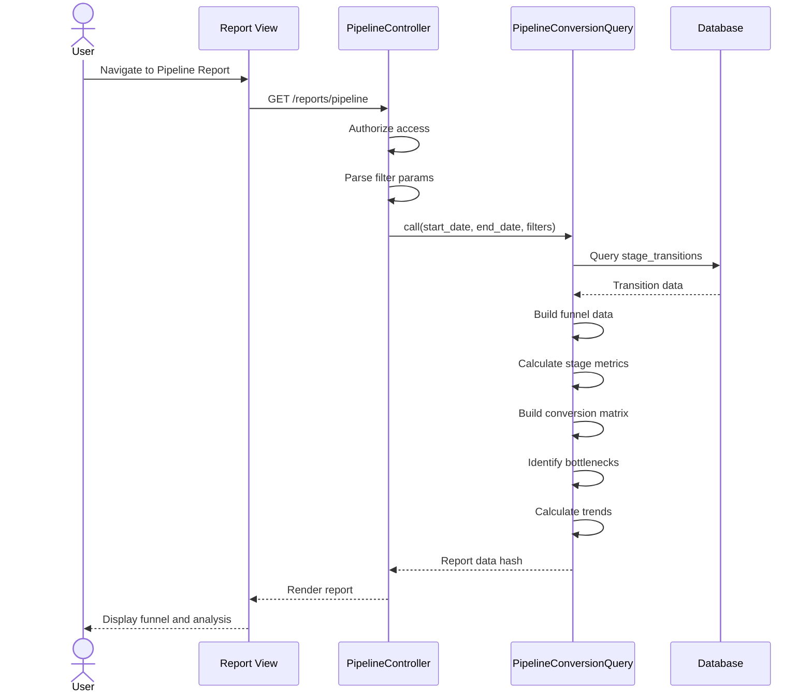

# UC-353: Pipeline Conversion Report

## Metadata

| Attribute | Value |
|-----------|-------|
| **ID** | UC-353 |
| **Name** | Pipeline Conversion Report |
| **Functional Area** | Reporting & Analytics |
| **Primary Actor** | Recruiter (ACT-02) |
| **Priority** | P1 |
| **Complexity** | High |
| **Status** | Draft |

## Description

Users generate and view a pipeline conversion analysis report that measures stage-to-stage conversion rates throughout the hiring funnel. The report identifies bottlenecks where candidates drop off, calculates average time spent in each stage, provides recommendations for process improvement, and shows conversion trends over time. This data helps optimize the recruiting process and improve overall hiring efficiency.

## Actors

| Actor | Role in Use Case |
|-------|------------------|
| Recruiter (ACT-02) | Primary user optimizing pipeline flow |
| Hiring Manager (ACT-03) | Reviews stage efficiency for their jobs |
| Executive (ACT-05) | Monitors overall funnel health |

## Preconditions

- [ ] User is authenticated with reports access permission
- [ ] Organization has defined pipeline stages
- [ ] Applications exist with stage transition history
- [ ] StageTransition records capture movement data

## Postconditions

### Success
- [ ] Funnel visualization displays conversion rates
- [ ] Stage metrics show pass-through and rejection rates
- [ ] Bottleneck analysis identifies problem areas
- [ ] Conversion matrix shows stage-to-stage flows

### Failure
- [ ] Empty state if no stage transitions in range
- [ ] Graceful handling if stages are misconfigured
- [ ] Error message for data retrieval failures

## Triggers

- User navigates to /reports/pipeline
- User clicks "Pipeline Conversion" from reports menu
- User drills down from dashboard funnel widget

## Basic Flow



| Step | Actor | Action | System Response |
|------|-------|--------|-----------------|
| 1 | User | Navigates to Pipeline Conversion report | System loads report page |
| 2 | System | Authorizes user access | Permission verified |
| 3 | System | Parses date range and filters | Filter parameters extracted |
| 4 | System | Calls PipelineConversionQuery | Query executes |
| 5 | System | Retrieves default stages | Stage configuration loaded |
| 6 | System | Counts stage entries/exits | Entry and exit counts per stage |
| 7 | System | Calculates conversion rates | Stage-to-stage percentages |
| 8 | System | Calculates average time per stage | Duration metrics |
| 9 | System | Builds conversion matrix | All stage flows mapped |
| 10 | System | Identifies bottlenecks | Below-average stages flagged |
| 11 | System | Calculates weekly trend | Conversion over time |
| 12 | System | Renders report with visualizations | Charts and tables displayed |

## Alternative Flows

### AF-1: Filter by Job

**Trigger:** User selects specific job

| Step | Actor | Action | System Response |
|------|-------|--------|-----------------|
| 3a | User | Selects job from dropdown | Filter applied |
| 4a | System | Re-queries with job_id | Job-specific pipeline data |
| 5a | System | Uses job-specific stages if configured | Custom stages shown |

**Resumption:** Returns to step 12

### AF-2: Filter by Department

**Trigger:** User selects department

| Step | Actor | Action | System Response |
|------|-------|--------|-----------------|
| 3b | User | Selects department | Filter applied |
| 4b | System | Re-queries for department jobs | Department aggregate |

**Resumption:** Returns to step 12

### AF-3: View Stage Detail

**Trigger:** User clicks on a stage in funnel

| Step | Actor | Action | System Response |
|------|-------|--------|-----------------|
| 12a | User | Clicks stage segment | Stage detail modal opens |
| 12b | System | Shows candidates in stage | Current stage occupants listed |
| 12c | System | Shows exit destinations | Where candidates went next |

**Resumption:** User closes modal

### AF-4: Export to CSV

**Trigger:** User clicks Export

| Step | Actor | Action | System Response |
|------|-------|--------|-----------------|
| 12a | User | Clicks "Export CSV" | Export initiated |
| 12b | System | Generates CSV with stage data | File created |
| 12c | System | Triggers download | File downloads |

**Resumption:** Use case ends

## Exception Flows

### EF-1: No Stage Transitions

**Trigger:** No StageTransition records in date range

| Step | Actor | Action | System Response |
|------|-------|--------|-----------------|
| E.1 | System | Empty transition set | Zero entries for all stages |
| E.2 | System | Shows empty state | "No pipeline activity in range" |

**Resolution:** User adjusts date range

### EF-2: Missing Stage Configuration

**Trigger:** Default stages not properly configured

| Step | Actor | Action | System Response |
|------|-------|--------|-----------------|
| E.1 | System | Cannot find default stages | Error logged |
| E.2 | System | Shows configuration error | Admin alert shown |

**Resolution:** Admin configures stages

## Business Rules

| ID | Rule | Description |
|----|------|-------------|
| BR-353.1 | Stage Entry | Counted when to_stage_id matches stage |
| BR-353.2 | Stage Exit | Counted when from_stage_id matches stage |
| BR-353.3 | Conversion Rate | (next stage entries / current stage entries) * 100 |
| BR-353.4 | Pass-Through Rate | (exits / entries) * 100 for non-terminal |
| BR-353.5 | Bottleneck Threshold | Stages with < average pass-through and > 5 entries |
| BR-353.6 | Time in Stage | Calculated from StageTransition.average_time_in_stage |
| BR-353.7 | Terminal Stages | Hired/Rejected/Withdrawn excluded from funnel |
| BR-353.8 | Organization Scope | All data scoped to Current.organization |

## Data Requirements

### Input Data

| Field | Type | Required | Validation |
|-------|------|----------|------------|
| start_date | date | Yes | Valid date |
| end_date | date | Yes | >= start_date |
| job_id | integer | No | Must belong to org |
| department_id | integer | No | Must belong to org |

### Output Data

| Field | Type | Description |
|-------|------|-------------|
| funnel | array | Stage-by-stage funnel data |
| funnel[].stage_name | string | Name of stage |
| funnel[].entries | integer | Applications entering stage |
| funnel[].conversion_from_previous | float | % from previous stage |
| funnel[].avg_time_in_stage | float | Hours in stage |
| stage_metrics | array | Detailed per-stage metrics |
| stage_metrics[].pass_through_rate | float | % passing through |
| stage_metrics[].rejection_rate | float | % rejected from stage |
| stage_metrics[].current_count | integer | Currently in stage |
| conversion_matrix | hash | Stage-to-stage counts |
| bottlenecks | array | Identified problem stages |
| bottlenecks[].stage_name | string | Stage with issue |
| bottlenecks[].recommendation | string | Improvement suggestion |
| trend | array | Weekly conversion trend |

## Database Transactions

### Tables Affected

| Table | Operation | Conditions |
|-------|-----------|------------|
| stage_transitions | READ | created_at in range |
| stages | READ | Default stage definitions |
| applications | READ | Status and stage counts |
| jobs | READ | Department filtering |

### Transaction Detail

```sql
-- Funnel data query (read-only)
-- Stage entries
SELECT
    stages.id as stage_id,
    stages.name as stage_name,
    stages.color,
    stages.position,
    COUNT(stage_transitions.id) as entries
FROM stages
LEFT JOIN stage_transitions ON stage_transitions.to_stage_id = stages.id
LEFT JOIN applications ON stage_transitions.application_id = applications.id
WHERE stages.is_default = true
  AND stages.is_terminal = false
  AND applications.discarded_at IS NULL
  AND stage_transitions.created_at BETWEEN @start_date AND @end_date
GROUP BY stages.id, stages.name, stages.color, stages.position
ORDER BY stages.position;

-- Conversion matrix
SELECT
    from_stage_id,
    to_stage_id,
    COUNT(*) as transitions
FROM stage_transitions
JOIN applications ON stage_transitions.application_id = applications.id
WHERE applications.discarded_at IS NULL
  AND stage_transitions.created_at BETWEEN @start_date AND @end_date
GROUP BY from_stage_id, to_stage_id;

-- Current stage counts
SELECT
    current_stage_id,
    COUNT(*) as count
FROM applications
WHERE discarded_at IS NULL
  AND status IN ('new', 'screening', 'interviewing', 'assessment', 'background_check', 'offered')
GROUP BY current_stage_id;
```

### Rollback Scenarios

| Scenario | Rollback Action |
|----------|-----------------|
| Query timeout | Return cached/partial data |
| Read-only | No rollback needed |

## UI/UX Requirements

### Screen/Component

- **Location:** /reports/pipeline
- **Entry Point:** Reports menu, Dashboard funnel drill-down
- **Key Elements:**
  - Date range picker
  - Job/Department filter
  - Visual funnel diagram
  - Stage metrics table
  - Bottleneck alerts
  - Conversion matrix heatmap
  - Trend line chart

### Report Layout

```
+--------------------------------------------------+
| Pipeline Conversion Report                       |
| [Start Date] to [End Date]  [Job v] [Dept v]     |
+--------------------------------------------------+
| Pipeline Funnel                                  |
| +-----------------------------------------------+|
| | Applied                 ████████████  234     ||
| |                              ↓ 65%            ||
| | Screening               ████████  152         ||
| |                              ↓ 58%            ||
| | Interviewing            ██████  88            ||
| |                              ↓ 45%            ||
| | Offer                   ███  40               ||
| |                              ↓ 70%            ||
| | Hired                   ██  28                ||
| +-----------------------------------------------+|
+--------------------------------------------------+
| Bottleneck Analysis                              |
| +-----------------------------------------------+|
| | ⚠ Interviewing: 45% pass-through (avg 58%)   ||
| |   Recommendation: Review screening criteria   ||
| +-----------------------------------------------+|
+--------------------------------------------------+
| Stage Metrics                                    |
| +-----------------------------------------------+|
| | Stage       | In  | Out | Pass% | Avg Days   ||
| | Screening   | 152 | 88  |  58%  |   3.2      ||
| | Interviewing|  88 | 40  |  45%  |   7.5      ||
| +-----------------------------------------------+|
+--------------------------------------------------+
| Conversion Trend                     [Export CSV]|
| +-----------------------------------------------+|
| | [Line Chart - weekly overall conversion]      ||
| +-----------------------------------------------+|
+--------------------------------------------------+
```

## Non-Functional Requirements

| Requirement | Target |
|-------------|--------|
| Response Time | < 4 seconds for complex queries |
| Funnel Rendering | < 1 second |
| Export Time | < 5 seconds |
| Data Accuracy | Real-time |

## Security Considerations

- [x] Authentication required
- [x] Authorization check: Reports permission required
- [x] Organization scoping: All queries filtered
- [x] Audit logging: Report access logged
- [ ] No PII in aggregate view

## Related Use Cases

| Use Case | Relationship |
|----------|--------------|
| UC-350 View Dashboard | Parent - funnel summary shown |
| UC-351 Time-to-Hire Report | Related - stage time impacts TTH |
| UC-352 Source Effectiveness Report | Related - source to stage flow |
| UC-103 Move Stage | Source - creates transition data |
| UC-359 Export Report Data | Extends - export capability |

---

## Data Model References

> Cross-references to [DATA_MODEL.md](../DATA_MODEL.md) and [CRUD_MATRIX.md](../CRUD_MATRIX.md)

### Subject Areas

| Subject Area | ID | Relationship |
|--------------|-----|--------------|
| Application Pipeline | SA-05 | Primary |
| Organization | SA-02 | Secondary (stages) |
| Job Requisition | SA-03 | Reference |

### Entities CRUD

| Entity | C | R | U | D | Notes |
|--------|---|---|---|---|-------|
| StageTransition | | ✓ | | | Primary data source |
| Stage | | ✓ | | | Stage definitions |
| Application | | ✓ | | | Current state counts |
| Job | | ✓ | | | Filtering |

**Legend:** C = Create, R = Read, U = Update, D = Delete

---

## Process Model References

> Cross-references to [PROCESS_MODEL.md](../PROCESS_MODEL.md) and [PROCESS_CRUD_MATRIX.md](../PROCESS_CRUD_MATRIX.md)

| Attribute | Value | Link |
|-----------|-------|------|
| **Elementary Business Process** | EP-1204: Generate Pipeline Conversion Report | [PROCESS_MODEL.md#ep-1204](../PROCESS_MODEL.md#ep-1204-generate-pipeline-conversion-report) |
| **Business Process** | BP-701: Operational Reporting | [PROCESS_MODEL.md#bp-701](../PROCESS_MODEL.md#bp-701-operational-reporting) |
| **Business Function** | BF-07: Analytics & Reporting | [PROCESS_MODEL.md#bf-07](../PROCESS_MODEL.md#bf-07-analytics--reporting) |

### EBP Details

| Attribute | Value |
|-----------|-------|
| **Trigger** | User requests pipeline conversion report |
| **Input** | Date range, optional job/department filters |
| **Output** | Funnel visualization with metrics and bottleneck analysis |
| **Business Rules** | BR-353.1 through BR-353.8 |

---

## Traceability Matrix

> Complete artifact mapping for requirements traceability

| Artifact Type | ID | Name | Link |
|---------------|-----|------|------|
| **Use Case** | UC-353 | Pipeline Conversion Report | *(this document)* |
| **Elementary Process** | EP-1204 | Generate Pipeline Conversion Report | [PROCESS_MODEL.md](../PROCESS_MODEL.md#ep-1204-generate-pipeline-conversion-report) |
| **Business Process** | BP-701 | Operational Reporting | [PROCESS_MODEL.md](../PROCESS_MODEL.md#bp-701-operational-reporting) |
| **Business Function** | BF-07 | Analytics & Reporting | [PROCESS_MODEL.md](../PROCESS_MODEL.md#bf-07-analytics--reporting) |
| **Primary Actor** | ACT-02 | Recruiter | [ACTORS.md](../ACTORS.md#act-02-recruiter) |
| **Subject Area (Primary)** | SA-05 | Application Pipeline | [DATA_MODEL.md](../DATA_MODEL.md#sa-05-application-pipeline) |
| **Subject Area (Secondary)** | SA-02 | Organization | [DATA_MODEL.md](../DATA_MODEL.md#sa-02-organization) |
| **CRUD Matrix Row** | UC-353 | - | [CRUD_MATRIX.md](../CRUD_MATRIX.md#uc-353) |
| **Process CRUD Row** | EP-1204 | - | [PROCESS_CRUD_MATRIX.md](../PROCESS_CRUD_MATRIX.md#ep-1204) |

### Implementation Artifacts

| Artifact Type | Path/Reference | Status |
|---------------|----------------|--------|
| Controller | `app/controllers/reports/pipeline_controller.rb` | Implemented |
| Query | `app/queries/pipeline_conversion_query.rb` | Implemented |
| View | `app/views/reports/pipeline/index.html.erb` | Implemented |
| Test | `test/queries/pipeline_conversion_query_test.rb` | Implemented |

---

## Open Questions

1. Should we track reason codes for stage exits (rejection reasons)?
2. How should we handle custom stages that differ from defaults?
3. Should bottleneck recommendations be configurable or AI-generated?

## Change History

| Version | Date | Author | Changes |
|---------|------|--------|---------|
| 0.1 | 2026-01-25 | System | Initial draft |
