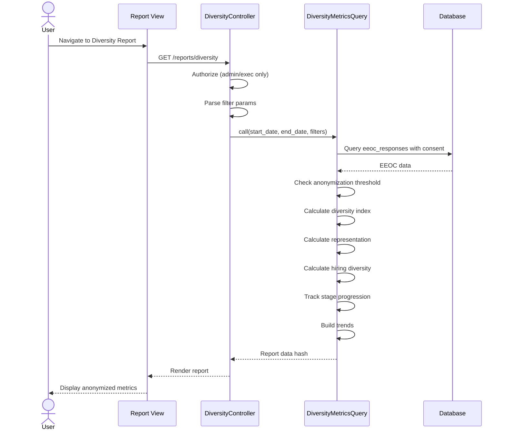

# UC-354: Diversity Report

## Metadata

| Attribute | Value |
|-----------|-------|
| **ID** | UC-354 |
| **Name** | Diversity Report |
| **Functional Area** | Reporting & Analytics |
| **Primary Actor** | Executive (ACT-05) |
| **Priority** | P1 |
| **Complexity** | High |
| **Status** | Draft |

## Description

Authorized users generate and view a diversity metrics report that analyzes workforce representation across demographic groups. The report uses data from voluntary EEOC self-identification responses, calculates diversity indices, tracks representation trends, and compares applicant demographics to hire demographics. All data is anonymized using a minimum threshold to protect individual privacy while providing meaningful organizational insights.

## Actors

| Actor | Role in Use Case |
|-------|------------------|
| Executive (ACT-05) | Primary viewer of diversity metrics |
| Compliance Officer (ACT-06) | Reviews for regulatory compliance |
| System Administrator (ACT-01) | May access for audit purposes |

## Preconditions

- [ ] User is authenticated with admin or executive role
- [ ] Organization has EEOC data collection enabled
- [ ] Candidates have submitted voluntary self-identification data
- [ ] Sufficient data exists to meet anonymization threshold (5+ responses)

## Postconditions

### Success
- [ ] Diversity summary with index score displayed
- [ ] Representation breakdown by demographic group shown
- [ ] Hiring diversity compared to applicant pool
- [ ] Trend data shows diversity over time
- [ ] All data properly anonymized below threshold

### Failure
- [ ] Insufficient data message if below threshold
- [ ] Empty state with guidance for data collection
- [ ] No individual identifiable data ever displayed

## Triggers

- User navigates to /reports/diversity
- User clicks "Diversity Report" from executive dashboard
- Compliance officer accesses for audit purposes

## Basic Flow



| Step | Actor | Action | System Response |
|------|-------|--------|-----------------|
| 1 | User | Navigates to Diversity Report | System loads report page |
| 2 | System | Checks user role | Admin or executive required |
| 3 | System | Parses date range and filters | Parameters extracted |
| 4 | System | Calls DiversityMetricsQuery | Query executes |
| 5 | System | Filters to responses with consent | Only consented data used |
| 6 | System | Checks anonymization threshold | Minimum 5 responses required |
| 7 | System | Calculates Simpson's Diversity Index | Index score computed |
| 8 | System | Calculates representation metrics | Breakdown by group |
| 9 | System | Computes hiring vs applicant comparison | Differential analysis |
| 10 | System | Tracks stage progression by group | Funnel by demographic |
| 11 | System | Builds monthly trends | Historical data |
| 12 | System | Renders report with anonymization | Charts and tables displayed |

## Alternative Flows

### AF-1: Filter by Department

**Trigger:** User selects department

| Step | Actor | Action | System Response |
|------|-------|--------|-----------------|
| 3a | User | Selects department | Filter applied |
| 4a | System | Re-queries for department | Department-specific data |
| 5a | System | Re-checks threshold | May show "insufficient data" |

**Resumption:** Returns to step 12

### AF-2: Filter by Job

**Trigger:** User selects specific job

| Step | Actor | Action | System Response |
|------|-------|--------|-----------------|
| 3b | User | Selects job | Filter applied |
| 4b | System | Re-queries for job | Job-specific data |
| 5b | System | Re-checks threshold | Likely shows "insufficient data" |

**Resumption:** Returns to step 12

### AF-3: Export to PDF

**Trigger:** User clicks Export PDF

| Step | Actor | Action | System Response |
|------|-------|--------|-----------------|
| 12a | User | Clicks "Export PDF" | PDF generation initiated |
| 12b | System | Generates PDF via Prawn | Document created |
| 12c | System | Triggers download | File downloads |

**Resumption:** Use case ends

## Exception Flows

### EF-1: Below Anonymization Threshold

**Trigger:** Fewer than 5 responses in selected criteria

| Step | Actor | Action | System Response |
|------|-------|--------|-----------------|
| E.1 | System | Count < 5 for category | Category marked anonymized |
| E.2 | System | Shows "< 5" instead of count | Privacy protected |
| E.3 | System | Percentage not calculated | Null/hidden percentage |

**Resolution:** Aggregate data only shown

### EF-2: No EEOC Data

**Trigger:** No EEOC responses in organization

| Step | Actor | Action | System Response |
|------|-------|--------|-----------------|
| E.1 | System | Zero EEOC responses | Empty state displayed |
| E.2 | System | Shows guidance | "Enable EEOC collection" |

**Resolution:** Admin configures EEOC collection

### EF-3: Unauthorized Access

**Trigger:** Non-admin/exec user attempts access

| Step | Actor | Action | System Response |
|------|-------|--------|-----------------|
| E.1 | System | Role check fails | Access denied |
| E.2 | System | Redirects to dashboard | Error message shown |

**Resolution:** User contacts admin for access

## Business Rules

| ID | Rule | Description |
|----|------|-------------|
| BR-354.1 | Authorization | Only admin and executive roles may access |
| BR-354.2 | Consent Required | Only responses with consent_given=true used |
| BR-354.3 | Anonymization Threshold | Groups with < 5 responses show "< 5" |
| BR-354.4 | Diversity Index | Simpson's Index: 1 - sum((n/N)^2) |
| BR-354.5 | Underrepresented | Hispanic, Black, Native American, Pacific Islander, Two+ races |
| BR-354.6 | Organization Scope | All data scoped to Current.organization |
| BR-354.7 | No Individual Data | Never show individual-level records |
| BR-354.8 | Trend Minimum | Monthly trend only shown if month >= threshold |

## Data Requirements

### Input Data

| Field | Type | Required | Validation |
|-------|------|----------|------------|
| start_date | date | Yes | Valid date |
| end_date | date | Yes | >= start_date |
| job_id | integer | No | Must belong to org |
| department_id | integer | No | Must belong to org |

### Output Data

| Field | Type | Description |
|-------|------|-------------|
| summary.total_respondents | integer | Total responses (or anonymized) |
| summary.diversity_index | float | Simpson's Index (0-1) |
| summary.diversity_index_label | string | Low/Moderate/Good/Excellent |
| summary.gender_ratio | hash | Female/Male percentages |
| summary.underrepresented_percentage | float | % in underrepresented groups |
| representation.by_gender | array | Gender breakdown |
| representation.by_race | array | Race/ethnicity breakdown |
| representation.by_veteran | array | Veteran status breakdown |
| representation.by_disability | array | Disability status breakdown |
| hiring_diversity | hash | Hired vs applicant comparison |
| stage_progression | array | Funnel by demographic (if threshold met) |
| trends | array | Monthly diversity index |

## Database Transactions

### Tables Affected

| Table | Operation | Conditions |
|-------|-----------|------------|
| eeoc_responses | READ | consent_given = true |
| applications | READ | Join for applied_at, status |
| jobs | READ | Filter by job/department |
| stage_transitions | READ | Stage progression analysis |

### Transaction Detail

```sql
-- Diversity metrics query (read-only)
-- Base query with consent filter
SELECT
    er.gender,
    er.race_ethnicity,
    er.veteran_status,
    er.disability_status,
    a.status
FROM eeoc_responses er
JOIN applications a ON er.application_id = a.id
JOIN jobs j ON a.job_id = j.id
WHERE er.consent_given = true
  AND a.applied_at BETWEEN @start_date AND @end_date
  AND j.organization_id = @organization_id;

-- Group counts for representation
SELECT
    race_ethnicity,
    COUNT(*) as count
FROM eeoc_responses er
JOIN applications a ON er.application_id = a.id
JOIN jobs j ON a.job_id = j.id
WHERE er.consent_given = true
  AND a.applied_at BETWEEN @start_date AND @end_date
  AND j.organization_id = @organization_id
GROUP BY race_ethnicity;

-- Hired comparison
SELECT
    race_ethnicity,
    COUNT(*) as hired_count
FROM eeoc_responses er
JOIN applications a ON er.application_id = a.id
JOIN jobs j ON a.job_id = j.id
WHERE er.consent_given = true
  AND a.status = 'hired'
  AND a.applied_at BETWEEN @start_date AND @end_date
  AND j.organization_id = @organization_id
GROUP BY race_ethnicity;
```

### Rollback Scenarios

| Scenario | Rollback Action |
|----------|-----------------|
| Query timeout | Return cached snapshot |
| Read-only | No rollback needed |

## UI/UX Requirements

### Screen/Component

- **Location:** /reports/diversity
- **Entry Point:** Executive dashboard, Reports menu (restricted)
- **Key Elements:**
  - Date range picker
  - Department filter (optional)
  - Diversity index summary card
  - Representation pie/bar charts
  - Hire vs Applicant comparison
  - Trend line chart
  - Export to PDF button

### Report Layout

```
+--------------------------------------------------+
| Diversity Report                [Admin/Exec Only]|
| [Start Date] to [End Date]  [Dept v]             |
+--------------------------------------------------+
| +----------+ +----------+ +----------+ +--------+|
| | Diversity| | Female   | | Under-   | |Respond-||
| | Index    | | Ratio    | | Repres.  | | ents   ||
| |   0.72   | |   42%    | |   28%    | |  156   ||
| | Good     | |          | |          | |        ||
| +----------+ +----------+ +----------+ +--------+|
+--------------------------------------------------+
| Representation by Race/Ethnicity                 |
| +-----------------------------------------------+|
| | [Horizontal Bar Chart with anonymization]     ||
| | White             ████████████  45%           ||
| | Asian             ██████  22%                 ||
| | Hispanic/Latino   ████  15%                   ||
| | Black             ███  12%                    ||
| | Two or More       █  < 5                      ||
| +-----------------------------------------------+|
+--------------------------------------------------+
| Hiring vs Applicant Pool                         |
| +-----------------------------------------------+|
| | Group          | Applied% | Hired% | Diff     ||
| | White          |   45%    |  48%   | +3%      ||
| | Asian          |   22%    |  25%   | +3%      ||
| | Hispanic       |   15%    |  12%   | -3%      ||
| +-----------------------------------------------+|
+--------------------------------------------------+
| Diversity Index Trend              [Export PDF]  |
| +-----------------------------------------------+|
| | [Line Chart - monthly diversity index]        ||
| +-----------------------------------------------+|
+--------------------------------------------------+
```

## Non-Functional Requirements

| Requirement | Target |
|-------------|--------|
| Response Time | < 3 seconds |
| PDF Export | < 10 seconds |
| Anonymization | 100% compliance |
| Access Control | Role-based restriction |

## Security Considerations

- [x] Authentication required
- [x] Authorization check: Admin or Executive role only
- [x] Organization scoping: All queries filtered
- [x] Anonymization: < 5 threshold strictly enforced
- [x] Consent filter: Only consented data used
- [x] Audit logging: All access logged
- [x] No individual data: Never show person-level records
- [x] PDF watermarking: "Confidential" watermark on exports

## Related Use Cases

| Use Case | Relationship |
|----------|--------------|
| UC-350 View Dashboard | Executive dashboard widget |
| UC-300 Collect EEOC Data | Source of diversity data |
| UC-306 Generate EEOC Report | Related compliance report |
| UC-359 Export Report Data | Extends - PDF export |

---

## Data Model References

> Cross-references to [DATA_MODEL.md](../DATA_MODEL.md) and [CRUD_MATRIX.md](../CRUD_MATRIX.md)

### Subject Areas

| Subject Area | ID | Relationship |
|--------------|-----|--------------|
| Compliance & Audit | SA-09 | Primary |
| Application Pipeline | SA-05 | Secondary |

### Entities CRUD

| Entity | C | R | U | D | Notes |
|--------|---|---|---|---|-------|
| EeocResponse | | ✓ | | | Primary data source |
| Application | | ✓ | | | Join for status, dates |
| Job | | ✓ | | | Filtering |
| StageTransition | | ✓ | | | Stage progression |
| ReportSnapshot | | ✓ | | | Optional cached data |

**Legend:** C = Create, R = Read, U = Update, D = Delete

---

## Process Model References

> Cross-references to [PROCESS_MODEL.md](../PROCESS_MODEL.md) and [PROCESS_CRUD_MATRIX.md](../PROCESS_CRUD_MATRIX.md)

| Attribute | Value | Link |
|-----------|-------|------|
| **Elementary Business Process** | EP-1211: Generate Diversity Report | [PROCESS_MODEL.md#ep-1211](../PROCESS_MODEL.md#ep-1211-generate-diversity-report) |
| **Business Process** | BP-702: Compliance Reporting | [PROCESS_MODEL.md#bp-702](../PROCESS_MODEL.md#bp-702-compliance-reporting) |
| **Business Function** | BF-07: Analytics & Reporting | [PROCESS_MODEL.md#bf-07](../PROCESS_MODEL.md#bf-07-analytics--reporting) |

### EBP Details

| Attribute | Value |
|-----------|-------|
| **Trigger** | Executive or admin requests diversity report |
| **Input** | Date range, optional department filter |
| **Output** | Anonymized diversity metrics with trends |
| **Business Rules** | BR-354.1 through BR-354.8 |

---

## Traceability Matrix

> Complete artifact mapping for requirements traceability

| Artifact Type | ID | Name | Link |
|---------------|-----|------|------|
| **Use Case** | UC-354 | Diversity Report | *(this document)* |
| **Elementary Process** | EP-1211 | Generate Diversity Report | [PROCESS_MODEL.md](../PROCESS_MODEL.md#ep-1211-generate-diversity-report) |
| **Business Process** | BP-702 | Compliance Reporting | [PROCESS_MODEL.md](../PROCESS_MODEL.md#bp-702-compliance-reporting) |
| **Business Function** | BF-07 | Analytics & Reporting | [PROCESS_MODEL.md](../PROCESS_MODEL.md#bf-07-analytics--reporting) |
| **Primary Actor** | ACT-05 | Executive | [ACTORS.md](../ACTORS.md#act-05-executive) |
| **Subject Area (Primary)** | SA-09 | Compliance & Audit | [DATA_MODEL.md](../DATA_MODEL.md#sa-09-compliance--audit) |
| **Subject Area (Secondary)** | SA-05 | Application Pipeline | [DATA_MODEL.md](../DATA_MODEL.md#sa-05-application-pipeline) |
| **CRUD Matrix Row** | UC-354 | - | [CRUD_MATRIX.md](../CRUD_MATRIX.md#uc-354) |
| **Process CRUD Row** | EP-1211 | - | [PROCESS_CRUD_MATRIX.md](../PROCESS_CRUD_MATRIX.md#ep-1211) |

### Implementation Artifacts

| Artifact Type | Path/Reference | Status |
|---------------|----------------|--------|
| Controller | `app/controllers/reports/diversity_controller.rb` | Implemented |
| Query | `app/queries/diversity_metrics_query.rb` | Implemented |
| View | `app/views/reports/diversity/index.html.erb` | Implemented |
| Test | `test/queries/diversity_metrics_query_test.rb` | Implemented |

---

## Open Questions

1. Should we implement differential privacy for additional protection?
2. What is the appropriate anonymization threshold for smaller organizations?
3. Should we track intersectionality (e.g., female + underrepresented)?

## Change History

| Version | Date | Author | Changes |
|---------|------|--------|---------|
| 0.1 | 2026-01-25 | System | Initial draft |
