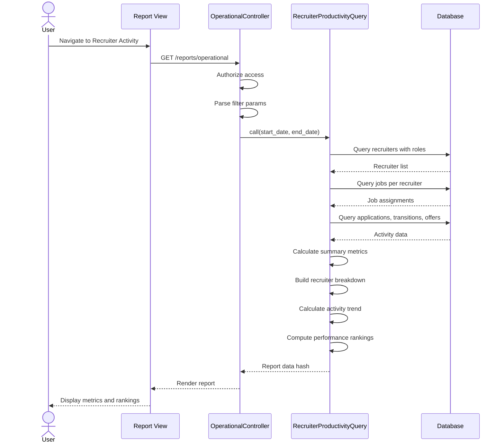

# UC-355: Recruiter Activity Report

## Metadata

| Attribute | Value |
|-----------|-------|
| **ID** | UC-355 |
| **Name** | Recruiter Activity Report |
| **Functional Area** | Reporting & Analytics |
| **Primary Actor** | Recruiter (ACT-02) |
| **Priority** | P2 |
| **Complexity** | Medium |
| **Status** | Draft |

## Description

Users generate and view a recruiter productivity report that tracks individual and team performance metrics. The report measures activity volume (applications processed, interviews scheduled, offers made, hires completed), conversion rates, and identifies top performers. This helps recruiting managers assess team capacity, identify coaching opportunities, and distribute workload effectively.

## Actors

| Actor | Role in Use Case |
|-------|------------------|
| Recruiter (ACT-02) | Views own metrics and team comparison |
| Executive (ACT-05) | Reviews team performance |
| System Administrator (ACT-01) | Accesses for operational review |

## Preconditions

- [ ] User is authenticated with reports access permission
- [ ] Organization has recruiters assigned to jobs
- [ ] Recruiting activity exists (stage moves, interviews, offers)
- [ ] User has permission to view productivity data

## Postconditions

### Success
- [ ] Summary metrics displayed for period
- [ ] Per-recruiter breakdown shown
- [ ] Activity trends visualized
- [ ] Performance rankings calculated

### Failure
- [ ] Empty state if no recruiter activity
- [ ] Graceful handling of recruiters with no jobs
- [ ] Error message for data retrieval failures

## Triggers

- User navigates to /reports/operational (productivity tab)
- User clicks "Recruiter Activity" from reports menu
- Manager reviews team performance periodically

## Basic Flow



| Step | Actor | Action | System Response |
|------|-------|--------|-----------------|
| 1 | User | Navigates to Recruiter Activity report | System loads report page |
| 2 | System | Authorizes user access | Permission verified |
| 3 | System | Parses date range | Parameters extracted |
| 4 | System | Calls RecruiterProductivityQuery | Query executes |
| 5 | System | Identifies recruiters by role | Users with recruiter/admin role found |
| 6 | System | Queries job assignments | Jobs per recruiter retrieved |
| 7 | System | Aggregates activity metrics | Applications, moves, interviews, offers, hires |
| 8 | System | Calculates summary totals | Team-wide metrics |
| 9 | System | Builds per-recruiter breakdown | Individual metrics computed |
| 10 | System | Calculates weekly trend | Activity over time |
| 11 | System | Computes rankings | Top performers identified |
| 12 | System | Renders report | Charts and tables displayed |

## Alternative Flows

### AF-1: Filter to Single Recruiter

**Trigger:** User selects specific recruiter

| Step | Actor | Action | System Response |
|------|-------|--------|-----------------|
| 3a | User | Selects recruiter from list | Filter applied |
| 4a | System | Re-queries for single recruiter | Individual deep-dive shown |
| 5a | System | Shows detailed activity log | Granular view available |

**Resumption:** Returns to step 12

### AF-2: Compare Period Over Period

**Trigger:** User enables comparison mode

| Step | Actor | Action | System Response |
|------|-------|--------|-----------------|
| 3b | User | Enables "Compare to previous" | Comparison mode activated |
| 4b | System | Queries current and prior period | Both datasets retrieved |
| 5b | System | Calculates deltas | % change shown |

**Resumption:** Returns to step 12

### AF-3: Export to CSV

**Trigger:** User clicks Export

| Step | Actor | Action | System Response |
|------|-------|--------|-----------------|
| 12a | User | Clicks "Export CSV" | Export initiated |
| 12b | System | Generates CSV with metrics | File created |
| 12c | System | Triggers download | File downloads |

**Resumption:** Use case ends

## Exception Flows

### EF-1: No Recruiters Found

**Trigger:** No users with recruiter role

| Step | Actor | Action | System Response |
|------|-------|--------|-----------------|
| E.1 | System | Empty recruiter list | Empty state displayed |
| E.2 | System | Shows role setup guidance | Admin prompted |

**Resolution:** Admin assigns recruiter roles

### EF-2: No Activity in Period

**Trigger:** Zero activity for all recruiters

| Step | Actor | Action | System Response |
|------|-------|--------|-----------------|
| E.1 | System | All metrics are zero | Empty metrics shown |
| E.2 | System | Suggests different date range | Guidance provided |

**Resolution:** User adjusts date range

## Business Rules

| ID | Rule | Description |
|----|------|-------------|
| BR-355.1 | Recruiter Definition | Users with recruiter or admin role |
| BR-355.2 | Job Attribution | Metrics attributed to job.recruiter_id |
| BR-355.3 | Stage Move Attribution | moved_by_id on StageTransition |
| BR-355.4 | Hire Attribution | Via job assignment |
| BR-355.5 | Conversion Rate | hires / applications_received * 100 |
| BR-355.6 | Organization Scope | All data scoped to Current.organization |
| BR-355.7 | Minimum Threshold | Conversion rate only shown if >= 10 applications |
| BR-355.8 | Active Jobs | Count of jobs with status 'open' |

## Data Requirements

### Input Data

| Field | Type | Required | Validation |
|-------|------|----------|------------|
| start_date | date | Yes | Valid date |
| end_date | date | Yes | >= start_date |

### Output Data

| Field | Type | Description |
|-------|------|-------------|
| summary.total_hires | integer | Total hires in period |
| summary.total_interviews_scheduled | integer | Interviews created |
| summary.total_offers_made | integer | Offers extended |
| summary.active_recruiters | integer | Recruiters with activity |
| summary.avg_hires_per_recruiter | float | Hires / recruiters |
| by_recruiter | array | Per-recruiter metrics |
| by_recruiter[].recruiter_name | string | Recruiter name |
| by_recruiter[].active_jobs | integer | Open jobs count |
| by_recruiter[].applications_received | integer | Apps on their jobs |
| by_recruiter[].stage_moves | integer | Transitions made |
| by_recruiter[].interviews_scheduled | integer | Interviews for their jobs |
| by_recruiter[].offers_made | integer | Offers for their jobs |
| by_recruiter[].hires | integer | Hires on their jobs |
| by_recruiter[].conversion_rate | float | Hire rate |
| activity_trend | array | Weekly activity breakdown |
| rankings | hash | Top performers by category |

## Database Transactions

### Tables Affected

| Table | Operation | Conditions |
|-------|-----------|------------|
| users | READ | Users with recruiter role |
| roles | READ | Join for role identification |
| jobs | READ | Recruiter assignments |
| applications | READ | Received, hired counts |
| stage_transitions | READ | Moves by recruiter |
| interviews | READ | Scheduled counts |
| offers | READ | Extended counts |

### Transaction Detail

```sql
-- Recruiter productivity query (read-only)
-- Get recruiters
SELECT DISTINCT u.id, u.first_name, u.last_name
FROM users u
JOIN roles r ON u.id = r.user_id
WHERE r.name IN ('recruiter', 'admin')
  AND u.organization_id = @organization_id;

-- Per-recruiter metrics
-- Applications received
SELECT j.recruiter_id, COUNT(a.id) as count
FROM applications a
JOIN jobs j ON a.job_id = j.id
WHERE a.discarded_at IS NULL
  AND a.applied_at BETWEEN @start_date AND @end_date
  AND j.organization_id = @organization_id
GROUP BY j.recruiter_id;

-- Stage moves by recruiter
SELECT moved_by_id, COUNT(*) as count
FROM stage_transitions st
JOIN applications a ON st.application_id = a.id
WHERE a.discarded_at IS NULL
  AND st.created_at BETWEEN @start_date AND @end_date
GROUP BY moved_by_id;

-- Interviews scheduled
SELECT j.recruiter_id, COUNT(i.id) as count
FROM interviews i
JOIN applications a ON i.application_id = a.id
JOIN jobs j ON a.job_id = j.id
WHERE i.created_at BETWEEN @start_date AND @end_date
  AND j.organization_id = @organization_id
GROUP BY j.recruiter_id;

-- Offers made
SELECT j.recruiter_id, COUNT(o.id) as count
FROM offers o
JOIN applications a ON o.application_id = a.id
JOIN jobs j ON a.job_id = j.id
WHERE o.created_at BETWEEN @start_date AND @end_date
  AND j.organization_id = @organization_id
GROUP BY j.recruiter_id;

-- Hires
SELECT j.recruiter_id, COUNT(a.id) as count
FROM applications a
JOIN jobs j ON a.job_id = j.id
WHERE a.discarded_at IS NULL
  AND a.status = 'hired'
  AND a.hired_at BETWEEN @start_date AND @end_date
  AND j.organization_id = @organization_id
GROUP BY j.recruiter_id;
```

### Rollback Scenarios

| Scenario | Rollback Action |
|----------|-----------------|
| Query timeout | Return cached/partial data |
| Read-only | No rollback needed |

## UI/UX Requirements

### Screen/Component

- **Location:** /reports/operational (productivity section)
- **Entry Point:** Reports menu, Dashboard link
- **Key Elements:**
  - Date range picker
  - Summary KPI cards
  - Recruiter comparison table
  - Activity trend chart
  - Top performers leaderboard

### Report Layout

```
+--------------------------------------------------+
| Recruiter Activity Report                        |
| [Start Date] to [End Date]                       |
+--------------------------------------------------+
| +----------+ +----------+ +----------+ +--------+|
| | Total    | | Intervws | | Offers   | | Avg/   ||
| | Hires    | | Sched    | | Made     | | Recr   ||
| |   28     | |   145    | |   42     | |  4.7   ||
| +----------+ +----------+ +----------+ +--------+|
+--------------------------------------------------+
| Recruiter Performance                            |
| +-----------------------------------------------+|
| | Recruiter   | Jobs | Apps | Moves | Hires |%  ||
| | Jane Smith  |  4   | 89   | 156   |   8   |9% ||
| | John Doe    |  6   | 124  | 201   |  12   |10%||
| | Alex Chen   |  3   | 45   |  78   |   5   |11%||
| +-----------------------------------------------+|
+--------------------------------------------------+
| Top Performers                                   |
| +---------------------+ +----------------------+|
| | Most Hires          | | Highest Conversion   ||
| | 1. John Doe (12)    | | 1. Alex Chen (11%)   ||
| | 2. Jane Smith (8)   | | 2. John Doe (10%)    ||
| | 3. Alex Chen (5)    | | 3. Jane Smith (9%)   ||
| +---------------------+ +----------------------+|
+--------------------------------------------------+
| Weekly Activity Trend                [Export CSV]|
| +-----------------------------------------------+|
| | [Stacked Bar - moves, interviews, hires]      ||
| +-----------------------------------------------+|
+--------------------------------------------------+
```

## Non-Functional Requirements

| Requirement | Target |
|-------------|--------|
| Response Time | < 3 seconds |
| Export Time | < 5 seconds |
| Chart Rendering | < 1 second |
| Concurrent Users | 50 |

## Security Considerations

- [x] Authentication required
- [x] Authorization check: Reports permission required
- [x] Organization scoping: All queries filtered
- [x] Audit logging: Report access logged
- [ ] Recruiter-level data visible to team managers

## Related Use Cases

| Use Case | Relationship |
|----------|--------------|
| UC-350 View Dashboard | Parent - productivity summary |
| UC-351 Time-to-Hire Report | Related - efficiency metric |
| UC-356 Open Requisitions Report | Related - workload context |
| UC-359 Export Report Data | Extends - export capability |

---

## Data Model References

> Cross-references to [DATA_MODEL.md](../DATA_MODEL.md) and [CRUD_MATRIX.md](../CRUD_MATRIX.md)

### Subject Areas

| Subject Area | ID | Relationship |
|--------------|-----|--------------|
| Identity & Access | SA-01 | Primary (users/recruiters) |
| Application Pipeline | SA-05 | Secondary |
| Job Requisition | SA-03 | Reference |

### Entities CRUD

| Entity | C | R | U | D | Notes |
|--------|---|---|---|---|-------|
| User | | ✓ | | | Recruiter identification |
| Role | | ✓ | | | Role filtering |
| Job | | ✓ | | | Recruiter assignments |
| Application | | ✓ | | | Activity counts |
| StageTransition | | ✓ | | | Move attribution |
| Interview | | ✓ | | | Interview counts |
| Offer | | ✓ | | | Offer counts |

**Legend:** C = Create, R = Read, U = Update, D = Delete

---

## Process Model References

> Cross-references to [PROCESS_MODEL.md](../PROCESS_MODEL.md) and [PROCESS_CRUD_MATRIX.md](../PROCESS_CRUD_MATRIX.md)

| Attribute | Value | Link |
|-----------|-------|------|
| **Elementary Business Process** | EP-1205: Generate Recruiter Activity Report | [PROCESS_MODEL.md#ep-1205](../PROCESS_MODEL.md#ep-1205-generate-recruiter-activity-report) |
| **Business Process** | BP-701: Operational Reporting | [PROCESS_MODEL.md#bp-701](../PROCESS_MODEL.md#bp-701-operational-reporting) |
| **Business Function** | BF-07: Analytics & Reporting | [PROCESS_MODEL.md#bf-07](../PROCESS_MODEL.md#bf-07-analytics--reporting) |

### EBP Details

| Attribute | Value |
|-----------|-------|
| **Trigger** | User requests recruiter productivity report |
| **Input** | Date range |
| **Output** | Recruiter metrics with rankings and trends |
| **Business Rules** | BR-355.1 through BR-355.8 |

---

## Traceability Matrix

> Complete artifact mapping for requirements traceability

| Artifact Type | ID | Name | Link |
|---------------|-----|------|------|
| **Use Case** | UC-355 | Recruiter Activity Report | *(this document)* |
| **Elementary Process** | EP-1205 | Generate Recruiter Activity Report | [PROCESS_MODEL.md](../PROCESS_MODEL.md#ep-1205-generate-recruiter-activity-report) |
| **Business Process** | BP-701 | Operational Reporting | [PROCESS_MODEL.md](../PROCESS_MODEL.md#bp-701-operational-reporting) |
| **Business Function** | BF-07 | Analytics & Reporting | [PROCESS_MODEL.md](../PROCESS_MODEL.md#bf-07-analytics--reporting) |
| **Primary Actor** | ACT-02 | Recruiter | [ACTORS.md](../ACTORS.md#act-02-recruiter) |
| **Subject Area (Primary)** | SA-01 | Identity & Access | [DATA_MODEL.md](../DATA_MODEL.md#sa-01-identity--access) |
| **Subject Area (Secondary)** | SA-05 | Application Pipeline | [DATA_MODEL.md](../DATA_MODEL.md#sa-05-application-pipeline) |
| **CRUD Matrix Row** | UC-355 | - | [CRUD_MATRIX.md](../CRUD_MATRIX.md#uc-355) |
| **Process CRUD Row** | EP-1205 | - | [PROCESS_CRUD_MATRIX.md](../PROCESS_CRUD_MATRIX.md#ep-1205) |

### Implementation Artifacts

| Artifact Type | Path/Reference | Status |
|---------------|----------------|--------|
| Controller | `app/controllers/reports/operational_controller.rb` | Implemented |
| Query | `app/queries/recruiter_productivity_query.rb` | Implemented |
| View | `app/views/reports/operational/index.html.erb` | Implemented |
| Test | `test/queries/recruiter_productivity_query_test.rb` | Planned |

---

## Open Questions

1. Should recruiters be able to see each other's metrics?
2. How should we handle recruiters who share job assignments?
3. Should we add quality-of-hire metrics to productivity?

## Change History

| Version | Date | Author | Changes |
|---------|------|--------|---------|
| 0.1 | 2026-01-25 | System | Initial draft |
