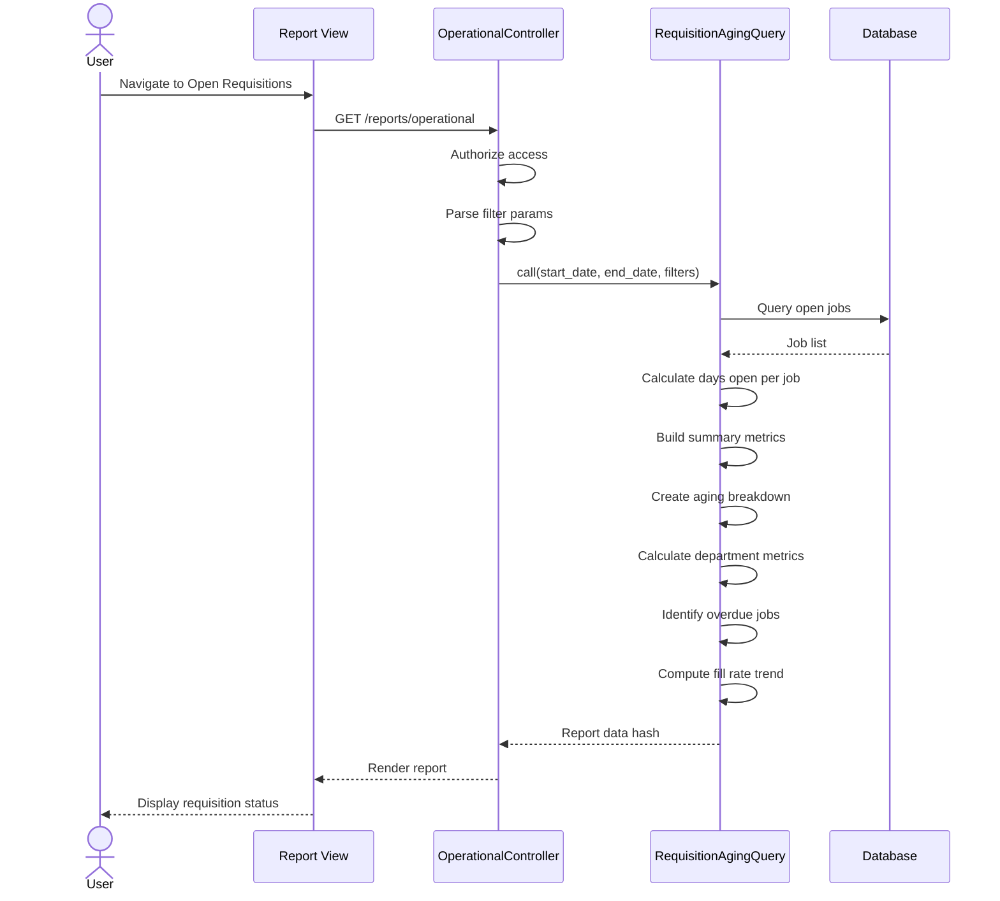

# UC-356: Open Requisitions Report

## Metadata

| Attribute | Value |
|-----------|-------|
| **ID** | UC-356 |
| **Name** | Open Requisitions Report |
| **Functional Area** | Reporting & Analytics |
| **Primary Actor** | Hiring Manager (ACT-03) |
| **Priority** | P1 |
| **Complexity** | Medium |
| **Status** | Draft |

## Description

Users generate and view a report on all open job requisitions showing their age, applicant counts, and fill status. The report identifies aging or overdue requisitions that may need attention, provides department-level breakdowns, and tracks the balance between jobs opened and filled over time. This helps managers understand hiring capacity and identify stuck requisitions.

## Actors

| Actor | Role in Use Case |
|-------|------------------|
| Hiring Manager (ACT-03) | Reviews status of their open positions |
| Recruiter (ACT-02) | Monitors requisition aging across portfolio |
| Executive (ACT-05) | Reviews organizational hiring capacity |

## Preconditions

- [ ] User is authenticated with reports access permission
- [ ] Organization has job requisitions created
- [ ] Jobs have opened_at timestamps set when opened

## Postconditions

### Success
- [ ] Summary metrics show total open jobs and average age
- [ ] Aging breakdown categorizes jobs by days open
- [ ] Department breakdown shows distribution
- [ ] Overdue requisitions highlighted
- [ ] Fill rate trend displayed

### Failure
- [ ] Empty state if no open jobs
- [ ] Graceful handling of jobs without opened_at
- [ ] Error message for data retrieval failures

## Triggers

- User navigates to /reports/operational (requisitions tab)
- User clicks "Open Requisitions" from reports menu
- Hiring manager checks status of their jobs

## Basic Flow



| Step | Actor | Action | System Response |
|------|-------|--------|-----------------|
| 1 | User | Navigates to Open Requisitions report | System loads report page |
| 2 | System | Authorizes user access | Permission verified |
| 3 | System | Parses date range and filters | Parameters extracted |
| 4 | System | Calls RequisitionAgingQuery | Query executes |
| 5 | System | Retrieves open jobs | Jobs with status 'open' |
| 6 | System | Calculates days open | Current date - opened_at |
| 7 | System | Builds summary metrics | Totals and averages |
| 8 | System | Creates aging breakdown | Bucketed by days open |
| 9 | System | Calculates department metrics | Per-department stats |
| 10 | System | Identifies overdue jobs | > 45 days flagged |
| 11 | System | Computes fill rate trend | Weekly opened vs filled |
| 12 | System | Renders report | Charts and tables displayed |

## Alternative Flows

### AF-1: Filter by Department

**Trigger:** User selects department

| Step | Actor | Action | System Response |
|------|-------|--------|-----------------|
| 3a | User | Selects department | Filter applied |
| 4a | System | Re-queries for department | Department-specific data |

**Resumption:** Returns to step 12

### AF-2: View Job Details

**Trigger:** User clicks on a job in the list

| Step | Actor | Action | System Response |
|------|-------|--------|-----------------|
| 12a | User | Clicks job row | Job detail modal opens |
| 12b | System | Shows job pipeline status | Applicant breakdown shown |
| 12c | System | Shows last activity date | Staleness visible |

**Resumption:** User closes modal or navigates to job

### AF-3: Export to CSV

**Trigger:** User clicks Export

| Step | Actor | Action | System Response |
|------|-------|--------|-----------------|
| 12a | User | Clicks "Export CSV" | Export initiated |
| 12b | System | Generates CSV with job data | File created |
| 12c | System | Triggers download | File downloads |

**Resumption:** Use case ends

## Exception Flows

### EF-1: No Open Jobs

**Trigger:** All jobs are closed or draft

| Step | Actor | Action | System Response |
|------|-------|--------|-----------------|
| E.1 | System | Zero open jobs | Empty state displayed |
| E.2 | System | Shows guidance | "No open positions" |

**Resolution:** User reviews closed jobs or creates new ones

### EF-2: Jobs Without opened_at

**Trigger:** Jobs opened before tracking implemented

| Step | Actor | Action | System Response |
|------|-------|--------|-----------------|
| E.1 | System | Job.opened_at is null | Days shown as 0 or N/A |
| E.2 | System | Warning displayed | Data quality note |

**Resolution:** Report includes jobs with unknown age

## Business Rules

| ID | Rule | Description |
|----|------|-------------|
| BR-356.1 | Open Jobs | Jobs with status = 'open' |
| BR-356.2 | Days Open | (current_date - opened_at) in days |
| BR-356.3 | Target Fill Days | Default target is 45 days |
| BR-356.4 | Overdue Definition | Days open > target fill days |
| BR-356.5 | Aging Buckets | 0-14, 15-30, 31-60, 61-90, 90+ days |
| BR-356.6 | Organization Scope | All data scoped to Current.organization |
| BR-356.7 | Fill Rate | Closed with filled_count > 0 vs opened |
| BR-356.8 | Closed in Period | closed_at within date range |

## Data Requirements

### Input Data

| Field | Type | Required | Validation |
|-------|------|----------|------------|
| start_date | date | Yes | Valid date |
| end_date | date | Yes | >= start_date |
| department_id | integer | No | Must belong to org |

### Output Data

| Field | Type | Description |
|-------|------|-------------|
| summary.total_open_jobs | integer | Count of open jobs |
| summary.avg_days_open | float | Average days open |
| summary.jobs_filled | integer | Filled in period |
| summary.on_target_count | integer | Jobs within target |
| summary.on_target_percentage | float | % meeting target |
| aging_breakdown | array | Jobs bucketed by age |
| aging_breakdown[].label | string | Bucket label (e.g., "0-14 days") |
| aging_breakdown[].count | integer | Jobs in bucket |
| aging_breakdown[].jobs | array | Sample jobs in bucket |
| by_department | array | Department-level metrics |
| overdue_jobs | array | Jobs exceeding target |
| overdue_jobs[].title | string | Job title |
| overdue_jobs[].days_open | integer | Days since opened |
| overdue_jobs[].days_overdue | integer | Days past target |
| fill_rate_trend | array | Weekly opened vs filled |

## Database Transactions

### Tables Affected

| Table | Operation | Conditions |
|-------|-----------|------------|
| jobs | READ | Status and aging |
| departments | READ | Department breakdown |
| applications | READ | Applicant counts |

### Transaction Detail

```sql
-- Requisition aging query (read-only)
-- Open jobs with age
SELECT
    j.id,
    j.title,
    j.status,
    j.opened_at,
    d.name as department_name,
    j.recruiter_id,
    j.hiring_manager_id,
    CAST(JULIANDAY('now') - JULIANDAY(j.opened_at) AS INTEGER) as days_open,
    (SELECT COUNT(*) FROM applications a
     WHERE a.job_id = j.id AND a.discarded_at IS NULL) as applicant_count
FROM jobs j
LEFT JOIN departments d ON j.department_id = d.id
WHERE j.discarded_at IS NULL
  AND j.status = 'open'
  AND j.organization_id = @organization_id
ORDER BY days_open DESC;

-- Fill rate by week
SELECT
    DATE(opened_at, 'weekday 0', '-6 days') as week_start,
    COUNT(CASE WHEN status = 'open' OR opened_at BETWEEN @start AND @end THEN 1 END) as opened,
    COUNT(CASE WHEN status = 'closed' AND filled_count > 0
          AND closed_at BETWEEN @start AND @end THEN 1 END) as filled
FROM jobs
WHERE organization_id = @organization_id
GROUP BY week_start
ORDER BY week_start;
```

### Rollback Scenarios

| Scenario | Rollback Action |
|----------|-----------------|
| Query timeout | Return cached/partial data |
| Read-only | No rollback needed |

## UI/UX Requirements

### Screen/Component

- **Location:** /reports/operational (requisitions section)
- **Entry Point:** Reports menu, Dashboard link
- **Key Elements:**
  - Date range picker
  - Department filter
  - Summary KPI cards
  - Aging distribution chart
  - Overdue jobs alert list
  - Department breakdown table
  - Fill rate trend chart

### Report Layout

```
+--------------------------------------------------+
| Open Requisitions Report                         |
| [Start Date] to [End Date]  [Dept v]             |
+--------------------------------------------------+
| +----------+ +----------+ +----------+ +--------+|
| | Open     | | Avg Days | | Filled   | | On     ||
| | Jobs     | | Open     | | (Period) | | Target ||
| |   14     | |   32     | |    8     | |  71%   ||
| +----------+ +----------+ +----------+ +--------+|
+--------------------------------------------------+
| Aging Distribution                               |
| +-----------------------------------------------+|
| | [Horizontal Bar Chart]                        ||
| | 0-14 days    ████  4                          ||
| | 15-30 days   ██████  6                        ||
| | 31-60 days   ██  2                            ||
| | 61-90 days   █  1                             ||
| | 90+ days     █  1                             ||
| +-----------------------------------------------+|
+--------------------------------------------------+
| Overdue Requisitions (> 45 days)    ⚠ 4 jobs    |
| +-----------------------------------------------+|
| | Job Title     | Dept    | Days | Overdue | ▼  ||
| | Sr. Engineer  | Eng     |  67  |   22    | → ||
| | Product Mgr   | Product |  58  |   13    | → ||
| | Data Analyst  | Data    |  52  |    7    | → ||
| +-----------------------------------------------+|
+--------------------------------------------------+
| By Department                                    |
| +-----------------------------------------------+|
| | Dept       | Open | Avg Days | Filled | Apps ||
| | Engineering|   6  |    28    |    4   | 156  ||
| | Product    |   4  |    35    |    2   |  89  ||
| | Sales      |   4  |    42    |    2   |  67  ||
| +-----------------------------------------------+|
+--------------------------------------------------+
| Fill Rate Trend                      [Export CSV]|
| +-----------------------------------------------+|
| | [Line Chart - opened vs filled weekly]        ||
| +-----------------------------------------------+|
+--------------------------------------------------+
```

## Non-Functional Requirements

| Requirement | Target |
|-------------|--------|
| Response Time | < 2 seconds |
| Export Time | < 5 seconds |
| Chart Rendering | < 1 second |
| Real-time Data | Current state, not cached |

## Security Considerations

- [x] Authentication required
- [x] Authorization check: Reports permission required
- [x] Organization scoping: All queries filtered
- [x] Audit logging: Report access logged
- [ ] Hiring manager sees only their jobs (optional)

## Related Use Cases

| Use Case | Relationship |
|----------|--------------|
| UC-350 View Dashboard | Parent - open jobs count |
| UC-351 Time-to-Hire Report | Related - aging impacts TTH |
| UC-355 Recruiter Activity Report | Related - workload view |
| UC-006 Open Job | Source - creates open requisitions |
| UC-008 Close Job | Source - removes from report |
| UC-359 Export Report Data | Extends - export capability |

---

## Data Model References

> Cross-references to [DATA_MODEL.md](../DATA_MODEL.md) and [CRUD_MATRIX.md](../CRUD_MATRIX.md)

### Subject Areas

| Subject Area | ID | Relationship |
|--------------|-----|--------------|
| Job Requisition | SA-03 | Primary |
| Organization | SA-02 | Secondary |
| Application Pipeline | SA-05 | Reference |

### Entities CRUD

| Entity | C | R | U | D | Notes |
|--------|---|---|---|---|-------|
| Job | | ✓ | | | Primary data source |
| Department | | ✓ | | | Grouping |
| Application | | ✓ | | | Applicant counts |
| User | | ✓ | | | Recruiter/HM names |

**Legend:** C = Create, R = Read, U = Update, D = Delete

---

## Process Model References

> Cross-references to [PROCESS_MODEL.md](../PROCESS_MODEL.md) and [PROCESS_CRUD_MATRIX.md](../PROCESS_CRUD_MATRIX.md)

| Attribute | Value | Link |
|-----------|-------|------|
| **Elementary Business Process** | EP-1206: Generate Open Requisitions Report | [PROCESS_MODEL.md#ep-1206](../PROCESS_MODEL.md#ep-1206-generate-open-requisitions-report) |
| **Business Process** | BP-701: Operational Reporting | [PROCESS_MODEL.md#bp-701](../PROCESS_MODEL.md#bp-701-operational-reporting) |
| **Business Function** | BF-07: Analytics & Reporting | [PROCESS_MODEL.md#bf-07](../PROCESS_MODEL.md#bf-07-analytics--reporting) |

### EBP Details

| Attribute | Value |
|-----------|-------|
| **Trigger** | User requests open requisitions report |
| **Input** | Date range, optional department filter |
| **Output** | Requisition aging with breakdown and alerts |
| **Business Rules** | BR-356.1 through BR-356.8 |

---

## Traceability Matrix

> Complete artifact mapping for requirements traceability

| Artifact Type | ID | Name | Link |
|---------------|-----|------|------|
| **Use Case** | UC-356 | Open Requisitions Report | *(this document)* |
| **Elementary Process** | EP-1206 | Generate Open Requisitions Report | [PROCESS_MODEL.md](../PROCESS_MODEL.md#ep-1206-generate-open-requisitions-report) |
| **Business Process** | BP-701 | Operational Reporting | [PROCESS_MODEL.md](../PROCESS_MODEL.md#bp-701-operational-reporting) |
| **Business Function** | BF-07 | Analytics & Reporting | [PROCESS_MODEL.md](../PROCESS_MODEL.md#bf-07-analytics--reporting) |
| **Primary Actor** | ACT-03 | Hiring Manager | [ACTORS.md](../ACTORS.md#act-03-hiring-manager) |
| **Subject Area (Primary)** | SA-03 | Job Requisition | [DATA_MODEL.md](../DATA_MODEL.md#sa-03-job-requisition) |
| **Subject Area (Secondary)** | SA-02 | Organization | [DATA_MODEL.md](../DATA_MODEL.md#sa-02-organization) |
| **CRUD Matrix Row** | UC-356 | - | [CRUD_MATRIX.md](../CRUD_MATRIX.md#uc-356) |
| **Process CRUD Row** | EP-1206 | - | [PROCESS_CRUD_MATRIX.md](../PROCESS_CRUD_MATRIX.md#ep-1206) |

### Implementation Artifacts

| Artifact Type | Path/Reference | Status |
|---------------|----------------|--------|
| Controller | `app/controllers/reports/operational_controller.rb` | Implemented |
| Query | `app/queries/requisition_aging_query.rb` | Implemented |
| View | `app/views/reports/operational/index.html.erb` | Implemented |
| Test | `test/queries/requisition_aging_query_test.rb` | Planned |

---

## Open Questions

1. Should target fill days be configurable per department or job level?
2. How should we handle "on hold" jobs in aging calculation?
3. Should we add alerts for jobs with zero applicants?

## Change History

| Version | Date | Author | Changes |
|---------|------|--------|---------|
| 0.1 | 2026-01-25 | System | Initial draft |
