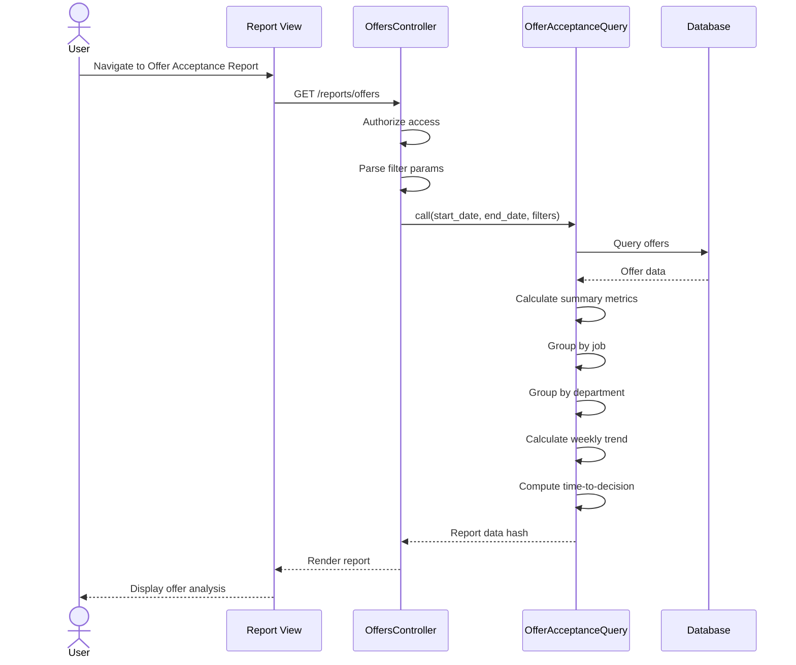

# UC-357: Offer Acceptance Report

## Metadata

| Attribute | Value |
|-----------|-------|
| **ID** | UC-357 |
| **Name** | Offer Acceptance Report |
| **Functional Area** | Reporting & Analytics |
| **Primary Actor** | Executive (ACT-05) |
| **Priority** | P1 |
| **Complexity** | Medium |
| **Status** | Draft |

## Description

Users generate and view an offer acceptance analysis report that tracks offer outcomes across the organization. The report measures acceptance rates, decline rates, time-to-decision, and provides breakdowns by job, department, and over time. This helps identify competitiveness of offers and informs compensation strategy decisions.

## Actors

| Actor | Role in Use Case |
|-------|------------------|
| Executive (ACT-05) | Reviews offer trends for strategy |
| Recruiter (ACT-02) | Analyzes offer performance |
| Hiring Manager (ACT-03) | Reviews their team's offer outcomes |

## Preconditions

- [ ] User is authenticated with reports access permission
- [ ] Organization has made offers to candidates
- [ ] Offers have status outcomes (accepted, declined, etc.)

## Postconditions

### Success
- [ ] Summary metrics show offer counts and rates
- [ ] Per-job breakdown displayed
- [ ] Per-department breakdown displayed
- [ ] Weekly trend visualized
- [ ] Time-to-decision metrics shown

### Failure
- [ ] Empty state if no offers in date range
- [ ] Graceful handling of pending offers
- [ ] Error message for data retrieval failures

## Triggers

- User navigates to /reports/offers
- User clicks "Offer Acceptance" from reports menu
- Executive reviews offer competitiveness

## Basic Flow



| Step | Actor | Action | System Response |
|------|-------|--------|-----------------|
| 1 | User | Navigates to Offer Acceptance report | System loads report page |
| 2 | System | Authorizes user access | Permission verified |
| 3 | System | Parses date range and filters | Parameters extracted |
| 4 | System | Calls OfferAcceptanceQuery | Query executes |
| 5 | System | Retrieves offers in date range | Offers by created_at |
| 6 | System | Calculates summary metrics | Total, accepted, declined, pending |
| 7 | System | Groups by job | Per-job acceptance rates |
| 8 | System | Groups by department | Per-department rates |
| 9 | System | Calculates weekly trend | Trend over time |
| 10 | System | Computes time-to-decision | Days from sent to response |
| 11 | System | Renders report | Charts and tables displayed |

## Alternative Flows

### AF-1: Filter by Job

**Trigger:** User selects specific job

| Step | Actor | Action | System Response |
|------|-------|--------|-----------------|
| 3a | User | Selects job | Filter applied |
| 4a | System | Re-queries for job | Job-specific offer data |

**Resumption:** Returns to step 11

### AF-2: Filter by Department

**Trigger:** User selects department

| Step | Actor | Action | System Response |
|------|-------|--------|-----------------|
| 3b | User | Selects department | Filter applied |
| 4b | System | Re-queries for department | Department aggregate |

**Resumption:** Returns to step 11

### AF-3: Export to CSV

**Trigger:** User clicks Export

| Step | Actor | Action | System Response |
|------|-------|--------|-----------------|
| 11a | User | Clicks "Export CSV" | Export initiated |
| 11b | System | Generates CSV | File created |
| 11c | System | Triggers download | File downloads |

**Resumption:** Use case ends

## Exception Flows

### EF-1: No Offers in Range

**Trigger:** Zero offers created in date range

| Step | Actor | Action | System Response |
|------|-------|--------|-----------------|
| E.1 | System | Empty offer set | Empty state displayed |
| E.2 | System | Shows guidance | "No offers in this period" |

**Resolution:** User adjusts date range

### EF-2: All Offers Pending

**Trigger:** No decided offers

| Step | Actor | Action | System Response |
|------|-------|--------|-----------------|
| E.1 | System | All offers pending | Acceptance rate N/A |
| E.2 | System | Shows pending count | "X offers awaiting response" |

**Resolution:** User waits for decisions or adjusts range

## Business Rules

| ID | Rule | Description |
|----|------|-------------|
| BR-357.1 | Offer Scope | Offers created within date range |
| BR-357.2 | Acceptance Rate | accepted / (accepted + declined) * 100 |
| BR-357.3 | Decline Rate | declined / (accepted + declined) * 100 |
| BR-357.4 | Pending Status | sent, approved, pending_approval |
| BR-357.5 | Time-to-Decision | decision_date - sent_at in days |
| BR-357.6 | Organization Scope | All data scoped to Current.organization |
| BR-357.7 | Decision Date | accepted_at or declined_at or updated_at |
| BR-357.8 | Median Calculation | Middle value(s) of sorted array |

## Data Requirements

### Input Data

| Field | Type | Required | Validation |
|-------|------|----------|------------|
| start_date | date | Yes | Valid date |
| end_date | date | Yes | >= start_date |
| job_id | integer | No | Must belong to org |
| department_id | integer | No | Must belong to org |

### Output Data

| Field | Type | Description |
|-------|------|-------------|
| summary.total_offers | integer | Total offers created |
| summary.accepted | integer | Accepted count |
| summary.declined | integer | Declined count |
| summary.pending | integer | Awaiting decision |
| summary.expired | integer | Expired offers |
| summary.withdrawn | integer | Withdrawn offers |
| summary.acceptance_rate | float | % accepted of decided |
| summary.decline_rate | float | % declined of decided |
| by_job | array | Per-job breakdown |
| by_job[].job_title | string | Job name |
| by_job[].offers | integer | Offers count |
| by_job[].acceptance_rate | float | Job-specific rate |
| by_department | array | Per-department breakdown |
| trend | array | Weekly offer outcomes |
| time_to_decision | hash | Decision timing metrics |
| time_to_decision.average_days | float | Mean days |
| time_to_decision.median_days | float | Median days |
| time_to_decision.fastest | integer | Quickest decision |
| time_to_decision.slowest | integer | Longest decision |

## Database Transactions

### Tables Affected

| Table | Operation | Conditions |
|-------|-----------|------------|
| offers | READ | created_at in range |
| applications | READ | Join for job |
| jobs | READ | Job title, department |
| departments | READ | Department name |

### Transaction Detail

```sql
-- Offer acceptance query (read-only)
-- Summary metrics
SELECT
    COUNT(*) as total,
    SUM(CASE WHEN status = 'accepted' THEN 1 ELSE 0 END) as accepted,
    SUM(CASE WHEN status = 'declined' THEN 1 ELSE 0 END) as declined,
    SUM(CASE WHEN status IN ('sent', 'approved', 'pending_approval') THEN 1 ELSE 0 END) as pending,
    SUM(CASE WHEN status = 'expired' THEN 1 ELSE 0 END) as expired,
    SUM(CASE WHEN status = 'withdrawn' THEN 1 ELSE 0 END) as withdrawn
FROM offers o
JOIN applications a ON o.application_id = a.id
JOIN jobs j ON a.job_id = j.id
WHERE o.created_at BETWEEN @start_date AND @end_date
  AND j.organization_id = @organization_id;

-- By job
SELECT
    j.id as job_id,
    j.title as job_title,
    COUNT(*) as total,
    SUM(CASE WHEN o.status = 'accepted' THEN 1 ELSE 0 END) as accepted,
    SUM(CASE WHEN o.status = 'declined' THEN 1 ELSE 0 END) as declined
FROM offers o
JOIN applications a ON o.application_id = a.id
JOIN jobs j ON a.job_id = j.id
WHERE o.created_at BETWEEN @start_date AND @end_date
  AND j.organization_id = @organization_id
GROUP BY j.id, j.title
ORDER BY total DESC;

-- Time to decision
SELECT
    o.sent_at,
    o.accepted_at,
    o.declined_at,
    CASE
        WHEN o.accepted_at IS NOT NULL THEN JULIANDAY(o.accepted_at) - JULIANDAY(o.sent_at)
        WHEN o.declined_at IS NOT NULL THEN JULIANDAY(o.declined_at) - JULIANDAY(o.sent_at)
        ELSE NULL
    END as days_to_decision
FROM offers o
JOIN applications a ON o.application_id = a.id
JOIN jobs j ON a.job_id = j.id
WHERE o.status IN ('accepted', 'declined')
  AND o.sent_at IS NOT NULL
  AND o.created_at BETWEEN @start_date AND @end_date
  AND j.organization_id = @organization_id;
```

### Rollback Scenarios

| Scenario | Rollback Action |
|----------|-----------------|
| Query timeout | Return cached/partial data |
| Read-only | No rollback needed |

## UI/UX Requirements

### Screen/Component

- **Location:** /reports/offers
- **Entry Point:** Reports menu, Executive dashboard
- **Key Elements:**
  - Date range picker
  - Job/Department filter
  - Summary KPI cards
  - Acceptance rate gauge
  - Job comparison bar chart
  - Weekly trend chart
  - Time-to-decision histogram

### Report Layout

```
+--------------------------------------------------+
| Offer Acceptance Report                          |
| [Start Date] to [End Date]  [Job v] [Dept v]     |
+--------------------------------------------------+
| +----------+ +----------+ +----------+ +--------+|
| | Total    | | Accepted | | Declined | | Pend-  ||
| | Offers   | |          | |          | | ing    ||
| |   42     | |   28     | |    8     | |   6    ||
| +----------+ +----------+ +----------+ +--------+|
+--------------------------------------------------+
| +----------------------+ +----------------------+|
| | Acceptance Rate      | | Time to Decision     ||
| | [Gauge: 78%]         | | Avg: 3.2 days        ||
| |                      | | Med: 2 days          ||
| +----------------------+ +----------------------+|
+--------------------------------------------------+
| By Job                                           |
| +-----------------------------------------------+|
| | Job Title        | Offers | Accept | Rate    ||
| | Sr. Engineer     |   12   |   10   |  83%    ||
| | Product Manager  |    8   |    5   |  63%    ||
| | Data Analyst     |    6   |    5   |  83%    ||
| +-----------------------------------------------+|
+--------------------------------------------------+
| By Department                                    |
| +-----------------------------------------------+|
| | [Bar Chart - acceptance rate by dept]         ||
| +-----------------------------------------------+|
+--------------------------------------------------+
| Weekly Trend                         [Export CSV]|
| +-----------------------------------------------+|
| | [Stacked Bar - accepted, declined, pending]   ||
| +-----------------------------------------------+|
+--------------------------------------------------+
```

## Non-Functional Requirements

| Requirement | Target |
|-------------|--------|
| Response Time | < 2 seconds |
| Export Time | < 5 seconds |
| Chart Rendering | < 1 second |
| Data Freshness | Real-time |

## Security Considerations

- [x] Authentication required
- [x] Authorization check: Reports permission required
- [x] Organization scoping: All queries filtered
- [x] Audit logging: Report access logged
- [ ] Salary data not exposed in report

## Related Use Cases

| Use Case | Relationship |
|----------|--------------|
| UC-350 View Dashboard | Parent - offer summary |
| UC-254 Send Offer to Candidate | Source - creates offers |
| UC-255 Candidate Accept Offer | Source - updates status |
| UC-256 Candidate Decline Offer | Source - updates status |
| UC-359 Export Report Data | Extends - export capability |

---

## Data Model References

> Cross-references to [DATA_MODEL.md](../DATA_MODEL.md) and [CRUD_MATRIX.md](../CRUD_MATRIX.md)

### Subject Areas

| Subject Area | ID | Relationship |
|--------------|-----|--------------|
| Offer Management | SA-08 | Primary |
| Application Pipeline | SA-05 | Secondary |
| Job Requisition | SA-03 | Reference |

### Entities CRUD

| Entity | C | R | U | D | Notes |
|--------|---|---|---|---|-------|
| Offer | | ✓ | | | Primary data source |
| Application | | ✓ | | | Join for job |
| Job | | ✓ | | | Job details |
| Department | | ✓ | | | Grouping |

**Legend:** C = Create, R = Read, U = Update, D = Delete

---

## Process Model References

> Cross-references to [PROCESS_MODEL.md](../PROCESS_MODEL.md) and [PROCESS_CRUD_MATRIX.md](../PROCESS_CRUD_MATRIX.md)

| Attribute | Value | Link |
|-----------|-------|------|
| **Elementary Business Process** | EP-1207: Generate Offer Acceptance Report | [PROCESS_MODEL.md#ep-1207](../PROCESS_MODEL.md#ep-1207-generate-offer-acceptance-report) |
| **Business Process** | BP-701: Operational Reporting | [PROCESS_MODEL.md#bp-701](../PROCESS_MODEL.md#bp-701-operational-reporting) |
| **Business Function** | BF-07: Analytics & Reporting | [PROCESS_MODEL.md#bf-07](../PROCESS_MODEL.md#bf-07-analytics--reporting) |

### EBP Details

| Attribute | Value |
|-----------|-------|
| **Trigger** | User requests offer acceptance report |
| **Input** | Date range, optional job/department filters |
| **Output** | Offer metrics with breakdowns and trends |
| **Business Rules** | BR-357.1 through BR-357.8 |

---

## Traceability Matrix

> Complete artifact mapping for requirements traceability

| Artifact Type | ID | Name | Link |
|---------------|-----|------|------|
| **Use Case** | UC-357 | Offer Acceptance Report | *(this document)* |
| **Elementary Process** | EP-1207 | Generate Offer Acceptance Report | [PROCESS_MODEL.md](../PROCESS_MODEL.md#ep-1207-generate-offer-acceptance-report) |
| **Business Process** | BP-701 | Operational Reporting | [PROCESS_MODEL.md](../PROCESS_MODEL.md#bp-701-operational-reporting) |
| **Business Function** | BF-07 | Analytics & Reporting | [PROCESS_MODEL.md](../PROCESS_MODEL.md#bf-07-analytics--reporting) |
| **Primary Actor** | ACT-05 | Executive | [ACTORS.md](../ACTORS.md#act-05-executive) |
| **Subject Area (Primary)** | SA-08 | Offer Management | [DATA_MODEL.md](../DATA_MODEL.md#sa-08-offer-management) |
| **Subject Area (Secondary)** | SA-05 | Application Pipeline | [DATA_MODEL.md](../DATA_MODEL.md#sa-05-application-pipeline) |
| **CRUD Matrix Row** | UC-357 | - | [CRUD_MATRIX.md](../CRUD_MATRIX.md#uc-357) |
| **Process CRUD Row** | EP-1207 | - | [PROCESS_CRUD_MATRIX.md](../PROCESS_CRUD_MATRIX.md#ep-1207) |

### Implementation Artifacts

| Artifact Type | Path/Reference | Status |
|---------------|----------------|--------|
| Controller | `app/controllers/reports/offers_controller.rb` | Planned |
| Query | `app/queries/offer_acceptance_query.rb` | Implemented |
| View | `app/views/reports/offers/index.html.erb` | Planned |
| Test | `test/queries/offer_acceptance_query_test.rb` | Planned |

---

## Open Questions

1. Should we track decline reasons and categorize them?
2. How should we handle counter-offers and negotiations?
3. Should we include salary comparison to market rates?

## Change History

| Version | Date | Author | Changes |
|---------|------|--------|---------|
| 0.1 | 2026-01-25 | System | Initial draft |
