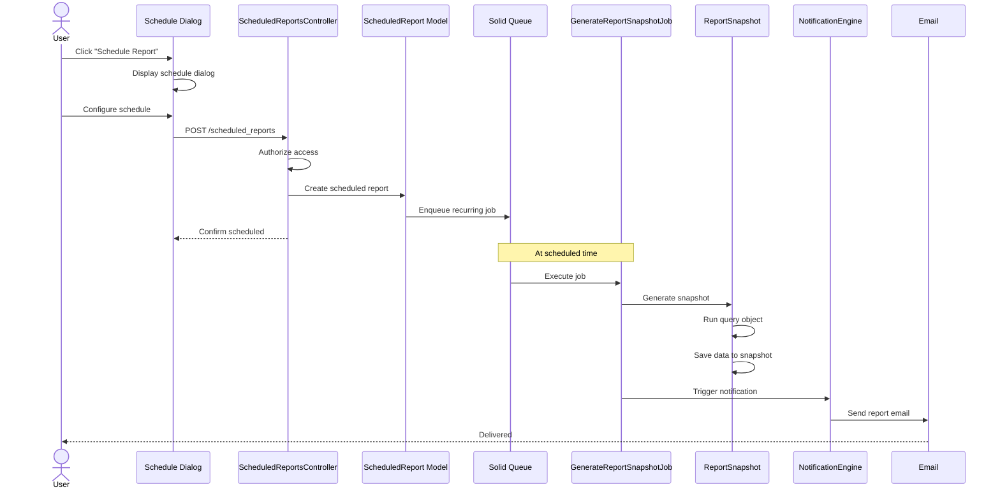

# UC-358: Schedule Report

## Metadata

| Attribute | Value |
|-----------|-------|
| **ID** | UC-358 |
| **Name** | Schedule Report |
| **Functional Area** | Reporting & Analytics |
| **Primary Actor** | Recruiter (ACT-02) |
| **Priority** | P2 |
| **Complexity** | Medium |
| **Status** | Draft |

## Description

Users configure scheduled reports to be automatically generated and delivered at regular intervals. Scheduled reports run in the background, create ReportSnapshot records for caching, and deliver results via email or make them available for download. This enables stakeholders to receive consistent updates without manual report generation.

## Actors

| Actor | Role in Use Case |
|-------|------------------|
| Recruiter (ACT-02) | Creates and manages scheduled reports |
| Executive (ACT-05) | Receives scheduled executive summaries |
| Scheduler (ACT-11) | System actor that triggers report generation |
| Notification Engine (ACT-13) | Delivers scheduled reports |

## Preconditions

- [ ] User is authenticated with reports access permission
- [ ] Background job infrastructure (Solid Queue) is operational
- [ ] Email delivery is configured for the organization
- [ ] At least one report type is available to schedule

## Postconditions

### Success
- [ ] Scheduled report configuration saved
- [ ] Background job scheduled for specified cadence
- [ ] ReportSnapshot created when report runs
- [ ] Email sent to specified recipients
- [ ] Audit log entry created

### Failure
- [ ] Error message if schedule configuration invalid
- [ ] Retry logic for failed report generation
- [ ] Notification of failure to creator
- [ ] No snapshot created on failure

## Triggers

- User clicks "Schedule" on any report page
- User manages schedules from reports settings
- Background job triggers at scheduled time

## Basic Flow



| Step | Actor | Action | System Response |
|------|-------|--------|-----------------|
| 1 | User | Clicks "Schedule Report" | Schedule dialog opens |
| 2 | User | Selects report type | Report type recorded |
| 3 | User | Chooses frequency | daily, weekly, monthly |
| 4 | User | Sets day/time | Schedule timing configured |
| 5 | User | Enters recipients | Email addresses captured |
| 6 | User | Configures filters | Date range, department, etc. |
| 7 | User | Clicks "Save Schedule" | Schedule saved |
| 8 | System | Creates ScheduledReport record | Configuration persisted |
| 9 | System | Enqueues recurring job | Background job scheduled |
| 10 | System | (At scheduled time) Runs job | Report generated |
| 11 | System | Creates ReportSnapshot | Data cached |
| 12 | System | Sends email with link/attachment | Recipients notified |

## Alternative Flows

### AF-1: Edit Existing Schedule

**Trigger:** User clicks edit on existing schedule

| Step | Actor | Action | System Response |
|------|-------|--------|-----------------|
| 1a | User | Selects existing schedule | Schedule details loaded |
| 2a | User | Modifies configuration | Changes captured |
| 3a | System | Updates schedule | New timing applied |

**Resumption:** Next run uses new configuration

### AF-2: Pause Schedule

**Trigger:** User wants to temporarily stop

| Step | Actor | Action | System Response |
|------|-------|--------|-----------------|
| 1b | User | Clicks "Pause" | Pause confirmation shown |
| 2b | System | Sets paused flag | No more runs until resumed |
| 3b | User | Later clicks "Resume" | Schedule reactivated |

**Resumption:** Normal schedule resumes

### AF-3: Delete Schedule

**Trigger:** User wants to remove schedule

| Step | Actor | Action | System Response |
|------|-------|--------|-----------------|
| 1c | User | Clicks "Delete" | Confirmation dialog |
| 2c | User | Confirms deletion | Schedule removed |
| 3c | System | Cancels pending jobs | No more runs |

**Resumption:** Use case ends

### AF-4: Run Now

**Trigger:** User wants immediate execution

| Step | Actor | Action | System Response |
|------|-------|--------|-----------------|
| 1d | User | Clicks "Run Now" | Immediate job queued |
| 2d | System | Generates snapshot | Report created |
| 3d | System | Sends email | Delivery triggered |

**Resumption:** Regular schedule unaffected

## Exception Flows

### EF-1: Report Generation Fails

**Trigger:** Query error during scheduled run

| Step | Actor | Action | System Response |
|------|-------|--------|-----------------|
| E.1 | System | Query throws error | Error caught |
| E.2 | System | Logs failure | Error recorded |
| E.3 | System | Schedules retry | Up to 3 attempts |
| E.4 | System | Notifies creator if all fail | Failure email sent |

**Resolution:** Creator investigates issue

### EF-2: Invalid Recipients

**Trigger:** Email delivery fails

| Step | Actor | Action | System Response |
|------|-------|--------|-----------------|
| E.1 | System | Email bounces | Bounce recorded |
| E.2 | System | Snapshot still created | Report available in UI |
| E.3 | System | Notifies creator | "Delivery failed" alert |

**Resolution:** Creator updates recipients

### EF-3: No Data in Period

**Trigger:** Report would be empty

| Step | Actor | Action | System Response |
|------|-------|--------|-----------------|
| E.1 | System | Empty result set | Empty snapshot created |
| E.2 | System | Sends with "No data" note | Recipients informed |

**Resolution:** Normal operation (some periods may be empty)

## Business Rules

| ID | Rule | Description |
|----|------|-------------|
| BR-358.1 | Frequency Options | daily, weekly, monthly, quarterly |
| BR-358.2 | Weekly Day | Specify day of week (Monday-Friday) |
| BR-358.3 | Monthly Day | Specify day of month (1-28) |
| BR-358.4 | Run Time | Specify hour (organization timezone) |
| BR-358.5 | Recipients | At least one valid email required |
| BR-358.6 | Max Recipients | Maximum 10 recipients per schedule |
| BR-358.7 | Date Range | Relative (last 7/30/90 days) or specific |
| BR-358.8 | Retry Policy | Up to 3 retries with exponential backoff |
| BR-358.9 | Organization Scope | Schedules scoped to organization |
| BR-358.10 | Report Types | time_to_hire, source, pipeline, diversity, operational |

## Data Requirements

### Input Data

| Field | Type | Required | Validation |
|-------|------|----------|------------|
| report_type | string | Yes | Valid report type |
| frequency | string | Yes | daily, weekly, monthly |
| day_of_week | integer | Conditional | 0-6, required if weekly |
| day_of_month | integer | Conditional | 1-28, required if monthly |
| run_time | time | Yes | Valid time |
| recipients | array | Yes | 1-10 valid emails |
| filters | hash | No | Report-specific filters |
| is_active | boolean | Yes | Default true |

### Output Data

| Field | Type | Description |
|-------|------|-------------|
| id | integer | Schedule identifier |
| next_run_at | datetime | Next scheduled execution |
| last_run_at | datetime | Last successful run |
| last_status | string | success, failed, pending |
| run_count | integer | Total executions |
| created_by | integer | User who created |

## Database Transactions

### Tables Affected

| Table | Operation | Conditions |
|-------|-----------|------------|
| scheduled_reports | CREATE/UPDATE | Schedule configuration |
| report_snapshots | CREATE | When report runs |
| solid_queue_jobs | CREATE | Background job scheduling |
| audit_logs | CREATE | Schedule creation/modification |

### Transaction Detail

```sql
-- Create scheduled report
BEGIN TRANSACTION;

-- Insert schedule configuration
INSERT INTO scheduled_reports (
    organization_id,
    report_type,
    frequency,
    day_of_week,
    day_of_month,
    run_time,
    recipients,
    filters,
    is_active,
    created_by_id,
    next_run_at,
    created_at,
    updated_at
) VALUES (
    @organization_id,
    @report_type,
    @frequency,
    @day_of_week,
    @day_of_month,
    @run_time,
    @recipients_json,
    @filters_json,
    true,
    @current_user_id,
    @calculated_next_run,
    NOW(),
    NOW()
);

SET @schedule_id = LAST_INSERT_ID();

-- Audit log
INSERT INTO audit_logs (
    organization_id,
    user_id,
    action,
    auditable_type,
    auditable_id,
    metadata,
    created_at
) VALUES (
    @organization_id,
    @current_user_id,
    'scheduled_report.created',
    'ScheduledReport',
    @schedule_id,
    JSON_OBJECT('report_type', @report_type, 'frequency', @frequency),
    NOW()
);

COMMIT;

-- When job runs (separate transaction)
BEGIN TRANSACTION;

INSERT INTO report_snapshots (
    organization_id,
    report_type,
    period_type,
    period_start,
    period_end,
    data,
    generated_at,
    generated_by_id,
    metadata,
    created_at
) VALUES (
    @organization_id,
    @report_type,
    @frequency,
    @period_start,
    @period_end,
    @report_data_json,
    NOW(),
    NULL, -- System generated
    JSON_OBJECT('scheduled_report_id', @schedule_id),
    NOW()
);

UPDATE scheduled_reports
SET last_run_at = NOW(),
    last_status = 'success',
    run_count = run_count + 1,
    next_run_at = @next_run_at
WHERE id = @schedule_id;

COMMIT;
```

### Rollback Scenarios

| Scenario | Rollback Action |
|----------|-----------------|
| Validation failure | No record created |
| Job scheduling fails | Delete schedule record |
| Report generation fails | Log error, schedule retry |

## UI/UX Requirements

### Screen/Component

- **Location:** Modal dialog from any report page
- **Entry Point:** "Schedule" button on reports
- **Key Elements:**
  - Report type selector (if from general page)
  - Frequency radio buttons
  - Day/time pickers
  - Recipients input with validation
  - Filter options (same as report)
  - Active/pause toggle
  - Save/Cancel buttons

### Schedule Dialog Layout

```
+--------------------------------------------------+
| Schedule Report                              [X] |
+--------------------------------------------------+
| Report: Time-to-Hire                             |
+--------------------------------------------------+
| Frequency                                        |
| ( ) Daily   (o) Weekly   ( ) Monthly            |
+--------------------------------------------------+
| Run On                                           |
| Day: [Monday    v]  Time: [09:00 AM v]          |
+--------------------------------------------------+
| Recipients                                       |
| +-----------------------------------------------+|
| | jane@company.com                          [x]||
| | john@company.com                          [x]||
| | [+ Add recipient]                             ||
| +-----------------------------------------------+|
+--------------------------------------------------+
| Report Period                                    |
| (o) Last 7 days  ( ) Last 30 days  ( ) Custom  |
+--------------------------------------------------+
| Filters (Optional)                               |
| Department: [All Departments        v]          |
+--------------------------------------------------+
|                    [Cancel]  [Save Schedule]     |
+--------------------------------------------------+
```

### My Schedules Page

```
+--------------------------------------------------+
| My Scheduled Reports                             |
+--------------------------------------------------+
| +-----------------------------------------------+|
| | Report     | Freq    | Next Run    | Status  ||
| | Time-Hire  | Weekly  | Mon 9:00 AM | Active ▶||
| | Source     | Monthly | Feb 1 8:00  | Active ▶||
| | Pipeline   | Daily   | Tomorrow    | Paused ⏸||
| +-----------------------------------------------+|
|                              [+ New Schedule]    |
+--------------------------------------------------+
```

## Non-Functional Requirements

| Requirement | Target |
|-------------|--------|
| Job Execution Window | Within 15 min of scheduled time |
| Email Delivery | Within 5 minutes of generation |
| Retry Interval | 5 min, 15 min, 60 min |
| Schedule Limit | 20 active schedules per org |

## Security Considerations

- [x] Authentication required to manage schedules
- [x] Authorization check: Reports permission required
- [x] Organization scoping: Schedules isolated per org
- [x] Audit logging: All schedule changes logged
- [x] Recipient validation: Must be valid emails
- [ ] Recipient restriction: Optional org domain only

## Related Use Cases

| Use Case | Relationship |
|----------|--------------|
| UC-350 through UC-357 | Source reports to schedule |
| UC-359 Export Report Data | Related - export vs schedule |
| UC-555 In-App Notification | Alternative delivery method |

---

## Data Model References

> Cross-references to [DATA_MODEL.md](../DATA_MODEL.md) and [CRUD_MATRIX.md](../CRUD_MATRIX.md)

### Subject Areas

| Subject Area | ID | Relationship |
|--------------|-----|--------------|
| (Cross-cutting) | - | Primary |

### Entities CRUD

| Entity | C | R | U | D | Notes |
|--------|---|---|---|---|-------|
| ScheduledReport | ✓ | ✓ | ✓ | ✓ | Schedule configuration |
| ReportSnapshot | ✓ | ✓ | | | Generated on schedule |
| AuditLog | ✓ | | | | Change tracking |

**Legend:** C = Create, R = Read, U = Update, D = Delete

---

## Process Model References

> Cross-references to [PROCESS_MODEL.md](../PROCESS_MODEL.md) and [PROCESS_CRUD_MATRIX.md](../PROCESS_CRUD_MATRIX.md)

| Attribute | Value | Link |
|-----------|-------|------|
| **Elementary Business Process** | EP-1208: Schedule Report | [PROCESS_MODEL.md#ep-1208](../PROCESS_MODEL.md#ep-1208-schedule-report) |
| **Business Process** | BP-701: Operational Reporting | [PROCESS_MODEL.md#bp-701](../PROCESS_MODEL.md#bp-701-operational-reporting) |
| **Business Function** | BF-07: Analytics & Reporting | [PROCESS_MODEL.md#bf-07](../PROCESS_MODEL.md#bf-07-analytics--reporting) |

### EBP Details

| Attribute | Value |
|-----------|-------|
| **Trigger** | User creates or modifies report schedule |
| **Input** | Schedule configuration, recipients, filters |
| **Output** | Scheduled recurring job, periodic snapshots and emails |
| **Business Rules** | BR-358.1 through BR-358.10 |

---

## Traceability Matrix

> Complete artifact mapping for requirements traceability

| Artifact Type | ID | Name | Link |
|---------------|-----|------|------|
| **Use Case** | UC-358 | Schedule Report | *(this document)* |
| **Elementary Process** | EP-1208 | Schedule Report | [PROCESS_MODEL.md](../PROCESS_MODEL.md#ep-1208-schedule-report) |
| **Business Process** | BP-701 | Operational Reporting | [PROCESS_MODEL.md](../PROCESS_MODEL.md#bp-701-operational-reporting) |
| **Business Function** | BF-07 | Analytics & Reporting | [PROCESS_MODEL.md](../PROCESS_MODEL.md#bf-07-analytics--reporting) |
| **Primary Actor** | ACT-02 | Recruiter | [ACTORS.md](../ACTORS.md#act-02-recruiter) |
| **Subject Area (Primary)** | - | Cross-cutting | - |
| **CRUD Matrix Row** | UC-358 | - | [CRUD_MATRIX.md](../CRUD_MATRIX.md#uc-358) |
| **Process CRUD Row** | EP-1208 | - | [PROCESS_CRUD_MATRIX.md](../PROCESS_CRUD_MATRIX.md#ep-1208) |

### Implementation Artifacts

| Artifact Type | Path/Reference | Status |
|---------------|----------------|--------|
| Controller | `app/controllers/admin/scheduled_reports_controller.rb` | Planned |
| Model | `app/models/scheduled_report.rb` | Planned |
| Model | `app/models/report_snapshot.rb` | Implemented |
| Job | `app/jobs/generate_report_snapshot_job.rb` | Implemented |
| View | `app/views/admin/scheduled_reports/` | Planned |
| Test | `test/models/scheduled_report_test.rb` | Planned |

---

## Open Questions

1. Should we allow PDF attachment vs link-only emails?
2. What file format options for attachments (PDF, Excel, CSV)?
3. Should we implement Slack/Teams integration for delivery?

## Change History

| Version | Date | Author | Changes |
|---------|------|--------|---------|
| 0.1 | 2026-01-25 | System | Initial draft |
