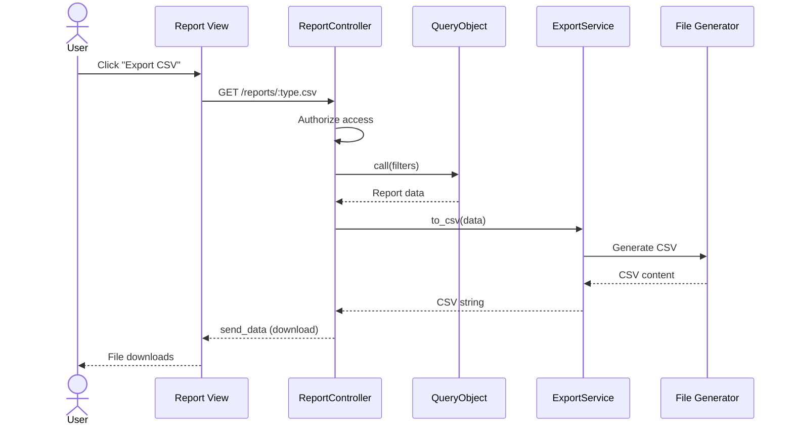

# UC-359: Export Report Data

## Metadata

| Attribute | Value |
|-----------|-------|
| **ID** | UC-359 |
| **Name** | Export Report Data |
| **Functional Area** | Reporting & Analytics |
| **Primary Actor** | Recruiter (ACT-02) |
| **Priority** | P1 |
| **Complexity** | Low |
| **Status** | Draft |

## Description

Users export report data to external file formats for further analysis, sharing, or archival. Export options include CSV for data analysis and PDF for presentation. The export captures the current report view with all applied filters and generates a downloadable file. This enables integration with external tools like Excel, Google Sheets, or business intelligence platforms.

## Actors

| Actor | Role in Use Case |
|-------|------------------|
| Recruiter (ACT-02) | Exports data for analysis |
| Executive (ACT-05) | Exports for board presentations |
| Compliance Officer (ACT-06) | Exports for audit documentation |

## Preconditions

- [ ] User is authenticated with reports access permission
- [ ] User is viewing a report with data
- [ ] Report has data to export (not empty state)
- [ ] PDF generation library (Prawn) is available

## Postconditions

### Success
- [ ] File generated in requested format
- [ ] Download triggered in browser
- [ ] Audit log entry created
- [ ] Report filters reflected in export

### Failure
- [ ] Error message if generation fails
- [ ] Graceful handling of large datasets
- [ ] No partial file downloaded

## Triggers

- User clicks "Export CSV" button on any report
- User clicks "Export PDF" button on any report
- User selects export format from dropdown menu

## Basic Flow



| Step | Actor | Action | System Response |
|------|-------|--------|-----------------|
| 1 | User | Clicks "Export CSV" button | Export request initiated |
| 2 | System | Determines export format | CSV format selected |
| 3 | System | Authorizes user access | Permission verified |
| 4 | System | Retrieves current filter state | Filters captured |
| 5 | System | Runs query object with filters | Report data fetched |
| 6 | System | Passes data to export service | Export processing begins |
| 7 | System | Generates CSV content | Headers and rows created |
| 8 | System | Sets response headers | Content-Type, filename |
| 9 | System | Sends file to browser | Download triggered |
| 10 | User | Saves file | File saved locally |
| 11 | System | Logs export action | Audit trail created |

## Alternative Flows

### AF-1: Export to PDF

**Trigger:** User clicks "Export PDF"

| Step | Actor | Action | System Response |
|------|-------|--------|-----------------|
| 2a | System | Determines PDF format | PDF generation path |
| 6a | System | Passes data to Prawn | PDF renderer invoked |
| 7a | System | Generates PDF with charts | Document assembled |
| 8a | System | Sets PDF content type | application/pdf |

**Resumption:** Returns to step 9

### AF-2: Export with Custom Date Range

**Trigger:** User modifies date range before export

| Step | Actor | Action | System Response |
|------|-------|--------|-----------------|
| 1b | User | Changes date range filter | Filter updated |
| 1c | System | Re-renders report preview | New data shown |
| 1d | User | Clicks export | Updated data exported |

**Resumption:** Continues from step 2

### AF-3: Export from Cached Snapshot

**Trigger:** Report uses cached ReportSnapshot

| Step | Actor | Action | System Response |
|------|-------|--------|-----------------|
| 5a | System | Finds existing snapshot | Cached data used |
| 5b | System | Skips query execution | Faster response |

**Resumption:** Continues from step 6

## Exception Flows

### EF-1: Large Dataset

**Trigger:** Export would exceed size limit

| Step | Actor | Action | System Response |
|------|-------|--------|-----------------|
| E.1 | System | Detects large dataset | Row count checked |
| E.2 | System | Shows warning | "Export limited to 10,000 rows" |
| E.3 | System | Truncates if user proceeds | Partial data exported |

**Resolution:** User narrows date range or accepts limit

### EF-2: PDF Generation Failure

**Trigger:** Prawn library error

| Step | Actor | Action | System Response |
|------|-------|--------|-----------------|
| E.1 | System | PDF generation throws error | Error caught |
| E.2 | System | Falls back to CSV offer | "PDF unavailable, download CSV?" |
| E.3 | System | Logs error for investigation | Error recorded |

**Resolution:** User downloads CSV instead

### EF-3: No Data to Export

**Trigger:** Report is empty for selected filters

| Step | Actor | Action | System Response |
|------|-------|--------|-----------------|
| E.1 | System | Query returns zero rows | Empty result set |
| E.2 | System | Shows message | "No data to export" |
| E.3 | System | Export button disabled | Prevents empty file |

**Resolution:** User adjusts filters

## Business Rules

| ID | Rule | Description |
|----|------|-------------|
| BR-359.1 | CSV Format | UTF-8 encoding, comma-separated |
| BR-359.2 | CSV Headers | First row contains column headers |
| BR-359.3 | Date Format | ISO 8601 (YYYY-MM-DD) in exports |
| BR-359.4 | PDF Layout | Portrait or landscape based on report type |
| BR-359.5 | Row Limit | Maximum 10,000 rows per export |
| BR-359.6 | File Naming | report_type_YYYY-MM-DD.format |
| BR-359.7 | Organization Scope | Export only includes org data |
| BR-359.8 | Filter Persistence | Export reflects current view filters |
| BR-359.9 | Diversity Restriction | Diversity PDF has "Confidential" watermark |

## Data Requirements

### Input Data

| Field | Type | Required | Validation |
|-------|------|----------|------------|
| report_type | string | Yes | Valid report identifier |
| format | string | Yes | csv or pdf |
| start_date | date | Yes | From current filters |
| end_date | date | Yes | From current filters |
| filters | hash | No | Report-specific filters |

### Output Data

| Field | Type | Description |
|-------|------|-------------|
| file_content | binary | Generated file data |
| filename | string | Suggested filename |
| content_type | string | MIME type |
| file_size | integer | Bytes |

## CSV Output Format

### Time-to-Hire Report CSV

```csv
Candidate,Job Title,Department,Source,Applied Date,Hired Date,Days to Hire
"Jane Doe","Sr. Engineer","Engineering","Referral","2026-01-01","2026-01-22",21
"John Smith","Product Manager","Product","LinkedIn","2026-01-03","2026-01-18",15
```

### Source Effectiveness Report CSV

```csv
Source,Applications,In Progress,Hired,Rejected,Conversion Rate,Quality Score
"Referral",89,12,15,62,16.8,78.5
"LinkedIn",64,8,8,48,12.5,65.2
```

### Pipeline Conversion Report CSV

```csv
Stage,Entries,Exits,Pass Through Rate,Rejection Rate,Avg Time (Hours)
"Screening",152,88,57.9,32.2,76.8
"Interviewing",88,40,45.5,38.6,180.5
```

## PDF Output Format

### PDF Structure

```
+--------------------------------------------------+
| [Organization Logo]          Report Date: Jan 25 |
| Ledgoria                                         |
+--------------------------------------------------+
| TIME-TO-HIRE REPORT                              |
| Period: January 1 - January 25, 2026             |
| Department: All Departments                       |
+--------------------------------------------------+
| SUMMARY                                          |
| +--------+ +--------+ +--------+ +--------+      |
| | Hires  | | Avg    | | Median | | Range  |      |
| |   47   | | 23 d   | |  21 d  | | 8-45 d |      |
| +--------+ +--------+ +--------+ +--------+      |
+--------------------------------------------------+
| TREND                                            |
| [Line Chart Rendered as Image]                   |
+--------------------------------------------------+
| BY DEPARTMENT                                    |
| +-----------------------------------------------+|
| | Department   | Hires | Avg Days              ||
| | Engineering  |  22   |   21                  ||
| | Product      |  15   |   25                  ||
| +-----------------------------------------------+|
+--------------------------------------------------+
| Generated by Ledgoria ATS                 Page 1 |
+--------------------------------------------------+
```

## Database Transactions

### Tables Affected

| Table | Operation | Conditions |
|-------|-----------|------------|
| (report source) | READ | Query execution |
| audit_logs | CREATE | Export logged |

### Transaction Detail

```sql
-- Export is primarily read-only with audit log
-- Audit log entry
INSERT INTO audit_logs (
    organization_id,
    user_id,
    action,
    auditable_type,
    auditable_id,
    metadata,
    ip_address,
    user_agent,
    created_at
) VALUES (
    @organization_id,
    @current_user_id,
    'report.exported',
    'Report',
    NULL,
    JSON_OBJECT(
        'report_type', @report_type,
        'format', @format,
        'start_date', @start_date,
        'end_date', @end_date,
        'row_count', @row_count
    ),
    @ip_address,
    @user_agent,
    NOW()
);
```

### Rollback Scenarios

| Scenario | Rollback Action |
|----------|-----------------|
| Generation fails | No file sent, error shown |
| Read-only + audit | Audit log still created |

## UI/UX Requirements

### Screen/Component

- **Location:** Export button on all report pages
- **Entry Point:** Report toolbar/header
- **Key Elements:**
  - Export button with format dropdown
  - Loading indicator during generation
  - Download prompt on completion

### Export Button Placement

```
+--------------------------------------------------+
| Time-to-Hire Report                              |
| [Start Date] to [End Date]  [Job v]  [Export v]  |
|                                       +--------+ |
|                                       | CSV    | |
|                                       | PDF    | |
|                                       +--------+ |
+--------------------------------------------------+
```

### Loading State

```
+--------------------------------------------------+
| Time-to-Hire Report                              |
|                                                  |
|                  [Spinner]                       |
|            Generating export...                  |
|                                                  |
+--------------------------------------------------+
```

## Non-Functional Requirements

| Requirement | Target |
|-------------|--------|
| CSV Generation | < 5 seconds for 10K rows |
| PDF Generation | < 15 seconds |
| Max File Size | 10 MB |
| Concurrent Exports | 5 per user |

## Security Considerations

- [x] Authentication required
- [x] Authorization check: Reports permission required
- [x] Organization scoping: Only org data exported
- [x] Audit logging: All exports logged with details
- [x] PII handling: Candidate names in exports (authorized users only)
- [x] Diversity reports: Watermarked "Confidential"

## Related Use Cases

| Use Case | Relationship |
|----------|--------------|
| UC-350 through UC-357 | Source reports for export |
| UC-358 Schedule Report | Alternative to manual export |

---

## Data Model References

> Cross-references to [DATA_MODEL.md](../DATA_MODEL.md) and [CRUD_MATRIX.md](../CRUD_MATRIX.md)

### Subject Areas

| Subject Area | ID | Relationship |
|--------------|-----|--------------|
| (Cross-cutting) | - | Primary |
| Compliance & Audit | SA-09 | Audit logging |

### Entities CRUD

| Entity | C | R | U | D | Notes |
|--------|---|---|---|---|-------|
| (Various per report) | | ✓ | | | Read source data |
| AuditLog | ✓ | | | | Export logged |

**Legend:** C = Create, R = Read, U = Update, D = Delete

---

## Process Model References

> Cross-references to [PROCESS_MODEL.md](../PROCESS_MODEL.md) and [PROCESS_CRUD_MATRIX.md](../PROCESS_CRUD_MATRIX.md)

| Attribute | Value | Link |
|-----------|-------|------|
| **Elementary Business Process** | EP-1209: Export Report Data | [PROCESS_MODEL.md#ep-1209](../PROCESS_MODEL.md#ep-1209-export-report-data) |
| **Business Process** | BP-701: Operational Reporting | [PROCESS_MODEL.md#bp-701](../PROCESS_MODEL.md#bp-701-operational-reporting) |
| **Business Function** | BF-07: Analytics & Reporting | [PROCESS_MODEL.md#bf-07](../PROCESS_MODEL.md#bf-07-analytics--reporting) |

### EBP Details

| Attribute | Value |
|-----------|-------|
| **Trigger** | User clicks export button on report |
| **Input** | Report type, format, current filters |
| **Output** | Downloaded CSV or PDF file |
| **Business Rules** | BR-359.1 through BR-359.9 |

---

## Traceability Matrix

> Complete artifact mapping for requirements traceability

| Artifact Type | ID | Name | Link |
|---------------|-----|------|------|
| **Use Case** | UC-359 | Export Report Data | *(this document)* |
| **Elementary Process** | EP-1209 | Export Report Data | [PROCESS_MODEL.md](../PROCESS_MODEL.md#ep-1209-export-report-data) |
| **Business Process** | BP-701 | Operational Reporting | [PROCESS_MODEL.md](../PROCESS_MODEL.md#bp-701-operational-reporting) |
| **Business Function** | BF-07 | Analytics & Reporting | [PROCESS_MODEL.md](../PROCESS_MODEL.md#bf-07-analytics--reporting) |
| **Primary Actor** | ACT-02 | Recruiter | [ACTORS.md](../ACTORS.md#act-02-recruiter) |
| **Subject Area (Primary)** | - | Cross-cutting | - |
| **CRUD Matrix Row** | UC-359 | - | [CRUD_MATRIX.md](../CRUD_MATRIX.md#uc-359) |
| **Process CRUD Row** | EP-1209 | - | [PROCESS_CRUD_MATRIX.md](../PROCESS_CRUD_MATRIX.md#ep-1209) |

### Implementation Artifacts

| Artifact Type | Path/Reference | Status |
|---------------|----------------|--------|
| Controller | `app/controllers/reports/*_controller.rb` | CSV Implemented |
| Service | `app/services/reports/csv_export_service.rb` | Planned |
| Service | `app/services/reports/pdf_export_service.rb` | Planned |
| Gem | Prawn (PDF generation) | Available |
| Test | `test/controllers/reports/*_controller_test.rb` | Partial |

---

## Open Questions

1. Should we add Excel (.xlsx) format option?
2. Should exports include chart images or just data?
3. How long should we retain export audit logs?

## Change History

| Version | Date | Author | Changes |
|---------|------|--------|---------|
| 0.1 | 2026-01-25 | System | Initial draft |
