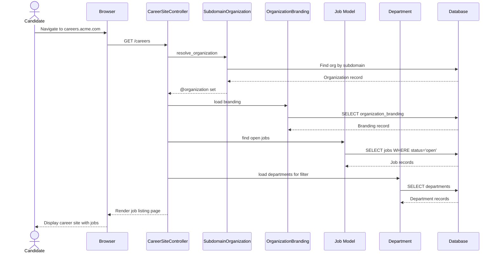

# UC-400: Browse Jobs

## Metadata

| Attribute | Value |
|-----------|-------|
| **ID** | UC-400 |
| **Name** | Browse Jobs |
| **Functional Area** | Career Site & Portal |
| **Primary Actor** | Candidate (ACT-07) |
| **Priority** | P1 |
| **Complexity** | Low |
| **Status** | Draft |

## Description

A candidate visits the organization's public career site and browses the list of open job positions. The system displays jobs filtered by the organization's published openings, with optional filtering by department, location type, and employment type. The career site displays the organization's branding and allows candidates to explore opportunities without requiring authentication.

## Actors

| Actor | Role in Use Case |
|-------|------------------|
| Candidate (ACT-07) | Browses available job listings on the career site |
| Integration Gateway (ACT-12) | Resolves organization from subdomain or custom domain |

## Preconditions

- [ ] Organization has an active career site (subdomain or custom domain configured)
- [ ] Organization branding is configured (optional but recommended)
- [ ] At least one job exists with status = 'open'
- [ ] Career site is accessible (not disabled by admin)

## Postconditions

### Success
- [ ] Candidate views list of open jobs for the organization
- [ ] Jobs are filtered based on any applied filters
- [ ] Branding elements are displayed (logo, colors, content)
- [ ] Page load is tracked for analytics (optional)

### Failure
- [ ] 404 page displayed if organization not found
- [ ] Empty state shown if no jobs match filters
- [ ] Error page shown if career site is disabled

## Triggers

- Candidate navigates to organization's career site URL
- Candidate clicks link from job board or social media
- Candidate is redirected from main company website
- Candidate accesses bookmarked career site URL

## Basic Flow



| Step | Actor | Action | System Response |
|------|-------|--------|-----------------|
| 1 | Candidate | Navigates to career site URL | DNS resolves to application |
| 2 | System | Resolves organization from subdomain | Organization context established |
| 3 | System | Loads organization branding | Colors, logo, content loaded |
| 4 | System | Queries open jobs | Retrieves jobs with status = 'open' |
| 5 | System | Loads filter options | Departments, location types, employment types |
| 6 | System | Renders career site layout | Applies branding CSS variables |
| 7 | System | Displays job listings | Shows job cards with key details |
| 8 | Candidate | Views job list | Sees available positions |

## Alternative Flows

### AF-1: Apply Filters

**Trigger:** Candidate selects filter options

| Step | Actor | Action | System Response |
|------|-------|--------|-----------------|
| 8a | Candidate | Selects department filter | Dropdown selection |
| 8b | Candidate | Selects location type filter | Dropdown selection |
| 8c | Candidate | Selects employment type filter | Dropdown selection |
| 8d | System | Applies filters to query | Re-queries with WHERE clauses |
| 8e | System | Updates job listing | Displays filtered results |

**Resumption:** Returns to step 8 with filtered results

### AF-2: Custom Domain Access

**Trigger:** Candidate accesses via custom domain (careers.company.com)

| Step | Actor | Action | System Response |
|------|-------|--------|-----------------|
| 1a | Candidate | Navigates to careers.company.com | Custom domain request |
| 2a | System | Looks up organization by custom domain | Checks custom_domain field |
| 2b | System | Sets organization context | Same as subdomain flow |

**Resumption:** Continues at step 3

### AF-3: No Open Jobs

**Trigger:** Organization has no jobs with status = 'open'

| Step | Actor | Action | System Response |
|------|-------|--------|-----------------|
| 4a | System | Queries open jobs | Returns empty result |
| 7a | System | Displays empty state | "No positions currently open" |
| 7b | System | Shows job alert signup | Offers email notification |

**Resumption:** Use case ends

## Exception Flows

### EF-1: Organization Not Found

**Trigger:** Subdomain or custom domain not recognized

| Step | Actor | Action | System Response |
|------|-------|--------|-----------------|
| 2.1 | System | Cannot resolve organization | Organization lookup fails |
| 2.2 | System | Returns 404 page | "Career site not found" |

**Resolution:** Candidate must verify URL

### EF-2: Career Site Disabled

**Trigger:** Organization has disabled their career site

| Step | Actor | Action | System Response |
|------|-------|--------|-----------------|
| 3.1 | System | Checks career site status | Site is disabled |
| 3.2 | System | Returns unavailable page | "Career site currently unavailable" |

**Resolution:** Candidate cannot access until enabled

## Business Rules

| ID | Rule | Description |
|----|------|-------------|
| BR-400.1 | Open Jobs Only | Only jobs with status = 'open' are displayed |
| BR-400.2 | Organization Scoped | Jobs must belong to the resolved organization |
| BR-400.3 | Kept Records Only | Soft-deleted jobs (discarded) are excluded |
| BR-400.4 | No Auth Required | Career site is publicly accessible |
| BR-400.5 | Branding Applied | Organization branding CSS variables are applied |
| BR-400.6 | Filter Visibility | Filters shown based on branding configuration |

## Data Requirements

### Input Data

| Field | Type | Required | Validation |
|-------|------|----------|------------|
| subdomain | string | Yes* | Valid subdomain format |
| custom_domain | string | Yes* | Valid domain format |
| department | integer | No | Valid department ID |
| location_type | string | No | Valid lookup value |
| employment_type | string | No | Valid lookup value |

*One of subdomain or custom_domain required

### Output Data

| Field | Type | Description |
|-------|------|-------------|
| jobs | array | List of open job records |
| departments | array | Available department filter options |
| location_types | array | Available location type filter options |
| employment_types | array | Available employment type filter options |
| branding | object | Organization branding settings |

## Database Transactions

### Tables Affected

| Table | Operation | Conditions |
|-------|-----------|------------|
| organizations | READ | Resolve from subdomain/domain |
| organization_brandings | READ | Load branding settings |
| jobs | READ | Filter by org, status, discarded_at |
| departments | READ | Load filter options |
| lookup_values | READ | Load location/employment types |

### Query Detail

```sql
-- Step 1: Resolve organization
SELECT * FROM organizations
WHERE subdomain = @subdomain
   OR custom_domain = @custom_domain
LIMIT 1;

-- Step 2: Load branding
SELECT * FROM organization_brandings
WHERE organization_id = @org_id;

-- Step 3: Query open jobs with filters
SELECT j.*, d.name as department_name
FROM jobs j
LEFT JOIN departments d ON d.id = j.department_id
WHERE j.organization_id = @org_id
  AND j.status = 'open'
  AND j.discarded_at IS NULL
  AND (@department IS NULL OR j.department_id = @department)
  AND (@location_type IS NULL OR j.location_type = @location_type)
  AND (@employment_type IS NULL OR j.employment_type = @employment_type)
ORDER BY j.created_at DESC;

-- Step 4: Load filter options
SELECT id, name FROM departments
WHERE organization_id = @org_id
ORDER BY name;
```

### Rollback Scenarios

| Scenario | Rollback Action |
|----------|-----------------|
| N/A | Read-only operation, no rollback needed |

## UI/UX Requirements

### Screen/Component

- **Location:** careers.[subdomain].ledgoria.com or custom domain
- **Entry Point:** Direct URL, job board link, company website link
- **Key Elements:**
  - Organization logo (from branding)
  - Company tagline (from branding)
  - Filter dropdowns (department, location, type)
  - Search input (optional)
  - Job cards with title, department, location, type
  - Apply button on each job card

### Career Site Layout

```
+----------------------------------------------------------+
| [Logo]                              [Sign In] (optional)  |
+----------------------------------------------------------+
| Company Tagline / Hero Section                            |
| About Company / Culture Description                       |
+----------------------------------------------------------+
| +------+ +------+ +------+ +------+                       |
| |Dept  | |Loc   | |Type  | |Search|                      |
| +------+ +------+ +------+ +------+                       |
+----------------------------------------------------------+
| +------------------------------------------------------+ |
| | Senior Software Engineer                              | |
| | Engineering | San Francisco, CA | Full-time          | |
| | Brief description of the role...                     | |
| |                                    [Apply Now]       | |
| +------------------------------------------------------+ |
|                                                          |
| +------------------------------------------------------+ |
| | Product Manager                                       | |
| | Product | Remote | Full-time                         | |
| | Brief description of the role...                     | |
| |                                    [Apply Now]       | |
| +------------------------------------------------------+ |
+----------------------------------------------------------+
| [Company Social Links]                                    |
| Footer with privacy policy, powered by Ledgoria           |
+----------------------------------------------------------+
```

## Non-Functional Requirements

| Requirement | Target |
|-------------|--------|
| Page Load Time | < 2 seconds |
| Mobile Support | Fully responsive |
| SEO | Meta tags from branding config |
| Accessibility | WCAG 2.1 AA compliant |
| Caching | CDN cached static assets |

## Security Considerations

- [ ] No authentication required
- [x] Rate limiting on requests
- [x] Input sanitization on filter params
- [x] SQL injection prevention via parameterized queries
- [x] XSS prevention in rendered content
- [ ] No sensitive data exposed

## Related Use Cases

| Use Case | Relationship |
|----------|--------------|
| UC-401 Search Jobs | Alternative for finding jobs |
| UC-402 View Job Details | Follows when job selected |
| UC-403 Apply for Job | Follows from job listing |
| UC-408 Configure Career Site | Admin configuration |
| UC-409 Customize Branding | Determines appearance |

---

## Data Model References

> Cross-references to [DATA_MODEL.md](../DATA_MODEL.md) and [CRUD_MATRIX.md](../CRUD_MATRIX.md)

### Subject Areas

| Subject Area | ID | Relationship |
|--------------|-----|--------------|
| Career Site | SA-12 | Primary |
| Job Requisition | SA-03 | Reference |
| Organization Management | SA-02 | Reference |

### Entities CRUD

| Entity | C | R | U | D | Notes |
|--------|---|---|---|---|-------|
| Organization | | X | | | Read to resolve from subdomain |
| OrganizationBranding | | X | | | Read for styling and content |
| Job | | X | | | Read open jobs for listing |
| Department | | X | | | Read for filter options |
| LookupValue | | X | | | Read for filter options |

**Legend:** C = Create, R = Read, U = Update, D = Delete

---

## Process Model References

> Cross-references to [PROCESS_MODEL.md](../PROCESS_MODEL.md) and [PROCESS_CRUD_MATRIX.md](../PROCESS_CRUD_MATRIX.md)

| Attribute | Value | Link |
|-----------|-------|------|
| **Elementary Business Process** | EP-1141: Browse Jobs | [PROCESS_MODEL.md#ep-1141](../PROCESS_MODEL.md#ep-1141-browse-jobs) |
| **Business Process** | BP-604: Career Site Management | [PROCESS_MODEL.md#bp-604](../PROCESS_MODEL.md#bp-604-career-site-management) |
| **Business Function** | BF-06: System Administration | [PROCESS_MODEL.md#bf-06](../PROCESS_MODEL.md#bf-06-system-administration) |

### EBP Details

| Attribute | Value |
|-----------|-------|
| **Trigger** | Candidate accesses career site URL |
| **Input** | Subdomain or custom domain, optional filter parameters |
| **Output** | Rendered career site with job listings |
| **Business Rules** | BR-400.1 through BR-400.6 (see Business Rules section) |

---

## Traceability Matrix

> Complete artifact mapping for requirements traceability

| Artifact Type | ID | Name | Link |
|---------------|-----|------|------|
| **Use Case** | UC-400 | Browse Jobs | *(this document)* |
| **Elementary Process** | EP-1141 | Browse Jobs | [PROCESS_MODEL.md](../PROCESS_MODEL.md#ep-1141-browse-jobs) |
| **Business Process** | BP-604 | Career Site Management | [PROCESS_MODEL.md](../PROCESS_MODEL.md#bp-604-career-site-management) |
| **Business Function** | BF-06 | System Administration | [PROCESS_MODEL.md](../PROCESS_MODEL.md#bf-06-system-administration) |
| **Primary Actor** | ACT-07 | Candidate | [ACTORS.md](../ACTORS.md#act-07-candidate) |
| **Subject Area (Primary)** | SA-12 | Career Site | [DATA_MODEL.md](../DATA_MODEL.md#sa-12-career-site) |
| **Subject Area (Secondary)** | SA-03 | Job Requisition | [DATA_MODEL.md](../DATA_MODEL.md#sa-03-job-requisition) |
| **CRUD Matrix Row** | UC-400 | - | [CRUD_MATRIX.md](../CRUD_MATRIX.md#uc-400) |
| **Process CRUD Row** | EP-1141 | - | [PROCESS_CRUD_MATRIX.md](../PROCESS_CRUD_MATRIX.md#ep-1141) |

### Implementation Artifacts

| Artifact Type | Path/Reference | Status |
|---------------|----------------|--------|
| Controller | `app/controllers/career_site_controller.rb` | Implemented |
| Concern | `app/controllers/concerns/subdomain_organization.rb` | Implemented |
| Model | `app/models/organization_branding.rb` | Implemented |
| Layout | `app/views/layouts/career_site.html.erb` | Implemented |
| View | `app/views/career_site/index.html.erb` | Implemented |
| Test | `test/controllers/career_site_controller_test.rb` | Implemented |

---

## Open Questions

1. Should we support pagination for organizations with many open jobs?
2. Should we track career site views for analytics purposes?
3. Should we offer an RSS feed of open positions?

## Change History

| Version | Date | Author | Changes |
|---------|------|--------|---------|
| 0.1 | 2026-01-25 | System | Initial draft |
