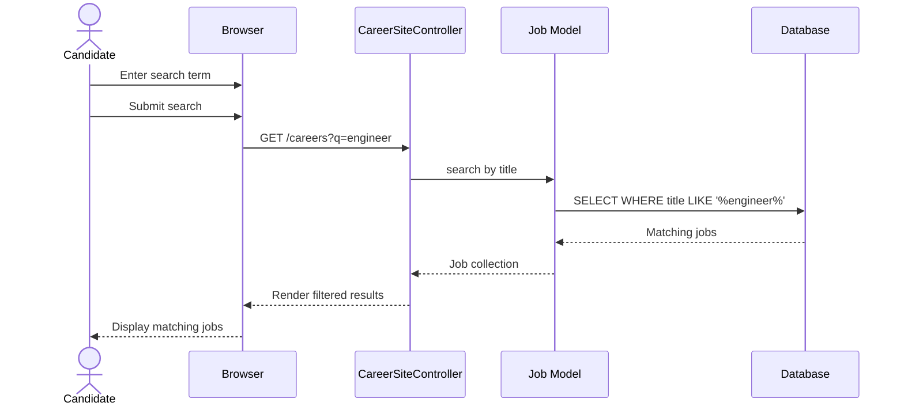

# UC-401: Search Jobs

## Metadata

| Attribute | Value |
|-----------|-------|
| **ID** | UC-401 |
| **Name** | Search Jobs |
| **Functional Area** | Career Site & Portal |
| **Primary Actor** | Candidate (ACT-07) |
| **Priority** | P2 |
| **Complexity** | Low |
| **Status** | Draft |

## Description

A candidate searches for jobs on the organization's career site using a keyword search query. The system filters open job positions by matching the search term against job titles and returns relevant results. This complements the filter-based browsing in UC-400 with free-text search capability.

## Actors

| Actor | Role in Use Case |
|-------|------------------|
| Candidate (ACT-07) | Enters search query to find relevant jobs |
| Integration Gateway (ACT-12) | Resolves organization from subdomain or custom domain |

## Preconditions

- [ ] Organization has an active career site
- [ ] Candidate has accessed the career site (UC-400)
- [ ] At least one job exists with status = 'open'

## Postconditions

### Success
- [ ] Jobs matching search query are displayed
- [ ] Search term is highlighted in results (optional)
- [ ] Filters can be combined with search
- [ ] Empty state shown if no matches

### Failure
- [ ] Error message if search fails
- [ ] Graceful fallback to full job list

## Triggers

- Candidate enters text in search input
- Candidate submits search form
- Candidate presses Enter in search field

## Basic Flow



| Step | Actor | Action | System Response |
|------|-------|--------|-----------------|
| 1 | Candidate | Enters search term in search box | Text captured |
| 2 | Candidate | Submits search (Enter or button) | Request sent to server |
| 3 | System | Receives search query parameter | Extracts 'q' param |
| 4 | System | Queries jobs with LIKE clause | Filters by title match |
| 5 | System | Applies other active filters | Combines with dept/location/type |
| 6 | System | Returns matching jobs | Ordered by relevance or date |
| 7 | System | Renders results page | Shows filtered job list |
| 8 | Candidate | Views search results | Sees matching positions |

## Alternative Flows

### AF-1: Search with Filters Combined

**Trigger:** Candidate has active filters when searching

| Step | Actor | Action | System Response |
|------|-------|--------|-----------------|
| 4a | System | Combines search with filters | AND conditions in query |
| 4b | System | Applies department filter | WHERE department_id = X |
| 4c | System | Applies location filter | AND location_type = Y |
| 4d | System | Applies employment filter | AND employment_type = Z |

**Resumption:** Continues at step 5

### AF-2: No Results Found

**Trigger:** Search query matches no jobs

| Step | Actor | Action | System Response |
|------|-------|--------|-----------------|
| 6a | System | Returns empty result set | No matches found |
| 7a | System | Displays empty state | "No jobs found matching 'term'" |
| 7b | System | Suggests actions | "Try different keywords" |
| 7c | System | Shows all jobs link | "View all open positions" |

**Resumption:** Use case ends or candidate searches again

### AF-3: Clear Search

**Trigger:** Candidate clears search input

| Step | Actor | Action | System Response |
|------|-------|--------|-----------------|
| 1a | Candidate | Clears search input | Text removed |
| 2a | Candidate | Submits empty search | Request without q param |
| 4a | System | Skips title filter | Returns all jobs |

**Resumption:** Returns to browse flow (UC-400)

### AF-4: Real-time Search (Optional)

**Trigger:** JavaScript-enabled browser with live search

| Step | Actor | Action | System Response |
|------|-------|--------|-----------------|
| 1a | Candidate | Types in search box | Keystrokes captured |
| 1b | System | Debounces input (300ms) | Waits for typing pause |
| 1c | System | Sends AJAX request | Fetches matching jobs |
| 1d | System | Updates job list | Replaces without page reload |

**Resumption:** Continues updating as candidate types

## Exception Flows

### EF-1: Search Query Too Long

**Trigger:** Search term exceeds maximum length

| Step | Actor | Action | System Response |
|------|-------|--------|-----------------|
| 3.1 | System | Validates query length | Exceeds limit (255 chars) |
| 3.2 | System | Truncates query | Uses first 255 chars |
| 3.3 | System | Proceeds with truncated search | Normal flow continues |

**Resolution:** Search proceeds with truncated query

### EF-2: SQL Injection Attempt

**Trigger:** Malicious characters in search query

| Step | Actor | Action | System Response |
|------|-------|--------|-----------------|
| 3.1 | System | Sanitizes input | Escapes special characters |
| 3.2 | System | Uses parameterized query | Prevents injection |
| 3.3 | System | Returns safe results | No security breach |

**Resolution:** Search proceeds safely

## Business Rules

| ID | Rule | Description |
|----|------|-------------|
| BR-401.1 | Title Search | Search matches against job title field |
| BR-401.2 | Case Insensitive | Search is case-insensitive |
| BR-401.3 | Partial Match | Uses LIKE with wildcards for partial matching |
| BR-401.4 | Open Jobs Only | Only searches jobs with status = 'open' |
| BR-401.5 | Organization Scoped | Only searches within current organization |
| BR-401.6 | Combinable | Search can be combined with other filters |

## Data Requirements

### Input Data

| Field | Type | Required | Validation |
|-------|------|----------|------------|
| q | string | No | Max 255 chars, sanitized |
| department | integer | No | Valid department ID |
| location_type | string | No | Valid lookup value |
| employment_type | string | No | Valid lookup value |

### Output Data

| Field | Type | Description |
|-------|------|-------------|
| jobs | array | List of matching job records |
| search_term | string | Echo of search query (for display) |
| result_count | integer | Number of matching jobs |

## Database Transactions

### Tables Affected

| Table | Operation | Conditions |
|-------|-----------|------------|
| jobs | READ | Filter by title, org, status |
| departments | READ | Load for display |

### Query Detail

```sql
-- Search jobs by title with filters
SELECT j.*, d.name as department_name
FROM jobs j
LEFT JOIN departments d ON d.id = j.department_id
WHERE j.organization_id = @org_id
  AND j.status = 'open'
  AND j.discarded_at IS NULL
  AND j.title LIKE CONCAT('%', @search_term, '%')
  AND (@department IS NULL OR j.department_id = @department)
  AND (@location_type IS NULL OR j.location_type = @location_type)
  AND (@employment_type IS NULL OR j.employment_type = @employment_type)
ORDER BY j.created_at DESC;
```

### Rollback Scenarios

| Scenario | Rollback Action |
|----------|-----------------|
| N/A | Read-only operation, no rollback needed |

## UI/UX Requirements

### Screen/Component

- **Location:** careers.[subdomain].ledgoria.com with search param
- **Entry Point:** Search input on career site
- **Key Elements:**
  - Search input with clear button
  - Search icon/submit button
  - Results count display
  - Job cards with matched term highlighted (optional)
  - Clear filters/search link

### Search Interface

```
+----------------------------------------------------------+
| [Logo]                              [Sign In] (optional)  |
+----------------------------------------------------------+
| +------------------------------------------------------+ |
| | [Search icon] Search jobs...              [x] [Go]   | |
| +------------------------------------------------------+ |
| +------+ +------+ +------+                               |
| |Dept  | |Loc   | |Type  |                               |
| +------+ +------+ +------+                               |
+----------------------------------------------------------+
| Showing 3 results for "engineer"          [Clear Search] |
+----------------------------------------------------------+
| +------------------------------------------------------+ |
| | Senior Software Engineer                              | |
| | Engineering | San Francisco | Full-time              | |
| +------------------------------------------------------+ |
| +------------------------------------------------------+ |
| | DevOps Engineer                                       | |
| | Engineering | Remote | Full-time                     | |
| +------------------------------------------------------+ |
| +------------------------------------------------------+ |
| | QA Engineer                                           | |
| | Engineering | New York | Contract                    | |
| +------------------------------------------------------+ |
+----------------------------------------------------------+
```

### Empty State

```
+----------------------------------------------------------+
| No jobs found matching "blockchain developer"             |
|                                                          |
| Suggestions:                                             |
| * Try different keywords                                 |
| * Remove filters to broaden your search                  |
| * [View all open positions]                              |
+----------------------------------------------------------+
```

## Non-Functional Requirements

| Requirement | Target |
|-------------|--------|
| Search Response Time | < 500ms |
| Maximum Query Length | 255 characters |
| Debounce Time (AJAX) | 300ms |
| Mobile Support | Fully responsive |

## Security Considerations

- [ ] No authentication required
- [x] Input sanitization for SQL safety
- [x] XSS prevention in search display
- [x] Query length limits enforced
- [x] Rate limiting on search requests

## Related Use Cases

| Use Case | Relationship |
|----------|--------------|
| UC-400 Browse Jobs | Base flow for job listing |
| UC-402 View Job Details | Follows when job selected |
| UC-403 Apply for Job | Follows from search results |

---

## Data Model References

> Cross-references to [DATA_MODEL.md](../DATA_MODEL.md) and [CRUD_MATRIX.md](../CRUD_MATRIX.md)

### Subject Areas

| Subject Area | ID | Relationship |
|--------------|-----|--------------|
| Career Site | SA-12 | Primary |
| Job Requisition | SA-03 | Reference |

### Entities CRUD

| Entity | C | R | U | D | Notes |
|--------|---|---|---|---|-------|
| Job | | X | | | Search by title, filter by status |
| Department | | X | | | Read for result display |

**Legend:** C = Create, R = Read, U = Update, D = Delete

---

## Process Model References

> Cross-references to [PROCESS_MODEL.md](../PROCESS_MODEL.md) and [PROCESS_CRUD_MATRIX.md](../PROCESS_CRUD_MATRIX.md)

| Attribute | Value | Link |
|-----------|-------|------|
| **Elementary Business Process** | EP-1142: Search Jobs | [PROCESS_MODEL.md#ep-1142](../PROCESS_MODEL.md#ep-1142-search-jobs) |
| **Business Process** | BP-604: Career Site Management | [PROCESS_MODEL.md#bp-604](../PROCESS_MODEL.md#bp-604-career-site-management) |
| **Business Function** | BF-06: System Administration | [PROCESS_MODEL.md#bf-06](../PROCESS_MODEL.md#bf-06-system-administration) |

### EBP Details

| Attribute | Value |
|-----------|-------|
| **Trigger** | Candidate submits search query on career site |
| **Input** | Search term, optional filter parameters |
| **Output** | Filtered list of matching job positions |
| **Business Rules** | BR-401.1 through BR-401.6 (see Business Rules section) |

---

## Traceability Matrix

> Complete artifact mapping for requirements traceability

| Artifact Type | ID | Name | Link |
|---------------|-----|------|------|
| **Use Case** | UC-401 | Search Jobs | *(this document)* |
| **Elementary Process** | EP-1142 | Search Jobs | [PROCESS_MODEL.md](../PROCESS_MODEL.md#ep-1142-search-jobs) |
| **Business Process** | BP-604 | Career Site Management | [PROCESS_MODEL.md](../PROCESS_MODEL.md#bp-604-career-site-management) |
| **Business Function** | BF-06 | System Administration | [PROCESS_MODEL.md](../PROCESS_MODEL.md#bf-06-system-administration) |
| **Primary Actor** | ACT-07 | Candidate | [ACTORS.md](../ACTORS.md#act-07-candidate) |
| **Subject Area (Primary)** | SA-12 | Career Site | [DATA_MODEL.md](../DATA_MODEL.md#sa-12-career-site) |
| **Subject Area (Secondary)** | SA-03 | Job Requisition | [DATA_MODEL.md](../DATA_MODEL.md#sa-03-job-requisition) |
| **CRUD Matrix Row** | UC-401 | - | [CRUD_MATRIX.md](../CRUD_MATRIX.md#uc-401) |
| **Process CRUD Row** | EP-1142 | - | [PROCESS_CRUD_MATRIX.md](../PROCESS_CRUD_MATRIX.md#ep-1142) |

### Implementation Artifacts

| Artifact Type | Path/Reference | Status |
|---------------|----------------|--------|
| Controller | `app/controllers/career_site_controller.rb` | Implemented |
| View | `app/views/career_site/index.html.erb` | Implemented |
| Test | `test/controllers/career_site_controller_test.rb` | Implemented |

---

## Open Questions

1. Should search also match job description content?
2. Should we implement full-text search for better relevance?
3. Should we track popular search terms for analytics?

## Change History

| Version | Date | Author | Changes |
|---------|------|--------|---------|
| 0.1 | 2026-01-25 | System | Initial draft |
