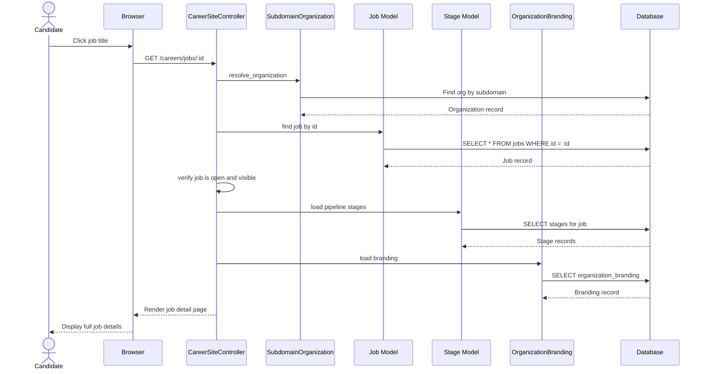

# UC-402: View Job Details

## Metadata

| Attribute | Value |
|-----------|-------|
| **ID** | UC-402 |
| **Name** | View Job Details |
| **Functional Area** | Career Site & Portal |
| **Primary Actor** | Candidate (ACT-07) |
| **Priority** | P1 |
| **Complexity** | Low |
| **Status** | Draft |

## Description

A candidate views the full details of a job position on the organization's career site. The system displays comprehensive information including job title, description, requirements, location, employment type, department, salary range (if configured), and company information. This page serves as the primary entry point for job applications.

## Actors

| Actor | Role in Use Case |
|-------|------------------|
| Candidate (ACT-07) | Views detailed job information before applying |
| Integration Gateway (ACT-12) | Resolves organization from subdomain or custom domain |

## Preconditions

- [ ] Job exists with status = 'open'
- [ ] Job belongs to the resolved organization
- [ ] Job is not soft-deleted (discarded_at IS NULL)
- [ ] Career site is accessible

## Postconditions

### Success
- [ ] Full job details displayed to candidate
- [ ] Apply button/link is visible and functional
- [ ] Pipeline stages shown (if configured to display)
- [ ] Company branding applied to page

### Failure
- [ ] 404 page displayed if job not found
- [ ] Error if job is closed or deleted

## Triggers

- Candidate clicks job title from job listing
- Candidate clicks "View Details" button
- Candidate navigates directly to job URL
- Candidate follows link from job board or social media

## Basic Flow



| Step | Actor | Action | System Response |
|------|-------|--------|-----------------|
| 1 | Candidate | Clicks on job listing | Navigation initiated |
| 2 | System | Resolves organization | From subdomain/domain |
| 3 | System | Finds job by ID | Queries database |
| 4 | System | Validates job visibility | Checks status = 'open' |
| 5 | System | Loads job stages | For hiring process display |
| 6 | System | Loads organization branding | For page styling |
| 7 | System | Renders job detail page | Applies branding |
| 8 | Candidate | Views job details | Reads information |

## Alternative Flows

### AF-1: Direct URL Access

**Trigger:** Candidate accesses job via direct URL or shared link

| Step | Actor | Action | System Response |
|------|-------|--------|-----------------|
| 1a | Candidate | Navigates to /careers/jobs/123 | Direct URL access |
| 2a | System | Resolves org from subdomain | Context established |
| 3a | System | Verifies job belongs to org | Security check |

**Resumption:** Continues at step 4

### AF-2: Salary Range Hidden

**Trigger:** Organization has disabled salary range display

| Step | Actor | Action | System Response |
|------|-------|--------|-----------------|
| 6a | System | Checks branding.show_salary_ranges | Returns false |
| 7a | System | Omits salary from display | Salary section hidden |

**Resumption:** Continues at step 8

### AF-3: Job with Application Questions

**Trigger:** Job has custom application questions configured

| Step | Actor | Action | System Response |
|------|-------|--------|-----------------|
| 5a | System | Loads application questions | For preview display |
| 7a | System | Shows question summary | "3 additional questions" |

**Resumption:** Continues at step 8

## Exception Flows

### EF-1: Job Not Found

**Trigger:** Job ID does not exist or belongs to different organization

| Step | Actor | Action | System Response |
|------|-------|--------|-----------------|
| 3.1 | System | Job lookup fails | No matching record |
| 3.2 | System | Returns 404 page | "Job not found" |
| 3.3 | System | Suggests browsing jobs | Link to job listings |

**Resolution:** Candidate redirected to browse jobs

### EF-2: Job Closed

**Trigger:** Job status is not 'open'

| Step | Actor | Action | System Response |
|------|-------|--------|-----------------|
| 4.1 | System | Checks job status | Status = 'closed' or 'on_hold' |
| 4.2 | System | Returns 404 page | "This position is no longer available" |
| 4.3 | System | Suggests similar jobs | Links to related positions |

**Resolution:** Candidate shown closed message

### EF-3: Job Soft Deleted

**Trigger:** Job has been discarded

| Step | Actor | Action | System Response |
|------|-------|--------|-----------------|
| 3.1 | System | Finds job with discarded_at | Job was soft-deleted |
| 3.2 | System | Returns 404 page | "Job not found" |

**Resolution:** Job treated as non-existent

## Business Rules

| ID | Rule | Description |
|----|------|-------------|
| BR-402.1 | Open Jobs Only | Only jobs with status = 'open' are viewable |
| BR-402.2 | Organization Scoped | Job must belong to the resolved organization |
| BR-402.3 | Kept Records Only | Soft-deleted jobs return 404 |
| BR-402.4 | Salary Visibility | Salary shown only if branding allows |
| BR-402.5 | Stage Visibility | Pipeline stages shown for transparency |
| BR-402.6 | Branding Applied | Page styled with organization branding |

## Data Requirements

### Input Data

| Field | Type | Required | Validation |
|-------|------|----------|------------|
| job_id | integer | Yes | Must exist and be open |
| subdomain | string | Yes* | Valid subdomain format |
| custom_domain | string | Yes* | Valid domain format |

*One of subdomain or custom_domain required

### Output Data

| Field | Type | Description |
|-------|------|-------------|
| job.title | string | Job title |
| job.description | text | Full job description (rich text) |
| job.requirements | text | Job requirements (rich text) |
| job.department | object | Department name |
| job.location | string | Job location |
| job.location_type | string | Remote/Hybrid/On-site |
| job.employment_type | string | Full-time/Part-time/Contract |
| job.salary_min | decimal | Minimum salary (if shown) |
| job.salary_max | decimal | Maximum salary (if shown) |
| job.created_at | datetime | Posted date |
| stages | array | Hiring process stages |
| branding | object | Organization branding |

## Database Transactions

### Tables Affected

| Table | Operation | Conditions |
|-------|-----------|------------|
| organizations | READ | Resolve from subdomain/domain |
| jobs | READ | Find by ID, validate status |
| departments | READ | Load department info |
| stages | READ | Load job stages |
| organization_brandings | READ | Load branding settings |

### Query Detail

```sql
-- Find open job by ID
SELECT j.*, d.name as department_name
FROM jobs j
LEFT JOIN departments d ON d.id = j.department_id
WHERE j.id = @job_id
  AND j.organization_id = @org_id
  AND j.status = 'open'
  AND j.discarded_at IS NULL;

-- Load job stages
SELECT s.*
FROM stages s
JOIN job_stages js ON js.stage_id = s.id
WHERE js.job_id = @job_id
ORDER BY js.position ASC;
```

### Rollback Scenarios

| Scenario | Rollback Action |
|----------|-----------------|
| N/A | Read-only operation, no rollback needed |

## UI/UX Requirements

### Screen/Component

- **Location:** /careers/jobs/:id
- **Entry Point:** Click from job listing, direct link
- **Key Elements:**
  - Job title (prominent heading)
  - Department, location, type badges
  - Salary range (if shown)
  - Full description (rich text)
  - Requirements section
  - Hiring process timeline (stages)
  - Apply button (prominent CTA)
  - Company info section
  - Back to jobs link

### Job Detail Layout

```
+----------------------------------------------------------+
| [Logo]                              [Sign In] (optional)  |
+----------------------------------------------------------+
| < Back to all jobs                                        |
+----------------------------------------------------------+
| Senior Software Engineer                                  |
| [Engineering] [San Francisco, CA] [Full-time] [On-site]  |
|                                                          |
| $150,000 - $200,000 per year                             |
| Posted 5 days ago                                         |
+----------------------------------------------------------+
| [                  Apply Now                            ] |
+----------------------------------------------------------+
|                                                          |
| About the Role                                           |
| -------------------------------------------------------- |
| We are looking for a Senior Software Engineer to join    |
| our growing engineering team. You will be responsible    |
| for designing and building scalable systems...           |
|                                                          |
| Requirements                                             |
| -------------------------------------------------------- |
| * 5+ years of experience in software development         |
| * Proficiency in Ruby on Rails, Python, or Go            |
| * Experience with cloud platforms (AWS, GCP)             |
| * Strong communication skills                            |
|                                                          |
| Nice to Have                                             |
| -------------------------------------------------------- |
| * Experience with distributed systems                    |
| * Contributions to open source projects                  |
|                                                          |
+----------------------------------------------------------+
| Our Hiring Process                                       |
| -------------------------------------------------------- |
| [Applied] -> [Phone Screen] -> [Technical] -> [Onsite]  |
|              -> [Offer]                                  |
+----------------------------------------------------------+
| About [Company Name]                                     |
| -------------------------------------------------------- |
| [Company tagline from branding]                          |
| [About company description from branding]                |
|                                                          |
| [LinkedIn] [Twitter] [Glassdoor]                        |
+----------------------------------------------------------+
| [                  Apply Now                            ] |
+----------------------------------------------------------+
| Footer                                                   |
+----------------------------------------------------------+
```

## Non-Functional Requirements

| Requirement | Target |
|-------------|--------|
| Page Load Time | < 2 seconds |
| Mobile Support | Fully responsive |
| SEO | Job-specific meta tags |
| Accessibility | WCAG 2.1 AA compliant |
| Schema.org | JobPosting structured data |

## Security Considerations

- [ ] No authentication required
- [x] Job ID validation (integer)
- [x] Organization scoping enforced
- [x] XSS prevention in rich text display
- [x] No sensitive internal data exposed

## Related Use Cases

| Use Case | Relationship |
|----------|--------------|
| UC-400 Browse Jobs | Precedes this use case |
| UC-401 Search Jobs | Alternative path to job |
| UC-403 Apply for Job | Follows from apply button |
| UC-410 Set Application Questions | Configures questions shown |

---

## Data Model References

> Cross-references to [DATA_MODEL.md](../DATA_MODEL.md) and [CRUD_MATRIX.md](../CRUD_MATRIX.md)

### Subject Areas

| Subject Area | ID | Relationship |
|--------------|-----|--------------|
| Career Site | SA-12 | Primary |
| Job Requisition | SA-03 | Primary |
| Organization Management | SA-02 | Reference |

### Entities CRUD

| Entity | C | R | U | D | Notes |
|--------|---|---|---|---|-------|
| Job | | X | | | Read job details |
| Department | | X | | | Read for display |
| Stage | | X | | | Read hiring process stages |
| OrganizationBranding | | X | | | Read for styling and content |
| ApplicationQuestion | | X | | | Read question count (optional) |

**Legend:** C = Create, R = Read, U = Update, D = Delete

---

## Process Model References

> Cross-references to [PROCESS_MODEL.md](../PROCESS_MODEL.md) and [PROCESS_CRUD_MATRIX.md](../PROCESS_CRUD_MATRIX.md)

| Attribute | Value | Link |
|-----------|-------|------|
| **Elementary Business Process** | EP-1143: View Job Details | [PROCESS_MODEL.md#ep-1143](../PROCESS_MODEL.md#ep-1143-view-job-details) |
| **Business Process** | BP-604: Career Site Management | [PROCESS_MODEL.md#bp-604](../PROCESS_MODEL.md#bp-604-career-site-management) |
| **Business Function** | BF-06: System Administration | [PROCESS_MODEL.md#bf-06](../PROCESS_MODEL.md#bf-06-system-administration) |

### EBP Details

| Attribute | Value |
|-----------|-------|
| **Trigger** | Candidate selects job from listing or accesses direct URL |
| **Input** | Job ID, organization context |
| **Output** | Full job details page with apply functionality |
| **Business Rules** | BR-402.1 through BR-402.6 (see Business Rules section) |

---

## Traceability Matrix

> Complete artifact mapping for requirements traceability

| Artifact Type | ID | Name | Link |
|---------------|-----|------|------|
| **Use Case** | UC-402 | View Job Details | *(this document)* |
| **Elementary Process** | EP-1143 | View Job Details | [PROCESS_MODEL.md](../PROCESS_MODEL.md#ep-1143-view-job-details) |
| **Business Process** | BP-604 | Career Site Management | [PROCESS_MODEL.md](../PROCESS_MODEL.md#bp-604-career-site-management) |
| **Business Function** | BF-06 | System Administration | [PROCESS_MODEL.md](../PROCESS_MODEL.md#bf-06-system-administration) |
| **Primary Actor** | ACT-07 | Candidate | [ACTORS.md](../ACTORS.md#act-07-candidate) |
| **Subject Area (Primary)** | SA-12 | Career Site | [DATA_MODEL.md](../DATA_MODEL.md#sa-12-career-site) |
| **Subject Area (Secondary)** | SA-03 | Job Requisition | [DATA_MODEL.md](../DATA_MODEL.md#sa-03-job-requisition) |
| **CRUD Matrix Row** | UC-402 | - | [CRUD_MATRIX.md](../CRUD_MATRIX.md#uc-402) |
| **Process CRUD Row** | EP-1143 | - | [PROCESS_CRUD_MATRIX.md](../PROCESS_CRUD_MATRIX.md#ep-1143) |

### Implementation Artifacts

| Artifact Type | Path/Reference | Status |
|---------------|----------------|--------|
| Controller | `app/controllers/career_site_controller.rb` | Implemented |
| Action | `CareerSiteController#show` | Implemented |
| View | `app/views/career_site/show.html.erb` | Implemented |
| Test | `test/controllers/career_site_controller_test.rb` | Implemented |

---

## Open Questions

1. Should we show the number of applicants for social proof?
2. Should we implement structured data for job boards (schema.org)?
3. Should we show estimated time to complete application?

## Change History

| Version | Date | Author | Changes |
|---------|------|--------|---------|
| 0.1 | 2026-01-25 | System | Initial draft |
