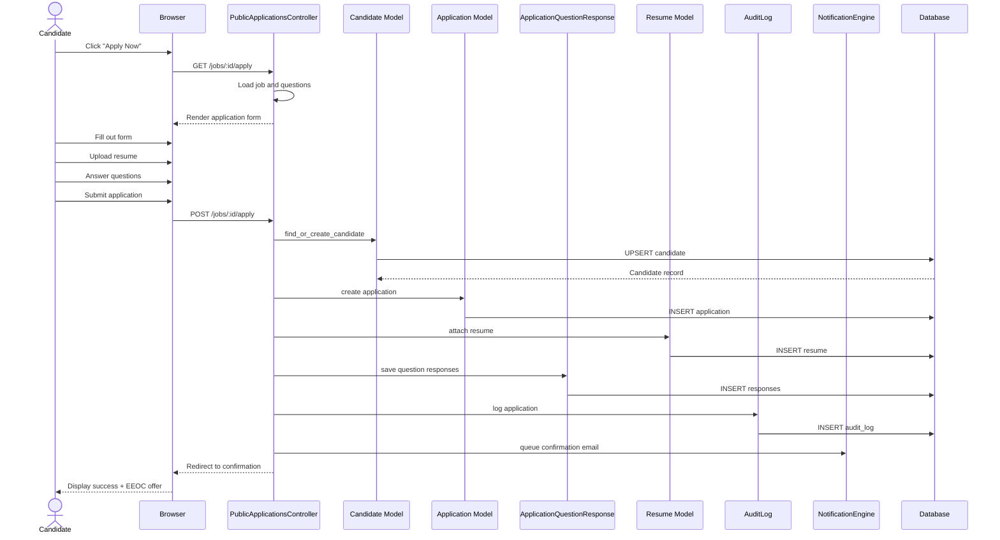

# UC-403: Apply for Job

## Metadata

| Attribute | Value |
|-----------|-------|
| **ID** | UC-403 |
| **Name** | Apply for Job |
| **Functional Area** | Career Site & Portal |
| **Primary Actor** | Candidate (ACT-07) |
| **Priority** | P1 |
| **Complexity** | Medium |
| **Status** | Draft |

## Description

A candidate submits an application for an open job position through the public career site. The system collects candidate information, resume, and responses to any custom application questions. Upon successful submission, a candidate record is created (or updated if existing), an application is created and placed in the first pipeline stage, and confirmation is sent.

**Note:** This use case is closely related to UC-100 (Apply for Job in Application & Pipeline) but focuses on the career site interface and candidate experience. UC-100 covers the internal application processing mechanics.

## Actors

| Actor | Role in Use Case |
|-------|------------------|
| Candidate (ACT-07) | Submits application with personal info and resume |
| Notification Engine (ACT-13) | Sends application confirmation email |
| Scheduler (ACT-11) | Triggers resume parsing job |

## Preconditions

- [ ] Job exists with status = 'open'
- [ ] Job is not soft-deleted
- [ ] Career site is accessible
- [ ] Candidate has viewed job details (UC-402)
- [ ] Application deadline not passed (if configured)

## Postconditions

### Success
- [ ] Candidate record created or updated
- [ ] Application record created with status = 'active'
- [ ] Application placed in first pipeline stage
- [ ] Resume attached to candidate
- [ ] Custom question responses saved
- [ ] Confirmation email queued
- [ ] Tracking token generated for status checking
- [ ] Audit log entry created
- [ ] EEOC collection page offered (post-application)

### Failure
- [ ] Validation errors displayed
- [ ] No application created
- [ ] No email sent
- [ ] Candidate can retry

## Triggers

- Candidate clicks "Apply Now" button on job detail page
- Candidate navigates directly to application form URL

## Basic Flow



| Step | Actor | Action | System Response |
|------|-------|--------|-----------------|
| 1 | Candidate | Clicks "Apply Now" | Navigates to application form |
| 2 | System | Loads application form | Displays form with job info |
| 3 | Candidate | Enters first name | Field captured |
| 4 | Candidate | Enters last name | Field captured |
| 5 | Candidate | Enters email | Email validated |
| 6 | Candidate | Enters phone (optional) | Field captured |
| 7 | Candidate | Uploads resume | File uploaded |
| 8 | Candidate | Answers custom questions | Responses captured |
| 9 | Candidate | Accepts terms/privacy | Consent recorded |
| 10 | Candidate | Clicks "Submit" | Form submitted |
| 11 | System | Validates all inputs | Checks required fields |
| 12 | System | Finds or creates candidate | By email match |
| 13 | System | Creates application | In first stage |
| 14 | System | Attaches resume | File saved |
| 15 | System | Saves question responses | Responses linked |
| 16 | System | Generates tracking token | For status lookup |
| 17 | System | Creates audit log | Application logged |
| 18 | System | Queues confirmation email | Email job enqueued |
| 19 | System | Displays confirmation | Success message shown |
| 20 | System | Offers EEOC collection | Optional demographic data |

## Alternative Flows

### AF-1: Existing Candidate

**Trigger:** Email matches existing candidate record

| Step | Actor | Action | System Response |
|------|-------|--------|-----------------|
| 12a | System | Finds candidate by email | Match found |
| 12b | System | Updates candidate info | Merges new data |
| 12c | System | Associates new resume | Adds to existing |

**Resumption:** Continues at step 13

### AF-2: Already Applied to This Job

**Trigger:** Candidate+Job combination already exists

| Step | Actor | Action | System Response |
|------|-------|--------|-----------------|
| 11a | System | Detects existing application | Duplicate found |
| 11b | System | Displays message | "You've already applied" |
| 11c | System | Shows current status | Links to status page |
| 11d | System | Offers resume update | Can upload new resume |

**Resumption:** Use case ends (no new application)

### AF-3: Logged-in Candidate

**Trigger:** Candidate is authenticated via CandidateAccount

| Step | Actor | Action | System Response |
|------|-------|--------|-----------------|
| 2a | System | Detects authenticated session | CandidateAccount found |
| 2b | System | Pre-fills form | From candidate profile |
| 2c | System | Shows saved resumes | Can select existing |
| 12a | System | Uses authenticated candidate | No duplicate check |

**Resumption:** Continues at step 13

### AF-4: No Custom Questions

**Trigger:** Job has no application questions configured

| Step | Actor | Action | System Response |
|------|-------|--------|-----------------|
| 8a | System | Skips questions section | Form is shorter |
| 15a | System | Skips response saving | No responses to save |

**Resumption:** Continues at step 16

### AF-5: Create Account Offered

**Trigger:** Guest application with account creation option

| Step | Actor | Action | System Response |
|------|-------|--------|-----------------|
| 19a | System | Offers account creation | "Create account to track" |
| 19b | Candidate | Chooses to create account | Clicks create link |
| 19c | System | Redirects to registration | UC-404 invoked |

**Resumption:** Use case ends, UC-404 begins

## Exception Flows

### EF-1: Required Field Missing

**Trigger:** Validation fails on required field

| Step | Actor | Action | System Response |
|------|-------|--------|-----------------|
| 11.1 | System | Detects missing required field | Validation fails |
| 11.2 | System | Highlights field with error | Red border + message |
| 11.3 | Candidate | Fills in missing field | Re-enters data |
| 11.4 | Candidate | Resubmits form | Validation retried |

**Resolution:** Returns to step 11

### EF-2: Invalid Email Format

**Trigger:** Email does not match valid format

| Step | Actor | Action | System Response |
|------|-------|--------|-----------------|
| 5.1 | System | Validates email format | Invalid format |
| 5.2 | System | Shows error message | "Please enter valid email" |
| 5.3 | Candidate | Corrects email | Re-enters email |

**Resolution:** Returns to step 5

### EF-3: Resume Upload Failure

**Trigger:** File upload fails or file is invalid

| Step | Actor | Action | System Response |
|------|-------|--------|-----------------|
| 7.1 | System | Validates file | Invalid type or size |
| 7.2 | System | Shows error | "PDF, DOC, DOCX under 10MB" |
| 7.3 | Candidate | Uploads valid file | New file selected |

**Resolution:** Returns to step 7

### EF-4: Job Closed During Application

**Trigger:** Job status changed between form load and submit

| Step | Actor | Action | System Response |
|------|-------|--------|-----------------|
| 11.1 | System | Validates job status | Job is now closed |
| 11.2 | System | Shows error | "Position no longer available" |
| 11.3 | System | Suggests alternatives | Links to other jobs |

**Resolution:** Use case ends, no application created

### EF-5: Question Response Invalid

**Trigger:** Custom question response fails validation

| Step | Actor | Action | System Response |
|------|-------|--------|-----------------|
| 8.1 | System | Validates responses | Fails validation rule |
| 8.2 | System | Shows error on question | "Response is required" |
| 8.3 | Candidate | Provides valid response | Re-answers question |

**Resolution:** Returns to step 8

## Business Rules

| ID | Rule | Description |
|----|------|-------------|
| BR-403.1 | One Application Per Job | Candidate can only apply once per job |
| BR-403.2 | Resume Required | Resume required unless job configured otherwise |
| BR-403.3 | Email Required | Valid email is always required |
| BR-403.4 | File Types | Resume: PDF, DOC, DOCX, TXT only |
| BR-403.5 | File Size | Resume must be under 10MB |
| BR-403.6 | Open Jobs Only | Can only apply to open jobs |
| BR-403.7 | Consent Required | Must accept privacy policy |
| BR-403.8 | Questions Required | Must answer all required questions |
| BR-403.9 | Source Tracking | Source = 'career_site' by default |

## Data Requirements

### Input Data

| Field | Type | Required | Validation |
|-------|------|----------|------------|
| first_name | string | Yes | Max 100 chars |
| last_name | string | Yes | Max 100 chars |
| email | string | Yes | Valid email format |
| phone | string | No | E.164 format preferred |
| resume | file | Conditional | PDF/DOC/DOCX/TXT, <10MB |
| linkedin_url | string | No | Valid LinkedIn URL |
| portfolio_url | string | No | Valid URL |
| cover_letter | text | No | Max 5000 chars |
| question_responses | json | Conditional | Per question validation |
| privacy_consent | boolean | Yes | Must be true |

### Output Data

| Field | Type | Description |
|-------|------|-------------|
| tracking_token | string | URL-safe token for status lookup |
| application_id | integer | Internal application ID |
| candidate_id | integer | Associated candidate ID |
| confirmation_message | string | Success confirmation text |

## Database Transactions

### Tables Affected

| Table | Operation | Conditions |
|-------|-----------|------------|
| candidates | CREATE or UPDATE | New or existing by email |
| applications | CREATE | Always |
| resumes | CREATE | When resume uploaded |
| application_question_responses | CREATE | For each question answered |
| stage_transitions | CREATE | Initial stage entry |
| gdpr_consents | CREATE | For consent records |
| audit_logs | CREATE | Always |

### Transaction Detail

```sql
BEGIN TRANSACTION;

-- Step 1: Find or create candidate
INSERT INTO candidates (
    organization_id, first_name, last_name, email, phone,
    linkedin_url, portfolio_url, source, created_at, updated_at
) VALUES (
    @org_id, @first_name, @last_name, @email, @phone,
    @linkedin_url, @portfolio_url, 'career_site', NOW(), NOW()
)
ON DUPLICATE KEY UPDATE
    first_name = COALESCE(@first_name, first_name),
    last_name = COALESCE(@last_name, last_name),
    phone = COALESCE(@phone, phone),
    updated_at = NOW();

SET @candidate_id = LAST_INSERT_ID();

-- Step 2: Get first stage
SELECT stage_id INTO @first_stage_id
FROM job_stages
WHERE job_id = @job_id
ORDER BY position ASC LIMIT 1;

-- Step 3: Generate tracking token
SET @tracking_token = @generated_token;

-- Step 4: Create application
INSERT INTO applications (
    organization_id, job_id, candidate_id, current_stage_id,
    status, source_type, tracking_token, applied_at,
    created_at, updated_at
) VALUES (
    @org_id, @job_id, @candidate_id, @first_stage_id,
    'active', 'career_site', @tracking_token, NOW(),
    NOW(), NOW()
);

SET @application_id = LAST_INSERT_ID();

-- Step 5: Record stage transition
INSERT INTO stage_transitions (
    application_id, to_stage_id, notes, created_at, updated_at
) VALUES (
    @application_id, @first_stage_id, 'Application received', NOW(), NOW()
);

-- Step 6: Save question responses
INSERT INTO application_question_responses (
    application_id, application_question_id, response,
    created_at, updated_at
)
SELECT @application_id, aq.id, @response_value, NOW(), NOW()
FROM application_questions aq
WHERE aq.job_id = @job_id AND aq.active = true;

-- Step 7: Record consent
INSERT INTO gdpr_consents (
    candidate_id, consent_type, granted, granted_at,
    ip_address, user_agent, created_at, updated_at
) VALUES (
    @candidate_id, 'data_processing', true, NOW(),
    @ip_address, @user_agent, NOW(), NOW()
);

-- Step 8: Audit log
INSERT INTO audit_logs (
    organization_id, action, auditable_type, auditable_id,
    metadata, ip_address, created_at
) VALUES (
    @org_id, 'application.created', 'Application', @application_id,
    JSON_OBJECT('job_id', @job_id, 'source', 'career_site'),
    @ip_address, NOW()
);

COMMIT;
```

### Rollback Scenarios

| Scenario | Rollback Action |
|----------|-----------------|
| Validation failure | Transaction not started |
| Duplicate application | Rollback, show existing |
| Database error | Full rollback, show error |

## UI/UX Requirements

### Screen/Component

- **Location:** /jobs/:id/apply
- **Entry Point:** "Apply Now" button on job detail page
- **Key Elements:**
  - Job title header (context)
  - Personal info section
  - Resume upload with drag-drop
  - Custom questions section
  - Privacy consent checkbox
  - Submit button with loading state
  - Progress indicator (optional)

### Application Form Layout

```
+----------------------------------------------------------+
| [Logo]                                                    |
+----------------------------------------------------------+
| Apply for: Senior Software Engineer                       |
| San Francisco, CA | Full-time | Engineering              |
+----------------------------------------------------------+
|                                                          |
| Your Information                                          |
| -------------------------------------------------------- |
| First Name *          Last Name *                        |
| [____________]        [____________]                      |
|                                                          |
| Email *                                                   |
| [________________________]                                |
|                                                          |
| Phone                                                     |
| [________________________]                                |
|                                                          |
| LinkedIn Profile (optional)                               |
| [________________________]                                |
|                                                          |
| Resume/CV *                                               |
| +------------------------------------------------------+ |
| |  Drag and drop your resume here                      | |
| |  or click to browse                                  | |
| |  PDF, DOC, DOCX, TXT (max 10MB)                     | |
| +------------------------------------------------------+ |
|                                                          |
| Cover Letter (optional)                                   |
| +------------------------------------------------------+ |
| |                                                      | |
| |                                                      | |
| +------------------------------------------------------+ |
|                                                          |
| Additional Questions                                      |
| -------------------------------------------------------- |
| Are you authorized to work in the United States? *       |
| ( ) Yes  ( ) No                                          |
|                                                          |
| Years of experience with Ruby on Rails? *                |
| [___]                                                    |
|                                                          |
| Why are you interested in this role? *                   |
| +------------------------------------------------------+ |
| |                                                      | |
| +------------------------------------------------------+ |
|                                                          |
| [x] I agree to the Privacy Policy *                      |
| [ ] Keep me updated about future opportunities           |
|                                                          |
| [              Submit Application                      ] |
|                                                          |
+----------------------------------------------------------+
```

### Confirmation Page

```
+----------------------------------------------------------+
| [Logo]                                                    |
+----------------------------------------------------------+
|                                                          |
|              Application Submitted                        |
|                                                          |
| Thank you for applying for Senior Software Engineer.     |
|                                                          |
| Your tracking code: APP-X7K2M9                           |
| Save this to check your application status.              |
|                                                          |
| What happens next:                                        |
| 1. We'll review your application                         |
| 2. If there's a match, we'll be in touch                |
| 3. Check your email for confirmation                     |
|                                                          |
| [Check Application Status]  [Create Account]             |
|                                                          |
+----------------------------------------------------------+
| Help Us Improve (Optional & Confidential)                |
| -------------------------------------------------------- |
| The following questions are used only for equal          |
| opportunity compliance reporting.                         |
|                                                          |
| [Complete EEOC Survey]                                   |
+----------------------------------------------------------+
```

## Non-Functional Requirements

| Requirement | Target |
|-------------|--------|
| Form Load Time | < 2 seconds |
| Submission Time | < 3 seconds |
| File Upload | Up to 10MB |
| Mobile Support | Fully responsive |
| Accessibility | WCAG 2.1 AA |

## Security Considerations

- [ ] No authentication required (guest apply)
- [x] CSRF protection on form
- [x] Rate limiting: 10 applications per IP per hour
- [x] File validation: type, size, malware scan
- [x] Input sanitization for XSS
- [x] Honeypot field for bots
- [x] Consent recorded with IP and timestamp

## Related Use Cases

| Use Case | Relationship |
|----------|--------------|
| UC-402 View Job Details | Precedes this use case |
| UC-404 Create Candidate Account | Offered on confirmation |
| UC-405 Check Application Status | Follows with tracking token |
| UC-410 Set Application Questions | Configures questions |
| UC-100 Apply for Job | Internal processing logic |
| UC-300 Collect EEOC Data | Offered post-submission |

---

## Data Model References

> Cross-references to [DATA_MODEL.md](../DATA_MODEL.md) and [CRUD_MATRIX.md](../CRUD_MATRIX.md)

### Subject Areas

| Subject Area | ID | Relationship |
|--------------|-----|--------------|
| Career Site | SA-12 | Primary |
| Application Pipeline | SA-05 | Primary |
| Candidate | SA-04 | Primary |
| Job Requisition | SA-03 | Reference |
| Compliance & Audit | SA-09 | Secondary |

### Entities CRUD

| Entity | C | R | U | D | Notes |
|--------|---|---|---|---|-------|
| Application | X | | | | Created with tracking token |
| Candidate | X | X | X | | Created or updated |
| Resume | X | | | | Attached to candidate |
| ApplicationQuestionResponse | X | | | | For each question |
| StageTransition | X | | | | Initial stage entry |
| GdprConsent | X | | | | Consent record |
| AuditLog | X | | | | Application logged |
| Job | | X | | | Read for validation |
| ApplicationQuestion | | X | | | Read for form |

**Legend:** C = Create, R = Read, U = Update, D = Delete

---

## Process Model References

> Cross-references to [PROCESS_MODEL.md](../PROCESS_MODEL.md) and [PROCESS_CRUD_MATRIX.md](../PROCESS_CRUD_MATRIX.md)

| Attribute | Value | Link |
|-----------|-------|------|
| **Elementary Business Process** | EP-1144: Apply for Job | [PROCESS_MODEL.md#ep-1144](../PROCESS_MODEL.md#ep-1144-apply-for-job) |
| **Business Process** | BP-604: Career Site Management | [PROCESS_MODEL.md#bp-604](../PROCESS_MODEL.md#bp-604-career-site-management) |
| **Business Function** | BF-06: System Administration | [PROCESS_MODEL.md#bf-06](../PROCESS_MODEL.md#bf-06-system-administration) |

### EBP Details

| Attribute | Value |
|-----------|-------|
| **Trigger** | Candidate submits application form on career site |
| **Input** | Personal info, resume, question responses, consent |
| **Output** | Application in first stage, tracking token, confirmation |
| **Business Rules** | BR-403.1 through BR-403.9 (see Business Rules section) |

---

## Traceability Matrix

> Complete artifact mapping for requirements traceability

| Artifact Type | ID | Name | Link |
|---------------|-----|------|------|
| **Use Case** | UC-403 | Apply for Job | *(this document)* |
| **Elementary Process** | EP-1144 | Apply for Job | [PROCESS_MODEL.md](../PROCESS_MODEL.md#ep-1144-apply-for-job) |
| **Business Process** | BP-604 | Career Site Management | [PROCESS_MODEL.md](../PROCESS_MODEL.md#bp-604-career-site-management) |
| **Business Function** | BF-06 | System Administration | [PROCESS_MODEL.md](../PROCESS_MODEL.md#bf-06-system-administration) |
| **Primary Actor** | ACT-07 | Candidate | [ACTORS.md](../ACTORS.md#act-07-candidate) |
| **Subject Area (Primary)** | SA-12 | Career Site | [DATA_MODEL.md](../DATA_MODEL.md#sa-12-career-site) |
| **Subject Area (Secondary)** | SA-05 | Application Pipeline | [DATA_MODEL.md](../DATA_MODEL.md#sa-05-application-pipeline) |
| **CRUD Matrix Row** | UC-403 | - | [CRUD_MATRIX.md](../CRUD_MATRIX.md#uc-403) |
| **Process CRUD Row** | EP-1144 | - | [PROCESS_CRUD_MATRIX.md](../PROCESS_CRUD_MATRIX.md#ep-1144) |

### Implementation Artifacts

| Artifact Type | Path/Reference | Status |
|---------------|----------------|--------|
| Controller | `app/controllers/public_applications_controller.rb` | Implemented |
| Model | `app/models/application.rb` | Implemented |
| Model | `app/models/candidate.rb` | Implemented |
| Model | `app/models/application_question_response.rb` | Implemented |
| View | `app/views/public_applications/new.html.erb` | Implemented |
| Mailer | `app/mailers/job_application_mailer.rb` | Implemented |
| Test | `test/controllers/public_applications_controller_test.rb` | Implemented |

---

## Open Questions

1. Should we support social login (LinkedIn, Google) for faster apply?
2. Should cover letter be a file upload or text area?
3. Maximum number of custom questions per job?
4. Should we support video introductions?

## Change History

| Version | Date | Author | Changes |
|---------|------|--------|---------|
| 0.1 | 2026-01-25 | System | Initial draft |
