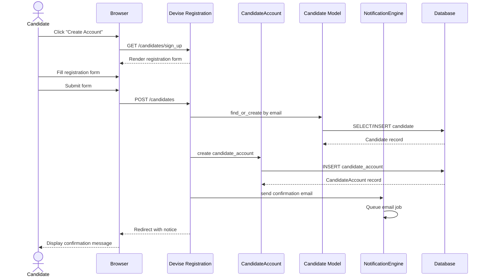

# UC-404: Create Candidate Account

## Metadata

| Attribute | Value |
|-----------|-------|
| **ID** | UC-404 |
| **Name** | Create Candidate Account |
| **Functional Area** | Career Site & Portal |
| **Primary Actor** | Candidate (ACT-07) |
| **Priority** | P2 |
| **Complexity** | Medium |
| **Status** | Draft |

## Description

A candidate creates an account on the candidate portal to track application status, manage documents, update profile information, and receive job alerts. The account is linked to the candidate's existing record (if they have applied) or creates a new candidate record. Candidates authenticate via Devise with email confirmation.

## Actors

| Actor | Role in Use Case |
|-------|------------------|
| Candidate (ACT-07) | Creates account for portal access |
| Notification Engine (ACT-13) | Sends confirmation email |

## Preconditions

- [ ] Candidate has accessed the career site
- [ ] Email address is not already registered
- [ ] Career site allows account creation (not disabled)

## Postconditions

### Success
- [ ] CandidateAccount record created
- [ ] Candidate record created or linked (by email)
- [ ] Confirmation email sent
- [ ] Account confirmed (in non-production)
- [ ] Candidate can access portal features

### Failure
- [ ] Validation errors displayed
- [ ] No account created
- [ ] Candidate informed of existing account

## Triggers

- Candidate clicks "Create Account" on career site
- Candidate clicks "Create Account" on application confirmation page
- Candidate clicks "Sign Up" from login page

## Basic Flow



| Step | Actor | Action | System Response |
|------|-------|--------|-----------------|
| 1 | Candidate | Clicks "Create Account" | Navigates to registration |
| 2 | System | Displays registration form | Form rendered |
| 3 | Candidate | Enters email | Email captured |
| 4 | Candidate | Enters password | Password captured (min 6 chars) |
| 5 | Candidate | Confirms password | Passwords match validated |
| 6 | Candidate | Enters first name | Name captured |
| 7 | Candidate | Enters last name | Name captured |
| 8 | Candidate | Submits form | Form data sent |
| 9 | System | Validates input | All validations pass |
| 10 | System | Finds or creates Candidate | By email match |
| 11 | System | Creates CandidateAccount | Linked to Candidate |
| 12 | System | Sends confirmation email | Email queued |
| 13 | System | Redirects to confirmation | Success message shown |
| 14 | Candidate | Checks email | Confirmation link received |
| 15 | Candidate | Clicks confirmation link | Account confirmed |
| 16 | System | Activates account | Can now log in |

## Alternative Flows

### AF-1: Existing Candidate Record

**Trigger:** Email matches existing candidate from previous application

| Step | Actor | Action | System Response |
|------|-------|--------|-----------------|
| 10a | System | Finds existing candidate | By email match |
| 10b | System | Links account to candidate | Uses existing record |
| 10c | System | Applications become visible | In portal dashboard |

**Resumption:** Continues at step 11

### AF-2: Skip Confirmation (Dev/Test)

**Trigger:** Non-production environment

| Step | Actor | Action | System Response |
|------|-------|--------|-----------------|
| 12a | System | Skips confirmation requirement | Auto-confirms |
| 13a | System | Logs candidate in | Session created |
| 13b | System | Redirects to dashboard | Portal home shown |

**Resumption:** Use case ends

### AF-3: Social Registration (Future)

**Trigger:** Candidate chooses OAuth provider

| Step | Actor | Action | System Response |
|------|-------|--------|-----------------|
| 3a | Candidate | Clicks "Sign up with LinkedIn" | OAuth initiated |
| 3b | System | Redirects to LinkedIn | OAuth flow |
| 3c | LinkedIn | Returns with profile data | Profile data received |
| 3d | System | Pre-fills form | From LinkedIn profile |

**Resumption:** Continues at step 8

## Exception Flows

### EF-1: Email Already Registered

**Trigger:** Email exists in CandidateAccount

| Step | Actor | Action | System Response |
|------|-------|--------|-----------------|
| 9.1 | System | Detects existing account | Email already taken |
| 9.2 | System | Shows error message | "Email already registered" |
| 9.3 | System | Offers login link | "Sign in instead?" |

**Resolution:** Candidate redirected to login

### EF-2: Password Too Weak

**Trigger:** Password fails validation

| Step | Actor | Action | System Response |
|------|-------|--------|-----------------|
| 9.1 | System | Validates password | Fails requirements |
| 9.2 | System | Shows error | "Password too short (minimum 6)" |
| 9.3 | Candidate | Enters stronger password | Retries |

**Resolution:** Returns to step 4

### EF-3: Password Mismatch

**Trigger:** Password confirmation does not match

| Step | Actor | Action | System Response |
|------|-------|--------|-----------------|
| 9.1 | System | Compares passwords | Do not match |
| 9.2 | System | Shows error | "Passwords don't match" |
| 9.3 | Candidate | Corrects confirmation | Retries |

**Resolution:** Returns to step 5

### EF-4: Confirmation Email Not Received

**Trigger:** Candidate did not receive confirmation

| Step | Actor | Action | System Response |
|------|-------|--------|-----------------|
| 14.1 | Candidate | Checks spam folder | Not found |
| 14.2 | Candidate | Requests resend | Clicks resend link |
| 14.3 | System | Sends new confirmation | Email re-queued |

**Resolution:** Returns to step 14

### EF-5: Confirmation Link Expired

**Trigger:** Confirmation token has expired

| Step | Actor | Action | System Response |
|------|-------|--------|-----------------|
| 15.1 | Candidate | Clicks expired link | Token invalid |
| 15.2 | System | Shows error | "Link has expired" |
| 15.3 | System | Offers resend | "Request new link" |

**Resolution:** New confirmation sent

## Business Rules

| ID | Rule | Description |
|----|------|-------------|
| BR-404.1 | Unique Email | Email must be unique across CandidateAccount |
| BR-404.2 | Password Minimum | Password minimum 6 characters |
| BR-404.3 | Confirmation Required | Email confirmation required in production |
| BR-404.4 | Candidate Link | Account linked to candidate record by email |
| BR-404.5 | Session Security | Secure session with remember me option |
| BR-404.6 | Lockable | Account locked after 5 failed attempts |

## Data Requirements

### Input Data

| Field | Type | Required | Validation |
|-------|------|----------|------------|
| email | string | Yes | Valid email, unique |
| password | string | Yes | Min 6 characters |
| password_confirmation | string | Yes | Must match password |
| first_name | string | Yes | Max 100 chars |
| last_name | string | Yes | Max 100 chars |

### Output Data

| Field | Type | Description |
|-------|------|-------------|
| candidate_account_id | integer | New account ID |
| candidate_id | integer | Linked candidate ID |
| confirmation_sent | boolean | Email sent status |

## Database Transactions

### Tables Affected

| Table | Operation | Conditions |
|-------|-----------|------------|
| candidates | CREATE or UPDATE | Find or create by email |
| candidate_accounts | CREATE | Always |

### Transaction Detail

```sql
BEGIN TRANSACTION;

-- Step 1: Find or create candidate
INSERT INTO candidates (
    first_name, last_name, email,
    source, created_at, updated_at
) VALUES (
    @first_name, @last_name, @email,
    'portal_registration', NOW(), NOW()
)
ON DUPLICATE KEY UPDATE
    first_name = COALESCE(@first_name, first_name),
    last_name = COALESCE(@last_name, last_name),
    updated_at = NOW();

SET @candidate_id = LAST_INSERT_ID();

-- Step 2: Create candidate account
INSERT INTO candidate_accounts (
    candidate_id,
    email,
    encrypted_password,
    confirmation_token,
    confirmation_sent_at,
    created_at,
    updated_at
) VALUES (
    @candidate_id,
    @email,
    @encrypted_password,
    @confirmation_token,
    NOW(),
    NOW(),
    NOW()
);

COMMIT;
```

### Rollback Scenarios

| Scenario | Rollback Action |
|----------|-----------------|
| Validation failure | No transaction started |
| Duplicate email | Rollback, show error |
| Database error | Full rollback |

## UI/UX Requirements

### Screen/Component

- **Location:** /candidates/sign_up
- **Entry Point:** "Create Account" link, post-application offer
- **Key Elements:**
  - Simple registration form
  - Password strength indicator
  - Terms and privacy links
  - Sign in link for existing accounts
  - Social registration buttons (future)

### Registration Form

```
+----------------------------------------------------------+
| [Logo]                                                    |
+----------------------------------------------------------+
|                                                          |
|              Create Your Account                          |
|                                                          |
| Track your applications and receive job alerts.          |
|                                                          |
| -------------------------------------------------------- |
|                                                          |
| First Name *                                              |
| [________________________]                                |
|                                                          |
| Last Name *                                               |
| [________________________]                                |
|                                                          |
| Email *                                                   |
| [________________________]                                |
|                                                          |
| Password *                                                |
| [________________________]  [Show]                        |
| [||||____] Minimum 6 characters                          |
|                                                          |
| Confirm Password *                                        |
| [________________________]                                |
|                                                          |
| [x] I agree to the Terms of Service and Privacy Policy   |
|                                                          |
| [              Create Account                           ] |
|                                                          |
| -------------------------------------------------------- |
|                                                          |
| Already have an account? [Sign In]                       |
|                                                          |
+----------------------------------------------------------+
```

### Confirmation Message

```
+----------------------------------------------------------+
|                                                          |
|              Check Your Email                             |
|                                                          |
| We've sent a confirmation link to:                       |
| john.doe@example.com                                     |
|                                                          |
| Click the link in the email to activate your account.    |
|                                                          |
| Didn't receive it?                                       |
| * Check your spam folder                                 |
| * [Resend confirmation email]                            |
|                                                          |
+----------------------------------------------------------+
```

## Non-Functional Requirements

| Requirement | Target |
|-------------|--------|
| Page Load Time | < 2 seconds |
| Password Hashing | bcrypt with cost 12 |
| Session Duration | 2 weeks (remember me) |
| Token Expiration | 24 hours |
| Mobile Support | Fully responsive |

## Security Considerations

- [x] Password hashing with bcrypt
- [x] CSRF protection on form
- [x] Rate limiting on registration
- [x] Confirmation token security
- [x] Account lockout after failed attempts
- [x] Secure session management
- [x] Password strength validation

## Related Use Cases

| Use Case | Relationship |
|----------|--------------|
| UC-403 Apply for Job | Often precedes account creation |
| UC-405 Check Application Status | Enabled by account |
| UC-406 Update Profile | Enabled by account |
| UC-407 Upload Documents | Enabled by account |

---

## Data Model References

> Cross-references to [DATA_MODEL.md](../DATA_MODEL.md) and [CRUD_MATRIX.md](../CRUD_MATRIX.md)

### Subject Areas

| Subject Area | ID | Relationship |
|--------------|-----|--------------|
| Career Site | SA-12 | Primary |
| Candidate | SA-04 | Primary |
| Identity & Access | SA-01 | Reference |

### Entities CRUD

| Entity | C | R | U | D | Notes |
|--------|---|---|---|---|-------|
| CandidateAccount | X | | | | Created for portal access |
| Candidate | X | X | X | | Created or linked by email |

**Legend:** C = Create, R = Read, U = Update, D = Delete

---

## Process Model References

> Cross-references to [PROCESS_MODEL.md](../PROCESS_MODEL.md) and [PROCESS_CRUD_MATRIX.md](../PROCESS_CRUD_MATRIX.md)

| Attribute | Value | Link |
|-----------|-------|------|
| **Elementary Business Process** | EP-1145: Create Candidate Account | [PROCESS_MODEL.md#ep-1145](../PROCESS_MODEL.md#ep-1145-create-candidate-account) |
| **Business Process** | BP-604: Career Site Management | [PROCESS_MODEL.md#bp-604](../PROCESS_MODEL.md#bp-604-career-site-management) |
| **Business Function** | BF-06: System Administration | [PROCESS_MODEL.md#bf-06](../PROCESS_MODEL.md#bf-06-system-administration) |

### EBP Details

| Attribute | Value |
|-----------|-------|
| **Trigger** | Candidate initiates account registration |
| **Input** | Email, password, name information |
| **Output** | Active candidate account with portal access |
| **Business Rules** | BR-404.1 through BR-404.6 (see Business Rules section) |

---

## Traceability Matrix

> Complete artifact mapping for requirements traceability

| Artifact Type | ID | Name | Link |
|---------------|-----|------|------|
| **Use Case** | UC-404 | Create Candidate Account | *(this document)* |
| **Elementary Process** | EP-1145 | Create Candidate Account | [PROCESS_MODEL.md](../PROCESS_MODEL.md#ep-1145-create-candidate-account) |
| **Business Process** | BP-604 | Career Site Management | [PROCESS_MODEL.md](../PROCESS_MODEL.md#bp-604-career-site-management) |
| **Business Function** | BF-06 | System Administration | [PROCESS_MODEL.md](../PROCESS_MODEL.md#bf-06-system-administration) |
| **Primary Actor** | ACT-07 | Candidate | [ACTORS.md](../ACTORS.md#act-07-candidate) |
| **Subject Area (Primary)** | SA-12 | Career Site | [DATA_MODEL.md](../DATA_MODEL.md#sa-12-career-site) |
| **Subject Area (Secondary)** | SA-04 | Candidate | [DATA_MODEL.md](../DATA_MODEL.md#sa-04-candidate) |
| **CRUD Matrix Row** | UC-404 | - | [CRUD_MATRIX.md](../CRUD_MATRIX.md#uc-404) |
| **Process CRUD Row** | EP-1145 | - | [PROCESS_CRUD_MATRIX.md](../PROCESS_CRUD_MATRIX.md#ep-1145) |

### Implementation Artifacts

| Artifact Type | Path/Reference | Status |
|---------------|----------------|--------|
| Model | `app/models/candidate_account.rb` | Implemented |
| Model | `app/models/candidate.rb` | Implemented |
| Devise Config | `config/initializers/devise.rb` | Implemented |
| Routes | `config/routes.rb` (devise_for :candidate_accounts) | Implemented |
| Views | `app/views/devise/registrations/` | Implemented |

---

## Open Questions

1. Should we support social login (LinkedIn, Google)?
2. Should we require phone verification in addition to email?
3. Should account creation be available without first applying?

## Change History

| Version | Date | Author | Changes |
|---------|------|--------|---------|
| 0.1 | 2026-01-25 | System | Initial draft |
